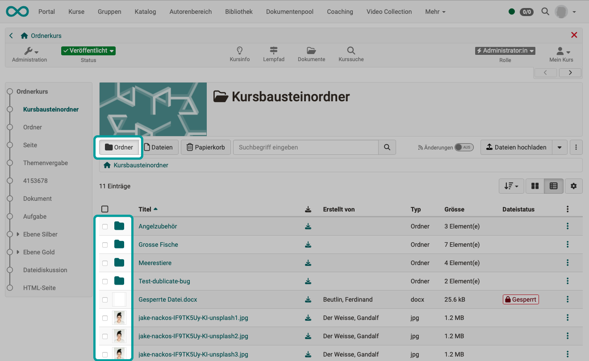
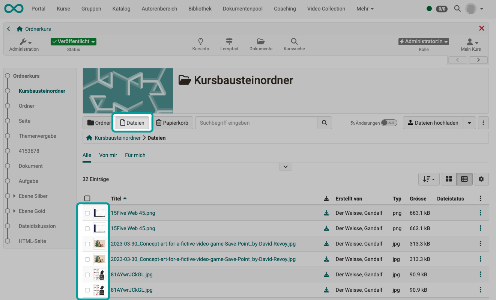

# Ordnerkonzept {: #folders}

Im :octicons-tag-24: Release 19 wurde die Ordnerkomponente komplett überarbeitet und die Ansichten und Arbeitsweisen haben sich teilweise geändert.

## Die verschiedenen Ordner {: #folder_types}

### Persönlicher Ordner {: #personal_folder}

Den persönlichen Ordner finden Sie bei den persönlichen Werkzeugen im [persönlichen Menü](../personal_menu/index.de.md). Ab Release 19 ist er im [File Hub](../personal_menu/File_Hub.de.md) zu finden.

Er bietet die Möglichkeit, individuelle Dateien unabhängig von Kursen oder Ressourcenordner abzulegen. 

Innerhalb des persönlichen Ordners wird zwischen einem **privaten** und einem **öffentlichen** Bereich unterschieden. Dateien im privaten Ordner sind nur für die jeweilige Person sichtbar, während Dateien im öffentlichen Bereich über die Visitenkarte von allen Benutzer:innen im System gelesen und heruntergeladen werden können.

!!! tip "Tipp"

    Um sich die Visitenkarten anderer OpenOlat-Benutzer:innen anzuschauen, wählen Sie **Personensuche** im persönlichen Menü und suchen die gewünschte Person über die Suchmaske.

[Zu den Details des persönlichen Ordners (bis Release 18) >](../personal_menu/Personal_folders.de.md) 
[Zu den Details des File Hubs >](../personal_menu/File_Hub.de.md) 
[Zum Seitenanfang ^](#folders)

### Ablageordner {: #storage_folder}

In einem Kurs verwendete Dateien können im Ablageordner dieses Kurses hinterlegt werden. 

Der Zugriff erfolgt im Kurs über **Administration > Dateien** oder über den [File Hub](../personal_menu/File_Hub.de.md) unter "Kurse".

Hier können z.B. auch Dateien hochgeladen werden, die später innerhalb des Kurses von einer Seite aus verlinkt und aufgerufen werden sollen.

[Zu den Details >](../learningresources/Storage_folder.de.md) 
[Zum Seitenanfang ^](#folders)

### Ressourcenordner {: #resource_folder}

In einen Ressourcenordner können Dateien hochgeladen werden, die in mehreren Kursen verwendet verwendet sollen. So können diese zentral und nur an einer Stelle bearbeitet werden.

Um den Ressourcenordner innerhalb eines Kurses zu nutzen, muss er über **Administration > Einstellungen > Tab Optionen** eingebunden werden. Anschliessend findet man im Ablageordner des Kurses den neuen Ordner "shared folder" und hat dort Zugriff auf die Dateien des Resssourcenordners. Pro Kurs kann nur ein Ressourcenordner verwendet werden.

Der kursübergreifende "Ressourcenordner" ist eine Lernressource und deshalb auch im Autorenbereich aufgelistet und er kann dort bearbeitet werden. 

[Zu den Details >](../learningresources/Resource_Folder.de.md) 
[Zum Seitenanfang ^](#folders)

### Kursbaustein "Ordner" {: #course_element_folder}

Der Kursbaustein "Ordner" ist eine Ablagemöglichkeit innerhalb eines Kurses oder einer Gruppe. Kursbetreuer:innen und Kursbesitzer:innen können dort Dateien zum Download bereitstellen. Auch Teilnehmer:innen des Kurses kann das Recht zum Upload erteilt werden.

[Zu den Details >](../learningresources/Course_Element_Folder.de.md) 
[Zum Seitenanfang ^](#folders)

### Kursbaustein "Teilnehmer:innen-Ordner" {: #course_element_participant_folder}

Der Kursbaustein "Teilnehmer:innen Ordner" ermöglicht einen Dateiaustausch zwischen einzelnen Teilnehmenden und Betreuenden. Dafür stehen zwei Unterordner zur Verfügung. Zum einen ist dies der "Teilnehmer:innen Abgabeorder", über den Teilnehmende Dateien an Betreuer:innen abgeben können. Zum anderen der "Betreuer:innen Rückgabeorder", in welchem die Betreuer:innen Dateien an alle Teilnehmer:innen gleichzeitig oder individuell zurückgeben können.

[Zu den Details >](../learningresources/Course_Element_Participant_Folder.de.md) 
[Zum Seitenanfang ^](#folders)

### Ordner im Kursbaustein "Aufgabe" bzw. "Gruppenaufgabe" {: #course_element_task}

Innerhalb des Workflows eines Kursbausteins "Aufgabe" und "Gruppenaufgabe" werden verschiedene Dokument von Betreuenden oder Teilnehmenden hoch- und heruntergeladen: Aufgabenstellung, abgegebene Dokumente, zurück gegebene Dokumente, überarbeitete Dokumente und Musterlösung. 
Für alle Dateien stehen innerhalb des Kursbausteins Ordner zur Verfügung, die nur innerhalb des Kursbausteins zugänglich sind.

[Zu den Details >](../learningresources/Course_Element_Task.de.md#workflow) 
[Zum Seitenanfang ^](#folders)

### Ordner für Mitglieder einer Gruppe (Gruppenordner) {: #group_folder}

Innerhalb einer Gruppe können Gruppenmitglieder Dokumente im gemeinsamen Gruppenordner austauschen. Dort können Dateien hochgeladen, erstellt und heruntergeladen werden. Eine weitere Strukturierung mit Unterordnern ist ebenfalls möglich.

Auch über den File Hub kann auf Gruppenordner zugegriffen werden. Der File Hub erkennt automatisch, ob Sie Mitglied einer Gruppe sind und welche Gruppenordner Ihnen deshalb im File Hub angezeigt werden. 

Der Zugriff auf einen Gruppenordner ist in jedem Fall an die Mitgliedschaft in der betreffenden Gruppe gebunden.

[Zu den Details >](../groups/Using_Group_Tools.de.md) 
[Zum Seitenanfang ^](#folders)

### Ordner für Betreuer:innen (Betreuer:innenordner) {: #coach_folder}

Innerhalb eines Kurses kann ein Ordner eingerichtet werden, der nur für die Betreuer:innen dieses Kurses zugänglich ist. Dort können z.B. Dokumente ausgetauscht werden oder einfach Dateien zum Kurs abgelegt werden, die den Teilnehmer:innen nicht zugänglich sein sollen.

Eingerichtet wird dieser Ordner unter **Administration > Einstellungen > Tab Optionen > Abschnitt "Einstellungen Betreuer:innen"**. 
Es kann ein Unterordner aus dem Ablageordner des Kurses verwendet werden oder ein Ordner automatisch neu erstellt werden (_coachdocuments).

Geöffnet werden kann der Ordner anschliessend unter **Administration > Unterlagen Betreuer:innen**.
Auch via File Hub kann durch Auswahl des Kurses auf den Ordner zugegriffen werden.

[Zu den Details >](../learningresources/Course_Settings_Options.de.md#einstellungen-betreuerinnen) 
[Zum Seitenanfang ^](#folders)

### Archive {: #archive}

Wird ein ganzer Kurs archiviert oder nur aus einigen Kursbausteine ein Teilarchiv erstellt, sind diese im File Hub im Ordner "Kursarchiv" abgelegt.

[Zu den Details >](../learningresources/Course_Archiving.de.md) 
[Zum Seitenanfang ^](#folders)

### Dokumentenpool {: #documentpool}

Auch der Dokumentenpool ist im File Hub als Ordner angezeigt, in dem unterschiedliche Dateien abgelegt werden. Allerdings werden hier zu den Dateien Metadaten hinzugefügt (z.B. Taxonomie). Es ist also keine reine Dateiablage in einem Filesystem, obwohl z.B. über WebDAV Dateien in den Dokumentenpool übertragen werden können.

[Zu den Details >](../basic_concepts/File_Hub_Concept.de.md#dokumentenpool) 
[Zum Seitenanfang ^](#folders)

## Ansicht {: #view}

Mit den Buttons über der Liste schalten Sie um zwischen

* hierarchischer Ansicht mit Ordner und
* nur Dateien in der Ansicht 

=== "Hierarchische Ansicht mit Ordnern"

    { class="shadow lightbox" title=" " }

=== "Nur Dateien in der Ansicht"

    { class="shadow lightbox" title=" " }

!!! hint "Tipp"

    Im Krümelpfad unter den Buttons ist jederzeit ersichtlich, in welchem Ordner Sie sich gerade befinden. Durch Klick auf einen Abschnitt im Krümelpfad springen Sie direkt zu dieser Ebene.

## Suche {: #search}

Die Suchfunktion in Ordnern sucht nach 

* Dateinamen,
* Beschreibung und 
* Ersteller

im aktuellen Ordner mit seinen Unterordnern.
(Es ist aktuell keine Volltextsuche, also keine Suche z.B. innerhalb von Word-Dateien.)

## Dateistatus {: #status}

Den Dateistatus entnehmen Sie der **Spalte "Dateistatus"**. (Sollte die Spalte nicht sichtbar sein, kann sie über das Zahnrad-Icon eingeblendet werden.)

Wenn eine Datei aktuell bearbeitet wird, erhält sie den **Status "Wird bearbeitet"**.

Der **Status "gesperrt"** kann in den Metadaten gesetzt werden. Sie bearbeiten die Metadaten unter den 3 Punkten am Ende einer Zeile.  

Wenn eine Datei hochgeladen wird, wird sie zunächst mit einem **Label als "Neu"** gekennzeichnet. (Dies hilft beim sofortigen "Weiterbearbeiten", wie Verschieben oder Kopieren). Das Label wird nur der Person angezeigt, die die Datei hochgeladen hat. Es verschwindet, sobald der Ordner einmal verlassen wurde.

##  Mit Dateien arbeiten {: #work_with_files}

### Aktionen via Menü
Um Dateien zu verschieben, zu kopieren, herunterzuladen, zu packen (zippen) oder zu löschen, finden Sie Auswahloptionen **unter den 3 Punkten** am Ende einer Zeile (rechter Rand einer Liste).

### Drag & drop
Dateien können auch per **drag & drop** mit der Maus auf ein markiertes Zielfeld geschoben werden.

### Multi-File-Upload
Es ist auch möglich, mehrere Dateien zu selektieren und gemeinsam auf das Zielfeld zu schieben.

### Massen-Aktionen
Sobald in einer Liste mindestens eine Checkbox am Zeilenbeginn ausgewählt ist, erscheinen über der Liste Buttons mit verfügbaren Optionen (herunterladen, verschieben, usw.).

Markieren Sie die Checkbox in der Kopfzeile, werden alle Listeneinträge ausgewählt und markiert. Dadurch können schnell mehrere Einträge gleichzeitig bearbeitet werden.

## Papierkorb {: #paper_basket}

Die Dateien im Papierkorb können automatisch nach einer bestimmten Zeit gelöscht werden. Die Verbleibdauer im Papierkorb und das automatische Löschen wird von Administrator:innen eingerichtet.

!!! info "Hinweis" 

    Die Ordnerkomponente wird in folgenden OpenOlat-Bereichen verwendet:
    
    - Shared Folder
    - Ablageordner des Kurses
    - Kursarchiv
    - Modul Bibliothek
    - Projekt
    - Kollaborationstools
    - Taxonomie / Lost & Found
    - Teinehmerordner

