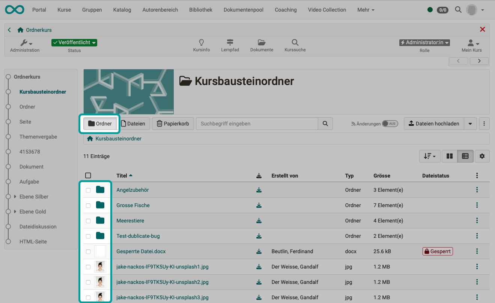
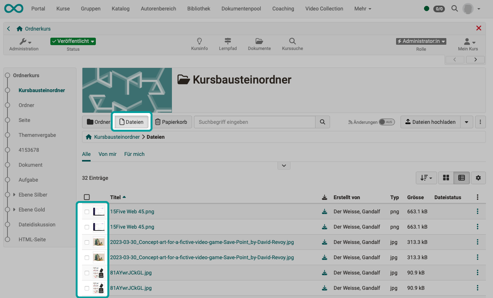

# Folder concept {: #folders}

The folder component is used everywhere in OpenOlat where files are stored. This page shows the different folders and how to work with files. [:octicons-tag-16:{ title="from Release 19.0 (OO-7700)" }](https://track.frentix.com/issue/OO-7700){:target="_blank"}

## Different folder types {: #folder_types}

### Personal folder {: #personal_folder}

The personal folder can be found in the personal tools in the [personal menu](../personal_menu/index.md), in the [File Hub](../personal_menu/File_Hub.md).

It offers the option of storing individual files independently of courses or resource folders.

Within the personal folder, a distinction is made between a **private** and a **public** area. Files in the private folder are only visible to the respective person, while files in the public area can be read and downloaded by all users in the system via the visiting card.

!!! tip "Tip"

    To view the visiting cards of other OpenOlat users, select "Other users" in the personal menu and search for the desired person using the search mask.

[See the details about the personal files >](../personal_menu/File_Hub.md#personal_files) 
[See the details about the File Hub >](../personal_menu/File_Hub.md) 
[To the top of the page ^](#folders)

### Storage folder {: #storage_folder}

Files used in a course can be stored in the storage folder of this course.

You access it in the course via `Course > Administration > Files > Storage folder` or in the personal area via the [File Hub](../personal_menu/File_Hub.md) under "Courses". Select the appropriate course there.

Files can be uploaded to the storage folder, for example, which are to be linked and accessed later within the course from a page.

[See the details >](../learningresources/Storage_folder.md) 
[To the top of the page ^](#folders)

### Resource folder {: #resource_folder}

Files that are to be used in several courses can be uploaded to a resource folder. This allows them to be edited centrally and in one place only.

To use the resource folder within a course, it must be integrated via `Course > Administration > Settings > Tab "Options"`. You will then find the new folder "shared folder" in the storage folder of the course and have access to the files of the resource folder there. Only one resource folder can be used per course.

The cross-course resource folder is a learning resource. It is therefore also listed in Authoring and can be edited there.

[See the details >](../learningresources/Resource_Folder.md) 
[To the top of the page ^](#folders)

### Course element "Folder" {: #course_element_folder}

The [course element "Folder"](../learningresources/Course_Element_Folder.md) is a storage option within a course. Coaches and owners of the course can make files available for download there. Participants of the course can also be granted the upload right if required.

[See the details >](../learningresources/Course_Element_Folder.md) 
[To the top of the page ^](#folders)

### Course element "Participant folder" {: #course_element_participant_folder}

The [course element "Participant folder"](../learningresources/Course_Element_Participant_Folder.md) enables the exchange of files between individual participants and coaches. Two subfolders are available for this purpose. One is the "Participant Drop Box", which participants can use to submit files to coaches. The other is the "Coach Return Box", in which the coaches can return files to all participants simultaneously or individually.

[See the details >](../learningresources/Course_Element_Participant_Folder.md) 
[To the top of the page ^](#folders)

### Folder in the course element "Task" or "Group task" {: #course_element_task}

Within the workflow of a [course element "Task"](../learningresources/Course_Element_Task.md) and ["Group task"](../learningresources/Course_Element_Grouptask.md), various documents are uploaded and downloaded by coaches or participants: assignment, submitted documents, returned documents, revised documents and sample solution. Folders are available for all files within the course element, which are only accessible within the course element.

[See the details >](../learningresources/Course_Element_Task.md#workflow) 
[To the top of the page ^](#folders)

### Folder for members of a group (group folder) {: #group_folder}

Within a group, group members can exchange documents in the shared group folder. Files can be uploaded, created and downloaded there. Further structuring with subfolders is also possible.

Group folders can also be accessed via the [File Hub](../personal_menu/File_Hub.md). The File Hub automatically recognizes whether you are a member of a group and which group folders are therefore displayed in the File Hub.

Access to a group folder is always linked to membership of the relevant group.

[See the details >](../groups/Using_Group_Tools.md) 
[To the top of the page ^](#folders)

### Folder for coaches (Coach files) {: #coach_folder}

A folder can be set up within a course that is only accessible to the coaches of this course. Documents can be exchanged there, for example, or files relating to the course that should not be accessible to participants can simply be stored there.

This folder is set up under `Course > Administration > Settings > Tab "Options" > Section "Coach settings"`. A subfolder from the storage folder of the course can be used or a new folder can be created automatically (`_coachdocuments`).

The folder can then be opened under `Course > Administration > Coach files`. The folder can also be accessed via the [File Hub](../personal_menu/File_Hub.md) by selecting the course.

[See the details >](../learningresources/Course_Settings_Options.md#enable-coach-folder) 
[To the top of the page ^](#folders)

### Course archive {: #archive}

If an entire course is archived or only a partial archive is created from some course elements, this archive is stored in the [File Hub](../personal_menu/File_Hub.md) in the folder "Course archive".

[See the details >](../learningresources/Course_Archiving.md) 
[To the top of the page ^](#folders)

### Document pool {: #documentpool}

The document pool is also displayed in the File Hub as a folder in which different files are stored. However, metadata is added to the files here (e.g. taxonomy). It is therefore not a pure file storage in a file system, although files can be transferred to the document pool via WebDAV, for example.

[See the details >](../basic_concepts/File_Hub_Concept.md#document_pool) 
[To the top of the page ^](#folders)

## View {: #view}

Use the buttons "Folder" and "Files" above the list to switch between the hierarchical view with folders and the pure file view. In the file view, the filter tabs "From me" and "For me" are also available.

=== "Hierarchical view with folders"

    { class="shadow lightbox" title=" " }

=== "Only files in the view"

    { class="shadow lightbox" title=" " }

!!! tip "Tip"

    In the breadcrumb below the buttons, you can always see which folder you are currently in. Click on a section in the breadcrumb to jump directly to this level.

## Search {: #search}

The search function in folders searches for

* file names,
* description and
* creator

in the current folder and its subfolders. It is not a full-text search, i.e. no search within Word files, for example.

## File status {: #status}

The file status can be found in the **column "File status"**. If the column is not visible, it can be displayed using the gear icon.

If a file is currently being edited, it receives the **status "Currently being edited"**.

The **status "Locked"** can be set in the metadata. You edit the metadata under the three dots at the end of a line.

When a file is uploaded, it is first marked with a **label "New"**. This helps with immediate further processing, such as moving or copying. The label is only displayed to the person who uploaded the file. It disappears as soon as the folder has been left once.

## Working with files {: #work_with_files}

### Actions via menu

To move, copy, download, pack (zip) or delete files, you will find selection options **under the three dots** at the end of a line (right-hand edge of a list).

### Drag & Drop

Files can also be moved to a highlighted target field using **Drag & Drop** with the mouse.

### Multi-file upload

It is also possible to select several files and move them together to the target field.

### Mass actions

As soon as at least one checkbox is selected at the beginning of a line in a list, buttons with available options (download, move, etc.) appear above the list.

If you select the checkbox in the header, all list entries are selected and highlighted. This allows you to quickly edit several entries at the same time.

## Trash {: #paper_basket}

The files in the trash can be deleted automatically after a certain period of time. The retention period in the trash and the automatic deletion are set up by administrators.

!!! note "Note"

    The folder component is used in the following OpenOlat areas:

    - Resource folder (shared folder)
    - Storage folder of the course
    - Course archive
    - Library
    - Project
    - Collaboration tools of the groups
    - Taxonomy / Lost & Found
    - Course element "Participant folder"

## Further information {: #further_information}

**Mentioned on this page** 
[Personal menu and general components >](../personal_menu/index.md) 
[Personal tools: File Hub >](../personal_menu/File_Hub.md) 
[Storage folder >](../learningresources/Storage_folder.md) 
[Resource folder >](../learningresources/Resource_Folder.md) 
[Course Element "Folder" >](../learningresources/Course_Element_Folder.md) 
[Course Element "Participant folder" >](../learningresources/Course_Element_Participant_Folder.md) 
[Course Element "Task" >](../learningresources/Course_Element_Task.md) 
[Course Element "Group Task" >](../learningresources/Course_Element_Grouptask.md) 
[Using Group Tools >](../groups/Using_Group_Tools.md) 
[Course Settings - Tab Options >](../learningresources/Course_Settings_Options.md) 
[Course administration - Archiving & Reports >](../learningresources/Course_Archiving.md) 
[File Hub Concept >](File_Hub_Concept.md)

**Further reading** 
[Coach files >](../learningresources/Coach_Files.md) 
[Which folders can I use to provide documents? >](../../manual_how-to/folders/folders.md) 
[Search in the File Hub >](Search_in_FileHub.md) 
[Using WebDAV >](Using_WebDAV.md)

[To the top of the page ^](#folders)
