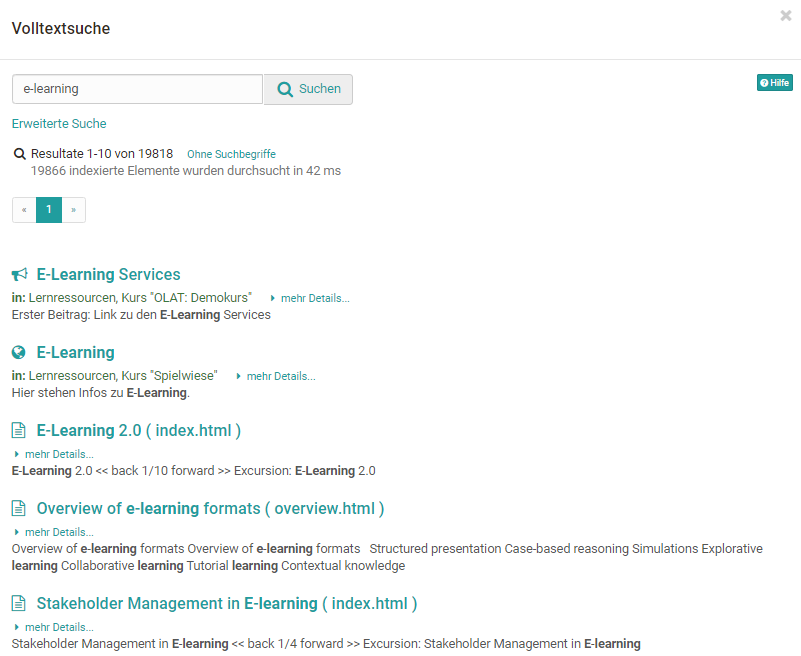
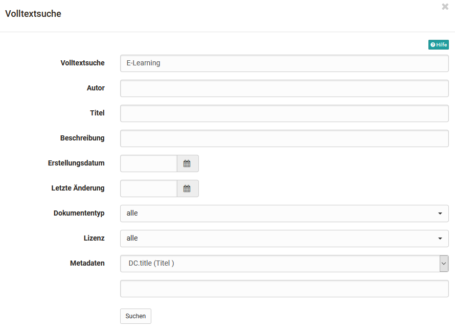
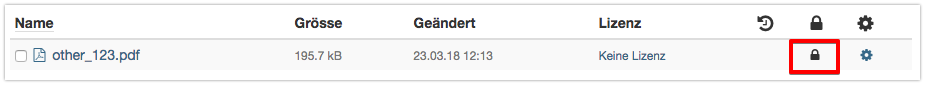

# Volltextsuche

:octicons-device-camera-video-24: **Video-Einführung**: [Suchfunktion](<https://www.youtube.com/embed/GlUCyVl11ic>){:target="_blank”}

Die Suche ist nur dann sichtbar und nutzbar, wenn sie in der Administration
aktiviert ist. Sollte dies bei Ihnen nicht der Fall sein, wenden Sie sich
bitte an den System Administrator Ihrer OpenOlat Instanz.

Das Suchfeld für die Volltextsuche ist oben rechts in der Menüzeile platziert.
Die Volltextsuche sucht in verschiedenen Kurs- und Gruppeninhalten nach
Suchbegriffen, beispielsweise auch in Forumsbeiträgen, PDF- und Word-Dateien.
Weiter können Sie auch nach Benutzern, nach Portfoliomappen und Artefakten
sowie nach Dokumenten in den [Benutzerordnern](../personal_menu/Personal_folders.de.md) suchen. Eine
Ausnahme ist der private Ordner, welcher nicht indexiert wird.

Sie finden über die Volltextsuche immer nur diejenigen Kursinhalte, auf die
Sie Zugriff haben.

## Erweiterte Suche

Um die Suche zu verfeinern, benutzen Sie die erweiterte Suche.

Im Modus _Erweiterte Suche_ können Sie Ihre Sucheingabe verfeinern. Beachten
Sie, dass die verschiedenen Suchfelder mit dem boolschen AND-Operator
verknüpft werden. D.h. wenn Sie zum Beispiel die Felder _Titel_ und _Autor_
ausfüllen, werden nur Dokumente gefunden, bei denen die Begriffe in den
jeweiligen Feldern gleichzeitig vorkommen.

Ausnahme: Das Feld Volltextsuche sucht über alle Felder.

Aus der Ergebnisliste können Sie direkt auf den Lerninhalt mit dem gefundenen
Suchbegriff springen.

!!! Info

    Neben der Volltextsuche über das gesamte OpenOlat gibt es auch eine
    [Kurssuche](../learningresources/Course_Settings.de.md#Kurseinstellungen-Optionen), welche pro
    Kurs in der Toolbar aktiviert werden kann. Die Einstellung wird unter "Administration" -> "Einstellungen" im Tab "Toolbar" aktiviert. Die Kurssuche durchsucht nur den entsprechenden Kurs.

## Suchsyntax {: #syntax}

Sie können Ihre Suchanfrage mit folgender Syntax modifizieren.
  
**Einzelne Begriffe:** z.B. _OpenOlat_

**Mehrere Begriffe:** im Suchfeld sind immer mit dem ODER-Operator verknüpft

**Suche mittels Wildcards:** Um nach bestimmten Wortfragmenten zu suchen, können Wildcards verwendet werden.

  * Das Fragezeichen in einem Suchbegriff steht für einen beliebigen, einzelnen Buchstaben. Z.B. Mit der Sucheingabe _te?t_ finden Sie alle Dokumente, die die Wörter "test", "text" usw. enthalten.
  * Der Stern in einem Suchbegriff steht für eine beliebige Anzahl von beliebigen Buchstaben. Z.B. Mit der Sucheingabe _Test*_ finden Sie alle Dokumente, die Wörter enthalten, die mit "Test" beginnen. Der Stern kann auch innerhalb eines Suchbegriffes stehen: _Te*t_

**Erweiterte Suche:** Im Modus _Erweiterte Suche_ werden die verschiedenen Suchfelder mit dem AND-Operator verknüpft.

## Metadaten {: #metadata}

Metadaten oder  _Metainformationen_  sind Daten, die Informationen über
Merkmale anderer Daten enthalten, aber nicht diese Daten selbst. Metadaten,
also Daten **über**  Daten, beschreiben eine Datei mit ergänzenden
Informationen wie zum Beispiel einem Titel, dem Urheber oder den Herausgeber.
Sie sind dazu da, dass besser erkennbar wird, um was für ein Dokument es sich handelt. Dies ist besonders sinnvoll, wenn der Titel eines Dokumentes nicht in den Dateinamen geschrieben werden kann, weil dieser viel zu lange ist oder spezielle Zeichen enthält.

Jede Datei aber auch komplette Lernressourcen können mit Metadaten versehen werden. Die Metadaten sind optional und
müssen nicht ausgefüllt werden. Sie orientieren sich am [Dublin Core Simple
Standard](https://de.wikipedia.org/wiki/Dublin_Core). Einige Metadaten können
nicht verändert werden. Es sind dies der Name der Person die das Dokument
hochgeladen hat, die Grösse des Dokuments, der Zeitpunkt zu dem das Dokument
hochgeladen wurde und der Dateityp. Informationen wie z.B. den ursprünglichen
Verfasser, den Titel, eine Beschreibung, die Quelle oder die Sprache können
Sie manuell eingeben.

Die Metadaten werden von der Volltextsuche indexiert. Dies bedeutet, dass man
in der Suche nach den verschlagworteten Metadaten suchen kann und so die
relevanten Dokumente besser auffindet.

**Datei sperren:** In den Metadaten können Sie eine Datei als gesperrt
markieren. Gesperrte Dateien sind mit einem Schloss versehen und können von
anderen Benutzern nicht mehr überschrieben, gelöscht oder verschoben werden.
Diese Option ist für Ordner nicht vorhanden.

Mit Hilfe des verfügbaren externen Links können Sie auch ausserhalb von
OpenOlat direkt auf eine bestimmte Datei verlinken.
