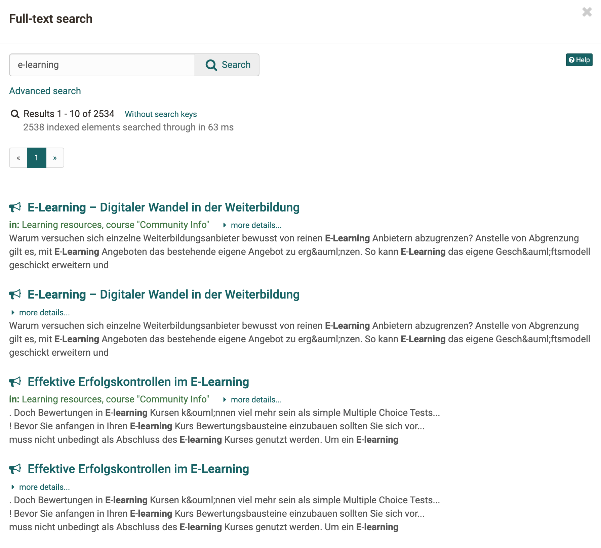
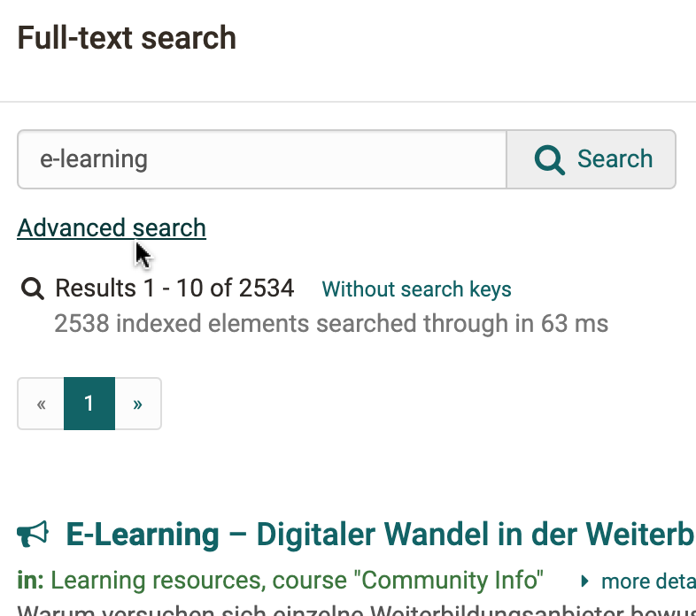
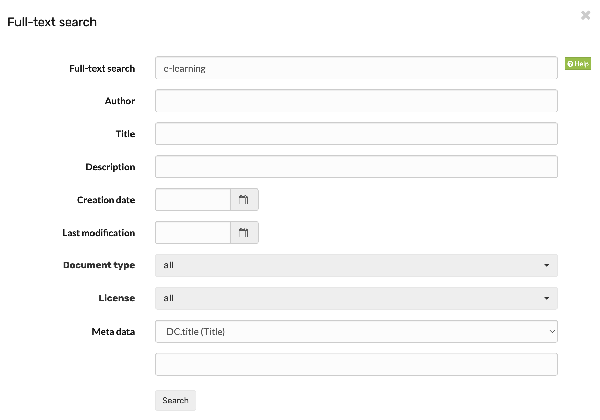
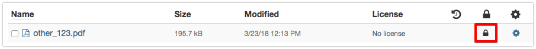

# Full-Text Search

The search is only visible and usable, if it is activated in the
administration. If this is not the case for you, please contact your
OpenOlat administrator directly.

The box for the full-text search is at the top right of the status bar. The
full-text search helps you to look for search terms in the course or group
content, in a forum or even in PDF and Word files. Furthermore you can look
for users, portfolio folders, artefacts, and documents in any [user folder](../personal_menu/Personal_folders.md). The
only exceptions are private folders since they will not be indexed.

You will only get search results of the course contents you have access to.

## Advanced Search

In order to search in more detail please use the advanced search.

Select the option "Advanced search." The mode _Advanced search_ enables you to
refine your search. Please note that these different fields have to be linked
by the Boolean AND operator. This means that e.g. by filling in the fields
_Title_ and _Author_ you will find documents containing the respective terms
in all indicated fields.

Exception: The field Full-text search searches through all fields.

You will be provided with a list of search results that is linked to the
learning content along with your search term.

!!! Info

    Beside the full-text search for the whole OpenOlat there exists also a [course
    search](../learningresources/Course_Settings.md#CourseSettings-course_search), which can be
    activated for every course in the course toolbar. The setting is activated under "Administration" -> "Settings" in the "Toolbar" tab. The course search searches only the corresponding course.

## Syntax {: #syntax}

You can modify your query by means of the following syntax.  

**Single terms:** e.g. _OpenOlat_

**Multiple terms:** in the search field are always linked with the OR operator

**Searching by means of wildcards:** Wildcards can be used to search for specific word fragments.

  * The question mark within a term stands for any single letter. For example: The query _te?t_ will result in finding all documents containing the words "test", "text" etc.
  * The asterisk within a term stands for any number of letters. For example: The query _test*_ will result in finding all documents containing words beginning with "test". The asterisk can also be put within a term: _te*t_

**Advanced search:** In advanced search mode, the various search fields are linked with the AND operator.

## Meta Data {: #metadata}

Meta data is data  **about**  data, containing information about attributes of
other data. Metadata additionally describe a file, e.g. its title, author or
publisher. They serve as a means to clarify a document's purpose and are
particularly suitable for file names that would otherwise be too long or for
document titles containing special characters.

Each file and each learning resource can be provided with metadata. Metadata are optional, and based on
the Dublin Core Simple Standard. For further information please go to: [Dublin
Simple Core](http://en.wikipedia.org/wiki/Dublin_Core). However, several meta
data cannot be modified: name of person who has uploaded a certain document,
size of document, file type, and time of document upload. Information on e.g.
the original author, the title, the source or the language can be entered
manually.

Metadata are indexed by the full-text search. Therefore you can search for
metadata by means of keywords when trying to find relevant documents.

**Lock a file:** Within the meta data you can mark a file as locked. Locked
files are marked with a lock and other users can no longer change, delete or
move it. This option is not available for folders.

Using the external link, you can link directly to a specific file from outside
of OpenOlat.

## Search results

In your search results the following will appear:

* Data that is shared in business cards of users
* Data / documents from "public folders" of users
* Data / documents from courses in which you are a member and to which you also have access as a course member
* Data / documents from courses that are configured as follows under Settings > Sharing: "Without booking" or "Freely available"
