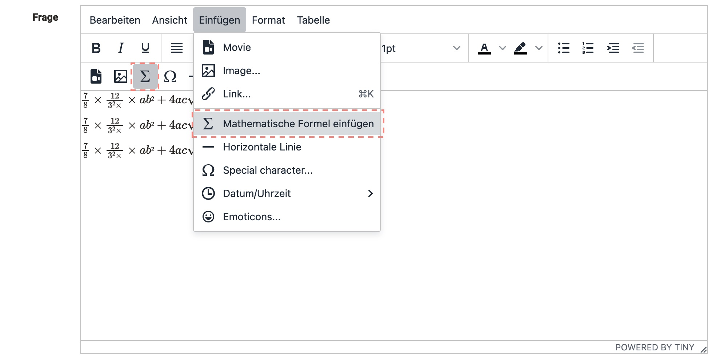
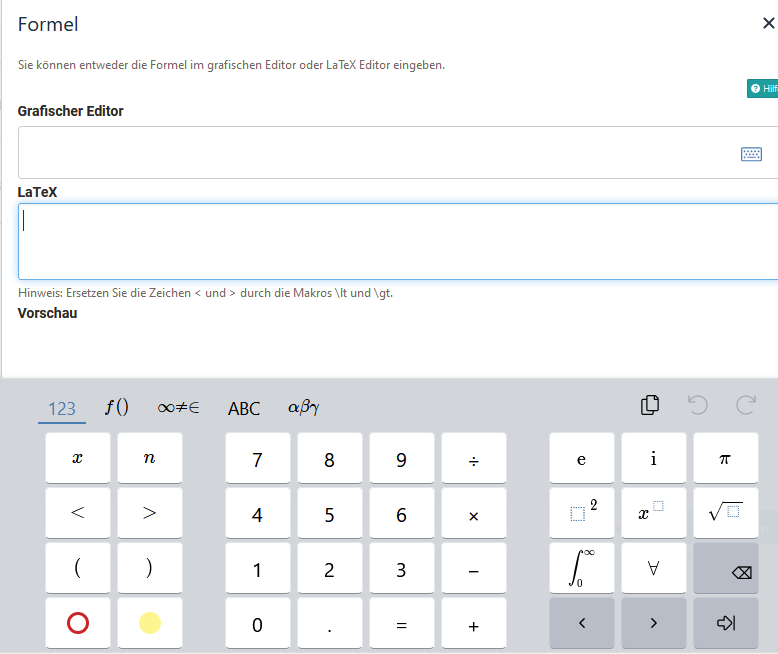
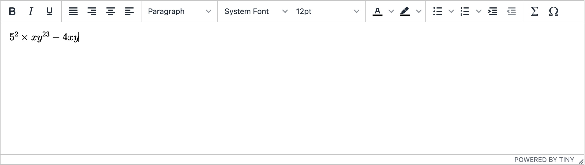
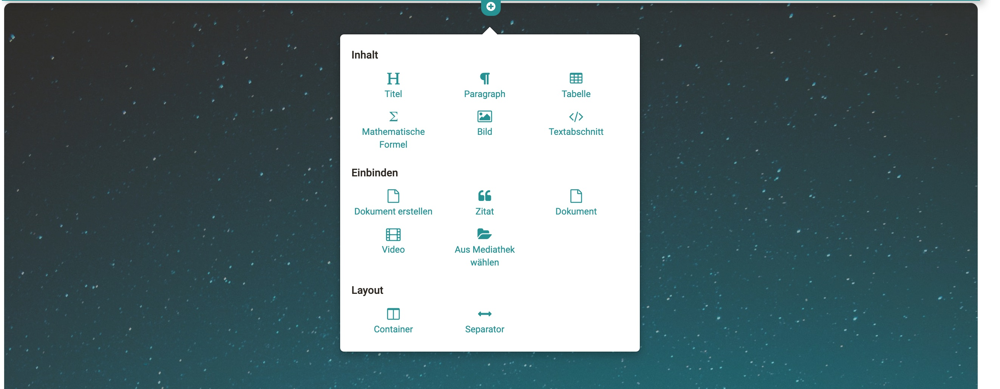
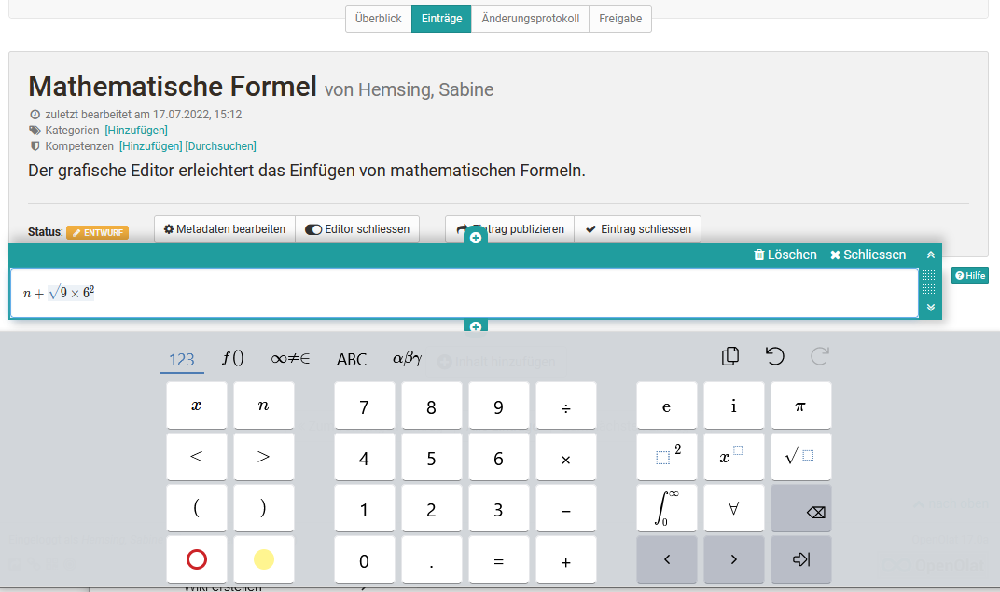

# Matheformel {: #formula}

Formeln können in OpenOlat an verschiedenen Stellen eingefügt werden. Verwendet wird dabei entweder der HTML-Editor oder der Content Editor.

## Einfügen einer Formel per HTML-Editor {: #insert_via_html}

1. Fügen Sie die Formel über `Einfügen > Mathematische Formel einfügen` im Menü des HTML-Editors hinzu oder, falls aktiviert, direkt über den Formel-Button.

    { class="shadow lightbox" }

2. Geben Sie die Formel im grafischen Editor oder im LaTeX-Feld ein. Weitere Informationen zur Verwendung des grafischen Editors finden Sie hier: [CortexJS keybindings](https://cortexjs.io/mathlive/reference/keybindings/).

    { class="shadow lightbox" }

3. Schliessen Sie den HTML-Editor mit "Speichern". Die Formel ist nun eingebunden.

    { class="shadow lightbox" }

Mathematische Formeln können in folgenden Kursbausteinen und Lernressourcen per HTML-Editor eingefügt werden:

* Kursbaustein "HTML-Seite"
* Kursbaustein "Aufgabe" und "Gruppenaufgabe" (HTML)
* Kursbaustein "Forum"
* Lernressource "CP-Lerninhalt"
* Lernressource "Blog"
* Lernressource "Test"

!!! info "Wichtig"

    Wortzählung bei Aufgaben: Die mathematische Formel zählt als ein Wort, unabhängig von Länge und Komplexität.

## Einfügen einer Formel per Content Editor im Portfolio 2.0 {: #insert_formula}

1. Öffnen oder erstellen Sie einen Portfolio-Eintrag und öffnen Sie den Content Editor. Klicken Sie auf "Inhalt hinzufügen".

    { class="shadow lightbox" }

2. Wählen Sie "Mathematische Formel".

3. Der grafische Formeleditor öffnet sich. Erstellen Sie Ihre Formel.

    { class="shadow lightbox" }

## Weiterführende Informationen {: #further_information}

[CortexJS keybindings >](https://cortexjs.io/mathlive/reference/keybindings/) 
[Content Editor >](Content_Editor.de.md) 
[Kursbaustein "HTML-Seite" >](../learningresources/Course_Element_HTML_Page.de.md) 
[Persönliche Werkzeuge: Portfolio >](../personal_menu/Portfolio.de.md)

[Zum Seitenanfang ^](#formula)
