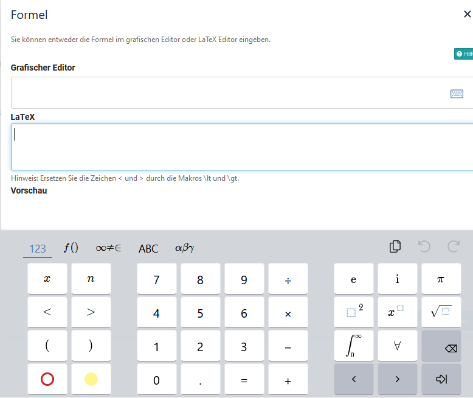

# Matheformel {:#formula}

Formeln können in OpenOlat an verschiedenen Stellen eingefügt werden. Verwendet wird dabei entweder der HTML-Editor oder Content-Editor. 

## Einfügen einer Formel per HTML-Editor

1. Man kann mathematische Formeln über `Einfügen> Mathematische Formel einfügen` im Kontextmenü des HTML-Editors oder direkt über den Formel-Button, falls aktiviert, hinzufügen.

    

2. Geben Sie die Formel über den LaTeX-Editor oder den grafischen Formeleditor ein. Weitere Informationen zur Verwendung des grafischen Editors finden Sie hier: [CortexJS keybindings](https://cortexjs.io/mathlive/reference/keybindings/).

    
  
3. Schliessen Sie den HTML-Editor mit `Speichern` und die Formel ist nun eingebunden.

    {class="shadow"}

Mathematische Formeln können in folgenden Kursbausteinen und Lernressourcen per HTML-Editor eingefügt werden:

* Kursbaustein Einzelne Seite
* Kursbaustein Aufgabe + Gruppenaufgabe (HTML)
* Kursbaustein Forum
* Lernressource CP-Lerninhalt
* Lernressource Blog
* Lernressource Test

!!! info "Hinweis"

    Wortzählung bei Aufgaben: Die mathematische Formel zählt als ein Wort, unabhängig von Länge und Komplexität.

## Einfügen einer Formel per Content Editor im Portfolio 2.0

1. Öffnen oder erstellen Sie einen Portfolio Eintrag und öffnen Sie den Inhaltseditor. Klicken Sie auf "Inhalt hinzufügen" und Sie erhalten u.a. die Möglichkeit den Formeleditor auszuwählen.

    {class="shadow"}

2. Wählen Sie `Mathematische Formel`

3. Der grafische Formeleditor öffnet sich. Jetzt können Sie Ihre Formel erstellen.  {class="shadow"}.
