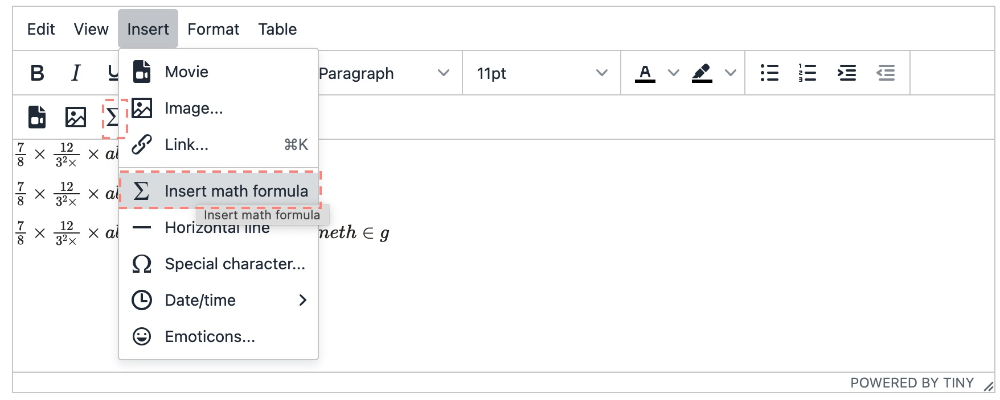
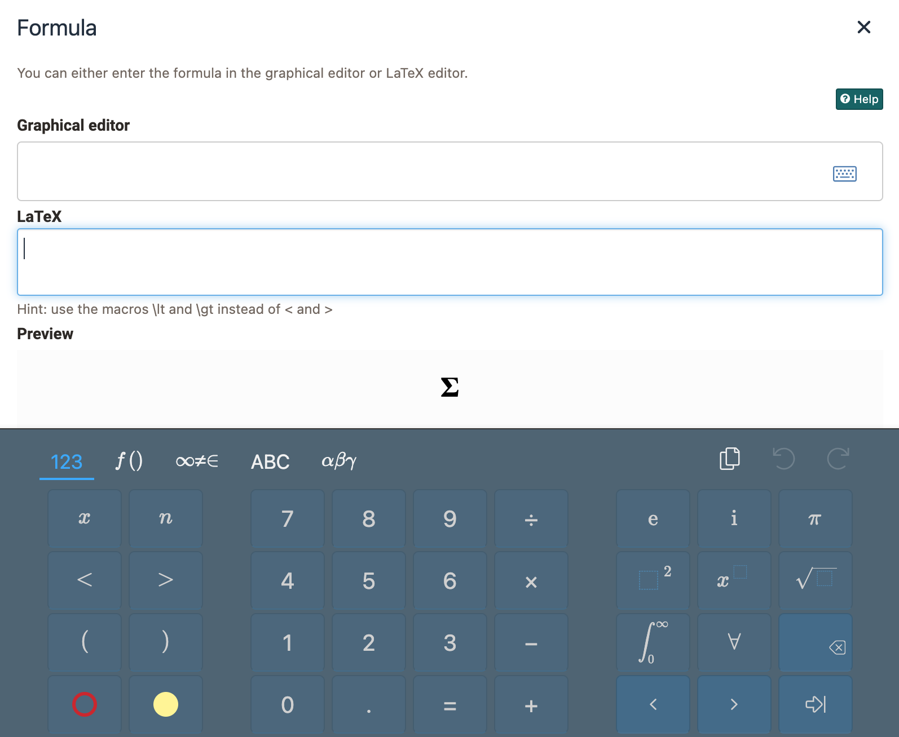
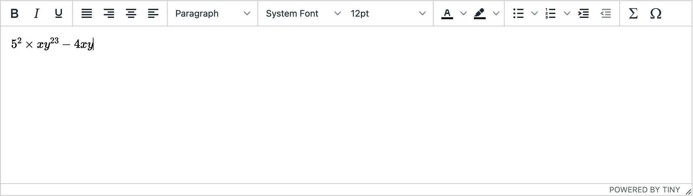
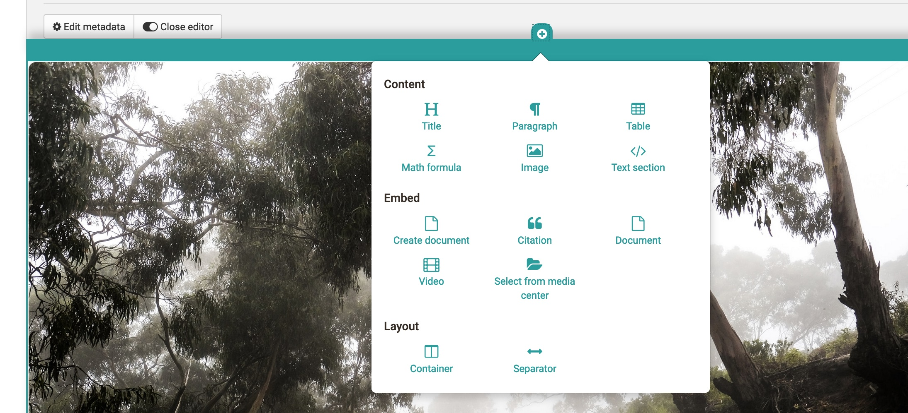
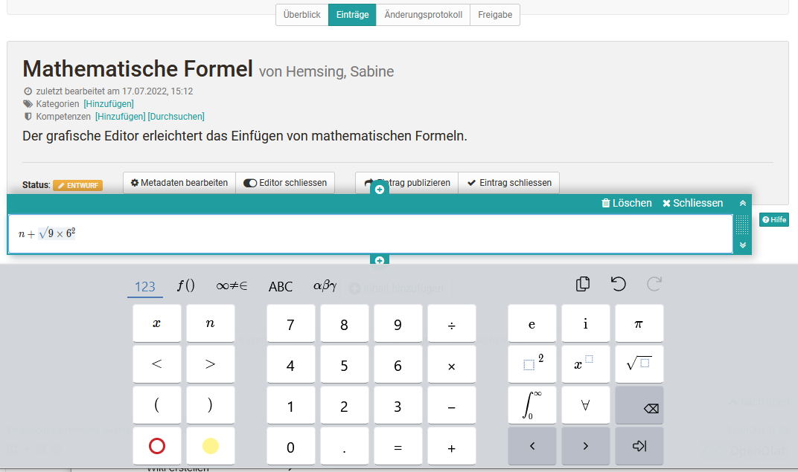

# Math formula {: #formula}

Formulas can be inserted in OpenOlat in various places. Either the HTML editor or the content editor is used.

## Insert math formula via HTML Editor

1. You insert the math formula via `Insert>Insert math formula` in the context menu of the html editor or directly via formula button, if available. A new popup window will open.

    {class="shadow"}

2. Type in the formula via the LaTeX editor or th graphical form editor. Further information on how to use the graphical editor can be found here: [CortexJS keybindings](https://cortexjs.io/mathlive/reference/keybindings/).

    {class="shadow"}
  
3. Close the html-editor with `Save`.
The math formula is now embedded into the text.

   {class="shadow"}

Mathematical formulas can be inserted in the following course elements and learning resources via HTML editor:

* Course element Single page
* Course element Task + Group task (HTML)
* Course element Forum
* Learning resource CP learning content
* Learning resource Blog
* Learning resource Test   

!!! info "Info: Wordcounting"

    The math formular counts as one word, regardless of length and complexity.

## Insert a formula in Content Editor in the Portfolio 2.0

1.  Open or create a portfolio entry and open the Content Editor. Click on add Content Block and (among other things) you get the possibility to select the formula editor.

    {class="shadow"}

2. Choose `Formula` in the menu.

3. The graphical formula editor opens. Now you can create your {class="shadow"}.

