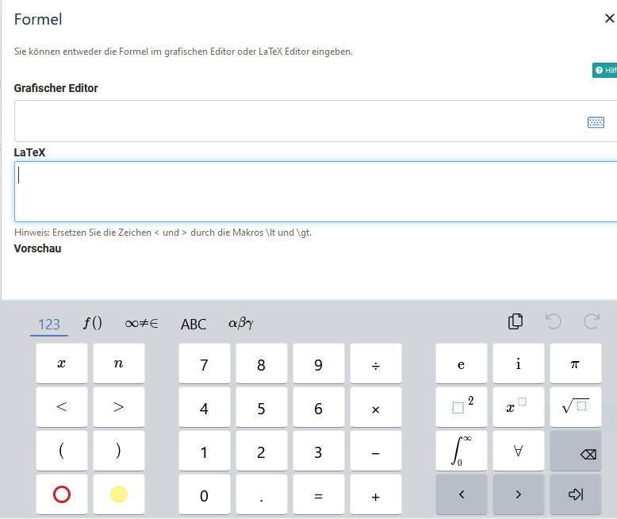

# Math formula {: #formula}

Formula can be inserted in OpenOlat in various places. Verwendet wird dabei entweder der HTML-Editor oder Content-Editor.

## Insert math formula via HTML Editor

1. You insert the math formula via `Insert>Insert math formula` in the contenxt menu of the rich text editor/ html editor or directly via formula button, if available. A new popup window will open.

    {class="shadow"}

2. Type in the formula via the LaTeX editor or th graphical form editor. Further information on how to use the graphical editor can be found here: [CortexJS keybindings](https://cortexjs.io/mathlive/reference/keybindings/).

    {class="shadow"}
  
3.Close the html-editor with "Save".
The math formula is now embedded into the text.

   {class="shadow"}

Mathematische Formeln können in folgenden Kursbausteinen und Lernressourcen per HTML-Editor eingefügt werden:

* Kursbaustein Einzelne Seite
* Kursbaustein Aufgabe + Gruppenaufgabe (HTML)
* Kursbaustein Forum
* Lernressource CP-Lerninhalt
* Lernressource Blog
* Lernressource Test   

!!! info "Info: Wordcounting"

    The math formular counts as one word, regardless of length and complexity.

## Insert a formula in Content Editor in the Portfolio 2.0

1.  Öffnen oder erstellen Sie einen Portfolio Eintrag und Open the Content Editor. Click on add Content Block und Sie erhalten u.a. die Möglichkeit den Formeleditor auszuwählen.

    {class="shadow"}

2. Choose `Formula` in the menu.

3. The graphical formular editor opens. Now you can create your {class="shadow"}.

