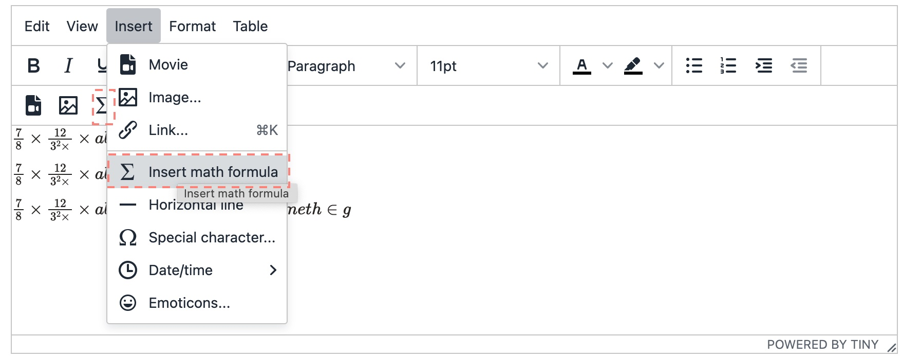
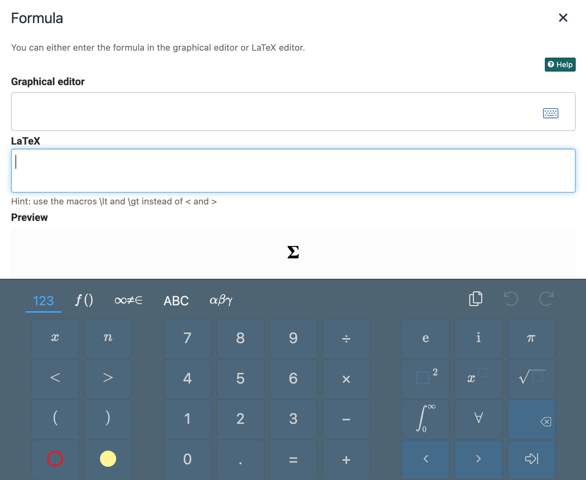
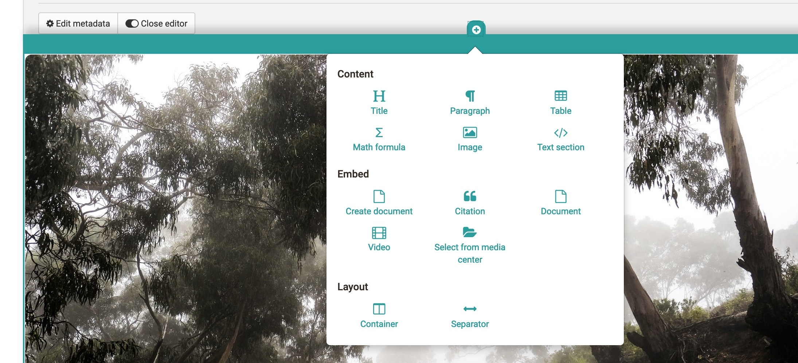

# Math formula {: #formula}

Formulas can be inserted in OpenOlat in various places. Either the HTML editor or the Content editor is used.

## Insert a formula via HTML editor {: #insert_via_html}

1. Insert the formula via `Insert > Insert math formula` in the menu of the HTML editor or, if activated, directly via the formula button.

    { class="shadow lightbox" }

2. Enter the formula in the graphical editor or in the LaTeX field. Further information on how to use the graphical editor can be found here: [CortexJS keybindings](https://cortexjs.io/mathlive/reference/keybindings/).

    { class="shadow lightbox" }

3. Close the HTML editor with "Save". The formula is now embedded.

    { class="shadow lightbox" }

Math formulas can be inserted in the following course elements and learning resources via HTML editor:

* Course element "HTML-Page"
* Course element "Task" and "Group task" (HTML)
* Course element "Forum"
* Learning resource "CP learning content"
* Learning resource "Blog"
* Learning resource "Test"

!!! info "Important"

    Word count for tasks: The math formula counts as one word, regardless of length and complexity.

## Insert a formula via Content editor in Portfolio 2.0 {: #insert_formula}

1. Open or create a portfolio entry and open the Content editor. Click "Add content".

    { class="shadow lightbox" }

2. Select "Math formula".

3. The graphical formula editor opens. Create your formula.

    { class="shadow lightbox" }

## Further information {: #further_information}

[CortexJS keybindings >](https://cortexjs.io/mathlive/reference/keybindings/) 
[Content Editor >](Content_Editor.md) 
[Course Element "HTML page" >](../learningresources/Course_Element_HTML_Page.md) 
[Personal tools: Portfolio >](../personal_menu/Portfolio.md)

[To the top of the page ^](#formula)
