# Media Center Concept {: #media_center_concept}

## Functions {: #functions}

The Media Center is a **central collection point** for different types of media.

Media can be...

* ... created directly in the Media Center (e.g. video recording, docx, pptx, ...)
* ... created in various course elements and then stored in the Media Center
* ... created externally and uploaded as a file
* ... used across courses
* ... released (shared) to other persons (authors) and used jointly
* ... versioned
* ... tagged
* ... assigned to a taxonomy
* ... filtered (e.g. "My media")
* ... searched by place of use

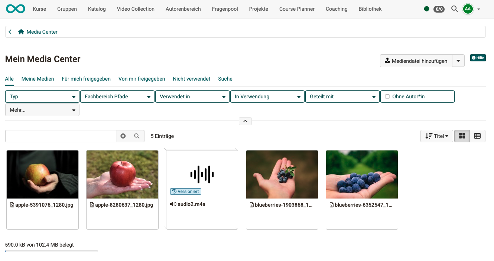{ class=" shadow lightbox" }

[To the top of the page ^](#media_center_concept)

---

## Access {: #access}

The Media Center is initially an individual, personal area and can therefore also be found in the **personal menu**.

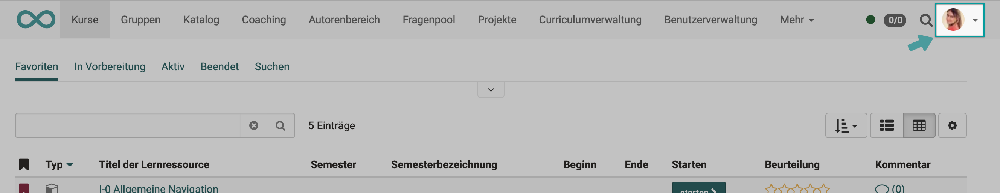{ class=" shadow lightbox" }

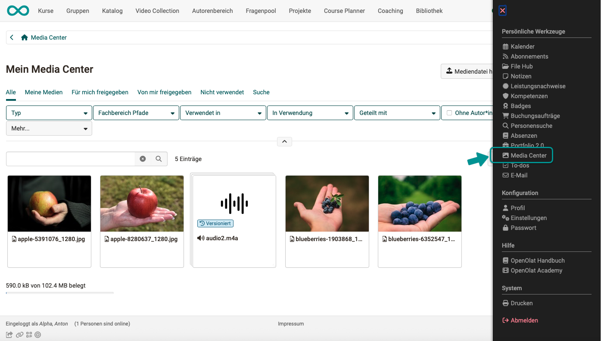{ class=" shadow lightbox" }

Even if they are personal media, they can be shared with other people and used in various OpenOlat contexts. 
[More about sharing >](#share)

### Administrative access {: #administrative_access}

Administrative users, such as learning resource managers and administrators, have **indirect** access to media due to their higher-level roles. They have **administrative access** to all media shared within their organisation, groups, courses, and with users.

[To the top of the page ^](#media_center_concept)

---

## Types of Media {: #media_types}

Different **file formats** and **content elements** are stored in the media center.

* images (png, jpg, ...)
* video files (mp4)
* audio files (mp3)
* Office documents (docx, xlsx, pptx, ...)
* texts
* diagrams (draw.io)
* video recordings via webcam
* audio recordings
* quotes
* forum posts
* blog entries
* wiki pages
* certificates of achievement from courses

[To the top of the page ^](#media_center_concept)

---

## Add media to the Media center {: #add_media}

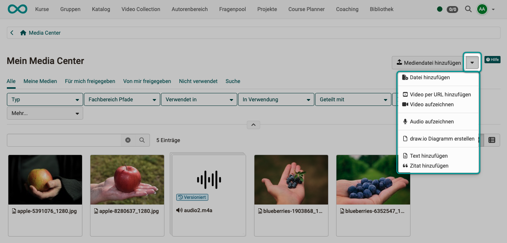{ class=" shadow lightbox" } 

There are various ways to store media in the Media center:

### Upload or link existing media directly in the Media Center {: #add_existing}

* **Add media file:** Upload images, videos, pdf, Excel, etc.
* **Add video via URL**: Videos from external portals such as YouTube, Vimeo, Panopto or nanoo.tv can simply be added via a link.
* **Add citation:**  Quotations from books, articles, websites, films, etc. can be stored in text form and provided with metadata such as source, author, URL, etc. This means that citations can be inserted in several places in OpenOlat without having to enter the entire source again and again. However, make sure that you enter all details carefully and comprehensively.

### Create new media directly in the Media Center {: #create_in_media_center}

* **Create document:** Documents of integrated editors, e.g. Word, Excel, Powerpoint 
* Create **draw.io diagram**: Creates a diagram, flowchart or drawing with the draw.io tool, as of :octicons-tag-24: Release 18.1.
* **Add text:** Text elements for use in the content editor, created with a simple HTML editor
* **Record video:** Video recording function integrated in OpenOlat. If you click on "Record video", the recording function for the webcam is started directly, provided you allow access to the camera in the browser.
* **Record Audio**:Audio recording function integrated in OpenOlat. If you click on "Record audio", the recording function is started, provided access has been permitted in the browser.

### Create new media outside the Media Center in the Content Editor {: #create_in_editor}

Media for the Media Center can also be created in the OpenOlat course or in the portfolio using the [content editor](../basic_concepts/Content_Editor.md). In the course, for example, this can be done via the course element ["Page"](../learningresources/Course_Element_Page.md). Go to edit mode and select "Add content". Among other things, a button for the "Media Center" will appear.  Click on the button and you will be taken to the Media Center with all the corresponding options. 

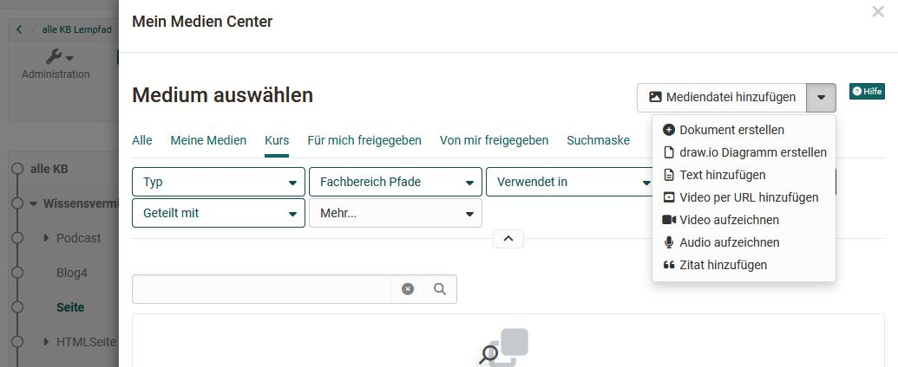{ class=" shadow lightbox" }

### Collect content elements and assign them to the Media Center {: #assign_media}

In addition to creating or uploading media in the Media Center, media can also be _collected_ in other places in OpenOlat and linked to the Media Center by clicking on the puzzle piece.

The elements include:

* forum posts
* blog entries
* wiki pages
* evidences of achievement from courses

For example, to add a post, open your forum post and click on the puzzle piece.

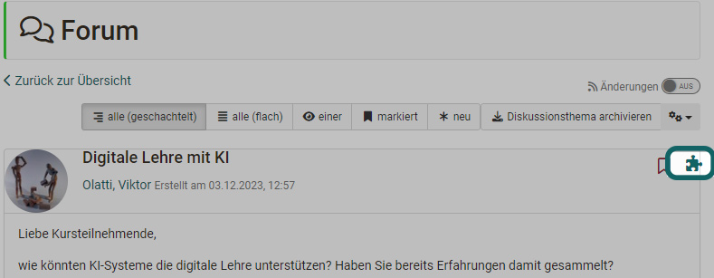{ class=" shadow lightbox" }

A page will then appear where you can enter the title, tags and a description for the post content. After saving, the post will be displayed in your Media Center.

!!! info "Important"

    For forum posts, blog entries and wiki pages, it is necessary to be the creator of an entry or wiki page. Simply editing the post is not sufficient.

!!! info "Mandatory information"

    Each media element must have a title and can then be provided with additional information and metadata. This information can be further configured later using the tabs of a media element.

### Share with others {: #share}

When you add a media file to Media Center, you have the option to share it with other people (co-users).

Users view: 
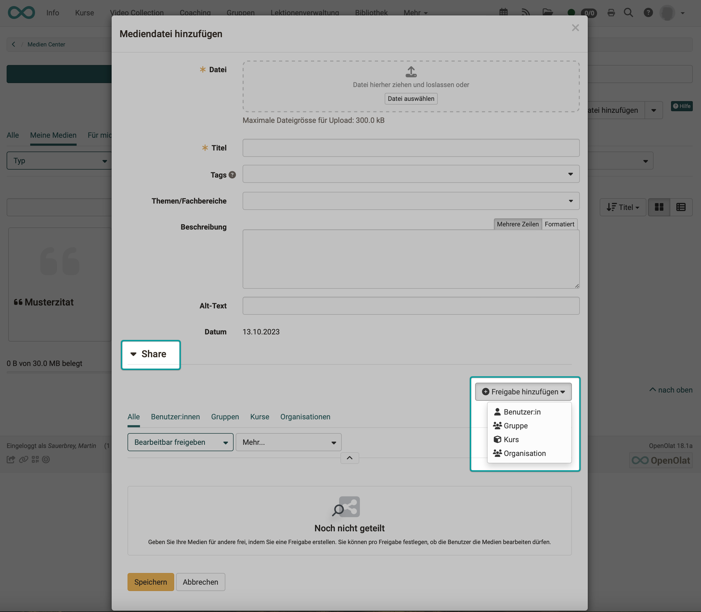{ class="shadow lightbox" }

[To the top of the page ^](#media_center_concept)

---

### Delete media {: #delete_media}

If you select at least one list entry at the beginning of a line in the table view, the "Delete" button appears above the list, which can be used to delete several files and content elements in the Media Center at once.

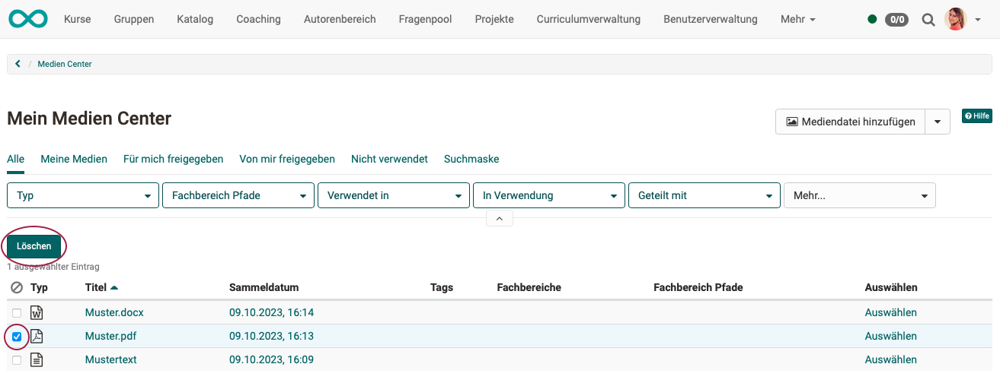{ class=" shadow lightbox" }

You can also delete individual files in the 3-dot menu if you have clicked on an individual medium and the information and descriptions are displayed. (Same menu as for downloading.)

!!! info "Info"

    Please note that you can only delete **your own** media that are not integrated in other places in OpenOlat.

Media uploaded to the Media Center always belong to one owner. When the owner deletes his/her content, the following applies:

* Media used in the ePortfolio will be deleted.
* Media not used in a "Page" course element that are not shared are deleted.
* Media used in a "Page" course element or those that have been shared are retained, but are then without an owner.
* Media without an owner will be displayed in the media management for administrators in future.

[To the top of the page ^](#media_center_concept)

---

### Quota

The storage space available in the Media Center can be limited by the OpenOlat administrator. You can see exactly how much storage space you have available and how much you have already used at the bottom left.

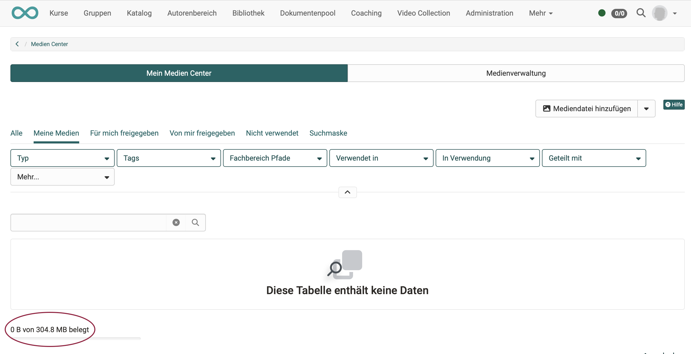{ class=" shadow lightbox" }

Authors usually require more storage space, so quota settings are configured separately for these power users. If you have any questions about storage requirements, please contact your administrator or user manager.

!!! hint "Note"

        Only media that has been uploaded/created by the user is displayed as storage consumption. If all media displayed is exclusively referenced (shared by other authors), then storage consumption of 0 is displayed.

[To the top of the page ^](#media_center_concept)

---

## Use media {: #usage}

And how can the media in the Media Center be reused? The media contained in the Media Center can be inserted into course elements in the Content Editor, for example in the course element ["Page"](../learningresources/Course_Element_Page.md) or in the [Portfolio](../area_modules/Portfolio.md).

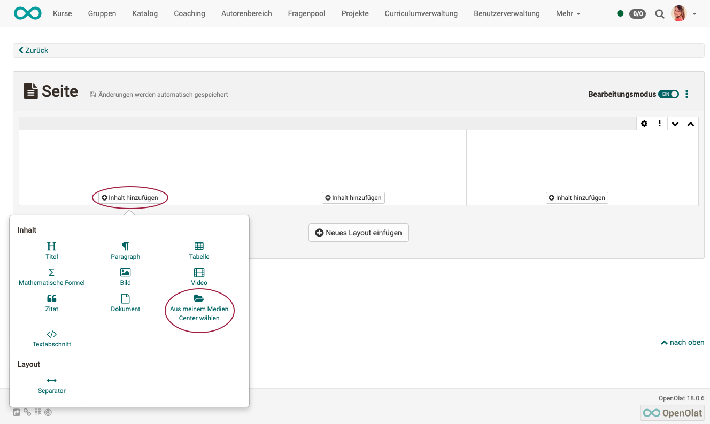{ class=" shadow lightbox" }

The **filter functions** help you to find the media you are looking for quickly. Search or filter for ...

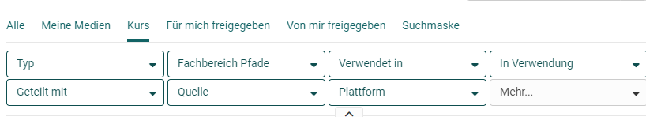{ class=" shadow lightbox" }

!!! note "Note"

    When documents are included in a portfolio folder, they are displayed as _links_ and are not displayed directly.

[To the top of the page ^](#media_center_concept)

---

## Manage Media Center {: #media_center_administration}

When accessing the Media Center, persons with administrative access (e.g. administrators) have an additional "Media management" tab in which they can perform administrative tasks in the Media Center. All media except your own are listed there. (Users without administrative access will not see this tab.)

After clicking on a medium, the usage locations, releases, last views, etc. can be called up for each medium.

{ class=" shadow lightbox" }

[To the top of the page ^](#media_center_concept)

---

## Further information {: #further_information}

[Information and settings for individual media >](../basic_concepts/Media_Center_Items.md) 
[Media Center in the personal menu >](../personal_menu/Media_Center.md) 
[Configuration of Media Center (by administrators) >](../../manual_admin/administration/Modules_Media_Center.md) 

[To the top of the page ^](#media_center_concept)