# Media Center Concept {: #media_center_concept}

## Functions [:octicons-tag-16:{ title="from Release 19.1 (OO-8156)" }](https://track.frentix.com/issue/OO-8156){:target="_blank"} {: #functions}

The Media Center is a **central collection point** for different types of media.

Media can be...

* ... created directly in the Media Center
* ... created in various course elements and then stored in the Media Center
* ... created externally and uploaded as a file
* ... used across courses
* ... released (shared) to other persons and used jointly
* ... versioned
* ... tagged
* ... assigned to a taxonomy
* ... filtered (e.g. "My media")
* ... searched by place of use

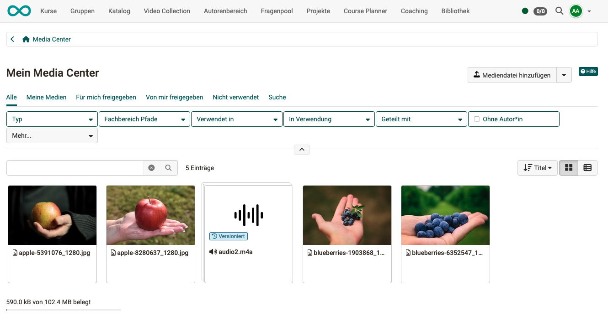{ class=" shadow lightbox" }

[To the top of the page ^](#media_center_concept)

---

## Access [:octicons-tag-16:{ title="from Release 19.1 (OO-7813)" }](https://track.frentix.com/issue/OO-7813){:target="_blank"} {: #access}

The Media Center is initially an individual, personal area and can therefore also be found in the **personal menu**.

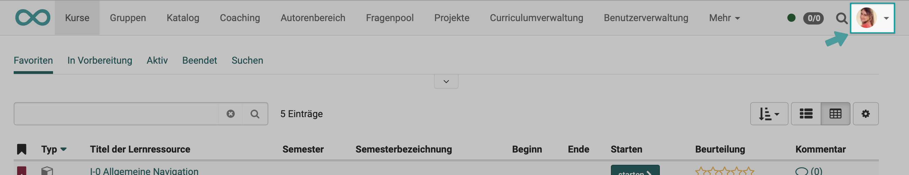{ class=" shadow lightbox" }

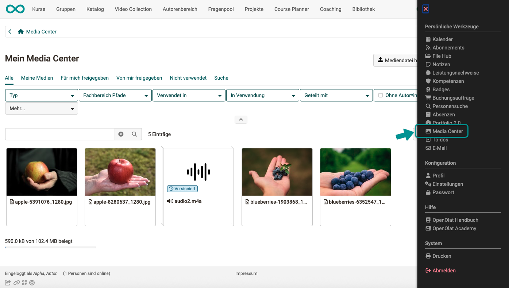{ class=" shadow lightbox" }

Even if they are personal media, they can be shared with other people and used in various OpenOlat contexts. 
[More about sharing >](#share)

### Administrative access {: #administrative_access}

Administrative users, such as learning resource managers and administrators, have **indirect** access to media due to their higher-level roles. They have **administrative access** to all media shared within their organisation, groups, courses, and with users.

[To the top of the page ^](#media_center_concept)

---

## Types of Media [:octicons-tag-16:{ title="from Release 18.1 (OO-7092)" }](https://track.frentix.com/issue/OO-7092){:target="_blank"} {: #media_types}

Different **file formats** and **content elements** can be stored and managed in the Media Center. These include:

* images (png, jpg, svg [:octicons-tag-16:{ title="svg from Release 20.3.0 (OO-9350)" }](https://track.frentix.com/issue/OO-9350){:target="_blank"}, ...)
* video files (mp4)
* audio files (mp3)
* Office documents (docx, xlsx, pptx, ...)
* text elements
* diagrams (draw.io)
* own video recordings via webcam
* audio recordings
* citations
* forum posts
* blog entries
* wiki pages
* evidences of achievement from courses

[To the top of the page ^](#media_center_concept)

---

## Add media to the Media Center [:octicons-tag-16:{ title="from Release 19.1 (OO-7813)" }](https://track.frentix.com/issue/OO-7813){:target="_blank"} {: #add_media}

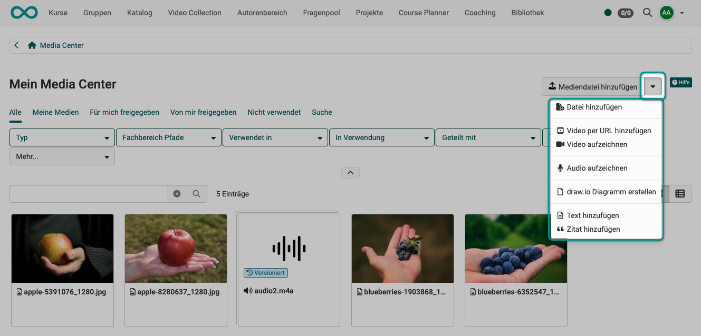{ class=" shadow lightbox" }

There are various ways to store media in the Media Center:

### Upload or link existing media directly in the Media Center {: #add_existing}

* **Add media file:** Upload images, videos, pdf, Excel, etc. If the AI module is enabled, metadata such as title, description, alt text and tags can be pre-filled by AI via a button when uploading images [:octicons-tag-16:{ title="from Release 20.3.0 (OO-9355)" }](https://track.frentix.com/issue/OO-9355){:target="_blank"}. [Details on metadata with AI >](Media_Center_Items.md#metadata_ai)
* **Add video via URL:** Videos from external portals such as YouTube, Vimeo, Panopto or nanoo.tv can simply be added via a link.
* **Add citation:** Quotations from books, articles, websites, films, etc. can be stored in text form and provided with metadata such as source, author, URL, etc. This means that citations can be inserted in several places in OpenOlat without having to enter the entire source again and again. However, make sure that you enter all details carefully and comprehensively.

### Create new media directly in the Media Center [:octicons-tag-16:{ title="from Release 18.1 (OO-7366)" }](https://track.frentix.com/issue/OO-7366){:target="_blank"} {: #create_in_media_center}

* **Create document:** Documents of integrated editors, e.g. Word, Excel, PowerPoint
* **Create draw.io diagram:** Creates a diagram, flowchart or drawing with the draw.io tool [:octicons-tag-16:{ title="from Release 18.1.0 (OO-7092)" }](https://track.frentix.com/issue/OO-7092){:target="_blank"}
* **Add text:** Text elements for use in the Content Editor, created with a simple HTML editor
* **Record Video:** Video recording function integrated in OpenOlat. If you click on "Record Video", the recording function for the webcam is started directly, provided you allow access to the camera in the browser.
* **Record Audio:** Audio recording function integrated in OpenOlat. If you click on "Record Audio", the recording function is started, provided access has been permitted in the browser.

### Create new media outside the Media Center in the Content Editor {: #create_in_editor}

Media for the Media Center can also be created in the OpenOlat course or in the portfolio using the [Content Editor](../basic_concepts/Content_Editor.md). In the course, for example, this can be done via the course element ["Page"](../learningresources/Course_Element_Page.md). Go to edit mode and select "Add content". Among other things, a button for the "Media Center" will appear. Click on the button and you will be taken to the Media Center with all the corresponding options.

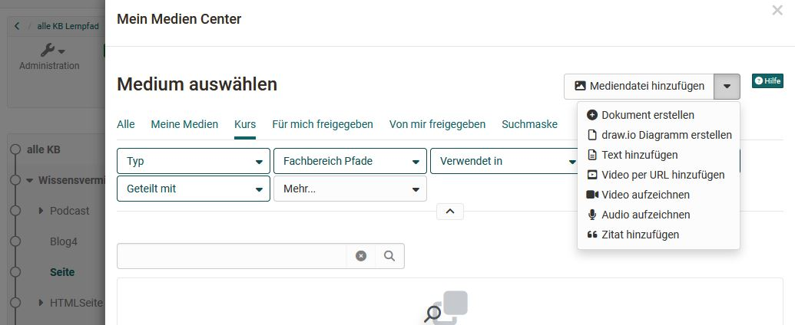{ class=" shadow lightbox" }

### Collect content elements and assign them to the Media Center {: #assign_media}

In addition to creating or uploading media in the Media Center, media can also be _collected_ in other places in OpenOlat and linked to the Media Center by clicking on the puzzle piece.

The elements include:

* forum posts
* blog entries
* wiki pages
* evidences of achievement from courses

For example, to add a post, open your forum post and click on the puzzle piece.

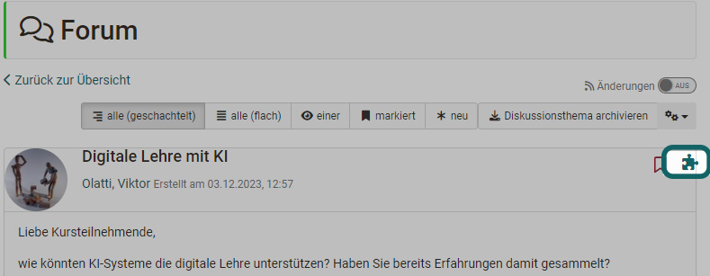{ class=" shadow lightbox" }

A page will then appear where you can enter the metadata as usual and save everything. The post is then available as a link in your Media Center.

!!! info "Important"

    For forum posts, blog entries and wiki pages, it is necessary to be the creator of an entry or wiki page. Simply editing the post is not sufficient.

!!! info "Mandatory information"

    Each media element must have a title and can then be provided with additional information and metadata. This information can be further configured later using the tabs of a media element.

### Share with others [:octicons-tag-16:{ title="from Release 18.0 (OO-7061)" }](https://track.frentix.com/issue/OO-7061){:target="_blank"} {: #share}

When you add a media file to the Media Center, you can share it with other people (co-users).

Users view: 
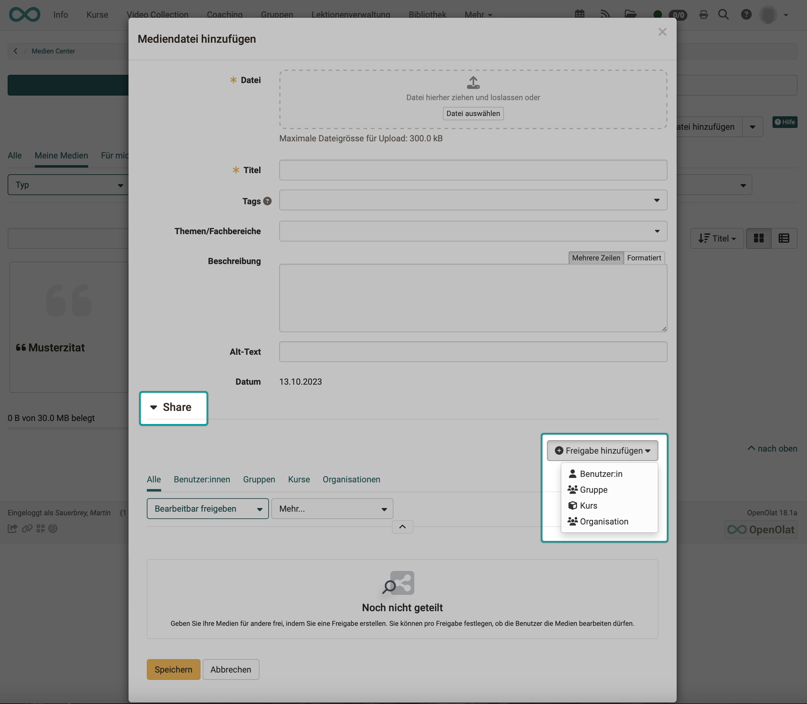{ class="shadow lightbox" }

[To the top of the page ^](#media_center_concept)

---

## Delete media {: #delete_media}

Select the table view at the top right above the list if you are currently viewing the media in card view.

If you select at least one list entry at the beginning of a line in the table view, the "Delete" button appears above the list, which can be used to delete several elements at once.

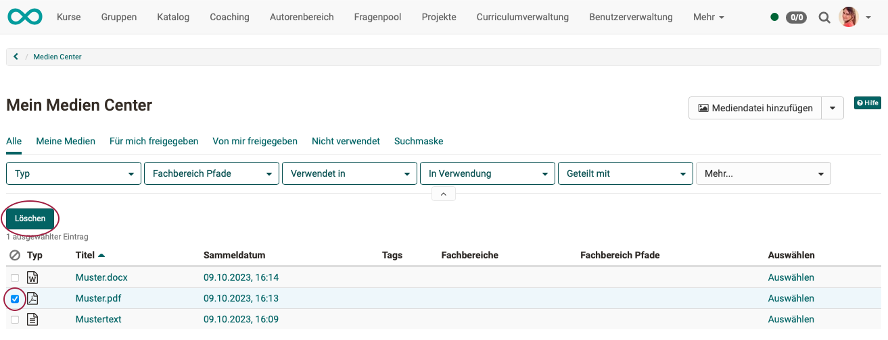{ class=" shadow lightbox" }

You can also delete individual files in the 3-dot menu if you have clicked on an individual medium and the information and descriptions are displayed. (Same menu as for downloading.)

!!! info "Important"

    Please note that you can only delete **your own** media that are not integrated in other places in OpenOlat.

### What happens to the media items when an account is deleted {: #delete_media_account}

Media items uploaded to the Media Center always belong to one owner. When that account is deleted, a single question decides the fate of every media item: is it embedded in a page?

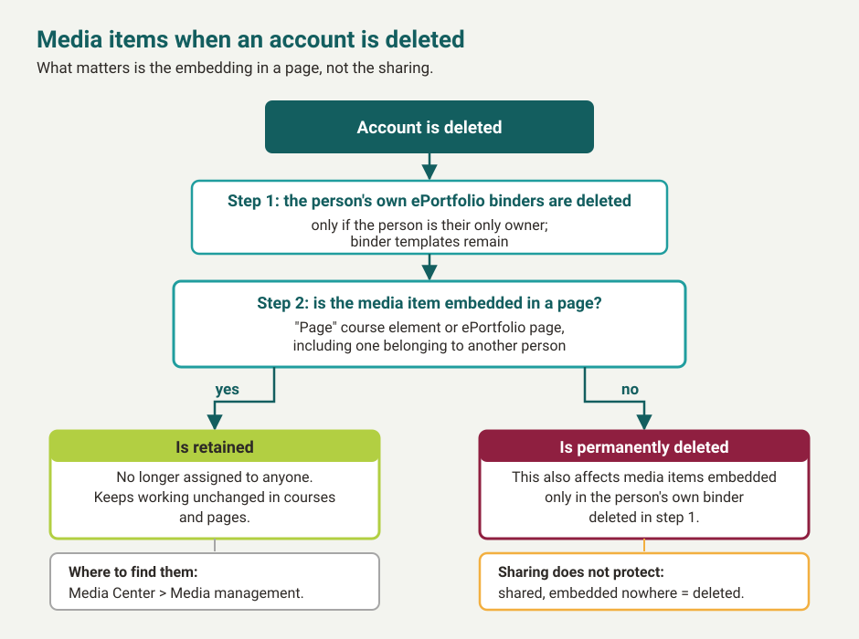{ class="shadow lightbox" title="Media items when an account is deleted" }

Embedded counts both in the "Page" course element and in an ePortfolio page, including one belonging to another person. If the media item is embedded, it is retained and is no longer assigned to anyone. If it is not embedded anywhere, it is permanently deleted.

**Sharing does not protect the media item.** Shared, but embedded nowhere means: deleted. Please note: the person's own ePortfolio binders are deleted beforehand, provided that the person is their only owner. Media items that were embedded only there lose their embedding and are therefore deleted as well.

Administrators and learning resource managers find the retained media items without an assignment in the media management, using the **Without creator** filter, provided that the media item is shared with a course of their organisation. A media item that is only embedded in a page does not appear there.

!!! tip "Before an account is deleted"
    Ask the person concerned to download any media items they need. If a media item is to remain in the system, it must be embedded in a page beforehand. The complete table of all data types is on the page [Delete user](../../manual_admin/usermanagement/Delete_User.md#del_properties).

[To the top of the page ^](#media_center_concept)

---

## Quota [:octicons-tag-16:{ title="from Release 18.1 (OO-7024)" }](https://track.frentix.com/issue/OO-7024){:target="_blank"} {: #quota}

The storage space available in the Media Center can be limited by the OpenOlat administrators. You can see exactly how much storage space you have available and how much you have already used at the bottom left.

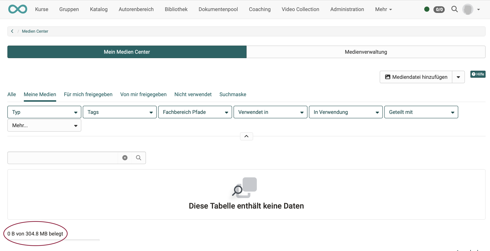{ class=" shadow lightbox" }

Authors usually require more storage space, so quota settings are configured separately for these power users. If you have any questions about storage requirements, please contact your administrators or user managers.

!!! note "Note"

    Only media that has been uploaded/created by the user is displayed as storage consumption. If all media displayed is exclusively referenced (shared by other authors), then storage consumption of 0 is displayed.

[To the top of the page ^](#media_center_concept)

---

## Use media [:octicons-tag-16:{ title="from Release 18.0 (OO-7014)" }](https://track.frentix.com/issue/OO-7014){:target="_blank"} {: #usage}

And how can the media in the Media Center be reused? The files, documents and collections can be used, for example, in the Content Editor in the course element ["Page"](../learningresources/Course_Element_Page.md) or in the [Portfolio](../area_modules/Portfolio.md).

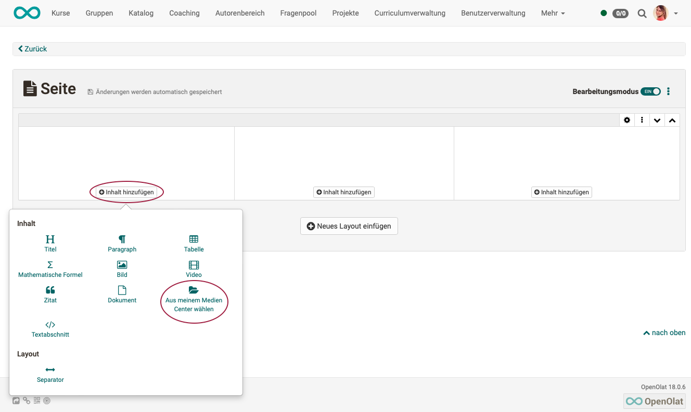{ class=" shadow lightbox" }

The **filter functions** help you to find the media you are looking for quickly. Search or filter for ...

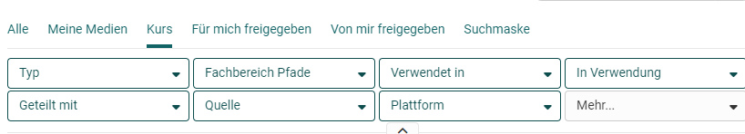{ class=" shadow lightbox" }

!!! note "Note"

    When documents are included in a portfolio binder, they are displayed as _links_ and are not displayed directly.

[To the top of the page ^](#media_center_concept)

---

## Manage Media Center [:octicons-tag-16:{ title="from Release 18.1 (OO-7254)" }](https://track.frentix.com/issue/OO-7254){:target="_blank"} {: #media_center_administration}

If you, as an administrator or learning resource manager, need to know where a media item of another person is embedded and with whom it is shared, you find the answer in the Media Center in the segment "Media management". Only these two roles see it next to the segment "My Media Center". All other roles only see their own Media Center and no segment bar.

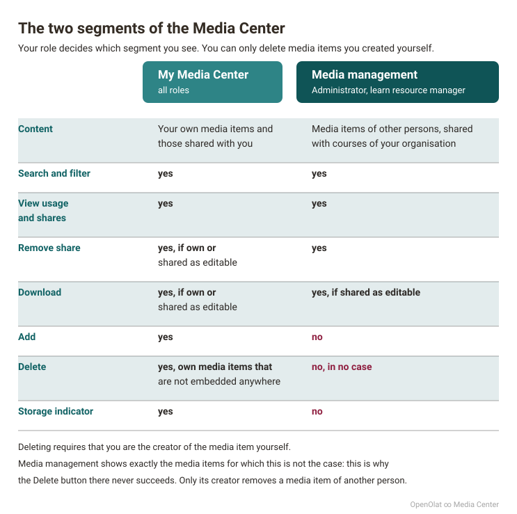{ class="shadow lightbox" title="The two segments of the Media Center" }

The media management lists media items of other persons that are shared with a course belonging to an organisation in which you are an administrator or learning resource manager. Media items shared directly with you, with one of your groups or with your organisation do not appear there. Like your own media items, they are in the segment "My Media Center", in the tab "Shared with me".

After clicking on a media item, you see in the tab "Uses" where it is embedded, and in the tab "Shares" with whom it is shared. Depending on the media type, the tab "Overview" also shows the activities log with the previous actions on the media item. This lets you clarify where a media item is embedded before you ask its creator to replace or remove it. In the tab "Shares", you can remove a share with the "Remove" icon in its row and confirm with "Remove share".

The filters **Used in**, **In use** and **Shared with** narrow down the list. The **Without creator** filter shows the media items in this list whose creator no longer has an account because it was deleted.

If a media item is shared with you as editable (setting "Editable" in the share), you can also edit its metadata and, depending on the media type, its versions. You can then download it via the 3-dot menu. Without an editable share, the 3-dot menu is missing.

You cannot add media items in the media management, the "Add media file" button is missing there. The storage indicator at the bottom left also belongs to your own Media Center and does not appear in the media management.

!!! info "Important"

    You cannot delete media items of other persons in the media management, not even as an administrator. The "Delete" button above the list and, with an editable share, the "Delete" action in the 3-dot menu are present, but they always end with the message that the media item cannot be deleted. The message gives existing uses as the reason, even if the media item is not embedded anywhere. The actual reason: deleting requires that you are the creator of the media item yourself and that it is not embedded anywhere. Anyone who wants to remove a media item of another person asks its creator to do so. If the creator's account was deleted, the media item is retained without an assignment, see [What happens to the media items when an account is deleted](#delete_media_account).

[To the top of the page ^](#media_center_concept)

---

## Further information {: #further_information}

[Information and settings for items in the Media Center >](../basic_concepts/Media_Center_Items.md) 
[Content Editor >](../basic_concepts/Content_Editor.md) 
[Course Element "Page" >](../learningresources/Course_Element_Page.md) 
[Creating Portfolios >](../area_modules/Portfolio.md) 
[Personal tools: Media Center >](../personal_menu/Media_Center.md) 
[Module Media Center >](../../manual_admin/administration/Modules_Media_Center.md) 
[Working with media files >](../basic_concepts/Working_with_Media_Files.md) 
[Delete user >](../../manual_admin/usermanagement/Delete_User.md) 
[Data protection >](../../manual_admin/usermanagement/Data_protection.md)

[To the top of the page ^](#media_center_concept)
