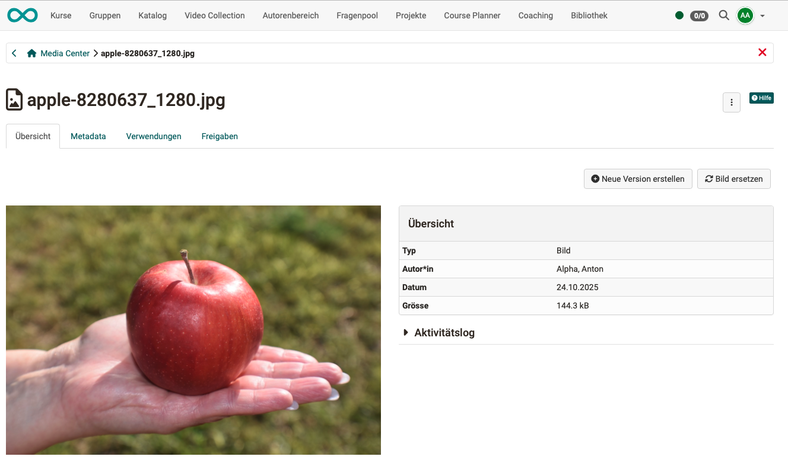
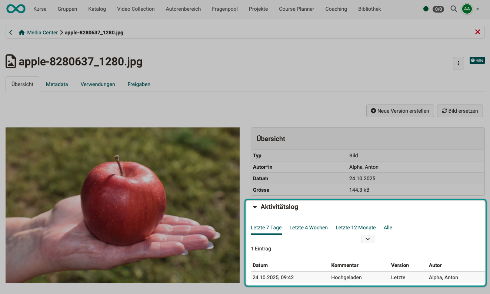
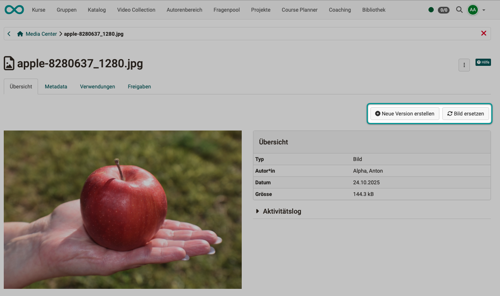
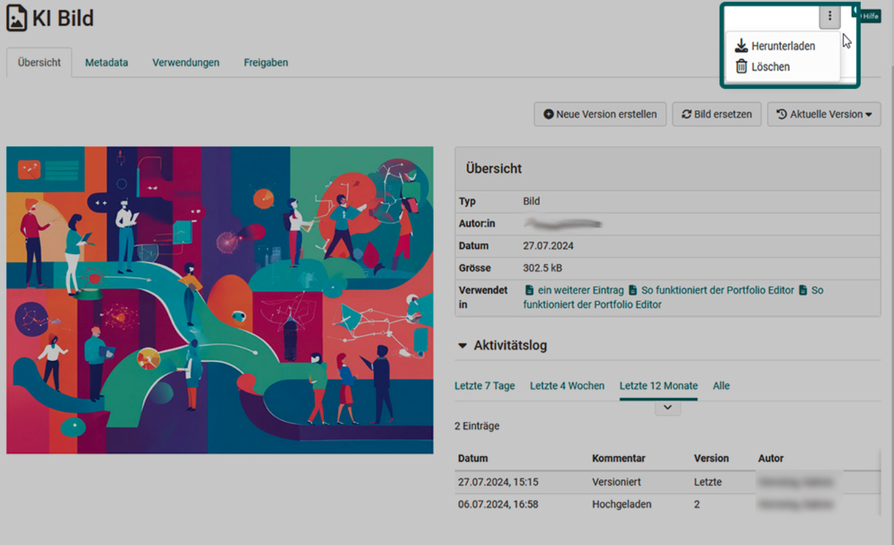
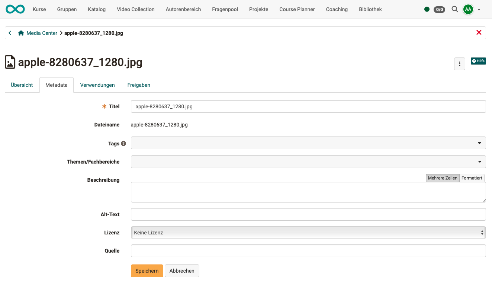
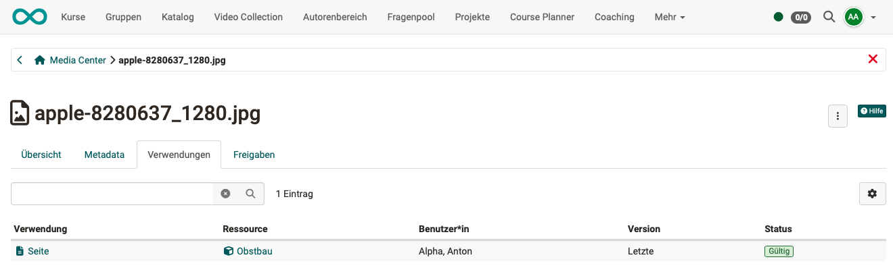
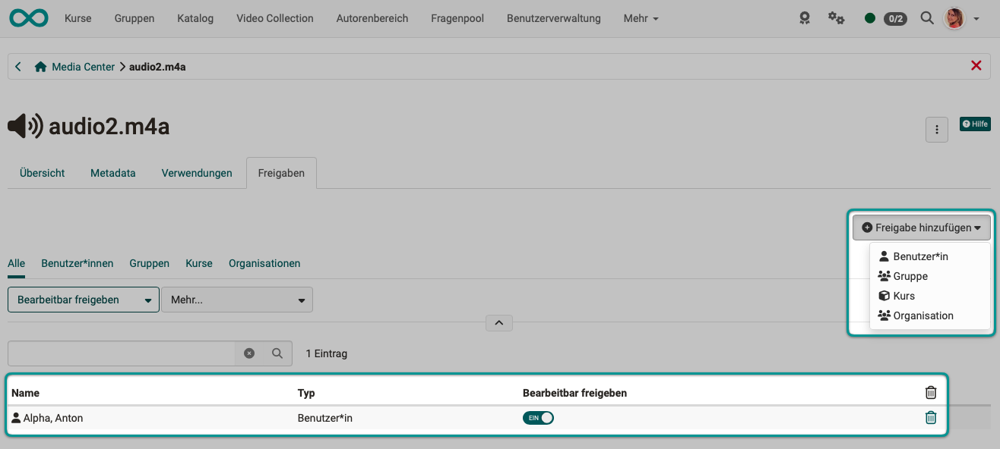

# Media Center: Informationen und Einstellungen zu Einzelmedien {: #media_center_items}

Zu jedem im Media Center abgelegten Einzelmedium können Informationen und Einstellungen eingegeben werden. Öffnen Sie dazu im persönlichen Menü das Media Center und klicken Sie das gewünschte Medienelement an. Es öffnet sich ein Screen mit den nachfolgend beschriebenen Tabs

* Übersicht
* Metadaten
* Verwendungen
* Freigaben

## Tab Übersicht {: #media_center_overview}

Der Tab **Übersicht** zeigt die Details Typ, Ersteller:in, Erstellungsdatum und Dateigrösse. Es besteht ausserdem die Möglichkeit den Aktivitätslog anzuzeigen und eine neue Version zu erstellen bzw. das Bild zu ersetzen.

{ class="shadow lightbox" } 

### Aktivitätslog {: #media_center_activitylog}

Im Aktivitätslog kann nachverfolgt werden, wann das Medienelement von wem bearbeitet wurde.

{ class="shadow lightbox" } 

### "Neue Version erstellen" und "Bild ersetzen" {: #media_center_versioning}

Interessant ist die Möglichkeit Medienelemente zu **versionieren**. So können z.B. verschiedene Arbeitsschritte oder Zwischenstufen gesichert werden. Ein Wechsel zu älteren Versionen ist dann jederzeit möglich.

Mit **Bild ersetzen** wird dagegen in der aktuellen Version das Bild ausgetauscht. Alle sonstigen eingegebenen Metadaten und Einstellungen (z.B. Freigaben) bleiben dabei erhalten. 

{ class="shadow lightbox" } 

### Herunterladen oder Löschen {: #media_center_download}

Über die 3 Punkte rechts oben können Sie einzelne Medien aus dem Media Center herunterladen. Sind Sie Besitzer:in können Sie Ihr Medienelement auch löschen. 

{ class="shadow lightbox" } 

[Zum Seitenanfang ^](#media_center_items)

---

## Tab Metadaten {: #media_center_metadata}

Folgende Informationen können einem Medienelement hinzugefügt werden: 

* ein vom Dateinamen abweichender Titel 
* Tags zur Verschlagwortung und für eine bessere Übersicht
* eine Zuordnung zu Themen und Fachbereichen (Taxonomie) 
* eine Beschreibung 
* ein "Alt-Text" bei draw.io Dateien oder Bildern/Grafiken. Er ist besonders relevant für Screenreader.
* eine Lizenzangabe, wie z.B. "CC BY-NC-SA"
* eine Quellenangabe

Je nach Art des Medientyps variieren die Informationen und Möglichkeiten der Metadaten. Alle Informationen können später geändert werden.  

{ class="shadow lightbox" } 

[Zum Seitenanfang ^](#media_center_items)

---

## Tab Verwendungen {: #media_center_uses}

Im Tab "Verwendungen" können Sie nachvollziehen, wo das Medienelement verwendet wird.  
Durch Klick auf die Verwendungsangabe können Sie direkt an die Stelle in diesem Kurs springen.

{ class="shadow lightbox" } 

[Zum Seitenanfang ^](#media_center_items)

---

## Tab Freigabe {: #media_center_share}

Hier kann festgelegt werden, durch wen ein Medienelement verwendet werden darf. Teilnehmende können nur Gruppen definieren. Autor:innen haben mehr Möglichkeiten und können spezifische OpenOlat-Benutzer:innen, Gruppen, oder Kurse angeben. Durch die Freigabe können Dateien auch kollaborativ genutzt werden, wenn die Bearbeitung erlaubt wird.

{ class="shadow lightbox" } 

[Zum Seitenanfang ^](#media_center_items)

---

## Weitere Informationen {: #further_information}

[Konzept des Media Centers >](../basic_concepts/Media_Center_Concept.de.md) 
[Media Center im persönlichen Menü >](../personal_menu/Media_Center.de.md) 

[Zum Seitenanfang ^](#media_center_items)

