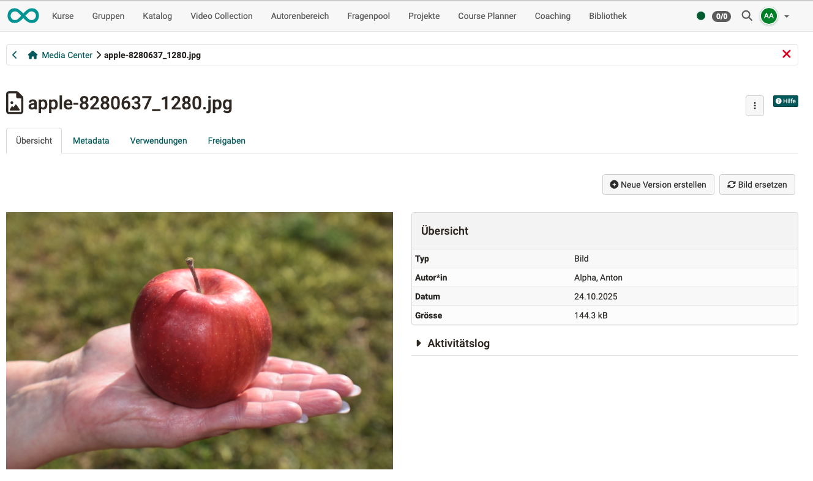
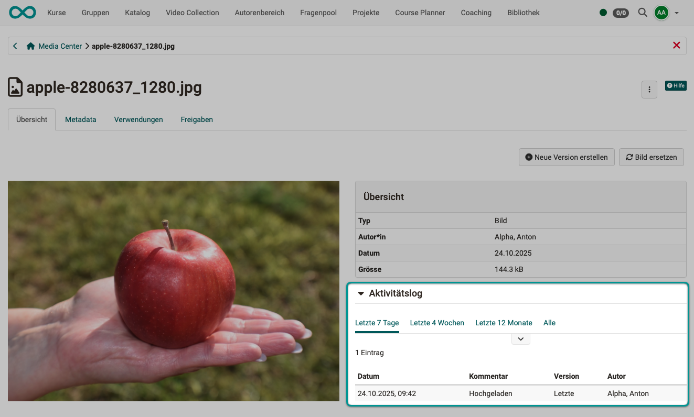
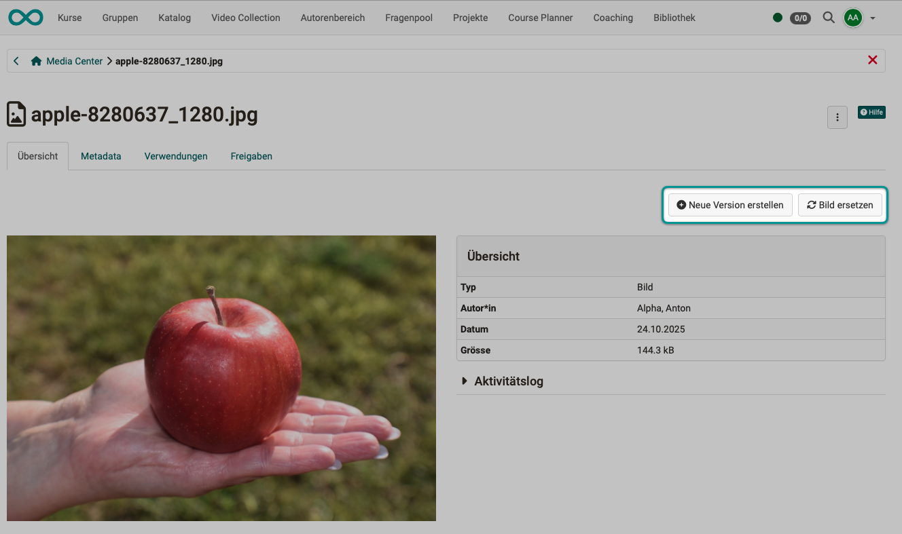
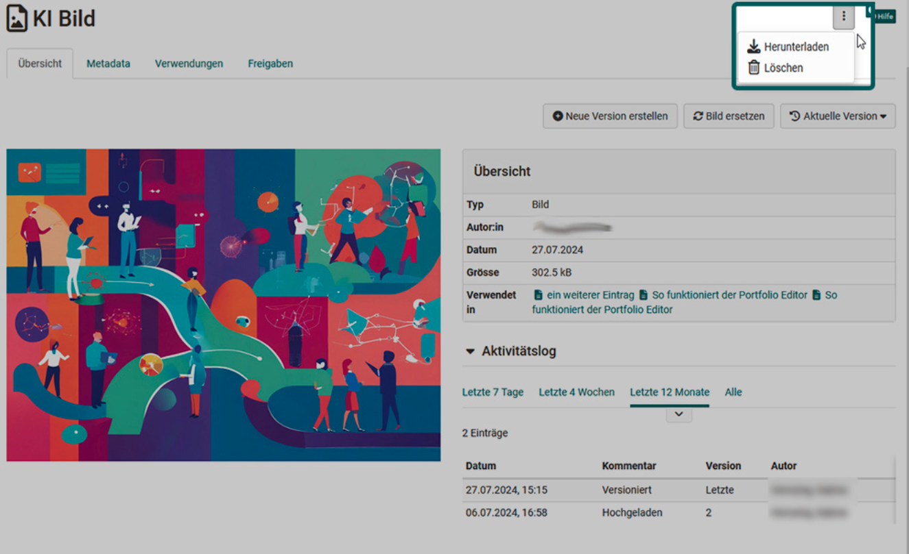
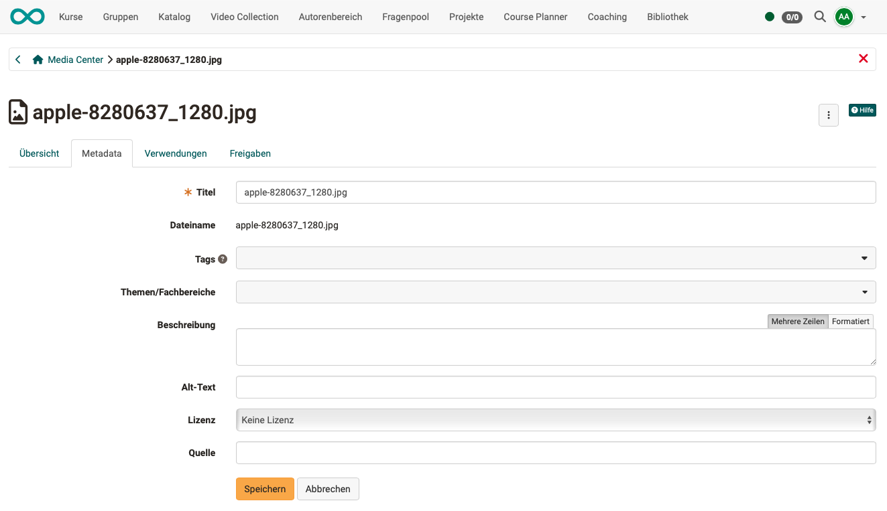
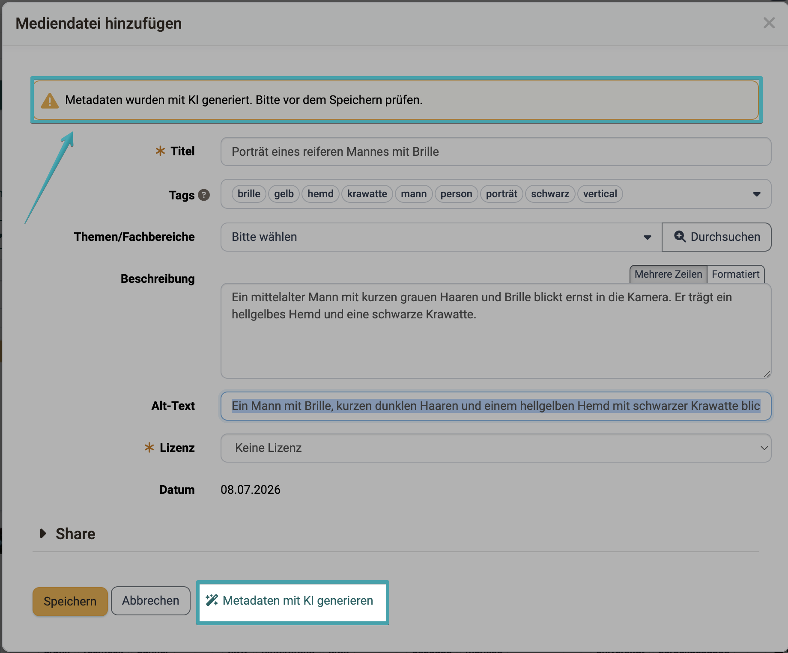
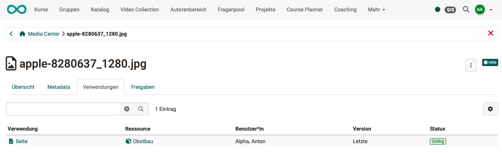
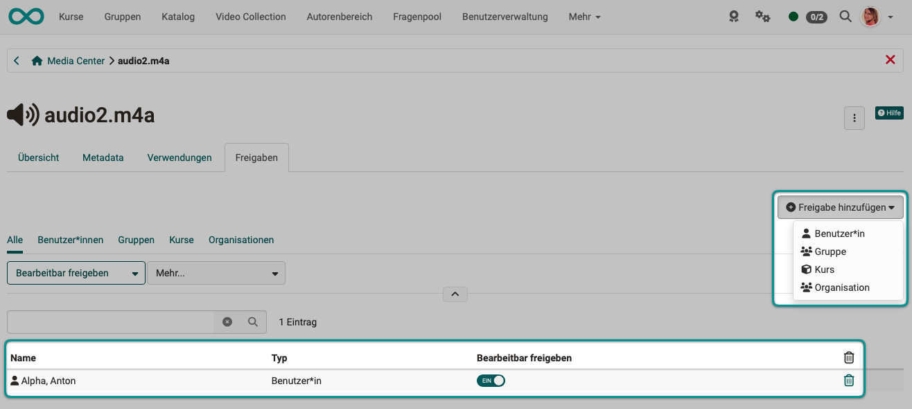

# Media Center: Informationen und Einstellungen zu Einzelmedien {: #media_center_items}

Zu jedem im Media Center abgelegten Einzelmedium können Informationen und Einstellungen eingegeben werden. Öffnen Sie dazu im persönlichen Menü das Media Center und klicken Sie das gewünschte Medienelement an. Es öffnet sich eine Ansicht mit den nachfolgend beschriebenen Tabs:

* Übersicht
* Metadaten
* Verwendungen
* Freigaben

## Tab Übersicht {: #media_center_overview}

Der Tab **Übersicht** zeigt die Details Typ, Autor:in, Datum und Grösse. Es besteht ausserdem die Möglichkeit, den Aktivitätslog anzuzeigen und eine neue Version zu erstellen bzw. das Bild zu ersetzen.

{ class="shadow lightbox" }

### Aktivitätslog {: #media_center_activitylog}

Im Aktivitätslog kann nachverfolgt werden, wann das Medienelement von wem bearbeitet wurde.

{ class="shadow lightbox" }

### "Neue Version erstellen" und "Bild ersetzen" [:octicons-tag-16:{ title="ab Release 18.0.0 (OO-6986)" }](https://track.frentix.com/issue/OO-6986){:target="_blank"} {: #media_center_versioning}

Interessant ist die Möglichkeit, Medienelemente zu **versionieren**. So können z.B. verschiedene Arbeitsschritte oder Zwischenstufen gesichert werden. Ein Wechsel zu älteren Versionen ist dann jederzeit möglich.

Mit **Bild ersetzen** wird dagegen in der aktuellen Version das Bild ausgetauscht. Alle sonstigen eingegebenen Metadaten und Einstellungen (z.B. Freigaben) bleiben dabei erhalten.

{ class="shadow lightbox" }

### Herunterladen oder Löschen {: #media_center_download}

Über das 3-Punkte-Menü rechts oben können Sie einzelne Medien aus dem Media Center herunterladen. Sind Sie Besitzer:in, können Sie Ihr Medienelement auch löschen.

{ class="shadow lightbox" }

[Zum Seitenanfang ^](#media_center_items)

---

## Tab Metadaten [:octicons-tag-16:{ title="ab Release 18.0.0 (OO-7060)" }](https://track.frentix.com/issue/OO-7060){:target="_blank"} {: #media_center_metadata}

Folgende Informationen können einem Medienelement hinzugefügt werden:

* ein vom Dateinamen abweichender Titel
* Tags zur Verschlagwortung und für eine bessere Übersicht
* eine Zuordnung zu Themen und Fachbereichen (Taxonomie)
* eine Beschreibung
* ein "Alt-Text" bei draw.io Dateien oder Bildern/Grafiken. Er ist besonders relevant für Screenreader.
* eine Lizenzangabe, wie z.B. "CC BY-NC-SA"
* eine Quellenangabe

Je nach Art des Medientyps variieren die Informationen und Möglichkeiten der Metadaten. Alle Informationen können später geändert werden.

{ class="shadow lightbox" }

### Metadaten mit KI generieren [:octicons-tag-16:{ title="ab Release 20.3.0 (OO-9355)" }](https://track.frentix.com/issue/OO-9355){:target="_blank"} {: #metadata_ai}

Ist das [KI Modul](../../manual_admin/administration/External_Tools_AI.de.md) mit der KI Funktion "Bildbeschreibungs-Generator" konfiguriert, steht beim Hochladen von Bildern und im Metadaten-Dialog der Button **"Metadaten mit KI generieren"** zur Verfügung. Ein Klick darauf befüllt Titel, Beschreibung, Alt-Text und Tags mit KI-generierten Vorschlägen. Erkennt die KI zusätzlich ein Thema, das exakt einem vorhandenen Fachbereich (Taxonomie) entspricht, wird auch dieses zugeordnet. Ein Hinweis im Formular zeigt an, dass die Metadaten mit KI generiert wurden. Prüfen Sie die Vorschläge vor dem Speichern und passen Sie sie bei Bedarf an. Für SVG-Bilder steht die KI-Bildanalyse nicht zur Verfügung.

Bereits ausgefüllte Felder bleiben bei der Generierung erhalten; der Titel wird nur ersetzt, wenn er leer ist oder einem Dateinamen entspricht.

{ class="shadow lightbox" }

Auch beim [Markdown-Import in den Content Editor](Content_Editor.de.md#markdown) werden die Metadaten importierter Bilder im Hintergrund per KI erzeugt [:octicons-tag-16:{ title="ab Release 20.3.0 (OO-9356)" }](https://track.frentix.com/issue/OO-9356){:target="_blank"}.

[Zum Seitenanfang ^](#media_center_items)

---

## Tab Verwendungen {: #media_center_uses}

Im Tab "Verwendungen" können Sie nachvollziehen, wo das Medienelement verwendet wird. 
Durch Klick auf die Verwendungsangabe können Sie direkt an die Stelle in diesem Kurs springen.

{ class="shadow lightbox" }

[Zum Seitenanfang ^](#media_center_items)

---

## Tab Freigaben [:octicons-tag-16:{ title="ab Release 18.0.0 (OO-7061)" }](https://track.frentix.com/issue/OO-7061){:target="_blank"} {: #media_center_share}

Hier kann festgelegt werden, durch wen ein Medienelement verwendet werden darf. Teilnehmende können nur Gruppen definieren. Autor:innen haben mehr Möglichkeiten und können spezifische OpenOlat-Benutzer:innen, Gruppen, oder Kurse angeben. Durch die Freigabe können Dateien auch kollaborativ genutzt werden, wenn die Bearbeitung erlaubt wird.

{ class="shadow lightbox" }

[Zum Seitenanfang ^](#media_center_items)

---

## Weiterführende Informationen {: #further_information}

[Externe Werkzeuge: KI Modul >](../../manual_admin/administration/External_Tools_AI.de.md) 
[Content Editor >](Content_Editor.de.md) 
[Media Center: Konzept >](../basic_concepts/Media_Center_Concept.de.md) 
[Persönliche Werkzeuge: Das Media Center >](../personal_menu/Media_Center.de.md) 
[Modul Media Center >](../../manual_admin/administration/Modules_Media_Center.de.md) 
[Arbeiten mit Mediendateien >](../basic_concepts/Working_with_Media_Files.de.md)

[Zum Seitenanfang ^](#media_center_items)
