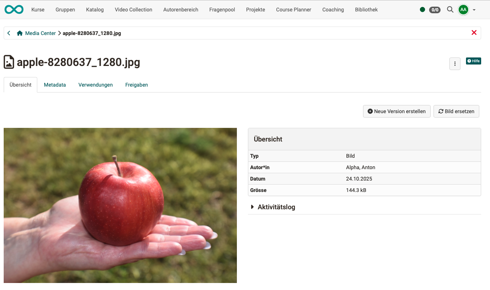
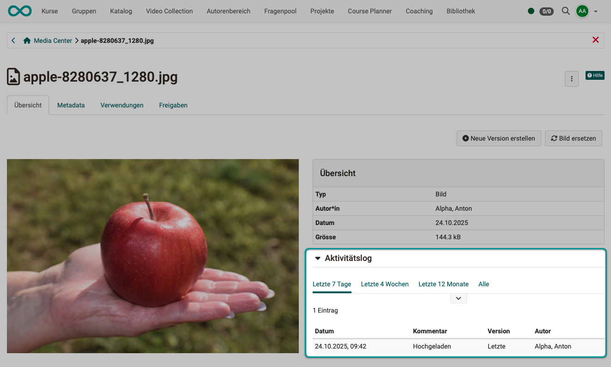
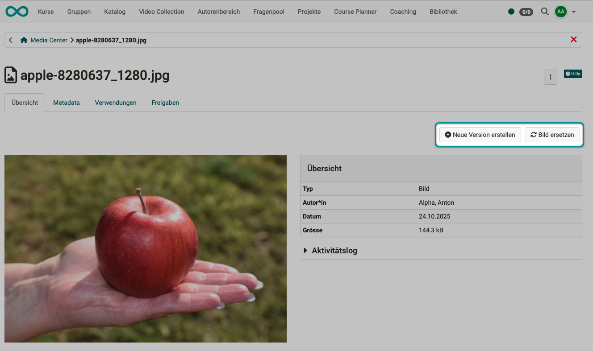
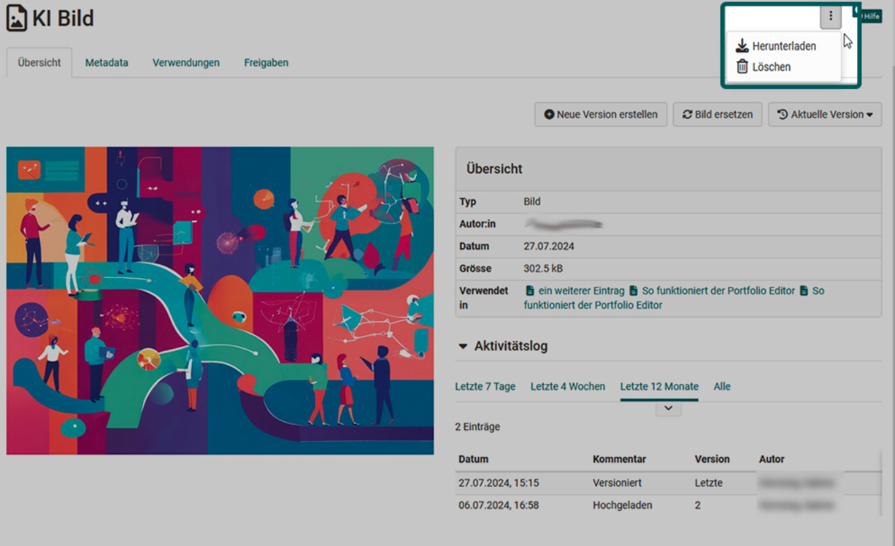
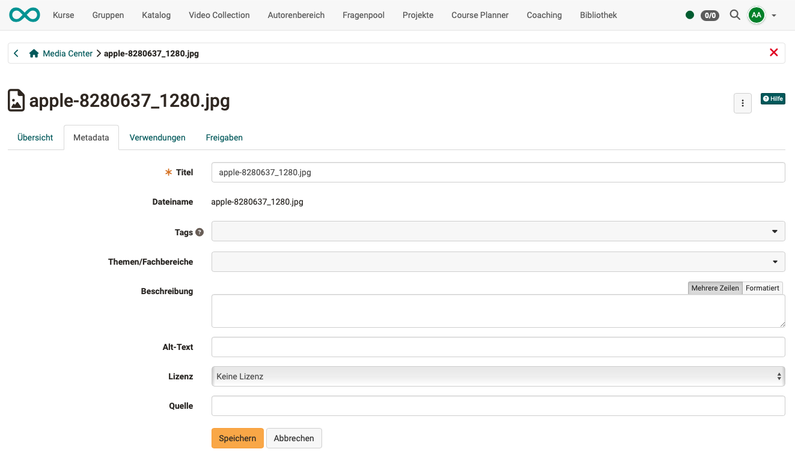
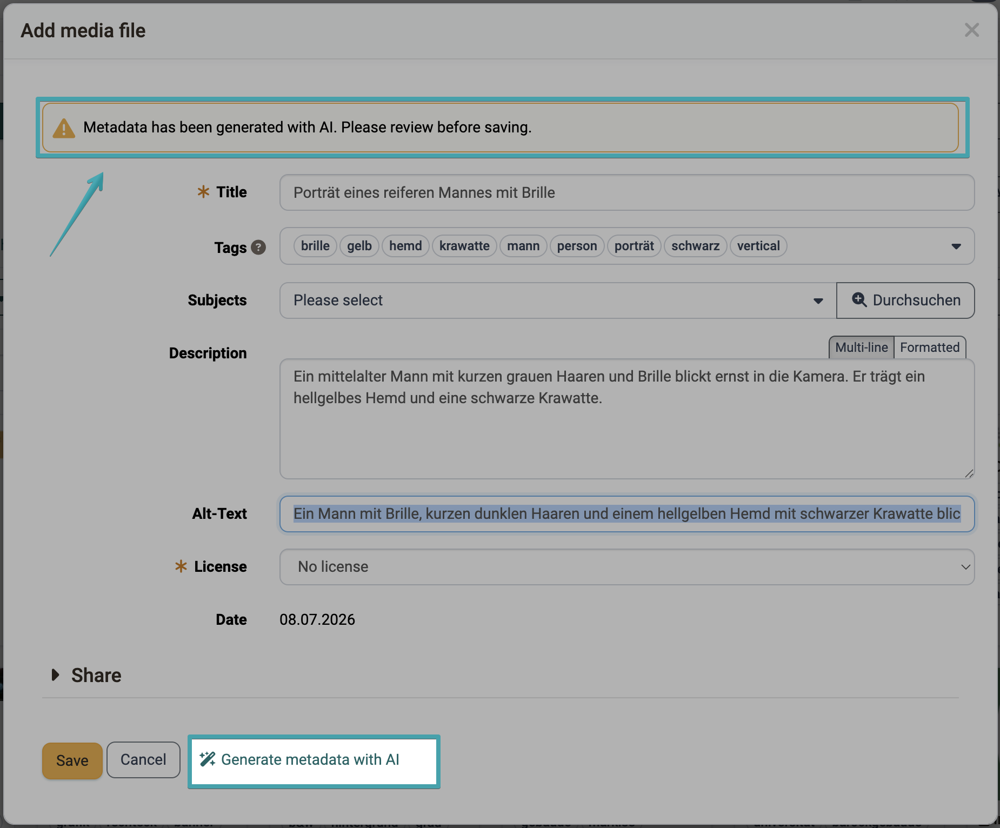
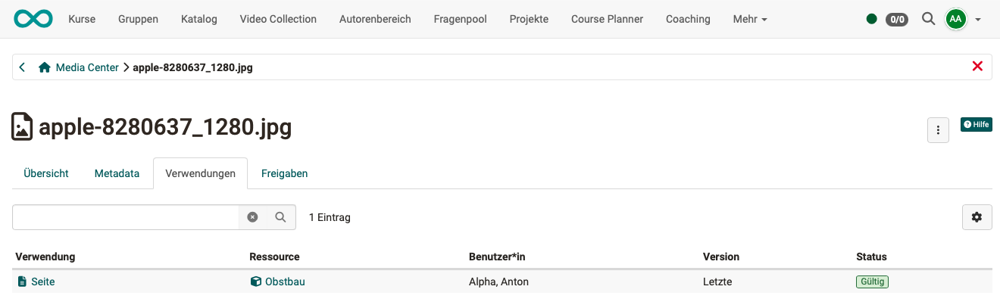
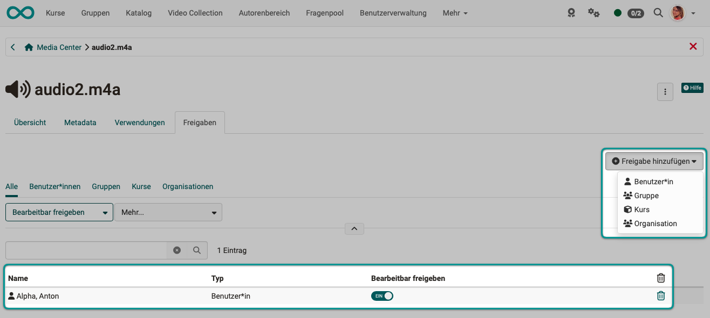

# Information and settings for items in the Media Center {: #media_center_items}

Information and settings can be entered for each individual media item stored in the Media Center. To do this, open the Media Center in your personal menu and click on the desired media item. A screen will open with the tabs described below.

* Overview
* Metadata
* Usage
* Shares

## Tab Overview {: #media_center_overview}

The **Overview** tab shows the details Type, Creator, Creation date, and File size. You can also view the activity log and create a new version or replace the image.

{ class="shadow lightbox" } 

### Activity log {: #media_center_activitylog}

The activity log can be used to track when the media element was edited and by whom.

{ class="shadow lightbox" } 

### "Createnew version" and "Replace image" [:octicons-tag-16:{ title="from Release 18.0.0 (OO-6986)" }](https://track.frentix.com/issue/OO-6986){:target="_blank"} {: #media_center_versioning}

An interesting feature is the option to **version** media elements. This allows you to save different work steps or intermediate stages, for example. You can then switch back to older versions at any time.

In contrast, **Replace Image** replaces the image in the current version. All other metadata and settings (e.g., permissions) remain unchanged. 

{ class="shadow lightbox" } 

### Download or delete {: #media_center_download}

You can download individual media files from the Media Center using the three dots in the top right corner. If you are the owner, you can also delete your media file. 

{ class="shadow lightbox" } 

[To the top of the page ^](#media_center_items)

---

## Tab Metadata [:octicons-tag-16:{ title="from Release 18.0.0 (OO-7060)" }](https://track.frentix.com/issue/OO-7060){:target="_blank"} {: #media_center_metadata}

The following information can be added to a media element:

* a title that differs from the file name 
* Tags for keyword indexing and a better overview
* Classification according to topics and subject areas (taxonomy) 
* a description 
* An "alt text" for draw.io files or images/graphics. This is particularly relevant for screen readers.
* a license specification, such as "CC BY-NC-SA"
* a source reference

The information and options available for metadata vary depending on the type of media. All information can be changed later.  

{ class="shadow lightbox" } 

### Generate metadata with AI [:octicons-tag-16:{ title="from Release 20.3.0 (OO-9355)" }](https://track.frentix.com/issue/OO-9355){:target="_blank"} {: #metadata_ai}

If the [AI module](../../manual_admin/administration/External_Tools_AI.md) is configured with the AI feature "Image Description Generator", the button **"Generate metadata with AI"** is available when uploading images and in the metadata dialog. Clicking it fills title, description, alt text and tags with AI-generated suggestions. If the AI additionally detects a topic that exactly matches an existing subject area (taxonomy), it is assigned as well. A notice in the form indicates that the metadata has been generated with AI. Review the suggestions before saving and adjust them if necessary. AI image analysis is not available for SVG images.

Fields that are already filled in are retained during generation; the title is only replaced if it is empty or corresponds to a file name.

{ class="shadow lightbox" }

Metadata of imported images is also generated by AI in the background during [markdown import into the content editor](Content_Editor.md#markdown) [:octicons-tag-16:{ title="from Release 20.3.0 (OO-9356)" }](https://track.frentix.com/issue/OO-9356){:target="_blank"}.

[To the top of the page ^](#media_center_items)

---

## Tab Uses  {: #media_center_uses}

In the "Uses" tab, you can see where the media element is used. 
By clicking on the usage information, you can jump directly to that section in this course.

{ class="shadow lightbox" } 

[To the top of the page ^](#media_center_items)

---

## Tab Share [:octicons-tag-16:{ title="from Release 18.0.0 (OO-7061)" }](https://track.frentix.com/issue/OO-7061){:target="_blank"} {: #media_center_share}

Here you can specify who is allowed to use a media element. Participants can only define groups. Authors have more options and can specify specific OpenOlat users, groups, or courses. By sharing files, they can also be used collaboratively if editing is allowed.

{ class="shadow lightbox" } 

[To the top of the page ^](#media_center_items)

---

## Further information {: #further_information}

[Concept of the Media Center >](../basic_concepts/Media_Center_Concept.md) 
[Media Center in he personal menu >](../personal_menu/Media_Center.md) 