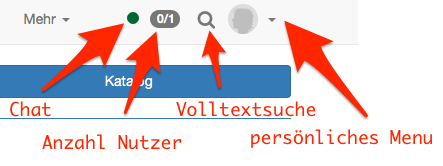

# Navigation {: #navigation}

Nach dem Login gelangen Sie entweder auf

* eine definierte Startseite, z.B. den Autorenbereich für Autor:innen oder die Kurse für Nicht-Autor:innen,
* eine Infoseite, eine Seite, die in der Regel generelle Informationen zu verschiedenen Themen enthält (ähnlich einem Kurs mit Infos),
* das OpenOlat Portal oder
* eine von Ihnen individuell festgelegte Startseite. Jede OpenOlat-Seite kann als individuelle Startseite markiert werden.

!!! info "Wichtig"

    Falls Sie den Tab "Portal" nicht sehen, ist diese Seite von den Systemadministrator:innen systemweit abgeschaltet.

## Globale Navigation {: #global_navigation}

In der oberen Navigationsleiste generell verfügbar sind der [Chat](Chat.de.md) (Instant Messenger) und die [Suche](Search_General.de.md). Welche weiteren Elemente in der Navigationsleiste rechts oben angezeigt werden, ist abhängig von Ihren Einstellungen.

{ class="shadow aside-right lightbox"}

Im [persönlichen Menü](../personal_menu/index.de.md) finden Sie die Bereiche persönliche Werkzeuge, Konfiguration und System. Je nach den unter "Einstellungen" ausgewählten Werkzeugen werden bestimmte persönliche Werkzeuge in die obere Navigationsleiste verschoben oder bleiben über das persönliche Menü aufrufbar.

Weitere Informationen zu den einzelnen Elementen finden Sie unter den entsprechenden Links.

:octicons-device-camera-video-24: **Video-Einführung**: [Navigation](<https://www.youtube.com/embed/kxfVVbfDXMw>){:target="_blank"}

:octicons-device-camera-video-24: **Video-Einführung**: [Der OpenOlat-Bildschirm](<https://www.youtube.com/embed/WbD6ZSgZ02Y>){:target="_blank"}

:octicons-device-camera-video-24: **Video-Einführung**: [Persönliches Menü](<https://www.youtube.com/embed/VxK1EKV7_rc>){:target="_blank"}

:octicons-device-camera-video-24: **Video-Einführung**: [Menüleiste](<https://www.youtube.com/embed/_abUlsfmBcs>){:target="_blank"}

## Weiterführende Informationen {: #further_information}

**Auf dieser Seite erwähnt** 
[Chat >](Chat.de.md) 
[Allgemeines zur Suche >](Search_General.de.md) 
[Persönliches Menü >](../personal_menu/index.de.md)

**Weiterführend** 
[Startseite >](../../manual_admin/administration/Landing_pages.de.md) 
[Persönliche Konfiguration: Einstellungen >](../personal_menu/Settings.de.md) 
[Persönliche Werkzeuge >](../personal_menu/Personal_Tools.de.md) 
[Rollen und ihre Arbeitsbereiche >](Roles_Home_Areas.de.md)

**youtube** 
[Navigation](<https://www.youtube.com/embed/kxfVVbfDXMw>) 
[Der OpenOlat-Bildschirm](<https://www.youtube.com/embed/WbD6ZSgZ02Y>) 
[Persönliches Menü](<https://www.youtube.com/embed/VxK1EKV7_rc>) 
[Menüleiste](<https://www.youtube.com/embed/_abUlsfmBcs>)

[Zum Seitenanfang ^](#navigation)
