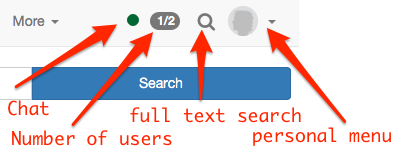

# Navigation

After your login you will navigate either to

* a defined start page e.g. author area for authors or course area for non-authors
* an info page, a page that usually contains general information on various topics (similar to a course with info),
* the OpenOlat portal or
* a start page defined individually by you. Each OpenOlat page can be marked as an individual start page.

This chapter will inform you on how to change the settings in your [personal menu](../personal_menu/Configuration.md), on how to use further features like the [full text search](Full_Text_Search.md) and the [chat](Chat.md) and on how to adapt the [portal](Portal_configuration.md) to your personal needs.

!!! info

    If you cannot see the portal it was most probably disabled by the system administrator.

## Global navigation

In the navigation the [chat](Chat.md) is shown first. Depending on the settings in the personal menu, more elements can be shown in the navigation.

{ class="shadow aside-right lightbox"}

In the navigation your [personal menu](../personal_menu/index.md) can be opened as well. It is divided into personal tools, configuration and system.

In the personal menu the areas personal tools, configuration and system can be found. Depending on the tools selected in "System settings" certain personal tools are moved in the navigation on the top or stay in the personal menu on the right.

Further information about the single elements can be found under the corresponding link.
