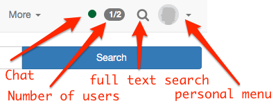

# Navigation {: #navigation}

After the login you get either to

* a defined landing page, e.g. the Authoring area for authors or the Courses for non-authors,
* an info page, a page that usually contains general information on various topics (similar to a course with info),
* the OpenOlat portal or
* a landing page you defined individually. Every OpenOlat page can be marked as an individual landing page.

!!! info "Important"

    If you cannot see the "Portal" tab, this page has been switched off system-wide by the system administrators.

## Global navigation {: #global_navigation}

The [chat](Chat.md) (instant messenger) and the [search](Search_General.md) are generally available in the top navigation bar. Which other elements are displayed at the top right of the navigation bar depends on your settings.

{ class="shadow aside-right lightbox"}

In the [personal menu](../personal_menu/index.md) you find the areas user tools, configuration and system. Depending on the tools selected under "Settings", certain user tools are moved to the top navigation bar or remain accessible via the personal menu.

Further information on the individual elements can be found under the corresponding links.

:octicons-device-camera-video-24: **Video Introduction (German)**: [Navigation](<https://www.youtube.com/embed/kxfVVbfDXMw>){:target="_blank"}

:octicons-device-camera-video-24: **Video Introduction (German)**: [The OpenOlat screen](<https://www.youtube.com/embed/WbD6ZSgZ02Y>){:target="_blank"}

:octicons-device-camera-video-24: **Video Introduction (German)**: [Personal menu](<https://www.youtube.com/embed/VxK1EKV7_rc>){:target="_blank"}

:octicons-device-camera-video-24: **Video Introduction (German)**: [Menu bar](<https://www.youtube.com/embed/_abUlsfmBcs>){:target="_blank"}

## Further information {: #further_information}

**Mentioned on this page** 
[Chat >](Chat.md) 
[General information on the search >](Search_General.md) 
[Personal menu and general components >](../personal_menu/index.md)

**Further reading** 
[Landing pages >](../../manual_admin/administration/Landing_pages.md) 
[Personal Configuration: Settings >](../personal_menu/Settings.md) 
[Personal Tools >](../personal_menu/Personal_Tools.md) 
[Roles and their working areas >](Roles_Home_Areas.md)

**youtube** 
[Navigation](<https://www.youtube.com/embed/kxfVVbfDXMw>) 
[The OpenOlat screen](<https://www.youtube.com/embed/WbD6ZSgZ02Y>) 
[Personal menu](<https://www.youtube.com/embed/VxK1EKV7_rc>) 
[Menu bar](<https://www.youtube.com/embed/_abUlsfmBcs>)

[To the top of the page ^](#navigation)
