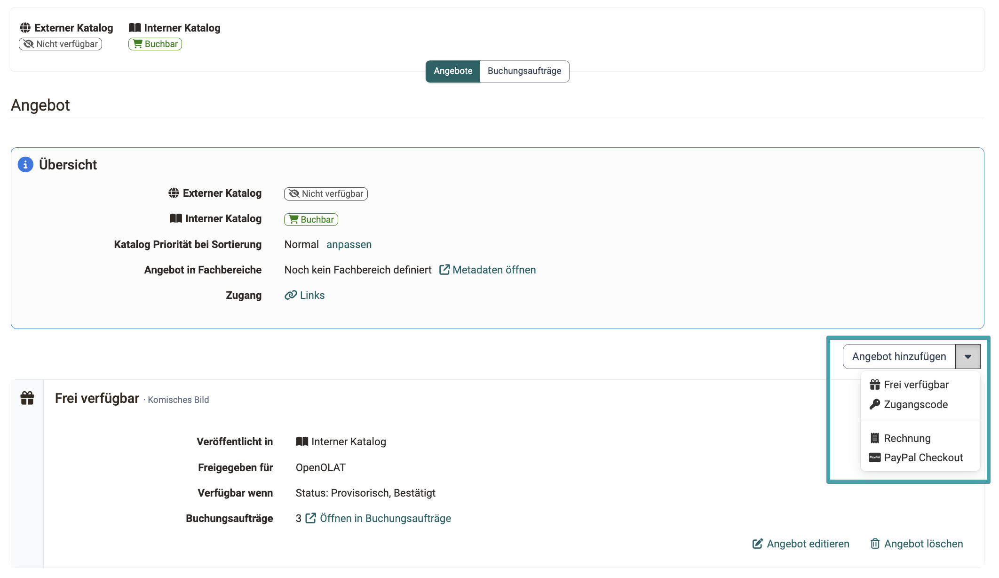
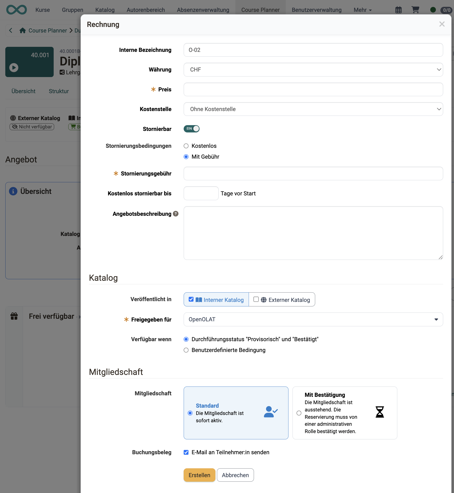

# Angebotskonzepte {: #offer_concepts}

## Was ist ein Angebot? {: #offers}

Sind Kurse und andere Lerninhalte in OpenOlat erstellt, muss bestimmt werden, **welche** Benutzer:innen **wann** darauf Zugriff haben sollen. Die Gewährung des Zugriffs (Freigabe) kann auf 2 Arten erfolgen:

* **Privat:** Durch Eintrag in der Mitgliederverwaltung der Kurs-Administration werden registrierte OpenOlat-Benutzer:innen zu Mitgliedern des Kurses oder der Lernressource und können dann darauf zugreifen.

* **Buchbare und offene Angebote:** Einem Kurs wird von dem/der Besitzer:in (Autor:in) ein Angebot hinzugefügt. Dieses Angebot finden Benutzer:innen dann im Katalog und können dort die Mitgliedschaft durch eine Buchung des Angebots selbst initiieren. 
Für den gleichen Kurs können auch mehrere verschiedene Angebote für verschiedene Zielgruppen erstellt werden. 
So kann z.B. für interne Benutzer:innen ein Kurs kostenlos angeboten werden, während ein zweites Angebot den gleichen Kurs kostenpflichtig für Externe anbietet.
Angebote können auch nur für bestimmte Organisationseinheiten im Katalog angezeigt werden. Ebenso aber auch für alle offen, es muss nicht einmal eine Mitgliedschaft geben.

**Beispiel für Kursangebote im Katalog:**
{ class="shadow lightbox" }

[Mehr zu Angeboten >](../area_modules/catalog2.0.de.md)

[zum Seitenanfang ^](#offer_concepts)

---

## Was kann in Angeboten gezeigt werden? {: #offers_card}

Der sichtbare Teil des Angebots wird als Karte im Katalog sichtbar (bzw. in der Listenansicht).
(Der unsichtbare Teil eines Angebots umfasst die Regeln: Wann wird das Angebot wo angezeigt?)

Was auf einer Karte im Katalog angezeigt wird, kann (für alle Karten einheitlich) von Administrator:innen in der System-Administration festgelegt werden unter 
`Administration > Module > Katalog > Tab Layout > Abschnitt Launchers`

* Durchführungsformat
* Zertifikat
* Kreditpunkte
* Kennzeichen
* Typ
* Titel
* Teaser
* Autor:innen
* Zeitaufwand
* Hauptsprache
* Durchführungszeitraum
* Durchführungsort
* Fachbereiche / Katalog

[zum Seitenanfang ^](#offer_concepts)

---

## Wo können Angebote gezeigt werden? {: #show_offers}

In OpenOlat gibt es einen **internen** und einen **externen** Katalog. Es kann bestimmt werden, ob ein Angebot nur in einem oder in beiden Katalogen angezeigt wird.

Innerhalb des Katalogs gibt es Abschnitte, sogenannte **Launcher**. Als Besitzer:in eines Kurses oder einer Durchführung können Sie bestimmen, in welchem Launcher Ihr Angebot erscheinen soll. Vom Katalog (V2) werden die Angebote dann dynamisch zusammengestellt und den verschiedenen Launchern zugeordnet. In Taxonomie-Launchern können zudem Ordner angezeigt werden, die bestimmten Taxonomie-Leveln entsprechen. So lassen sich die Kurse und Lernressourcen nach Taxonomiebegriffen sortiert anzeigen.

Eine Anzeige kann auch **in mehreren verschiedenen Launchern des Katalogs** (V2) erfolgen. Z.B. in einem Launcher "Beliebte Kurse" und einem Launcher, der thematisch Kurse anhand einer bestimmten Taxonomie zusammenstellt.

Angebote können auch in Katalogbereichen (Launchern) angezeigt werden, die **nur für Mitglieder bestimmter Organisationseinheiten** sichtbar sind. (Voraussetzung ist, dass das Modul "Organisationen" aktiviert ist.)

Die Freigabe-Einstellungen nehmen Sie direkt im Angebot vor: 
Kurs: `Kurs > Administration > Einstellungen > Freigabe > Abschnitt "Angebot" > Link "Angebot editieren"` 
Durchführung: `Course Planner > Durchführungen > "Ihre Durchführung" > Tab Katalog > Button Angebote > Link "Angebot editieren"`

{ class="shadow lightbox" }

!!! info "Wichtig"

    Die Angebote sind im Katalog buchbar, sobald der Status auf "Veröffentlicht" gestellt wurde. (Bzw. "provisorisch" oder "bestätigt" bei Durchführungen.)

!!! tip "Tipp"

    Innerhalb eines Launchers kann auch eine Sortierung vorgenommen werden.
    [Mehr dazu >](../../manual_user/area_modules/catalog2.0_sort_offers.de.md)

[zum Seitenanfang ^](#offer_concepts)

---

## Wo werden Angebote erstellt? {: #create_offers}

Angebote werden erstellt

* im Kurs  oder
* in einer Durchführung (innerhalb des Course Planners)

### Angebotserstellung im Kurs [:octicons-tag-16:{ title="ab Release 17.0.0 (OO-6141)" }](https://track.frentix.com/issue/OO-6141){:target="_blank"} {: #create_offers_course}

Um einen **Kurs** im Katalog anzubieten, wählen Sie den betreffenden Kurs und dann 
`Kurs > Administration > Einstellungen > Freigabe > Abschnitt "Angebot"`

{ class="shadow lightbox" }

!!! tip "Tipp"

    Sind Angebote erstellt worden, können sie auch nachgesehen werden unter: 
    `Kurs > Administration > Angebotsarten` 
    Der Eintrag erscheint, sobald für den Kurs ein buchbares Angebot konfiguriert ist. Konfiguriert werden Angebote unter `Kurs > Administration > Einstellungen > Freigabe > Abschnitt "Angebot"` (siehe oben). 
    [Details zur Angebotskonfiguration >](../../manual_user/learningresources/Access_configuration.de.md#offer)

### Angebotserstellung im Course Planner [:octicons-tag-16:{ title="ab Release 20.0 (OO-8301)" }](https://track.frentix.com/issue/OO-8301){:target="_blank"} {: #create_offers_implementation}

Um eine **Durchführung** im Katalog anzubieten, wählen Sie die betreffende Durchführung im Course Planner: 
`Course Planner > Durchführungen > "Ihre Durchführung" > Tab Katalog > Button Angebote`

{ class="shadow lightbox" }

[zum Seitenanfang ^](#offer_concepts)

---

## Die Angebotsarten {: #offer_types}

Es können die folgenden Angebotsarten erstellt werden:

|                       | Mitgliedstatus  |                                 | verfügbar in |
| --------------------- | --------------- |-------------------------------- | --- |
| <b>Ohne Buchung</b>    | ohne  |Mit diesem Angebot ist die Ressource ohne eine Mitgliedschaft für Benutzer:innen zugänglich. | Einzelkurs |
| <b>Frei verfügbar</b>  | Mitgliedschaft | Mit diesem Angebot ist die Ressource buchbar. Die Benutzer:innen erhalten eine entsprechende Mitgliedschaft, die ihnen den Zugang zur Ressource ermöglicht. | Einzelkurs und Durchführung |
| <b>Zugangscode</b> | Mitgliedschaft | Mit diesem Angebot ist die Ressource mit einem Zugangscode buchbar. Die Benutzer:innen erhalten eine entsprechende Mitgliedschaft, die ihnen den Zugang zur Ressource ermöglicht. | Einzelkurs und Durchführung |
| <b>PayPal Checkout</b> | Mitgliedschaft | Mit diesem Angebot ist die Ressource mit PayPal kostenpflichtig buchbar. Die Benutzer:innen erhalten eine entsprechende Mitgliedschaft, die ihnen den Zugang zur Ressource ermöglicht. | Einzelkurs und Durchführung |
| <b>Rechnung</b> | Mitgliedschaft | Mit diesem Angebot ist die Ressource per Rechnung kostenpflichtig buchbar. Die Benutzer:innen erhalten eine entsprechende Mitgliedschaft, die ihnen den Zugang zur Ressource ermöglicht. | Durchführung |

Beim Erstellen wählen Sie die Angebotsart über den Button **"Angebot hinzufügen"**.

{ class="shadow lightbox" }

[Mehr über die Angebotsarten >](../../manual_user/learningresources/Access_configuration.de.md#angebotsoptionen)

[zum Seitenanfang ^](#offer_concepts)

---

## Was kann angeboten werden? {: #what_is_offered}

In den Katalog können Angebote aufgenommen werden für

- Kurse
- Durchführungen
- sonstige Lernressourcen

### Kurse anbieten [:octicons-tag-16:{ title="ab Release 17.0.0 (OO-6141)" }](https://track.frentix.com/issue/OO-6141){:target="_blank"} {: #what_is_offered_courses}

Angebote zu einem Kurs werden erstellt unter 
`Kurs > Administration > Einstellungen > Freigabe > Abschnitt "Angebot"` 
Beachten Sie, dass zuvor bei "Zugang für Teilnehmer:innen" die Option "Buchbare und offene Angebote" gewählt werden muss.

{ class="shadow lightbox" }

{ class="shadow lightbox" }

Ausführliche Informationen über das [Anbieten von Kursen im Katalog finden Sie hier >](../../manual_user/area_modules/catalog2.0_angebote.de.md)

[zum Seitenanfang ^](#offer_concepts)

---

### Durchführungen anbieten [:octicons-tag-16:{ title="ab Release 20.0 (OO-8301)" }](https://track.frentix.com/issue/OO-8301){:target="_blank"} {: #what_is_offered_implementations}

Soll der gleiche Kurs mehrmals zu verschiedenen Terminen angeboten werden, kann dies im **Course Planner** mit **Durchführungen** bewerkstelligt werden.

Durchführungen können auch im Katalog ausgeschrieben werden, wenn noch unklar ist, ob die Durchführung überhaupt stattfinden wird. (Z.B. weil sie von der Zahl der Anmeldungen/Buchungen abhängig ist). Ein Angebot für eine Durchführung muss deshalb immer im Course Planner in der jeweiligen Durchführung erstellt werden und nicht in einem Kurs, der für diese Durchführung vorgesehen ist. Kurse können dazu speziell für die Verwendung in Durchführungen vorgesehen werden und haben dann keine eigene Mitgliederverwaltung.

Benutzer:innen können diese Durchführungen buchen, indem sie sich aus dem Katalog heraus anmelden (wenn sie schon OpenOlat-Benutzer:in sind) oder sich neu registrieren (wenn sie eine passende Kursdurchführung im externen Katalog gefunden haben, den sie ohne Registrierung ansehen können).

Wenn aus dem Course Planner heraus ein Angebot im Katalog gemacht wurde, das **mit Rechnung** gebucht werden kann, werden die Interessent:innen beim Anmeldevorgang zur Angabe der Rechnungsadresse usw. geführt. Es wird dabei auch eine Buchungsnummer erstellt. (Dies ist ausschliesslich mit dem Course Planner möglich.)

Der Buchungsauftrag kann anschliessend bestätigt werden.

Angebote für Durchführungen werden im Course Planner erstellt unter: 
`Course Planner > Durchführungen > "Ihre Durchführung" > Tab Katalog > Button Angebote`

{ class="shadow lightbox" }

{ class="shadow lightbox" }

[Mehr über das Anbieten von Durchführungen im Katalog >](../../manual_user/area_modules/Course_Planner_Implementations.de.md#tab_catalog)

[zum Seitenanfang ^](#offer_concepts)

---

### Sonstige Lernressourcen anbieten {: #what_is_offered_other}

Sollen einzelne Videos oder Dokumente im Katalog angeboten werden, können dazu Kurse mit jeweils nur einem Kursbaustein eingerichtet werden (z.B. Kursbaustein Video oder Kursbaustein Dokument). Es ist darauf zu achten, dass beim Aufruf automatisch zum ersten Kursbaustein gewechselt wird.

Das Vorgehen zum Erstellen eines Angebots ist dann identisch mit den Angeboten für andere eigenständige Kurse.

Die Metadaten und Beschreibungen eines solchen "Kurses" können entsprechend nur auf diese enthaltene Lernressource angepasst werden, so dass im Katalog dann z.B. "Video xy" als Angebot erscheint.

[zum Seitenanfang ^](#offer_concepts)

---

## Angebote mit Bezahlung {: #offer_payed}

### PayPal {: #offer_payed_paypal}

Das PayPal Bezahlungsmodul erlaubt es Autor:innen, Lerninhalte gegen Geld freizuschalten. Es muss vorgängig in der System-Administration eingerichtet und freigeschaltet werden.

Nach erfolgreicher Konfiguration des PayPal Moduls steht die Angebotsart "PayPal Checkout" beim Erstellen eines Angebots zur Verfügung: für Kurse unter `Kurs > Administration > Einstellungen > Freigabe > Abschnitt "Angebot"`, für Durchführungen im Course Planner und für Gruppen in der [Gruppenadministration](../groups/Group_Administration.de.md#booking).

[Einrichtung des Bezahlungsmoduls PayPal (Administration) >](../../manual_admin/administration/Payment_PayPal.de.md)

### Rechnung [:octicons-tag-16:{ title="ab Release 20.0 (OO-8210)" }](https://track.frentix.com/issue/OO-8210){:target="_blank"} {: #offer_payed_invoice}

Eine Bezahlung per Rechnung ist nur für Durchführungen im Course Planner möglich.

Bei einem Angebot mit Rechnung ist

* die Mitgliedschaft sofort aktiv oder
* die Mitgliedschaft ist zunächst ausstehend, bis eine administrative Rolle die Reservierung bestätigt.

{ class="shadow lightbox" }

!!! tip "Tipp"

    Die Buchungsaufträge sind je Durchführung gesammelt: 
    `Course Planner > Durchführungen > "Ihre Durchführung" > Tab Katalog > Button Buchungsaufträge` 
    Die Tabs einer Durchführung erscheinen erst, wenn Sie diese in der Tabelle geöffnet haben. Dort können die Buchungsaufträge als Excel-Datei exportiert und in einem anderen Programm (z.B. zur Rechnungserstellung) verwendet werden.

[Einrichtung des Bezahlungsmoduls Rechnung (Administration) >](../../manual_admin/administration/Payment_Invoice.de.md)

### Stornierungsbedingungen bei Rechnungsangeboten [:octicons-tag-16:{ title="ab Release 21.0 (OO-9382)" }](https://track.frentix.com/issue/OO-9382){:target="_blank"} {: #offer_invoice_cancellation}

Beim Erstellen oder Bearbeiten eines Rechnungsangebots legen Sie fest, ob und zu welchen Bedingungen eine Buchung storniert werden kann. So kennen die Buchenden die Stornierungsregeln bereits vor der Buchung.

{ class="shadow lightbox" }

* **Kostenstelle:** Oberhalb der Stornierungsoptionen ordnen Sie dem Angebot bei Bedarf eine Kostenstelle zu.
* **Stornierbar:** Mit diesem Schalter bestimmen Sie, ob Buchungen dieses Angebots storniert werden können. Standardmässig ist die Option aktiviert.
* **Stornierungsbedingungen:** Ist das Angebot stornierbar, wählen Sie zwischen "Kostenlos" (Standard) und "Mit Gebühr".
* **Stornierungsgebühr:** Bei der Auswahl "Mit Gebühr" geben Sie die Höhe der Gebühr an. Mit "Kostenlos stornierbar bis \<Anzahl\> Tage vor Start" definieren Sie zusätzlich eine Frist, bis zu der ohne Gebühr storniert werden kann. Damit die Frist berücksichtigt wird, muss beim Durchführungszeitraum ein Anfangsdatum angegeben sein.

Die Stornierungsinformationen werden den Benutzer:innen beim Angebot angezeigt.

### Kreditpunkte [:octicons-tag-16:{ title="ab Release 20.1.1 (OO-8558)" }](https://track.frentix.com/issue/OO-8558){:target="_blank"} {: #offer_payed_credit_points}

In OpenOlat können Kreditpunktsysteme eingerichtet werden. Ein Kreditpunktesystem ermöglicht das Sammeln von Kreditpunkten über verschiedene Lernangebote hinweg. Über das Modul "Kreditpunkte" können eigene Kreditpunktesysteme global definiert werden. Diese ermöglichen später den Teilnehmenden für das Bestehen von Kursen Bildungspunkte/Credits, wie zum Beispiel ECTS oder LearnCoins, zu sammeln.

Diese Punkte können z.B. auch in Zertifikatsprogrammen für Rezertifizierungen eingesetzt werden. Teilnehmer:innen können mit jedem erfolgreichen Absolvieren eines Kurses Kreditpunkte sammeln. Mit diesen Kreditpunkten können sie dann einen weiteren Kurs kaufen.

Organisationen können eigene Kreditpunktesysteme definieren und benennen, sowie bei Bedarf einschränken. Etwa nach Rollen oder organisatorischen Bereichen. Nach dem erfolgreichen Abschluss eines Lernangebots lassen sich Kreditpunkte gezielt zuweisen, sodass eine langfristige Nutzung für Rezertifizierungen unterstützt wird.

[Kreditpunkte systemweit aktivieren (Administration) >](../../manual_admin/administration/e-Assessment_Credit_Points.de.md) 
[Kreditpunkte in Kursen vergeben >](../../manual_user/learningresources/Course_Settings_Assessment.de.md#section_credit_points) 
[Kreditpunkte im persönlichen Menü >](../../manual_user/personal_menu/Credit_Points.de.md)

[zum Seitenanfang ^](#offer_concepts)

---

## Weitere Randbedingungen für Angebote {: #further_boundary_conditions}

Für Angebote können weitere Bedingungen eingestellt werden. Die meisten Konfigurationsoptionen geben Sie direkt während der Erstellung eines neuen Angebots ein.

{ class="shadow lightbox" }

* **Verfügbar wenn: Durchführungsstatus "Provisorisch" und "Bestätigt":** 
Eine Durchführung muss noch nicht vollständig geplant sein, um bereits ein Angebot veröffentlichen zu können. Bei Kursen lautet die Standardbedingung Kursstatus "Veröffentlicht".

* **Verfügbar wenn: Benutzerdefinierte Bedingung:** 
Das Angebot ist nur in den gewählten Status verfügbar und zusätzlich auf einen Zeitraum begrenzt, mit festen Daten oder relativ zum Durchführungszeitraum. [Details zur Verfügbarkeit >](../../manual_user/learningresources/Access_configuration.de.md) [:octicons-tag-16:{ title="ab Release 21.0 (OO-9304)" }](https://track.frentix.com/issue/OO-9304){:target="_blank"}

* **Mitgliedschaft Standard:** 
Die Mitgliedschaft ist sofort nach der Buchung des Angebots aktiv.

* **Mitgliedschaft mit Bestätigung:** 
Die Mitgliedschaft ist zunächst ausstehend. Die Reservierung muss von einer administrativen Rolle bestätigt werden.

* **Buchungsbeleg:** 
Mit der Option "E-Mail an Teilnehmer:in senden" erhält die buchende Person nach der Buchung den Buchungsbeleg per E-Mail.

* **Automatisches Buchen:** 
Die Mitgliedschaft wird automatisch erstellt, wenn der Kurs geöffnet wird.
Beim automatischen Buchen wird die Angebotsbeschreibung nicht angezeigt und den Benutzer:innen wird nur die Aktion "Öffnen" angeboten. Diese Option sollte nicht gleichzeitig mit anderen Angeboten verwendet werden.

* Auch bei sofort aktiver Mitgliedschaft (Durchführungen, Angebot mit Rechnung) wird in der Regel zunächst noch ein **Akzeptieren der Datenschutzbestimmungen und weiterer Nutzungsbedingungen** verlangt. In den Nutzungsbedingungen können ggf. weitere Rahmenbedingungen festgelegt werden.

* Eine Ausschreibung/ein Angebot für eine Durchführung kann erfolgen, wenn noch unklar ist, ob die Durchführung stattfindet. Es muss zum Zeitpunkt der Angebotserstellung noch nicht einmal ein Kurs existieren. Wird dagegen ein eigenständiger Kurs angeboten, muss das Angebot im Kurs erstellt werden und erscheint nur bei veröffentlichtem Kurs im Katalog.

* Mit einem **Angebot des Typs "Zugangscode"** ist die Ressource mit einem Zugangscode buchbar. Die Benutzer:innen erhalten eine entsprechende Mitgliedschaft, die ihnen den Zugang zur Ressource ermöglicht.

[zum Seitenanfang ^](#offer_concepts)

---

## Weiterführende Informationen {: #further_information}

**Auf dieser Seite erwähnt** 
[Katalog 2.0: Übersicht >](../area_modules/catalog2.0.de.md) 
[Katalog 2.0 - Sortierung/Reihenfolge >](../area_modules/catalog2.0_sort_offers.de.md) 
[Zugangskonfiguration / Freigabe >](../learningresources/Access_configuration.de.md) 
[Katalog 2.0 - Angebote >](../area_modules/catalog2.0_angebote.de.md) 
[Course Planner: Durchführungen >](../area_modules/Course_Planner_Implementations.de.md) 
[Gruppenadministration >](../groups/Group_Administration.de.md) 
[PayPal Konfiguration (Administration) >](../../manual_admin/administration/Payment_PayPal.de.md) 
[Bezahlungsmodule: Rechnung (Administration) >](../../manual_admin/administration/Payment_Invoice.de.md) 
[e-Assessment Administration: Kreditpunkte >](../../manual_admin/administration/e-Assessment_Credit_Points.de.md) 
[Kurseinstellungen - Tab Bewertung >](../learningresources/Course_Settings_Assessment.de.md) 
[Persönliche Erfolge/Leistungen: Kreditpunkte >](../personal_menu/Credit_Points.de.md)

**Weiterführend** 
[Wie zeige ich meine Kurse im OpenOlat-Katalog? >](../../manual_how-to/catalog/catalog.de.md)

[Zum Seitenanfang ^](#offer_concepts)
