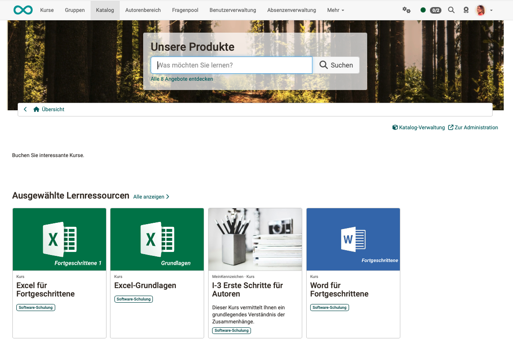
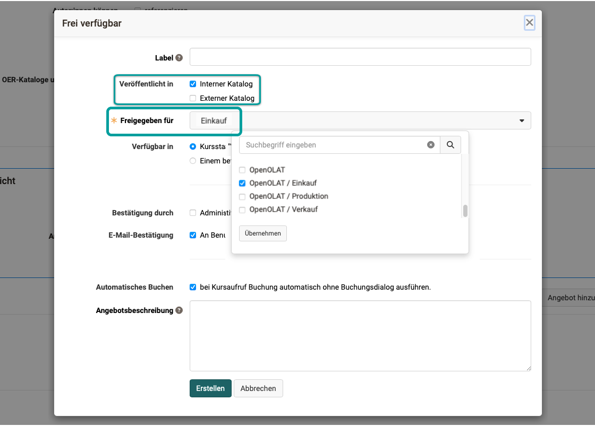
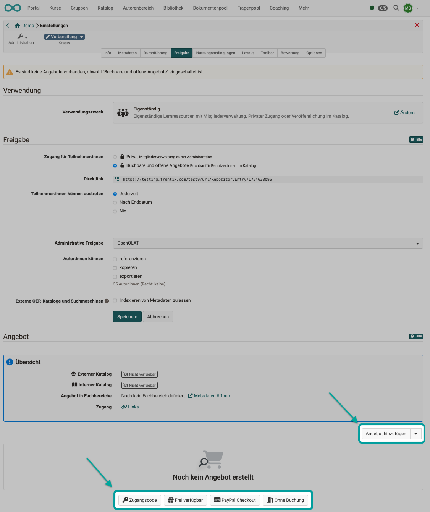
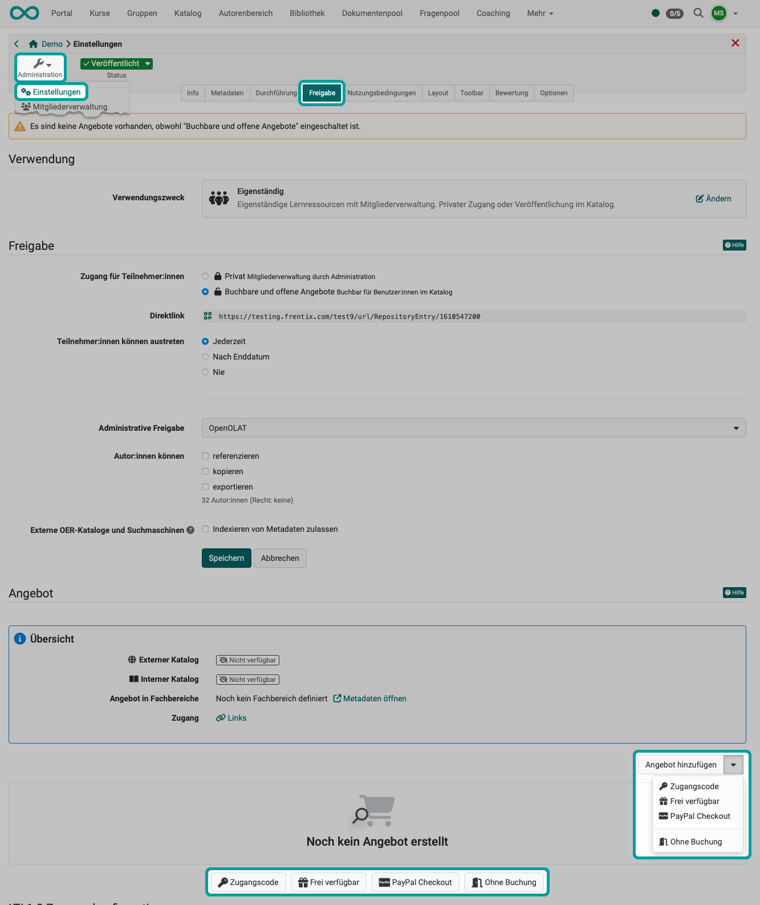
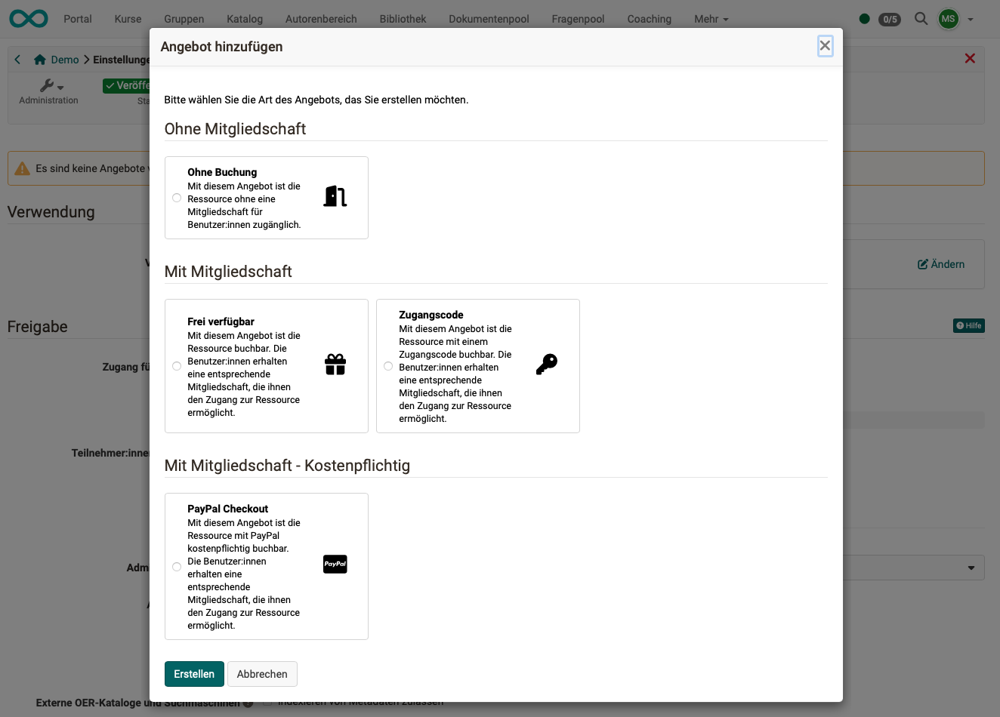
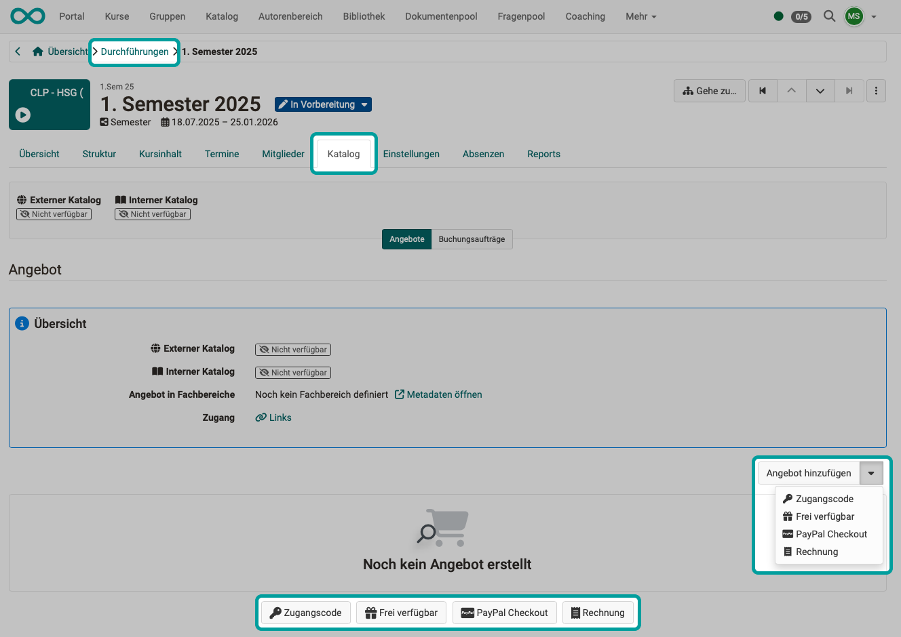
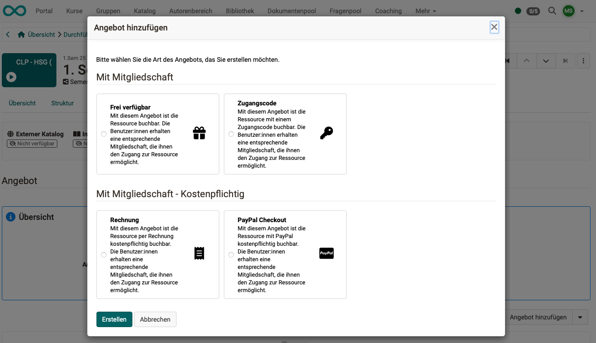
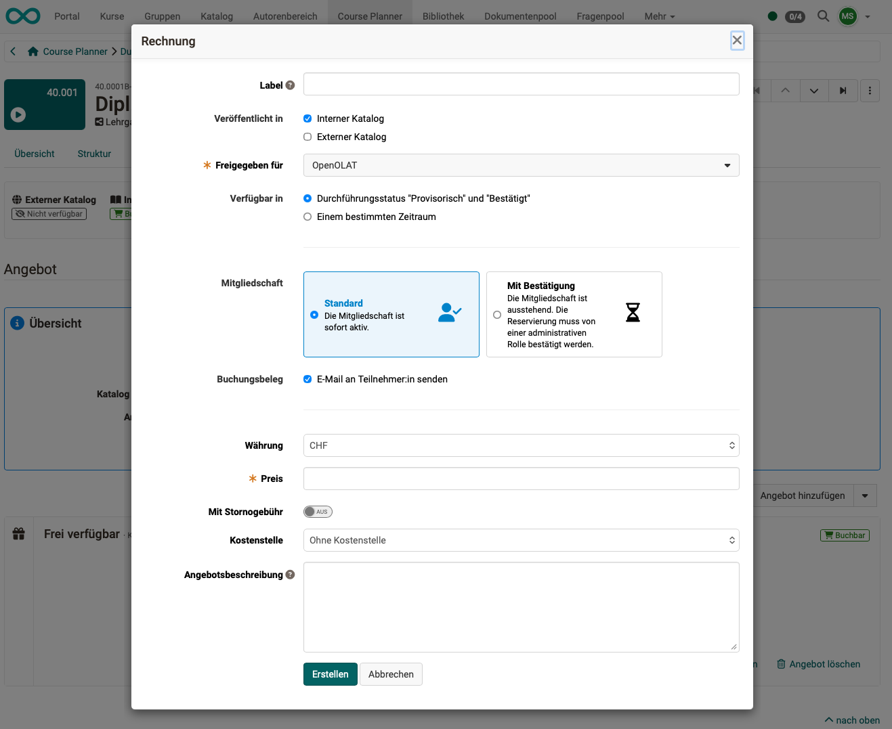
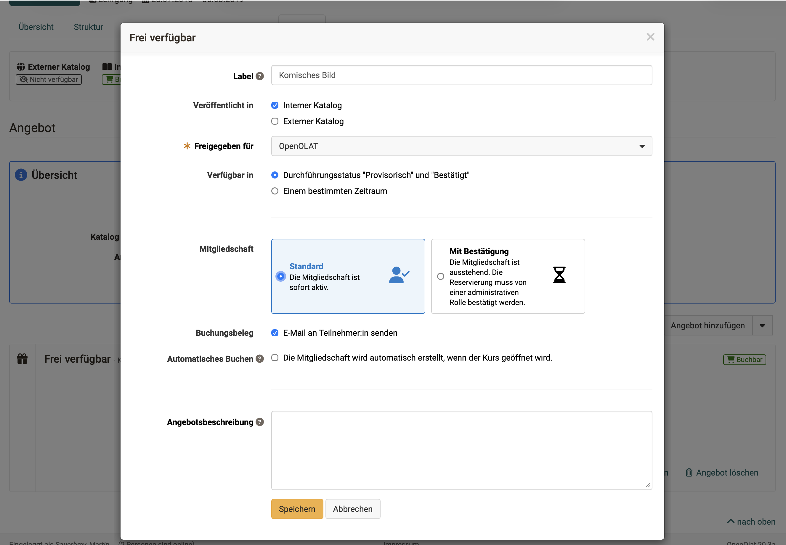

# Offer concepts {: #offer_concepts}

## What is an offer? {: #offers}

Once courses and other learning content have been created in OpenOlat, it must be determined **which** users should have access to them **and when**. Access can be granted (approved) in two ways:

* **Private:** By entering them in the member management section of the (course) administration, registered OpenOlat users become members of the course or learning resource and can then access it.

* **Bookable and open offers:** An offer is added to a course by the owner (author). Users can then find this offer in the catalog and initiate membership themselves by booking the offer. 
Several different offers for different target groups can also be created for the same course. 
For example, a course can be offered free of charge to internal users, while a second offer provides the same course to external users for a fee.
Offers can also be displayed in the catalog for specific organizational units only. However, they can also be displayed for everyone; membership is not even required.

**Example of courses offered in the catalog:**
{ class=" shadow lightbox" }

[More about offers >](../area_modules/catalog2.0.md)

[To the top of the page ^](#offer_concepts)

---

## What can be shown in offers? {: #offers_card}

The visible part of the offer is displayed as a card in the catalog (or in the list view).
(The invisible part of an offer includes the rules: When and where is the offer displayed?)

What is displayed on a card in the catalog can be specified (uniformly for all cards) by administrators under 
`Administration > Modules > Catalog > Tab Layout > Section Launchers`

* Implementation format
* Certificate
* Credit Points
* Characteristic
* Type
* Title
* Teaser
* Authors
* Time required
* Main language
* Period of time for implementation
* Place of implementation
* Specialist areas / Catalog

[To the top of the page ^](#offer_concepts)

---

## Where can offers be displayed? {: #show_offers}

OpenOlat has an **internal** and an **external** catalog. You can specify whether an offer is displayed in only one or in both catalogs.

Within the catalog, there are sections called **launchers**. As the owner of a course or session, you can determine in which launcher your offering should appear. The offerings are then dynamically compiled from the catalog (V2) and assigned to the various launchers. Taxonomy launchers can also display folders that correspond to specific taxonomy levels. This allows courses and learning resources to be displayed sorted by taxonomy terms.

An advertisement can also appear in **several different launchers in the catalog** (V2). For example, in a launcher called "Popular Courses" and a launcher that compiles courses thematically based on a specific taxonomy. 

Offers can also be displayed in catalog areas (launchers) that are visible only to members of certain organizational units. (This requires that the "Organizations" module be activated.)

The release settings can be configured under 
`Course/Implementation > Administration > Settings > Share > Section Offers > Link "Edit Offer"`

{ class=" shadow lightbox" }

!!! info "Important"

    Offers can be booked in the catalog as soon as their status has been set to "Published". (“Provisional” or “confirmed” for implementations.)

!!! tip "Hint"

    Sorting can also be performed within a launcher. 
    [Find out more >](../area_modules/catalog2.0_sort_offers.md)

[To the top of the page ^](#offer_concepts)

---

## Where can offers be created? {: #create_offers}

Offers are created

* in a course  or
* in an implementation (within the Course Planner)

### Create offers in courses {: #create_offers_course}

To offer a **course** in the catalog, select the relevant course and then  
`Administration > Settings > Share > Section "Offers"`

{ class=" shadow lightbox" }

!!! tip "Tip"

    Once offers have been created, they can also be viewed under: 
    `Course > Administration > Offer types` 
    The entry appears as soon as a bookable offer has been configured for the course. Offers are configured under `Administration > Settings > Share > Section "Offers"` (see above). 
    [Details on the offer configuration >](../learningresources/Access_configuration.md#offer)

### Create offers in the Course Planner [:octicons-tag-16:{ title="from Release 20.0 (OO-8301)" }](https://track.frentix.com/issue/OO-8301){:target="_blank"} {: #create_offers_implementation}

To offer an **implementation** in the catalog, select the relevant course in the Course Planner and then the 
`Tab Catalog > Button Offers`

{ class=" shadow lightbox" }

[To the top of the page ^](#offer_concepts)

---

## Offer Types {: #offer_types}

The following types of offers can be created:

|                       | Member status  |                                 | available in |
| --------------------- | --------------- |-------------------------------- | --- |
| <b>Without booking</b>    | without  |With this offer, the resource is accessible to users without a membership. | Single course |
| <b>Freely available</b>  | Membership | This offer allows the resource to be booked. Users receive a corresponding membership that gives them access to the resource. | Single course and implementation |
| <b>Access code</b> | Membership | With this offer, the resource can be booked with an access code. Users receive a corresponding membership that allows them to access the resource. | Single course and implementation |
| <b>PayPal Checkout</b> | Membership | With this offer, the resource can be booked for a fee using PayPal. Users receive a corresponding membership that gives them access to the resource. | Single course and implementation |
| <b>Invoice</b> | Membership | With this offer, the resource can be booked for a fee via invoice. Users receive a corresponding membership that gives them access to the resource. | Implementation |

[More about Offer Types >](../learningresources/Access_configuration.md#angebotsoptionen)

[To the top of the page ^](#offer_concepts)

---

## What is offered? {: #what_is_offered}

The catalog can include offers for

- Courses
- Implementation
- other learning resources

### Offer Courses {: #what_is_offered_courses}

Offers of a Course can be created under 
`(Course) Administration > Settings > Share > Section "Offers"` 
Please note that the option "Bookable and open offers" must be selected beforehand under "Access for participants".

{ class="shadow lightbox" }

{ class="shadow lightbox" }

Detailed information about [offering courses in the catalog can be found here >](../area_modules/catalog2.0_angebote.md)

[To the top of the page ^](#offer_concepts)

---

### Offer implementation [:octicons-tag-16:{ title="from Release 20.0 (OO-8301)" }](https://track.frentix.com/issue/OO-8301){:target="_blank"} {: #what_is_offered_implementations}

If the same course is to be offered several times on different dates, this can be done in the **Course Planner** using **Instances**.

Events can also be advertised in the catalog if it is still unclear whether they will actually take place (e.g., because they depend on the number of registrations/bookings). An offer for an implementation must therefore always be created in the Course Planner in the respective implementation and not in a course that is intended for this implementation. Courses can be specifically designated for use in implementations and then do not have their own member management.

Users can book these courses by logging in from the catalog (if they are already OpenOlat users) or by registering as new users (if they have found a suitable course in the external catalog, which they can view without registering).

If an offer has been made in the catalog from within Course Planner that can be booked **with an invoice**, interested parties will be guided through the registration process to enter their billing address, etc. A booking number will also be generated. (This is only possible with the Course Planner.)

The booking request can then be confirmed.

Offers for implementation are created in the Course Planner at: 
`Course Planner > Implementation > Tab Catalog > Tab Offers`

{ class="shadow lightbox" }

{ class="shadow lightbox" }

[More about offering tours in the catalog >](../area_modules/Course_Planner_Implementations.md#tab_catalog)

[To the top of the page ^](#offer_concepts)

---

### Offer other learning resources {: #what_is_offered_other}

If individual videos or documents are to be offered in the catalog, courses with only one course element can be set up for each (e.g., course element video or course element document). Please note that when the course is called up, it automatically switches to the first course element.

The procedure for creating an offer is then identical to the offers for other independent courses.

The metadata and descriptions of such a "course" can only be adapted to the learning resource it contains, so that, for example, "Video xy" appears as an offering in the catalog.

[To the top of the page ^](#offer_concepts)

---

## Offers with payment {: #offer_payed}

### PayPal {: #offer_payed_paypal}

The PayPal payment module allows authors to unlock learning content in exchange for money. It must be set up and activated in advance in the administration section.

After successfully configuring the PayPal module, you can select the PayPal offer type on the course details page or in the administration environment of the workgroup. 

[Setting up the PayPal payment module (Administration) >](../../manual_admin/administration/Payment_PayPal.md)

### Invoice [:octicons-tag-16:{ title="from Release 20.0 (OO-8210)" }](https://track.frentix.com/issue/OO-8210){:target="_blank"} {: #offer_payed_invoice}

Payment by invoice is only possible for implementations in the Course Planner.

For offers with invoices,

* immediate active membership or
* Membership is initially pending until an administrative role confirms the reservation.

{ class="shadow lightbox" }

!!! tip "Tip"

    In the Course Planner under 
    `Implementations > Tab Catalog > Tab Booking orders` 
    the booking orders are collected and can be exported as an Excel file and used in another program (e.g., for invoicing).  

[Setting up the invoice payment module (Administration) >](../../manual_admin/administration/Payment_Invoice.md)

### Cancellation policy for invoice offers [:octicons-tag-16:{ title="from Release 21.0 (OO-9382)" }](https://track.frentix.com/issue/OO-9382){:target="_blank"} {: #offer_invoice_cancellation}

When creating or editing an invoice offer, you define whether and under which conditions a booking can be cancelled. This way, users know the cancellation rules before they book.

* **Cancelable:** This toggle determines whether bookings of this offer can be cancelled. The option is enabled by default.
* **Cancellation Policy:** If the offer is cancelable, choose between "Free of charge" (default) and "With fee".
* **Cancellation fee:** If "With fee" is selected, you enter the amount of the fee. With "Cancellable free of charge until \<number\> days before start" you additionally define a period during which cancellation is free of charge. In order for the deadline to be taken into account, a start date must be specified in the execution period.
* **Cost center:** Above the cancellation options, you can assign a cost center to the offer if required.

The cancellation information is displayed to users with the offer.

### Credit Points [:octicons-tag-16:{ title="from Release 20.1.1 (OO-8558)" }](https://track.frentix.com/issue/OO-8558){:target="_blank"} {: #offer_payed_credit_points}

Credit point systems can be set up in OpenOlat. A credit point system allows credit points to be collected across different learning opportunities. Using the "Credit points" module, you can define your own credit point systems globally. These enable participants to collect educational points/credits, such as ECTS or LearnCoins, for passing courses.

These points can also be used in certificate programs for recertification, for example. Participants can earn credit points for each course they successfully complete. They can then use these credit points to purchase another course.

Organizations can define and name their own credit point systems and restrict them as needed, for example, by role or organizational area. After successfully completing a learning program, credit points can be assigned in a targeted manner to support long-term use for recertification.

[Activate Credit Points system-wide (Administration) >](../../manual_admin/administration/e-Assessment_Credit_Points.md) 
[Awarding credit points in courses >](../learningresources/Course_Settings_Assessment.md#4_green_24png-section-credit-points--section_credit_points) 
[Credit Points in the Personal Menu >](../personal_menu/Credit_Points.md) 

[To the top of the page ^](#offer_concepts)

---

## Further conditions for Offers {: #further_boundary_conditions}   

Additional conditions can be set for quotes. Most configuration options are entered directly when creating a new quote.

{ class="shadow lightbox" }

* **Available when the implementation status is "provisional" and "confirmed":** 
An implementation does not have to be fully planned in order to publish an offer.

* **Available during a specific period:** 
The offer will be displayed in the specified time window regardless of its status and can be booked.

* **Membership Standard:** 
Membership is active immediately after booking the offer. 

* **Membership with confirmation:** 
Membership is pending. Your reservation must be confirmed by an administrative role.

* **Automatic Booking:**  
Membership is automatically created when the course is opened.
When booking automatically, the offer description is not displayed and users are only offered the "Open" action. This option should not be used in conjunction with other offers.

* Even with immediate active membership (implementation, offer with invoice), **acceptance of the privacy policy and other terms of use** is usually required first. Additional terms and conditions may be specified in the terms of use.

* A tender/offer for implementation can be made even if it is still unclear whether implementation will take place. A course does not even have to exist at the time the offer is made. If, on the other hand, an independent course is offered, the offer must be created in the course and will only appear in the catalog once the course has been published.

* With an **"access code" offer**, the resource can be booked with an access code. Users receive a corresponding membership that allows them to access the resource.

[To the top of the page ^](#offer_concepts)

---

## Further information {: #further_information}

[More about the Catalog >](../area_modules/catalog2.0_angebote.md) 
[More about Offers >](../area_modules/catalog2.0_angebote.md) 
[How do I show my Courses in the Catalog? >](../../manual_how-to/catalog/catalog.md) 
[Access configuration/Share >](../learningresources/Access_configuration.md) 
[Offering bushings in the catalog >](../area_modules/Course_Planner_Implementations.md#tab_catalog) 
[Payment Module PayPal (Administration) >](../../manual_admin/administration/Payment_PayPal.md) 
[Payment module invoice (Administration) >](../../manual_admin/administration/Payment_Invoice.md) 
[Credit Points for the Personal Menu >](../personal_menu/Credit_Points.md) 
[Activate credit points system-wide (Administration) >](../../manual_admin/administration/e-Assessment_Credit_Points.md) 
[Awarding credit points in courses >](../learningresources/Course_Settings_Assessment.md) 

[To the top of the page ^](#offer_concepts)

