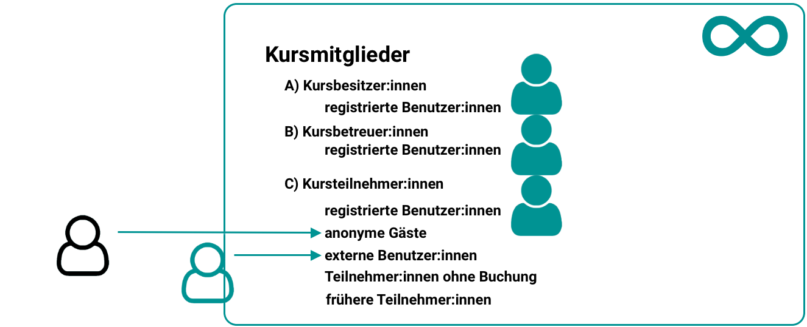

# Rollen und Rechte: Welche Rollen gibt es? {: #roles} 

Entsprechend den Aufgaben lassen sich die Rollen folgenden Kontexten zuordnen:

## Organisationsweit gültige Rollen {: #org} 

Zu Organisationsrollen gehören organisationsweit (wie innerhalb der OpenOlat-Instanz definiert) gültige Berechtigungen. Die Organisationsrollen werden in der Benutzerverwaltung vergeben.

* **Autor:in**: Autor:innen haben Zugriff auf den Autorenbereich in der obersten Navigation. Damit sind sie berechtigt, Kurse und alle weiteren Lernressourcen zu erstellen. In der Suchmaske finden Autor:innen alle Kurse und Lernressourcen wie Tests, Filme und Portfoliovorlagen, welche für sie zugänglich sind. Diese Rolle wird häufig an Lehrende oder E-Learning Verantwortliche vergeben.
* **Lernressourcenverwalter:in**: Lernressourcenverwalter:innen haben automatisch Besitzerrechte (= Vollzugriff) für alle Kurse und Lernressourcen, die der eigenen Organisation (siehe [Administrative Freigabe](../learningresources/Access_configuration.de.md#administrative-freigabe)) angehören. Im Status "Beendet" und "Gelöscht" ist der Zugriff lesend. Über den Autorenbereich sind die Kurse und Lernressourcen auffindbar und können kopiert sowie exportiert werden.
* **Linienvorgesetzte/r**: Linienvorgesetzte können für alle Benutzer innerhalb ihrer Organisation automatisch über den Erhalt von Zertifikaten informiert werden.
* **Ausbildungsverantwortliche/r**: Die Rechte, die Ausbildungsverantwortlichen zugeteilt werden, können für jede Organisationseinheit separat definiert werden.
* **Principal**: Der Principal sieht viele Bereiche des Systems, hat aber nur Lesezugriff und kann keine Änderungen vornehmen, Objekte bearbeiten etc.
* **Absenzenverwalter:in**: Ihnen steht in der Hauptnavigation der Menüpunkt "Absenzenverwaltung" für die Administration der Absenzen innerhalb ihrer Organisationseinheit zur Verfügung.
* **Kursplaner:in**: Kursplaner:innen haben Zugriff auf den [Course Planner](../area_modules/Course_Planner.de.md). Sind Kursplaner:innen einer Organisation zugeordnet, so besitzen sie nur Zugang zum Course Planner dieser Organisation.
* **Projektverwalter:in**: Projektverwalter verfügen zusätzlich im Menüpunkt "Projekte" über den Tab "Administration" und haben hier Zugriff auf alle Projekte inklusive Mitgliederverwaltung und Konfiguration.
* **Qualityverwalter:in**: Qualityverwalter:innen haben Zugriff auf den Menüpunkt Qualitätsmanagement und können dort sämtliche Einstellungen und Objekte wie Fragebögen, Datenerhebungsgeneratoren sowie das Analysewerkzeug verwalten.
* **Benutzerverwalter:in**: Benutzerverwalter:innen haben Zugriff auf die [Benutzerverwaltung](../../manual_admin/usermanagement/index.de.md) und alle Benutzer:innen der eigenen Organisation. Sie können Benutzer:innen erstellen, bearbeiten und inaktiv setzen. Zudem können sie die Rolle Autor und weitere Rollen vergeben. Benutzerverwalter verfügen über den Menüpunkt "Benutzerverwaltung" in der obersten Navigation. 
* **Rollenverwalter:in**: Rollenverwalter:innen haben Zugriff auf die Benutzerverwaltung (separater Menüpunkt in der obersten Navigation) und können alle Benutzer:innen der eigenen Organisationen sehen und organisieren. Rollenverwalter können, ausser die Rollen Administrator und Systemadministrator, alle Rollen der Benutzer:innen ändern, sie vergeben und entfernen.
* **Administrator:in**: Administrator:innen besitzen Modul- und Funktionsverwaltung und haben auf alle Bereiche des Systems, wie z.B. Benutzerverwaltung, Katalogverwaltung und Course Planner Zugriff, ausser auf die Administrationsseite. Die Rolle kann auf eine Organisation beschränkt werden. Administrator:innen können Benutzer:innen löschen und zudem weiteren Personen das Recht für die Katalogverwaltung einräumen.
* **Gruppenverwalter:in**: Gruppenverwalter:innen haben im Menüpunkt "Gruppen" zusätzlich Zugriff auf den Tab [Gruppenverwaltung](../area_modules/Group_Management.de.md). 
* **Poolverwalter:in**: Poolverwalter:innen haben Zugriff auf den [Fragenpool](../area_modules/Question_Bank.de.md). Im Fragenpool können sie den Bereich Administration öffnen.
* **Systemadministrator:in**: Systemadministrator:innen haben Zugriff auf die Administrationsseite und sind für die technische Systemkonfiguration und deren Überwachung zuständig. Dies ist eine globale Rolle, die nicht an eine Organisation gebunden ist.

!!! warning "Hinweis"

    Die genannten Rollen stellen Optionen dar, normalen Usern organisationsweit umfangreiche weitere Rechte zu geben. In der Regel wird bei einer OpenOlat Instanz gezielt eine passende Rollenzusammensetzung gewählt und nicht alle spezifischen Rollen vergeben. Typisch ist eine Kombination aus Benutzer:in, Autor:in und Administrator:in bzw. Systemadministrator:in. Darüber hinausgehende Rollen ergeben sich aus der Struktur der jeweiligen Institution und der Nutzung von bestimmten Tools, wie z.B. dem [Course Planner](../area_modules/Course_Planner.de.md).  Es ist also möglich, dass in Ihrer Instanz nicht alle potenziellen OpenOlat-Rollen verwendet werden. 
    
    Wenden Sie sich bei Rückfragen bezüglich der Rollenvergabe an den jeweiligen Support Ihrer OpenOlat Instanz.

[zum Seitenanfang ^](#roles)

---

## Rollen in einem Kurs {: #course} 

{ class=" shadow lightbox" }

Innerhalb eines Kurses unterscheiden wir die 3 Kursrollen: 

* **Besitzer:in**: Diese Benutzer:innen haben alle Rechte im Kurs. Sie können den Kurs bearbeiten, Mitglieder verwalten und den Kurs auch löschen. Somit ist der/die Besitzer:in Kursadministrator:in.

    :octicons-device-camera-video-24: **Video-Einführung**: [Voraussetzungen für Autoren](<https://www.youtube.com/embed/L0jc_LBKXLE>){:target="_blank”}

* **Betreuer:in**: Der/die Kursbetreuer:in hat Zugriff auf das [Bewertungswerkzeug](../learningresources/Assessment_tool_overview.de.md) des Kurses, wie auch auf die Test- und Fragebogen-Statistik. Ein/eine Kursbetreuer:in kann jedoch den Kurs weder im Kurseditor bearbeiten noch den Kurs löschen. Im Bewertungswerkzeug sehen die Kursbetreuer:innen alle Kursteilnehmenden, jedoch keine Gruppenteilnehmenden. Weitere Details der Kursrolle Betreuer:in finden Sie [hier](coach.de.md).

* **Teilnehmer:in**: Teilnehmer:innen können den Kurs öffnen und die bereitgestellten Kursbausteine und Inhalte bearbeiten (je nach Konfiguration). Sie haben jedoch keine zusätzlichen Rechte im Kurs.

{ class="shadow" }

Neben den kursbezogenen Rollen können in herkömmlichen Kursen auch [Gäste](guest_access.de.md) ohne OpenOlat Account Zugang zu einem Kurs erhalten.  

!!! success "Rollenwechsel"

    Es ist ferner möglich, dass Personen mehrere Kursrollen erhalten und so verschiedene Perspektiven auf den Kurs einnehmen können. Ein Rollenwechsel ist, nachdem einer Person mehrere kursbezogene Rollen zugewiesen wurden, über den Wechsel der "Benutzerrolle" in der Toolbar des Kurses möglich.
      
    { class="shadow" }

[zum Seitenanfang ^](#roles)

---

## Rollen in Gruppen {: #groups} 

Werden in Kursen Gruppen verwendet, können die Mitglieder entweder als Gruppenteilnehmer:innen oder Gruppenbetreuer:innen eingetragen werden.

* **Gruppenbetreuer:in**: 
Gruppenbetreuer:innen haben praktisch die gleichen Rechte wie die Rolle Kursbetreuer:in, jedoch nur für ihre Gruppe. Sie haben im Kurs also Zugriff auf das Bewertungswerkzeug und die Test und Fragebogen Statistik. Im Bewertungswerkzeug sehen sie jedoch nur die Teilnehmer ihrer eigenen Gruppe.

* **Gruppenteilnehmer:in**: 
Gruppenteilnehmer:innen haben die gleichen Rechte wie die Rolle Kursteilnehmer:in.

Im Rechtemanagement des Kurses können weitergehende *Rechtepakete* entweder an Gruppenteilnehmer:innen oder Gruppenbetreuer:innen vergeben werden.

{ class="shadow" }

!!! warning "Kurs-/Gruppenrollen"

    Sowohl die Kurs- als auch die Gruppenrechte sind unabhängig von der _systemweiten Rolle_, welche Benutzer:innen in der Benutzerverwaltung erhalten haben. Registrierte Benutzer:innen ohne zugewiesene Rolle können auch Kursbesitzer:in, Kursbetreuer:in oder Gruppenbetreuer:in sein.

!!! note "Hinweis"

    Gruppenteilnehmer:innen und Gruppenbetreuer:innen sind Rollen innerhalb einer bestimmten Gruppe. Die Rolle "Gruppenverwalter:in" ist dagegen eine organisationsweit gültige Rolle, denn ihre Aufgabe ist es gruppen**übergreifend** Verwaltungsaufgaben wahrzunehmen.

[zum Seitenanfang ^](#roles)

---

## Rollen in einer Organisation {: #orgunit} 

Ist das optionale Zusatzmodul "Organisationseinheiten" aktiviert, können Rollen auch nur für eine bestimmte Organisationseinheit vergeben werden.

Benutzer:innen können Mitglied in verschiedenen Organisationseinheiten sein und dort jeweils unterschiedliche Rollen zugewiesen bekommen.

Zu den Rollen, die begrenzt auf eine Organisationseinheit vergeben werden können, gehören

* Alle Systembenutzer:innen
* Autor:innen
* Gruppenverwalter:innen
* Absenzenverwalter:innen
* Projektverwalter:innen
* Qualityverwalter:innen
* Poolverwalter:innen
* Benutzerverwalter:innen
* Rollenverwalter:innen
* Kursplaner:innen
* Lernressourcenverwalter:innen
* Linienvorgesetzte
* Principals
* Administrator:innen

(Systemadministrator:innen sind per Definition für das Gesamtsystem zuständig und nicht auf Organisationseinheiten beschränkbar.)

Organisationsrollen werden in der Benutzerverwaltung vergeben. 
(Siehe [Rollenzuweisung organisationsspezifischer Rollen](Assign_Roles.de.md#role_assignment_orgunit))

!!! info "Ohne aktivierte Organisationseinheiten"

    Ist das Modul "Organisationseinheiten" nicht eingerichtet, sind alle Benutzer:innen automatisch Mitglieder in der einzigen vorhandenen Gesamtorganisation (OpenOlat) und alle Rollen beziehen sich darauf.

[zum Seitenanfang ^](#roles)

---

## Selbst definierte Rollen und Beziehungen {: #relations} 

Neben den in OpenOlat vorgegebenen Rollen gibt es auch die Möglichkeit, dass Administrator:innen selbst Rollen erstellen. 
(**Administration > Module > Rolle Benutzer zu Benutzer**) 
Diese frei definierbaren Rollen können von Adminstrator:innen mit spezifischen Rechten ausgestattet werden.

Für diese Rollen können mit Benutzer-zu-Benutzer-Beziehungen zum Beispiel kursübergreifende Betreuungsfunktionen wie Mentoren, Lernbegleiter und Vorgesetzte eingerichtet werden. 
(Siehe [Coaching - Personenbeziehungen](../area_modules/coaching_personenbeziehungen.de.md))

**Voraussetzungen:** 
Bevor Beziehungen zwischen Rollen definiert werden können, müssen einerseits zuerst die **Rollen** vorhanden sein und es muss eine **Systematik** vorhanden sein (welche Rolle ist welcher anderen Rolle über- bzw. untergeordnet).

Die **Systematik** wird durch **Administrator:innen** festgelegt. 

Sind die Rollen und ihre Systematik eingerichtet, können anschliessend die Beziehungen in der **Benutzerverwaltung** bestimmt werden. 
(Siehe [Beziehungen definieren](Assign_Roles.de.md#role_assignment_relations))

[zum Seitenanfang ^](#roles)

---

## Kontorollen {: #account_roles} 

Die Kontorollen sind nur für die Suchfunktion der Administrator:innen relevant. 
(Siehe [Kontorollen](../../manual_admin/usermanagement/Search_Users.de.md#kontorollen))

[zum Seitenanfang ^](#roles)

---

!!! danger "Zugriff Bewertungswerkzeug"

    Möchte man vermeiden, dass eine Person auf das Bewertungswerkzeug zugreifen kann, sollte man ihr weder im Kurs noch in der Gruppe Betreuerrechte geben!

!!! danger "Zugriff Mitgliederverwaltung"

    Personen, die das Recht "[Mitgliederverwaltung](../learningresources/Members_management.de.md)" haben, können sowohl sich selbst weitere Rechte geben als auch andere Mitglieder des Kurses entfernen oder deren Rechteumfang reduzieren. (Auch den/die Ersteller:in oder andere Besitzer:innen!)

[zum Seitenanfang ^](#roles)

---

## Weiterführende Informationen

[Rollenzuweisung für Organisationsrollen](Assign_Roles.de.md#role_assignment_org) 

[Rollenzuweisung für Kursrollen](Assign_Roles.de.md#role_assignment_course)  

[Rollenzuweisung für Gruppenrollen](Assign_Roles.de.md#role_assignment_group)  

[Rollenzuweisung der "Einladung"](Assign_Roles.de.md#role_assignment_invitee)  

[Eigene Rollen und Beziehungen definieren](Assign_Roles.de.md#role_assignment_relations)  

 

[zum Seitenanfang ^](#roles)