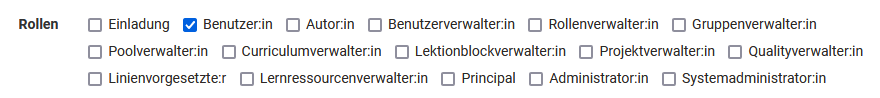
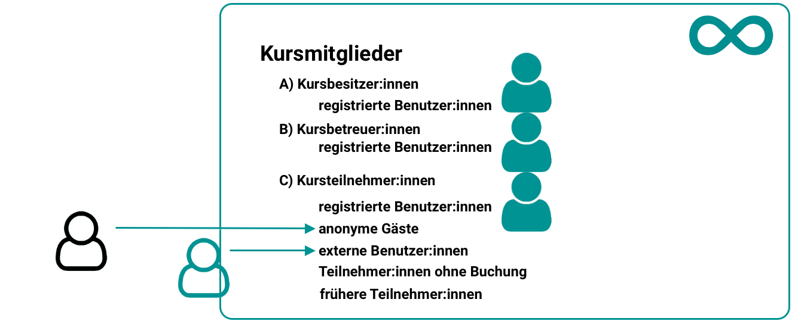
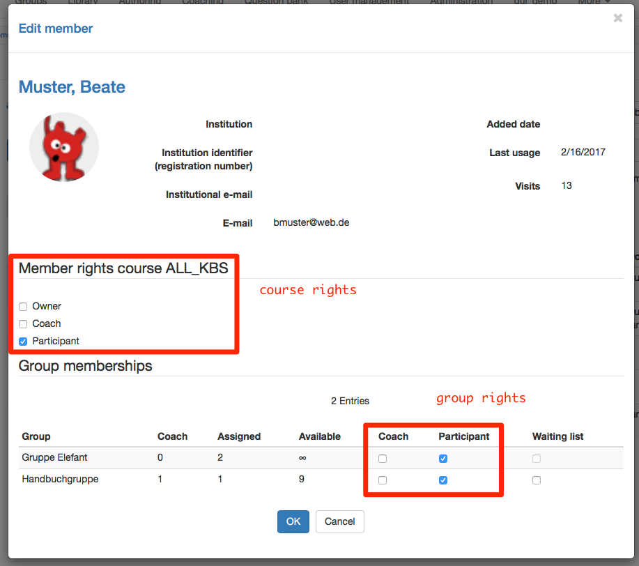
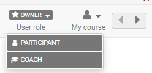
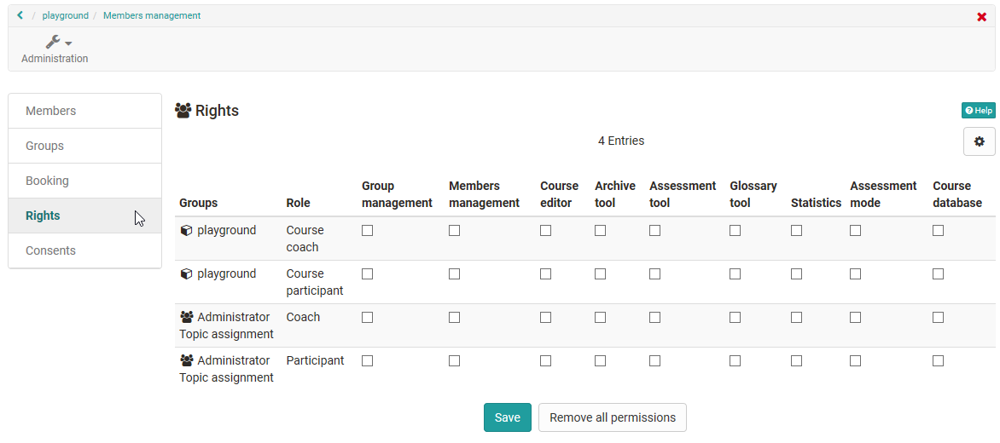

# Roles and Rights: Which roles are available? {: #roles} 

The roles can be assigned to the following contexts according to the tasks:

## Organization wide roles {: #org} 

Organisation roles include organisation-wide authorizations (as definied for the OpenOlat instance). The organisation roles are assigned in the user administration.

* **Author**: The author has access to the authoring area. This allows the author to create courses and all other learning resources. In the search mask the author finds all courses and learning resources such as tests, films and portfolio templates which are accessible to authors. This role is often assigned to teachers or e-learning managers.
* **Learning resource manager**: A learning resource manager automatically has owner rights (= full access) for all courses and learning resources belonging to the own organization (see [Administrative release](../learningresources/Access_configuration.md#administrative-release)). In the status "Finished" and "Deleted" the access is read-only. The courses and learning resources can be found in the authoring area and can be copied as well as exported.
* **Line manager**: The line manager can be automatically informed about the receipt of certificates for all users of his organization.
* **Education manager**: The rights assigned to training managers apply to the entire branch of their organizational unit. They include rights in the coaching tool, even if they are not directly active and assigned there as coaches. Or administrative functions, such as checking booking orders, blocking accounts, etc.
* **Principal**: The principal sees many areas of the system, but has read-only access and cannot make any changes, edit objects, etc.
* **Absence manager**: The menu item "Absence management" is available in the main navigation for the administration of absences within your organizational unit.
* **Course planner**: Course planners have access to the [Course Planner](../area_modules/Course_Planner.md). If course planners are assigned to an organization, they only have access to that organization's Course Planner.
* **Project manager** Project administrators also have the "Administration" tab in the "Projects" menu item and can access all projects here, including member administration and configuration.
* **Quality manager**: The quality manager has access to the Quality Management area and can manage all settings and objects such as questionnaires, data collection generators and the analysis tool.
* **User manager**:User managers have access to the [User management](../../manual_admin/usermanagement/index.md) and all users of the own organization. They can create, edit and inactivate users. They can also assign the Author role and other roles. User administrators have the menu item "User administration" in the top navigation bar. 
* **Role manager**: Role administrators have access to user management (separate menu item in the top navigation bar) and can view and organize all users in their own organizations. Role administrators can change, assign, and remove all user roles except for the roles of administrator and system administrator.
* **Administrator**: The administrator has module and function management and has access to all areas of the system e.g. user management, catalog management, curriculum management, lectures management, except the administration page. This role can be limited to an organization. The administrator can delete users and also grant other people the right to manage the catalogue.
* **Group manager**: The group manager has access to the "Group" section and in there the tab [Group Administration](../area_modules/Group_Management.md). 
* **Pool manager**: Pool administrators have access to the [Question pool](../area_modules/Question_Bank.md). In the question pool, they can open the Administration section.
* **System administrator**: The system administrator has access to the administration side and is responsible for the technical system configuration and its monitoring. This is a global role that is not tied to an organization.

!!! warning "Note"

    The mentioned roles represent options to give normal users organisation-wide extensive additional rights. Usually an appropriate role composition is selected for an OpenOlat instance and not all specific roles are assigned.
    Typical is a combination of user, author and administrator or system administrator. Additional roles result from the structure of the respective institution and the use of certain tools such as Curriculum or [Absences](../learningresources/Lectures_and_absences.md). It is therefore possible that not all potential OpenOlat roles are used in your instance.
    
    If you have any questions regarding the role management please contact the support of your own OpenOlat instance.

[To the top of the page ^](#roles)

---

## Roles in an organizational unit {: #orgunit}

If the optional additional module "Organizational units" is activated, roles can also only be assigned for a specific organizational unit.

Users can be members of different organizational units and be assigned different roles there.

The roles that can be limited to an organizational unit include

* All system users
* Authors
* Group managers
* Lection block managers
* Project managers
* Quality managers
* Question bank managers
* User managers
* Role managers
* Curriculum managers
* Learning resource managers
* Line managers
* Principals
* Administrators

(System administrators are by definition responsible for the entire system and cannot be restricted to organizational units).

Organizational roles are assigned in the user administration. 
(See [Role assignment of organization-specific roles](Assign_Roles.md#role_assignment_orgunit))

!!! info "Without activated organizational units"

    If the "Organizational units" module is not set up, all users are automatically members of the only existing overall organization (OpenOlat) and all roles refer to it.

[To the top of the page ^](#roles)

---

## Roles in a course {: #course} 

{ class=" shadow lightbox" }

Within a course, we distinguish between the 3 course roles:  

* **Owner**: The user has all rights in the course. He can edit a course, manage members and delete the course. Thus the owner is like the course administrator.

* **Coach**: The course coach has access to the [Assessment tool](../learningresources/Assessment_tool_overview.md), as well as to the test and survey statistic. However a course coach cannot edit or delete a course. In the assessment tool a course coach can see the course participants, but not the group participants. More details of the course role Coach can be found [here](coach.md).

* **Participant**: A participant can open the course and edit everything he has access rights to (depending on configuration). A participant has no further rights.

{ class="shadow" }

In addition to the course-related roles, depending on the configuration, [guests](guest_access.md) can also have access to a course without an OpenOlat account.

!!! success "Role change"
  
    It is also possible for people to be given multiple course roles and thus have different perspectives on the course. Once a person has been assigned several course-related roles, it is possible to change roles by changing the "User role" in the course toolbar.
    
    

[To the top of the page ^](#roles)

---

## Roles in groups {: #groups} 

If groups are used in courses, the members can be registered either as participants or as group coaches. 

* **Group coach**:  
The group coach has basically the same rights as the course coach, but only for his group. In courses where his group is assigned to, he has access rights to the assessment tool as well as to the test and survey statistic. In the assessment tool he can only see the participants of his group.

* **Group members**: 
The group participant has the same rights as the course participant.

In the course's rights management, more extensive *rights packages* can be assigned to course coaches, course participants, group participants, or group coaches (specific to each group).

{ class=" aside-left-lg" }
**Group management** 
This function is available when the checkbox under "Administration > Member Management > Groups" is activated. Existing groups that are already members of the course can be changed and removed. Additional groups (to which you have access rights) can be added, or new groups can be created.

[More about groups >](../groups/index.md) 
[More about the group administration >](../groups/Group_Administration.md)

{ class=" aside-left-lg" }
**Member management** 
This function is available when the checkbox under the "Administration" icon is activated. The available options correspond to those of the course owners. (Please note: To add new members to the course, all registered users can be viewed.)

Note: The "Group Management" option described above is part of member management, even if the "Group Management" option is not activated.

[More about member management >](../learningresources/Members_management.md)

{ class=" aside-left-lg" }
**Course editor** 
This function is available when the checkbox under the “Administration” icon is activated. Course members (e.g., coaches) can be granted access to the course editor. This allows you to edit this course and configure or add course elements. However, this authoring right is limited. You cannot create new courses or learning resources. 
**Note:** 
A course for which you have been granted editing rights but do not own does not appear in the authors area. (Provided you otherwise have author rights and access to the authors area.) To edit it, go to the course in the main menu under "Courses." Then you will find the course editor under the "Administration" icon. The same rule applies here: the course will only be displayed to coaches and participants if it has been published by the owner.

[More about the course editor >](../learningresources/General_Configuration_of_Course_Elements.md)

{ class=" aside-left-lg" }
**Data archiving** 
This feature is available when the checkbox under the "Administration" icon is selected. The available options correspond to those of the course owner.

[More about Course Archiving >](../learningresources/Course_Archiving.md)

{ class=" aside-left-lg" }
**Assessment tool** 
This function is available when the checkbox under the "Administration" icon is activated. 
The assessment tool is part of the basic equipment of all caregivers. It can also be made available to other people here under the "Administration" icon.

[More about assessment tool >](../learningresources/Assessment_tool_overview.md)

{ class=" aside-left-lg" }
**Glossary tool** 
The glossary function can be displayed as an icon in the toolbar. To make the icon appear there, the view must be activated under **Administration > Settings > Tab Toolbar** and a glossary must be selected or created under **Administration > Settings > Tab Options**.

If the "Glossary tool" is activated here in the member management section of a course under "Rights," the relevant group members can add and edit glossary entries by clicking on the glossary icon in the toolbar. 

If no glossary has been created yet (glossary icon not yet visible in the toolbar), access will not be possible even if the checkbox is activated. In this case, access to the course editor must first be granted so that a glossary can be created there under **Administration > Settings > Toolbar tab and Options tab**.

[More about the glossary >](../learningresources/Glossary.md)

{ class=" aside-left-lg" }
**Statistics** 
This feature is available when the checkbox under the "Administration" icon is selected. The available options correspond to those of the course owner.

[More about Course Statistics >](../learningresources/Statistics_Course.md)

{ class=" aside-left-lg" }
**Assessment mode** 
This feature is available when the checkbox under the "Administration" icon is selected. The available options correspond to those of the course owner.

[More about Assessment Management >](../learningresources/Assessment_Management.md)

{ class=" aside-left-lg" }
**Course data bank** 
This function is available when the checkbox under the "Administration" icon is activated. The available options correspond to those of the course owners. Here you can create, reset, delete, and export course databases.

!!! warning "Course/Group Roles"

    Course rights as well as group rights are independent of the role which a user has _system wide_ in the user management. A system user without an assigned role can be course owner, course coach or group coach. 

!!! note "Note"

    Group participants and group coaches are roles within a specific group. The "Group administrator" role, on the other hand, is a organisation-wide role, as its task is to perform administrative tasks **across all groups**.

[To the top of the page ^](#roles)

---

## Self-defined roles and relations {: #relations}

In addition to the roles predefined in OpenOlat, administrators can also create roles themselves. 
(**Administration > Module > Role user to user**) 
These freely definable roles can be assigned specific rights by administrators.

For example, cross-course support functions such as mentors, learning guides and coaches can be set up for these roles with user-to-user relationships. 
(Siehe [Coaching - People](../area_modules/Coaching_People.md))

**Requirements**: 
Before relationships between roles can be defined, the **roles** must first exist and a **system** must be in place (which role is superior or subordinate to which other role).

The **system** is determined by **administrators**.

Once the roles and their system have been set up, the relationships can then be defined in **User administration**. 
(See [Assign roles](Assign_Roles.md))

[To the top of the page ^](#roles)

---

## Account roles {: #account_roles}

The account roles are only relevant for the administrator's search function. 
(See [Account roles](../../manual_admin/usermanagement/Search_Users.md))

[To the top of the page ^](#roles)

---

!!! danger "Access assessment tool"

    If you want to prevent a person from having access to the assessment tool, you should not give them coach rights either in the course or in the group!

!!! danger "Access members management"

    Persons who have the right "[Member management](../learningresources/Members_management.md)" can give themselves additional rights as well as remove other members of the course, including the creator or other owners, or reduce their scope of rights.

[To the top of the page ^](#roles)

---

## Further information

[Role assignment for organisational roles](Assign_Roles.md#role_assignment_org) 

[Role assignment for course roles](Assign_Roles.md#role_assignment_course)  

[Role assignment for curricula](Assign_Roles.md#role_assignment_curriculum) 
[Rights of the curriculum roles](../basic_concepts/Authorisation_Concept.md#rights-of-curriculum-roles-in-a-course)  

[Role assignment of the "Invitee"](Assign_Roles.md#role_assignment_invitee) 

[Define your own roles and relationships](Assign_Roles.md#role_assignment_relations)  

 

[To the top of the page ^](#roles)