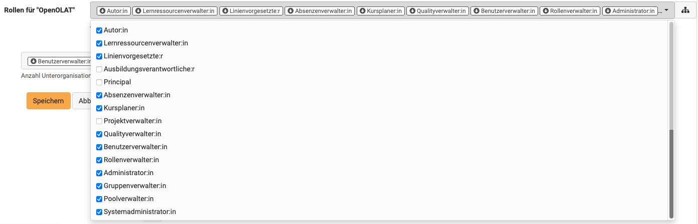
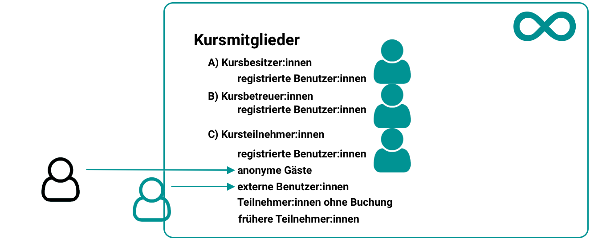
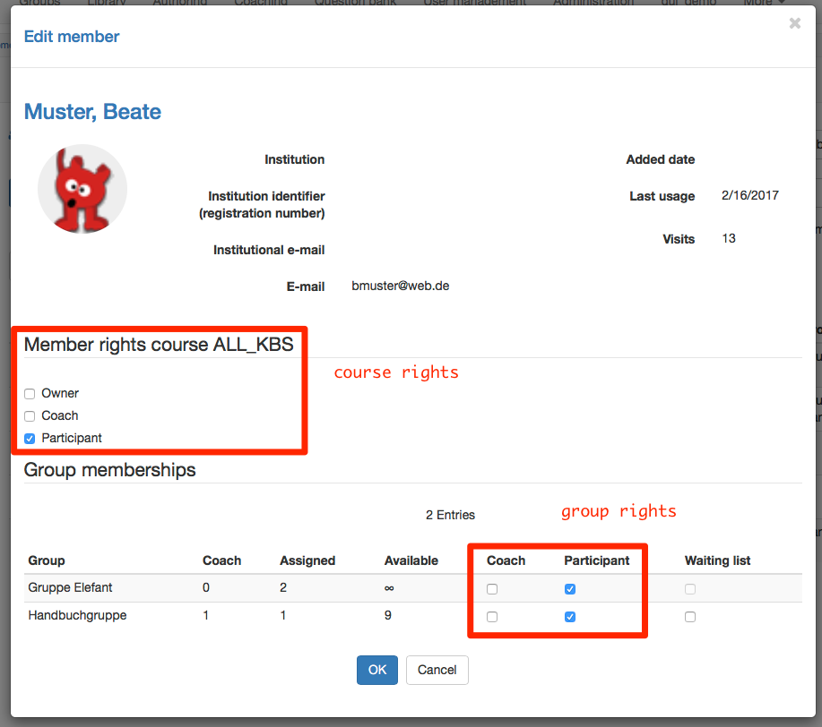
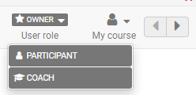
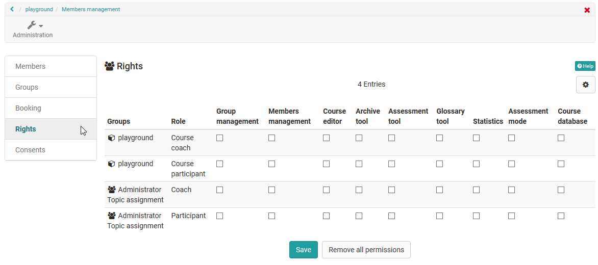

# Roles and Rights: Which roles are available? {: #roles} 

The roles can be assigned to the following contexts according to the tasks:

## Organisation wide roles {: #org} 

Organisation roles include organisation-wide authorisations (as defined for the OpenOlat instance). The organisation roles are assigned in the user management.

{ class="shadow lightbox" }

* **Author**: Authors have access to Authoring in the top navigation. This allows them to create courses and all other learning resources. In the search mask authors find all courses and learning resources such as tests, films and portfolio templates which are accessible to them. This role is often assigned to teachers or e-learning managers.
* **Learning resource manager**: Learning resource managers automatically have owner rights (= full access) for all courses and learning resources belonging to the own organisation (see [Administrative access](../learningresources/Access_configuration.md#administrative-release)). In the status "Finished" and "Deleted" the access is read-only. The courses and learning resources can be found in Authoring and can be copied as well as exported.
* **Line manager**: Line managers can, for example, be automatically informed about the issue of certificates for users within their organisation unit.
* **Education manager**: The rights assigned to education managers apply to the entire branch of their organisation unit. They include rights in Coaching, even if they are not directly active and assigned there as coaches. Or administrative functions, such as checking booking orders, blocking accounts, etc.
* **Principal**: The principal sees many areas of the system, but has read-only access and cannot make any changes, edit objects, etc.
* **Absence manager**: The menu item "Absence management" is available to them in the main navigation for the administration of absences within their organisation unit.
* **Course planner**: Course planners have access to the [Course Planner](../area_modules/Course_Planner.md). If course planners are assigned to an organisation, they only have access to that organisation's Course Planner.
* **Project manager**: Project managers also have the "Administration" tab in the "Projects" menu item and can access all projects here, including member management and configuration.
* **Quality manager**: Quality managers have access to the "Quality management" menu item and can manage all settings and objects such as questionnaires, data collection generators and the analysis tool.
* **User manager**: User managers have access to the [User management](../../manual_admin/usermanagement/index.md) and all users of the own organisation. They can create, edit and inactivate users. They can also assign the Author role and other roles. User managers have the menu item "User management" in the top navigation.
* **Roles manager**: Roles managers have access to the user management (separate menu item in the top navigation) and can view and organise all users in their own organisations. Roles managers can change, assign and remove all roles of users except the roles Administrator and System administrator.
* **Administrator**: Administrators have module and function management and have access to all areas of the system, such as user management, catalog management and Course Planner, except the administration page. This role can be limited to an organisation. Administrators can delete users and also grant other people the right to manage the catalog.
* **Group manager**: Group managers have additional access to the tab [Group Management](../area_modules/Group_Management.md) in the "Groups" menu item.
* **Question bank manager**: Question bank managers have access to the [Question Bank](../area_modules/Question_Bank.md). In the question bank they can open the Administration section.
* **System administrator**: System administrators have access to the administration page and are responsible for the technical system configuration and its monitoring. This is a global role that is not tied to an organisation.

!!! note "Note"

    The mentioned roles represent options to give normal users organisation-wide extensive additional rights. Usually an appropriate role composition is selected for an OpenOlat instance and not all specific roles are assigned. Typical is a combination of user, author and administrator or system administrator. Additional roles result from the structure of the respective institution and the use of certain tools such as the [Course Planner](../area_modules/Course_Planner.md). It is therefore possible that not all potential OpenOlat roles are used in your instance.

    If you have any questions regarding the role assignment, please contact the support of your OpenOlat instance.

[To the top of the page ^](#roles)

---

## Roles in an organisation unit {: #orgunit} 

If the optional additional module "Organisation units" is activated, roles can also be assigned for a specific organisation unit only.

Users can be members of different organisation units and be assigned different roles there.

The roles that can be limited to an organisation unit include

* All system users
* Authors
* Group managers
* Absence managers
* Project managers
* Quality managers
* Question bank managers
* User managers
* Roles managers
* Course planners
* Learning resource managers
* Line managers
* Education managers
* Principals
* Administrators

(System administrators are by definition responsible for the entire system and cannot be restricted to organisation units.)

Organisation roles are assigned in the user management. 
(See [Role assignment of organisation-specific roles](Assign_Roles.md#role_assignment_orgunit))

!!! info "Without activated organisation units"

    If the "Organisation units" module is not set up, all users are automatically members of the only existing overall organisation (OpenOlat) and all roles refer to it.

[To the top of the page ^](#roles)

---

## Roles in a course {: #course} 

{ class="shadow lightbox" }

Within a course we distinguish between the 3 course roles: 

* **Owner**: These users have all rights in the course. They can edit the course, manage members and also delete the course. Thus the owner is the course administrator.

    :octicons-device-camera-video-24: **Video Introduction (German)**: [Requirements for authors](<https://www.youtube.com/embed/L0jc_LBKXLE>){:target="_blank"}

* **Coach**: The course coach has access to the [Assessment tool](../learningresources/Assessment_tool_overview.md) of the course, as well as to the test and survey statistics. However, a course coach can neither edit the course in the course editor nor delete the course. In the assessment tool course coaches see all course participants, but no group participants. More details of the course role coach can be found [here](coach.md).

* **Participant**: Participants can open the course and work on the provided course elements and contents (depending on the configuration). However, they have no additional rights in the course.

{ class="shadow lightbox" }

In addition to the course-related roles, [guests](guest_access.md) without an OpenOlat account can also get access to a course in conventional courses.

!!! tip "Role change"

    It is also possible for people to be given several course roles and thus take different perspectives on the course. Once a person has been assigned several course-related roles, a role change is possible by switching the "User's role" in the toolbar of the course.

    { class="shadow lightbox" }

[To the top of the page ^](#roles)

---

## Roles in groups {: #groups} 

If groups are used in courses, the members can be registered there either as group participants or as group coaches.

* **Group coach**: 
Group coaches have practically the same rights as the role course coach, but only for their group. In the course they therefore have access to the assessment tool and the test and survey statistics. In the assessment tool, however, they only see the participants of their own group.

* **Group participant**: 
Group participants have the same rights as the role course participant.

Under `Course > Administration > Members management > Rights` further *rights packages* can be assigned to course coaches, course participants, group participants or group coaches (specific to each group).

{ class="shadow lightbox" }

{ class=" aside-left-lg" }
**Group management** 
This function is available when the checkbox under `Course > Administration > Members management > Groups` is activated. Existing groups that are already members of the course can be changed and removed. Additional groups (to which you have access rights) can be added or new groups can be created.

[More about groups >](../groups/index.md) 
[More about the group administration >](../groups/Group_Administration.md)

{ class=" aside-left-lg" }
**Members management** 
This function is available when the checkbox under the "Administration" icon is activated. The available options correspond to those of the course owners. (Please note: To add new members to the course, all registered users can be viewed.)

Note: The right "Group management" described above is part of Members management, even if the right "Group management" is not activated.

[More about members management >](../learningresources/Members_management.md)

{ class=" aside-left-lg" }
**Course editor** 
This function is available when the checkbox under the "Administration" icon is activated. Course members (e.g. coaches) can be granted access to the course editor. This allows these members to edit the course and configure or add course elements. However, this authoring right is limited. No new courses or learning resources can be created. 
**Note:** 
A course in which you have been granted editing rights here, but which you do not own, does not appear in Authoring. (Provided you otherwise have author rights and access to Authoring.) To edit it, open the course in the main menu under "Courses" instead. Then you will find the course editor under the "Administration" icon. The same rule applies here: the course is only displayed to coaches and participants if it has been published by the owner.

[More about the course editor >](../learningresources/General_Configuration_of_Course_Elements.md)

{ class=" aside-left-lg" }
**Archive tool** 
This function is available when the checkbox under the "Administration" icon is activated. The available options correspond to those of the course owners.

[More about Archiving & Reports >](../learningresources/Course_Archiving.md)

{ class=" aside-left-lg" }
**Assessment tool** 
This function is available when the checkbox under the "Administration" icon is activated. 
The assessment tool is part of the basic equipment of all coaches. Here it can also be made available to other people under the "Administration" icon.

[More about the assessment tool >](../learningresources/Assessment_tool_overview.md)

{ class=" aside-left-lg" }
**Glossary tool** 
The glossary function can be displayed as an icon in the toolbar. For the icon to appear there, the view must be activated under `Course > Administration > Settings > Tab "Toolbar"` and a glossary must be selected or created under `Course > Administration > Settings > Tab "Options"`.

If the "Glossary tool" is activated here in the members management of a course under "Rights", the relevant group members can add and edit glossary entries by clicking on the glossary icon in the toolbar. 

If no glossary has been created yet (glossary icon not yet visible in the toolbar), there is no access even if the checkbox is activated. In this case, access to the course editor must first be granted additionally so that a glossary can be created there under `Course > Administration > Settings > Tab "Toolbar"` and `Tab "Options"`.

[More about the glossary >](../learningresources/Glossary.md)

{ class=" aside-left-lg" }
**Statistics** 
This function is available when the checkbox under the "Administration" icon is activated. The available options correspond to those of the course owners.

[More about course statistics >](../learningresources/Statistics_Course.md)

{ class=" aside-left-lg" }
**Assessment mode** 
This function is available when the checkbox under the "Administration" icon is activated. The available options correspond to those of the course owners.

[More about assessment management >](../learningresources/Assessment_Management.md)

{ class=" aside-left-lg" }
**Course database** 
This function is available when the checkbox under the "Administration" icon is activated. The available options correspond to those of the course owners. Here you can create, reset, delete and export course databases.

!!! info "Course/group roles"

    Both the course rights and the group rights are independent of the _system-wide role_ which users have received in the user management. Registered users without an assigned role can also be course owner, course coach or group coach.

!!! note "Note"

    Group participants and group coaches are roles within a specific group. The role "Group manager", on the other hand, is an organisation-wide role, as its task is to perform administrative tasks **across all groups**.

[To the top of the page ^](#roles)

---

## Self-defined roles and relations {: #relations} 

In addition to the roles predefined in OpenOlat, administrators can also create roles themselves in the system administration: 
`Administration > Modules > Role user to user` 
These freely definable roles can be equipped with specific rights by administrators.

For these roles, cross-course support functions such as mentors, learning guides and superiors can be set up with user-to-user relations, for example. 
(See [Coaching - People](../area_modules/Coaching_People.md))

**Requirements:** 
Before relations between roles can be defined, the **roles** must first exist and a **system** must be in place (which role is superior or subordinate to which other role).

The **system** is determined by **administrators**. 

Once the roles and their system have been set up, the relations can then be defined in the **user management**. 
(See [Define relations](Assign_Roles.md#role_assignment_relations))

[To the top of the page ^](#roles)

---

## Account roles {: #account_roles} 

The account roles are only relevant for the search function of the administrators. 
(See [Account roles](../../manual_admin/usermanagement/Search_Users.md))

[To the top of the page ^](#roles)

---

!!! warning "Access assessment tool"

    If you want to prevent a person from accessing the assessment tool, you should not give them the role coach either in the course or in the group!

!!! warning "Access members management"

    Persons who have the right "[Members management](../learningresources/Members_management.md)" can give themselves additional rights as well as remove other members of the course or reduce their scope of rights. (Including the creator or other owners!)

[To the top of the page ^](#roles)

---

## Further information {: #further_information} 

**Mentioned on this page** 
[Access configuration >](../learningresources/Access_configuration.md) 
[Course Planner: Overview >](../area_modules/Course_Planner.md) 
[User management >](../../manual_admin/usermanagement/index.md) 
[Group Management >](../area_modules/Group_Management.md) 
[Question Bank: Overview >](../area_modules/Question_Bank.md) 
[Assign roles >](Assign_Roles.md) 
[Assessment tool - overview >](../learningresources/Assessment_tool_overview.md) 
[The role of a coach >](coach.md) 
[Guest access >](guest_access.md) 
[Groups >](../groups/index.md) 
[Group Administration >](../groups/Group_Administration.md) 
[Members management >](../learningresources/Members_management.md) 
[Elements >](../learningresources/General_Configuration_of_Course_Elements.md) 
[Course administration - Archiving & Reports >](../learningresources/Course_Archiving.md) 
[Glossary >](../learningresources/Glossary.md) 
[Course statistics >](../learningresources/Statistics_Course.md) 
[Assessment Management: Overview >](../learningresources/Assessment_Management.md) 
[Coaching - People >](../area_modules/Coaching_People.md) 
[User search / Account search >](../../manual_admin/usermanagement/Search_Users.md)

**Further reading** 
[Authorisation in courses >](Authorisation_Concept.md) 
[User Types >](User_Types.md) 
[Roles and their working areas >](Roles_Home_Areas.md)

**youtube** 
[Requirements for authors](<https://www.youtube.com/embed/L0jc_LBKXLE>)

[To the top of the page ^](#roles)
