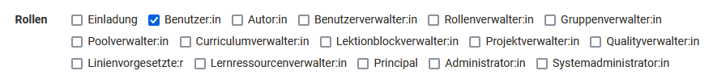
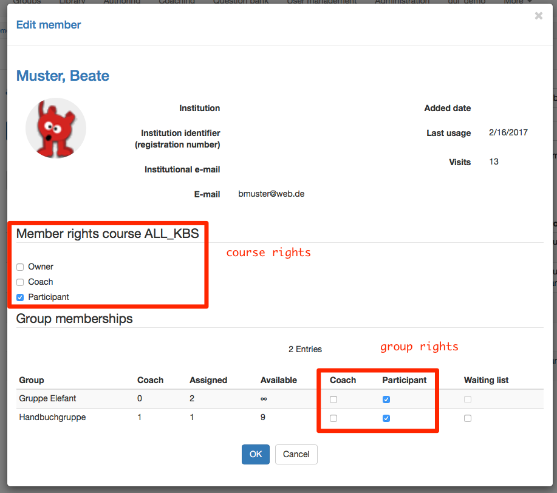
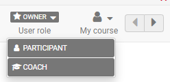
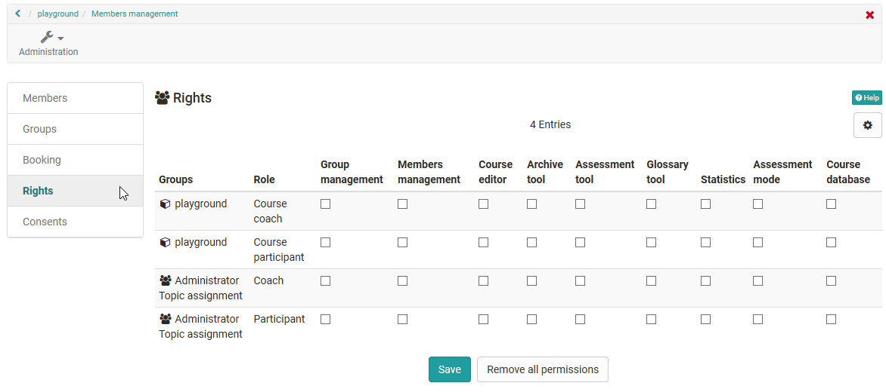

# Roles and Rights: Which roles are available? {: #overview} 

The roles can be assigned to the following contexts according to the tasks:

## System wide roles {: #system} 

System roles include system-wide authorizations (for the entire OpenOlat instance). The system roles are assigned in the user administration.

* **Invitee**: Invited persons with user type "external user" (see [User_Types](User_Types.md))
* **User**: Standard role for registered users
* **Author**: The author has access to the authoring area. This allows the author to create courses and all other learning resources. In the search mask the author finds all courses and learning resources such as tests, films and portfolio templates which are accessible to authors. This role is often assigned to teachers or e-learning managers.
* **User manager**:User managers have access to the [User management](../../manual_admin/usermanagement/index.md) and all users of the own organization. They can create, edit and inactivate users. They can also assign the Author role and other roles. User administrators have the menu item "User administration" in the top navigation bar. 
* **Role manager**: Role managers have access to the user administration (separate menu item in the top navigation) and all users of his or her own organization. Apart from the roles "Administrator" and "System Administrator", they can change, assign and remove all user roles.
* **Group manager**: The group manager has access to the "Group" section and in there the tab [Group Administration](../area_modules/Group_Management.md). 
* **Question bank manager**: Question bank managers has access to the [Question Bank](../area_modules/Question_Bank.md). In there, they are able to open the administration section.
* **Curriculum manager**: The curriculum manager has access to [Curriculum Management](../area_modules/Curriculum_Management.md) and can create new curricula and manage existing ones. If the curriculum manager is assigned to an organization, he or she only has access to the curricula of this organization.
* **Lectures manager**: Lesson block administrators have access to the menu item "Lesson administration" in the top navigation. They can see all lessons and absences including the respective users of their own organizations.   
* **Project manager** Project administrators also have the "Administration" tab in the "Projects" menu item and can access all projects here, including member administration and configuration.
* **Quality manager**: The quality manager has access to the Quality Management area and can manage all settings and objects such as questionnaires, data collection generators and the analysis tool.
* **Line manager**: The line manager can be automatically informed about the receipt of certificates for all users of his organization.
* **Learning resource manager**: A learning resource manager automatically has owner rights (= full access) for all courses and learning resources belonging to the own organization (see [Administrative release](../learningresources/Access_configuration.md#administrative-release)). In the status "Finished" and "Deleted" the access is read-only. The courses and learning resources can be found in the authoring area and can be copied as well as exported.
* **Principal**: The principal sees many areas of the system, but has read-only access and cannot make any changes, edit objects, etc.
* **Administrator**: The administrator has module and function management and has access to all areas of the system e.g. user management, catalog management, curriculum management, lectures management, except the administration page. This role can be limited to an organization. The administrator can delete users and also grant other people the right to manage the catalogue.
* **System administrator**: The system administrator has access to the administration side and is responsible for the technical system configuration and its monitoring. This is a global role that is not tied to an organization.

!!! warning "Note"

    The mentioned roles represent options to give normal users system-wide extensive additional rights. Usually an appropriate role composition is selected for an OpenOlat instance and not all specific roles are assigned.
    Typical is a combination of user, author and administrator or system administrator. Additional roles result from the structure of the respective institution and the use of certain tools such as [Curriculum](../area_modules/Curriculum_Management.md) or [Absences](../learningresources/Lectures_and_absences.md). It is therefore possible that not all potential OpenOlat roles are used in your instance.
    
    If you have any questions regarding the role management please contact the support of your own OpenOlat instance.

[To the top of the page ^](#roles)

---

## Roles in a course {: #course} 

{ class=" shadow lightbox" }

Within a course, we distinguish between the 3 course roles:  

* **Owner**: The user has all rights in the course. He can edit a course, manage members and delete the course. Thus the owner is like the course administrator.

* **Coach**: The course coach has access to the [Assessment tool](../learningresources/Assessment_tool_overview.md), as well as to the test and survey statistic. However a course coach cannot edit or delete a course. In the assessment tool a course coach can see the course participants, but not the group participants. More details of the course role Coach can be found [here](coach.md).

* **Participant**: A participant can open the course and edit everything he has access rights to (depending on configuration). A participant has no further rights.

{ class="shadow" }

In addition to the course-related roles, depending on the configuration,
[guests](guest_access.md) can also have access to a course without an OpenOlat account.

!!! success "Role change"
  
    It is also possible for people to be given multiple course roles and thus have different perspectives on the course. Once a person has been assigned several course-related roles, it is possible to change roles by changing the "User role" in the course toolbar.
    
    

[To the top of the page ^](#roles)

---

### Roles in groups {: #groups} 

If groups are used in courses, the members can be registered either as participants or as group coaches. 

* **Group coach**:  
The group coach has basically the same rights as the course coach, but only for his group. In courses where his group is assigned to, he has access rights to the assessment tool as well as to the test and survey statistic. In the assessment tool he can only see the participants of his group.

* **Group members**: 
The group participant has the same rights as the course participant.

In the rights management of the course, further *rights packages* can be assigned to either group participants or group coaches.

!!! warning "Course/Group Roles"

    Course rights as well as group rights are independent of the role which a user has _system wide_ in the user management. A system user without an assigned role can be course owner, course coach or group coach. 

!!! note "Note"

    Group participants and group coaches are roles within a specific group. The "Group administrator" role, on the other hand, is a system-wide role, as its task is to perform administrative tasks **across all groups**.

[To the top of the page ^](#roles)

---

## Roles in curricula {: #curriculum} 

If the optional additional module "Curriculum" is activated, additional roles are available alongside the usual course roles, which can be assigned to members of a curriculum.

* Curriculum owner
* Curriculum element owner
* Class teacher (Master Coach)

* (Curriculum) course owner
* (Curriculum) course coach
* (Curriculum) course participantss

**The role curriculum owner** 
If a person with access to curriculum management (curriculum administrators) imports or creates a new curriculum, this person becomes the curriculum owner. In particular, this entails the right to structure the curriculum and to add courses and (curriculum) participants to the curriculum.

{ class=" shadow lightbox" }

**The role curriculum element owner** 
Like owners, element owners also have the right to structure the curriculum and add courses and (curriculum) participants to the curriculum - but limited to one curriculum element.

**The role class teacher (master coach)** 
Example: 
If a class has different subjects (subjects correspond to curriculum elements in OpenOlat), then the class teachers have access to the different curriculum elements (read permission), while subject teachers (curriculum element owners) only have access to their curriculum element (subject).

**Owners, Coaches** and **Users** are the three roles of course participants. A curriculum is made up of courses. That is why these 3 roles are also available for all courses in a particular curriculum - with a few special features.

**The role (Curriculum-) course owner** 
Normally, users with the system-wide author role can create courses in the author area. In every newly created course, the creator automatically receives the course role "Course owner". The "Course owner" role applies to one course at a time.

If a user becomes a curriculum member and receives the role "course owner" **within the curriculum**, the person becomes the course owner in **all courses of this curriculum**.

Outside of the curriculum elements, a (curriculum) course owner has no author rights if he/she does not have the system-wide role of author.

If the curriculum membership is withdrawn, the owner role is also removed from all courses in this curriculum.

The same applies to the roles of **(curriculum) course coaches** and **(curriculum) course participants**.

!!! note "Note"

    The roles listed above are roles **within** a specific curriculum. The role of "curriculum administrator", on the other hand, is a system-wide role, as its task is to perform administrative tasks across the curriculum**. 
    (See [Curriculum management](../area_modules/Curriculum_Management.md))

[To the top of the page ^](#roles)

---

## Roles in an organization {: #orgunit}

If the optional additional module "Organizational units" is activated, roles can also only be assigned for a specific organizational unit.

Users can be members of different organizational units and be assigned different roles there.

The roles that can be limited to an organizational unit include

* All system users
* Authors
* Group managers
* Lection block managers
* Project managers
* Quality managers
* Question bank managers
* User managers
* Role managers
* Curriculum managers
* Learning resource managers
* Line managers
* Principals
* Administrators

(System administrators are by definition responsible for the entire system and cannot be restricted to organizational units).

Organizational roles are assigned in the user administration. 
(See [Role assignment of organization-specific roles](Assign_Roles.md#role_assignment_orgunit))

!!! info "Without activated organizational units"

    If the "Organizational units" module is not set up, all users are automatically members of the only existing overall organization (OpenOlat) and all roles refer to it.

[To the top of the page ^](#roles)

---

## Self-defined roles and relations {: #relations}

In addition to the roles predefined in OpenOlat, administrators can also create roles themselves. 
(**Administration > Module > Role user to user**) 
These freely definable roles can be assigned specific rights by administrators.

For example, cross-course support functions such as mentors, learning guides and coaches can be set up for these roles with user-to-user relationships. 
(See [Coaching - Role user-to-user](../../area_modules/coaching_personenbeziehungen.md))

**Requirements**: 
Before relationships between roles can be defined, the **roles** must first exist and a **system** must be in place (which role is superior or subordinate to which other role).

The **system** is determined by **administrators**.

Once the roles and their system have been set up, the relationships can then be defined in **User administration**. 
(See [Assign roles](Assign_Roles.md))

[To the top of the page ^](#roles)

---

## Role "Invitee" {: #invitee} 

The "Invitee" role is for people who do not have a user account in OpenOlat and still need to enter data in OpenOlat. They are given a kind of pseudo user account with very few rights. The role is used in the ePortfolio module, for example. Here, the authors of a contribution can also invite external persons (e.g. the teacher) to assess the contribution. These external persons are assigned the "Invitee" role.

All persons who have been added to a course via the option "**Invite external members**" receive the "role" or the associated rights status. In user management, the "Invitation" role should only be assigned in exceptional cases.

As external users, such persons are not fully registered (only with e-mail) and therefore **do not have full user rights**, like the standard role "User". 
(See [User types](User_Types.md))

(Available since release 17.0.)

[To the top of the page ^](#roles)

---

## Account roles {: #account_roles}

The account roles are only relevant for the administrator's search function. 
(See [Account roles](../../manual_admin/usermanagement/Search_Users.md))

[To the top of the page ^](#roles)

---

!!! danger "Access assessment tool"

    If you want to prevent a person from having access to the assessment tool, you should not give them coach rights either in the course or in the group!

!!! danger "Access members management"

    Persons who have the right "[Member management](../learningresources/Members_management.md)" can give themselves additional rights as well as remove other members of the course, including the creator or other owners, or reduce their scope of rights.

[To the top of the page ^](#roles)

---

## Further information

[Role assignment for system roles](Assign_Roles.md#role_assignment_system) 

[Role assignment for course roles](Assign_Roles.md#role_assignment_course)  

[Role assignment for curricula](Assign_Roles.de.md#role_assignment_curriculum) 
[Rights of the curriculum roles](../basic_concepts/Authorization_Concept.md#rechte-der-curriculum-rollen)  

[Role assignment of the "Invitee"](Assign_Roles.md#role_assignment_invitee) 

[Define your own roles and relationships](Assign_Roles.md#role_assignment_relations)  

 

[To the top of the page ^](#roles)