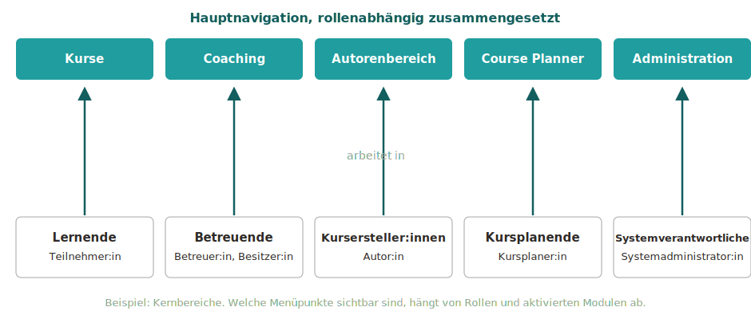

# Rollen und ihre Arbeitsbereiche {: #home_areas}

Die Hauptnavigation von OpenOlat wird rollenabhängig zusammengesetzt. Jede Aufgabe hat ihren eigenen Arbeitsbereich: Lernende arbeiten unter "Kurse", Betreuende im "Coaching", Autor:innen im "Autorenbereich". Welche Menüpunkte eine Person sieht, ergibt sich aus ihren [Rollen](Roles.de.md) und aus den in der jeweiligen OpenOlat-Instanz aktivierten Modulen.

## Klare Trennung von Lernen und Betreuen [:octicons-tag-16:{ title="ab Release 21.0 (OO-9576)" }](https://track.frentix.com/issue/OO-9576) {: #separation}

OpenOlat trennt die beiden Blickwinkel auf einen Kurs konsequent nach Rolle:

* Unter **Kurse** ("Meine Kurse") finden Sie die Lernressourcen, in denen Sie selbst als Teilnehmer:in eingetragen sind.
* Lernressourcen, die Sie als Betreuer:in oder Besitzer:in begleiten, finden Sie im Bereich **Coaching**.

Sind Ihnen in einem Kurs beide Rollen zugewiesen, erscheint der Kurs in beiden Bereichen. Sie öffnen ihn dann dort, wo Ihre aktuelle Aufgabe liegt: zum Lernen unter "Kurse", zum Betreuen im "Coaching".

Zwei Personen können deshalb nach dem Login unterschiedliche Menüs sehen. Fehlt ein Menüpunkt, ist das kein Fehler: Entweder ist das entsprechende Modul nicht aktiviert oder die dafür nötige Rolle wurde nicht zugewiesen.

{ class="shadow lightbox" }

---

## Die Kernbereiche {: #core_areas}

| Wer | Arbeitsbereich | Typische Tätigkeiten |
|---|---|---|
| **Lernende** Kursrolle Teilnehmer:in | [Kurse](../area_modules/Courses.de.md) | Kurse aufrufen und absolvieren, Favoriten verwalten, den eigenen Lernstand verfolgen |
| **Betreuende** Kursrolle Betreuer:in oder Besitzer:in, Gruppenbetreuer:in, Ausbildungsverantwortliche/r | [Coaching](../area_modules/Coaching.de.md) | betreute Personen, Kurse und Gruppen kursübergreifend begleiten, bewerten und verwalten |
| **Kursersteller:innen** Organisationsrolle Autor:in | [Autorenbereich](../area_modules/Authoring.de.md) | Kurse und weitere Lernressourcen erstellen, importieren und pflegen |
| **Kursplanende** Organisationsrolle Kursplaner:in | [Course Planner](../area_modules/Course_Planner.de.md) | Produkte, Durchführungen und Termine des Bildungsangebots planen und verwalten |
| **Systemverantwortliche** Rolle Systemadministrator:in | [Administration](../../manual_admin/administration/System.de.md) | die OpenOlat-Instanz technisch konfigurieren und überwachen |

Die Arbeitsbereiche ergänzen sich, ohne sich zu überschneiden. So bleibt jeder Bereich auf seine Aufgabe fokussiert: Wer einen Kurs absolviert, wird nicht von Verwaltungsfunktionen abgelenkt; wer betreut oder plant, findet alle dafür nötigen Werkzeuge an einem Ort.

[zum Seitenanfang ^](#home_areas)

---

## Mehrere Rollen, mehrere Arbeitsbereiche {: #multiple_roles}

Rollen sind natürlich kombinierbar. Eine Lehrperson kann zum Beispiel als Autor:in im Autorenbereich Kurse erstellen, im Coaching die eigenen Teilnehmenden begleiten und unter "Meine Kurse" selbst eine Weiterbildung absolvieren. Die Hauptnavigation zeigt in diesem Fall alle entsprechenden Menüpunkte nebeneinander an.

Innerhalb eines Kurses gibt es zusätzlich den Rollenwechsel: Wurden einer Person mehrere Kursrollen zugewiesen, kann sie über die "Benutzerrolle" in der Toolbar des Kurses die Perspektive wechseln. 
(Siehe [Rollen in einem Kurs](Roles.de.md#course))

[zum Seitenanfang ^](#home_areas)

---

## Weitere rollenspezifische Bereiche {: #further_areas}

Neben den Kernbereichen gibt es weitere Menüpunkte und Bereiche, die erst mit der passenden Rolle gezielt sichtbar werden:

| Rolle | Arbeitsbereich |
|---|---|
| Benutzerverwalter:in | [Benutzerverwaltung](../../manual_admin/usermanagement/index.de.md), Menüpunkt in der obersten Navigation |
| Rollenverwalter:in | [Benutzerverwaltung](../../manual_admin/usermanagement/index.de.md), mit dem Recht zur Vergabe von Rollen |
| Gruppenverwalter:in | Menüpunkt "Gruppen", zusätzlicher Tab [Gruppenverwaltung](../area_modules/Group_Management.de.md) |
| Poolverwalter:in | [Fragenpool](../area_modules/Question_Bank.de.md), inklusive Bereich Administration |
| Qualityverwalter:in | Menüpunkt [Qualitätsmanagement](../area_modules/Quality_Management.de.md) |
| Absenzenverwalter:in | Menüpunkt [Absenzenverwaltung](../area_modules/Absence_Management.de.md) |
| Projektverwalter:in | Menüpunkt "Projekte", zusätzlicher Tab [Administration](../area_modules/Project_Admin.de.md) |
| Lernressourcenverwalter:in | [Autorenbereich](../area_modules/Authoring.de.md), mit Besitzerrechten für die Kurse und Lernressourcen der eigenen Organisation |
| Administrator:in | Modul- und Funktionsverwaltung: Zugriff auf viele Bereiche wie Benutzerverwaltung, Katalogverwaltung und Course Planner, jedoch nicht auf die Administrationsseite |
| Principal | Lesender Zugriff auf viele Bereiche des Systems |

Die vollständige Beschreibung aller Rollen und der damit verbundenen Rechte finden Sie unter [Welche Rollen gibt es?](Roles.de.md) Eine Übersicht aller Menüpunkte der Hauptnavigation bietet die Seite [Bereiche und Module](../area_modules/index.de.md).

[zum Seitenanfang ^](#home_areas)

---

## Weiterführende Informationen {: #further_information}

[Rollen und Rechte: Übersicht >](Roles_Rights.de.md) 
[Welche Rollen gibt es? >](Roles.de.md) 
[Bereiche und Module >](../area_modules/index.de.md) 
[Navigation >](Navigation.de.md)

[zum Seitenanfang ^](#home_areas)
