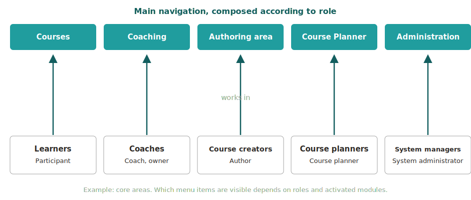

# Roles and their working areas {: #home_areas}

The main navigation of OpenOlat is composed according to role. Every task has its own working area: learners work under "Courses", coaches in "Coaching", authors in the "Authoring area". Which menu items a person sees depends on their [roles](Roles.md) and on the modules activated in the respective OpenOlat instance.

## Clear separation of learning and coaching [:octicons-tag-16:{ title="from Release 21.0 (OO-9576)" }](https://track.frentix.com/issue/OO-9576) {: #separation}

OpenOlat consistently separates the two perspectives on a course by role:

* Under **Courses** ("My Courses") you find the learning resources in which you yourself are entered as a participant.
* Learning resources you accompany as a coach or owner are found in the **Coaching** area.

If you are assigned both roles in a course, the course appears in both areas. You then open it where your current task lies: under "Courses" for learning, in "Coaching" for coaching.

Two people can therefore see different menus after logging in. If a menu item is missing, this is not an error: either the corresponding module is not activated or the required role has not been assigned.

{ class="shadow lightbox" }

---

## The core areas {: #core_areas}

| Who | Working area | Typical tasks |
|---|---|---|
| **Learners** course role participant | [Courses](../area_modules/Courses.md) | open and complete courses, manage favourites, track their own learning progress |
| **Coaches** course role coach or owner, group coach, education manager | [Coaching](../area_modules/Coaching.md) | accompany, assess and manage supervised people, courses and groups across courses |
| **Course creators** organisation role author | [Authoring area](../area_modules/Authoring.md) | create, import and maintain courses and other learning resources |
| **Course planners** organisation role course planner | [Course Planner](../area_modules/Course_Planner.md) | plan and manage products, implementations and dates of the educational offering |
| **System managers** role system administrator | [Administration](../../manual_admin/administration/System.md) | configure and monitor the OpenOlat instance technically |

The working areas complement each other without overlapping. This keeps each area focused on its task: those who complete a course are not distracted by administrative functions; those who coach or plan find all the necessary tools in one place.

[to the top ^](#home_areas)

---

## Multiple roles, multiple working areas {: #multiple_roles}

Roles can of course be combined. A teacher, for example, can create courses as an author in the authoring area, accompany their own participants in Coaching, and complete a course themselves as a learner under "My Courses". In this case the main navigation displays all the corresponding menu items side by side.

Within a course there is additionally the role switch: if a person has been assigned several course roles, they can change perspective via the "User role" in the course toolbar. 
(See [Roles in a course](Roles.md#course))

[to the top ^](#home_areas)

---

## Further role-specific areas {: #further_areas}

Besides the core areas, there are further menu items and areas that only become visible with the corresponding role:

| Role | Working area |
|---|---|
| User manager | [User management](../../manual_admin/usermanagement/index.md), menu item in the top navigation |
| Roles manager | [User management](../../manual_admin/usermanagement/index.md), with the right to assign roles |
| Group manager | "Groups" menu item, additional tab [Group management](../area_modules/Group_Management.md) |
| Question bank manager | [Question pool](../area_modules/Question_Bank.md), including the Administration area |
| Quality manager | [Quality management](../area_modules/Quality_Management.md) menu item |
| Absence manager | [Absence management](../area_modules/Absence_Management.md) menu item |
| Project manager | "Projects" menu item, additional tab [Administration](../area_modules/Project_Admin.md) |
| Learning resource manager | [Authoring area](../area_modules/Authoring.md), with owner rights for the courses and learning resources of their own organisation |
| Administrator | Module and function administration: access to many areas such as user management, catalog management and Course Planner, but not to the administration page |
| Principal | Read access to many areas of the system |

You find the complete description of all roles and the associated rights under [Which roles are there?](Roles.md) An overview of all menu items of the main navigation is provided on the page [Area and modules](../area_modules/index.md).

[to the top ^](#home_areas)

---

## Further information {: #further_information}

[Roles and Rights: Overview >](Roles_Rights.md) 
[Which roles are there? >](Roles.md) 
[Area and modules >](../area_modules/index.md) 
[Navigation >](Navigation.md)

[to the top ^](#home_areas)
