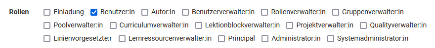

# Rollen und Rechte

:octicons-device-camera-video-24: **Video-Einführung**: [Benutzerverwaltung](<https://www.youtube.com/embed/V1RuH0q08J8>){:target="_blank”}

## Systemweite Rollen und Rechte

### Benutzertypen

OpenOlat arbeitet mit einem Rollen und Rechte Management. Zuerst wird zwischen 2 grundsätzlichen Benutzertypen unterschieden. Dies sind:

* **Anonymer Gast**: Gäste haben - ohne sich zu registrieren – beschränkten Zugang zu OpenOlat. Sie können für Gäste freigegebene Lerninhalte betrachten, sich jedoch nicht an den Lernaktivitäten beteiligen. Der Link zum Gastzugang befindet sich auf der Login-Seite. Weitere Informationen zum Gast finden Sie [hier](guest_access.de.md).
* **Registrierte Benutzer**: Alle Benutzer:innen haben einen eindeutigen Benutzernamen, der nach der Registrierung nicht mehr geändert werden kann. Benutzer:innen können freigeschaltete Lerninhalte nutzen und sich an allen Lernaktivitäten beteiligen. Zudem haben alle Benutzer:innen eine individuell konfigurierbare Startseite und [Speicherplatz](../personal_menu/Personal_folders.de.md) zur Verfügung. Alle registrierten Benutzer:innen hat auch die Möglichkeit eigene [Gruppen](../groups/index.de.md) zu erstellen und alle darin enthaltenen Funktionen und Tools zu nutzen. 

!!! info "Info"

    Bei registrierten Benutzer:innen ohne weitere Rollen und Rechte handelt es sich in der Regel um die Lernenden.

### Rollen

Registrierte Benutzer:innen können zusätzlich eine oder mehrere Rollen erhalten.

Hier ein Überblick über alle OpenOlat Rollen.

* **Einladung**: Eingeladene Personen
* **Benutzer**: Standardrolle (siehe oben)
* **Autor**: Autor:innen haben Zugriff auf den Autorenbereich. Damit sind sie berechtigt, Kurse und alle weiteren Lernressourcen zu erstellen. In der Suchmaske finden Autor:innen alle Kurse und Lernressourcen wie Tests, Filme und Portfoliovorlagen, welche für sie zugänglich sind. Diese Rolle wird häufig an Lehrende oder E-Learning Verantwortliche vergeben.  
* **Benutzerverwalter**: Benutzerverwalter:innen haben Zugriff auf die [Benutzerverwaltung](../../manual_admin/usermanagement/index.de.md) und alle Benutzer:innen der eigenen Organisation. Er kann Benutzer:innen erstellen, bearbeiten und inaktiv setzen. Zudem kann er die Rolle Autor vergeben.
* **Rollenverwalter**: Rollenverwalter:innen haben Zugriff auf die Benutzerverwaltung und alle Benutzer:innen der eigenen Organisationen. Er kann, ausser die Rollen Administrator und Systemadministrator, alle Rollen der Benutzer:innen ändern, sie vergeben und entfernen.
* **Gruppenverwalter**: Gruppenverwalter:innen haben Zugriff auf den Bereich Gruppen und darin Zugriff auf den Tab [Gruppenverwaltung](../groups/Group_Administration.de.md). 
* **Poolverwalter**: Poolverwalter:innen haben Zugriff auf den [Fragenpool](../area_modules/Question_Bank.de.md). Im Fragenpool können sie den Bereich Administration öffnen.
* **Curriculumverwalter**: Curriculumverwalter:innen haben Zugriff auf die [Curriculumverwaltung](../area_modules/Curriculum_Management.de.md). Sie können neue Curricula erstellen und bereits bestehende verwalten. Sind Curriculumverwalter:innen einer Organisation zugeordnet, so besitzen sie nur Zugang zu Curricula dieser Organisation.
* **Lektionenblockverwalter**: Konfiguration des Moduls "[Lektionen und Absenzen](../learningresources/Lectures_and_absences.de.md)"  
* **Projektverwalter**
* **Qualityverwalter**: Qualityverwalter:innen haben Zugriff auf den Bereich Qualitätsmanagement und können dort sämtliche Einstellungen und Objekte wie Fragebögen, Datenerhebungsgeneratoren sowie das Analysewerkzeug verwalten.
* **Linienvorgesetzter**: Linienvorgesetzte können für alle Benutzer innerhalb ihrer Organisation automatisch über den Erhalt von Zertifikaten informiert werden.
* **Lernressourcenverwalter**: Lernressourcenverwalter:innen haben automatisch Besitzerrechte (= Vollzugriff) für alle Kurse und Lernressourcen, die der eigenen Organisation (siehe [Administrative Freigabe](../learningresources/Access_configuration.de.md#administrative-freigabe)) angehören. Im Status "Beendet" und "Gelöscht" ist der Zugriff lesend. Über den Autorenbereich sind die Kurse und Lernressourcen auffindbar und können kopiert sowie exportiert werden.
* **Principal**: Der Principal sieht – ausser der Administration – alle Bereiche des Systems, hat aber nur Lesezugriff und kann keine Änderungen vornehmen, Objekte bearbeiten etc.
* **Administrator**: Administrator:innen besitzen Modul- und Funktionsverwaltung und haben auf alle Bereiche des Systems z.B. Benutzerverwaltung, Katalogverwaltung, Curriculumverwaltung, Lektionenverwaltung Zugriff, ausser auf die Administrationsseite. Diese Rolle kann auf eine Organisation beschränkt werden. Administrator:innen können Benutzer:innen löschen und zudem weiteren Personen das Recht für die Katalogverwaltung einräumen.
* **Systemadministrator**: Systemadministrator:innen haben Zugriff auf die Administrationsseite und ist für die technische Systemkonfiguration und deren Überwachung zuständig. Dies ist eine globale Rolle, die nicht an eine Organisation gebunden ist.

!!! warning "Hinweis"

    Die genannten Rollen stellen Optionen dar, normalen Usern systemweit umfangreiche weitere Rechte zu geben. In der Regel wird bei einer OpenOlat Instanz gezielt eine passende Rollenzusammensetzung gewählt und nicht alle spezifischen Rollen vergeben. Typisch ist eine Kombination aus Benutzer, Autor und Administrator bzw. Systemadministrator. Darüberhinausgehende Rollen ergeben sich aus der Struktur der jeweiligen Institution und der Nutzung von bestimmten Tools wie [Curriculum](../area_modules/Curriculum_Management.de.md) oder [Absenzen](../learningresources/Lectures_and_absences.de.md). Es ist also möglich, dass in Ihrer Instanz nicht alle potenziellen OpenOlat Rollen verwendet werden. 
    
    Wenden Sie sich bei Rückfragen bezüglich der Rollenvergabe an den jeweiligen Support Ihrer OpenOlat Instanz.

## Kursbezogene Rollen und Rechte

### Kursrollen

Eine Person, die einen Kurs erstellt, ist automatisch Besitzer des Kurses.

Wenn ein Benutzer dem Kurs hinzugefügt wird, kann definiert werden, welche
Mitgliederrechte dieser Benutzer in diesem Kurs erhalten soll. Zur Auswahl stehen:

* **Besitzer**: Diese Benutzer haben alle Rechte im Kurs. Sie können den Kurs bearbeiten, Mitglieder verwalten und den Kurs auch löschen. Somit ist der Besitzer Kursadministrator.

    :octicons-device-camera-video-24: **Video-Einführung**: [Voraussetzungen für Autoren](<https://www.youtube.com/embed/L0jc_LBKXLE>){:target="_blank”}

* **Betreuer**: Der Kursbetreuer hat Zugriff auf das [Bewertungswerkzeug](../learningresources/Assessment_tool_overview.de.md) des Kurses, wie auch auf die Test- und Fragebogen-Statistik. Ein Kursbetreuer kann jedoch den Kurs weder im Kurseditor bearbeiten noch den Kurs löschen. Im Bewertungswerkzeug sieht der Kursbetreuer alle Kursteilnehmenden, jedoch keine Gruppenteilnehmenden. Weitere Details der Kursrolle Betreuer finden Sie [hier](coach.de.md).
* **Teilnehmer**: Teilnehmer:innen können den Kurs öffnen und die bereitgestellten Kursbausteine und Inhalte bearbeiten (je nach Konfiguration). Sie haben jedoch keine zusätzlichen Rechte im Kurs.

{ class="shadow" }

Neben den kursbezogenen Rollen können in herkömmlichen Kursen auch [Gäste](guest_access.de.md) ohne OpenOlat Account Zugang zu einem Kurs erhalten.  

!!! success "Rollenwechsel"

    Es ist ferner möglich, dass Personen mehrere Kursrollen erhalten und so verschiedene Perspektiven auf den Kurs einnehmen können. Ein Rollenwechsel ist, nachdem einer Person mehrere kursbezogene Rollen zugewiesen wurden, über den Wechsel der "Benutzerrolle" in der Toolbar des Kurses möglich.
      
    { class="shadow" }

### Gruppenrollen

Werden in Kursen Gruppen verwendet, können die Mitglieder entweder als Gruppeteilnehmer oder Gruppenbetreuer eingetragen werden.

* **Gruppenbetreuer**: Gruppenbetreuer:innen haben praktisch die gleichen Rechte wie die Rolle Kursbetreuer, jedoch nur für ihre Gruppe. Sie haben im Kurs also Zugriff auf das Bewertungswerkzeug und die Test und Fragebogen Statistik. Im Bewertungswerkzeug sehen sie jedoch nur die Teilnehmer ihrer Gruppe.
* **Gruppenteilnehmer**: Gruppenteilnehmer:innen haben die gleichen Rechte wie die Rolle Kursteilnehmer.

Im Rechtemanagement des Kurses können weitergehende *Rechtepakete* entweder an Gruppen Teilnehmende oder Gruppen Betreuer vergeben werden.

{ class="shadow" }

!!! warning "Kurs-/Gruppenrollen"

    Sowohl die Kurs- als auch die Gruppenrechte sind unabhängig von der _systemweiten Rolle_, welche Benutzer:innen in der Benutzerverwaltung erhalten hat. Registrierte Benutzer:innen ohne zugewiesene Rolle können auch Kursbesitzer, Kursbetreuer oder Gruppenbetreuer sein.

!!! danger "Zugriff Bewertungswerkzeug"

    Möchte man vermeiden, dass eine Person auf das Bewertungswerkzeug zugreifen kann, sollte man ihr weder im Kurs noch in der Gruppe Betreuerrechte geben!

!!! danger "Zugriff Mitgliederverwaltung"

    Personen, die das Recht "[Mitgliederverwaltung](../learningresources/Members_management.de.md)" haben, können sowohl sich selbst weitere Rechte geben als auch andere Mitglieder des Kurses, auch den Ersteller oder andere Besitzer, entfernen oder deren Rechteumfang reduzieren.
