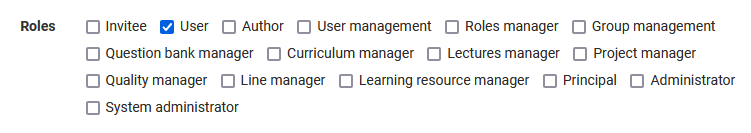
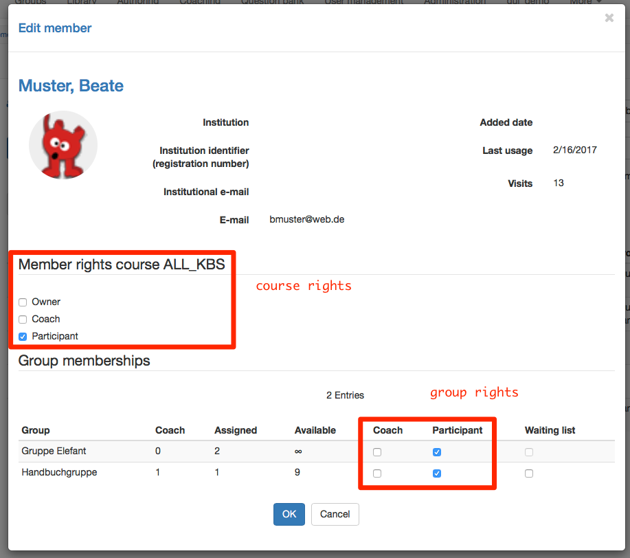
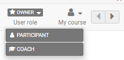
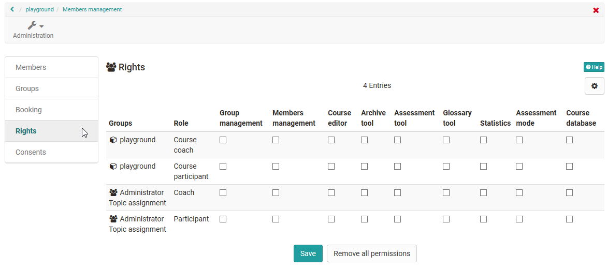

# Roles and Rights

## OpenOlat system wide roles and rights

### User types

OpenOlat works with a roles and rights management. First two user types are differentiated. These are:

* **Anonymous guest:** Guests have - without registration - limited access to OpenOlat. They can only have a look at learning content enabled for guests, but cannot take part in learning activities. The link to the guest access can be found on the login page. Further information about guest can be found [here](guest_access.md).
* **System user:**  Every user has a distinct username, which cannot be changed after the registration anymore. Users can use enabled learning content and can take part in learning activities. Additionally every users has an individual configurable landing page and [storage](../personal_menu/Personal_folders.md) available. Further more he can create [groups](../groups/index.md).

!!! info "Note"

    Normally registered users without any further roles or rights are learners.

### Roles

System users can get one ore more roles additionally.

Here is an overview of all OpenOlat roles.

* **Invitee**: Invited persons
* **User**: Standard role (see above)
* **Author**: The author has access to the authoring area. This allows the author to create courses and all other learning resources. In the search mask the author finds all courses and learning resources such as tests, films and portfolio templates which are accessible to authors. This role is often assigned to teachers or e-learning managers.
* **User manager**: The user manager has access to the [User management](../../manual_admin/usermanagement/index.md) and all users of the own organization. He or she can create, edit and inactivate users. Furthermore he or can assign the Author role.
* **Role manager**: The role administrator has access to the user administration and all users of his or her own organization. Apart from the roles Administrator and System Administrator, he/she can change, assign and remove all user roles.
* **Group manager**: The group manager has access to the group section and in there the tab [Group management](../groups/Group_Administration.md).
* **Question bank manager**: The question bank manager has access to the [Question bank](../area_modules/Question_Bank.md). In there he is able to open the administration section.
* **Curriculum manager**: The curriculum manager has access to [Curriculum Management](../area_modules/Curriculum_Management.md) and can create new curricula and manage existing ones. If the curriculum manager is assigned to an organization, he or she only has access to the curricula of this organization.
* **Lectures manager**: Configuration of the ["Lectures and absences"](../learningresources/Lectures_and_absences.md) module.
* **Project manager**
* **Quality manager**: The quality manager has access to the Quality Management area and can manage all settings and objects such as questionnaires, data collection generators and the analysis tool.
* **Line manager**: The line manager can be automatically informed about the receipt of certificates for all users of his organization.
* **Learning resource manager**: A learning resource manager automatically has owner rights (= full access) for all courses and learning resources belonging to the own organization (see [Administrative release](../learningresources/Access_configuration.md#administrative-release)). In the status "Finished" and "Deleted" the access is read-only. The courses and learning resources can be found in the authoring area and can be copied as well as exported.
* **Principal**: The principal sees all areas of the system except administration, but has read-only access and cannot make any changes, edit objects, etc.
* **Administrator**: The administrator has module and function management and has access to all areas of the system e.g. user management, catalog management, curriculum management, lectures management, except the administration page. This role can be limited to an organization. The administrator can delete users and also grant other people the right to manage the catalogue.
* **System administrator**: The system administrator has access to the administration side and is responsible for the technical system configuration and its monitoring. This is a global role that is not tied to an organization.

!!! warning "Note"

    The mentioned roles represent options to give normal users system-wide extensive additional rights. Usually an appropriate role composition is selected for an OpenOlat instance and not all specific roles are assigned.
    Typical is a combination of user, author and administrator or system administrator. Additional roles result from the structure of the respective institution and the use of certain tools such as [curriculum](../area_modules/Curriculum_Management.md) or [absences](../learningresources/Lectures_and_absences.md). It is therefore possible that not all potential OpenOlat roles are used in your instance.
    
    If you have any questions regarding the role management please contact the support of your own OpenOlat instance.

## Course rights and roles  

### Course roles

A person who creates a course automatically owns the course.

If a user is added to a course it can be defined which member rights the user
should get in this course.  

* **Owner**: The user has all rights in the course. He can edit a course, manage members and delete the course. Thus the owner is like the course administrator.
* **Coach**: The course coach has access to the [assessment tool](../learningresources/Assessment_tool_overview.md), as well as to the test and survey statistic. However a course coach cannot edit or delete a course. In the assessment tool a course coach can see the course participants, but not the group participants. More details of the course role Coach can be found [here](coach.md).
* **Participant**: A participant can open the course and edit everything he has access rights to (depending on configuration). A participant has no further rights.

{ class="shadow" }

In addition to the course-related roles, depending on the configuration,
[guests](guest_access.md) can also have access to a course without an OpenOlat account.

!!! success "Role change"
  
    It is also possible for people to be given multiple course roles and thus have different perspectives on the course. Once a person has been assigned several course-related roles, it is possible to change roles by changing the "User role" in the course toolbar.
    
    

### Group roles

If groups are used in courses, the members can be registered either as participants or as group coaches. 

* **Group coach** The group coach has basically the same rights as the course coach, but only for his group. In courses where his group is assigned to, he has access rights to the assessment tool as well as to the test and survey statistic. In the assessment tool he can only see the participants of his group.
* **Group members**: The group participant has the same rights as the course participant.

In the rights management of the course, further *rights packages* can be assigned to either group participants or group coaches.

!!! warning "Course/Group Roles"

    Course rights as well as group rights are independent of the role which a user has _system wide_ in the user management. A system user without an assigned role can be course owner, course coach or group coach. 

!!! danger "Access assessment tool"

    To avoid the access to the assessment tool for a given user, do not give any coach rights, neither in the course nor in the group!

!!! danger "Access member management"

    Users with the right "[Members management](../learningresources/Members_management.md)" can give more rights, remove them or reduce the rights of themselves as well as other members and the the creator or other owner of the course.
