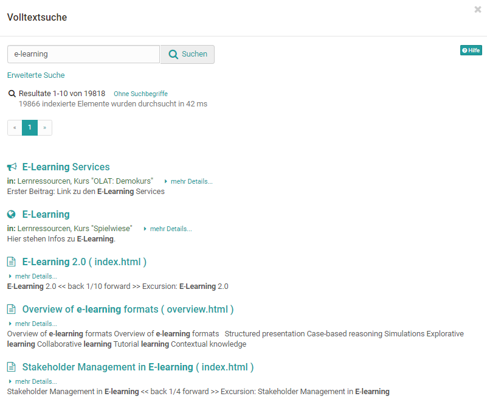
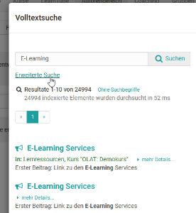
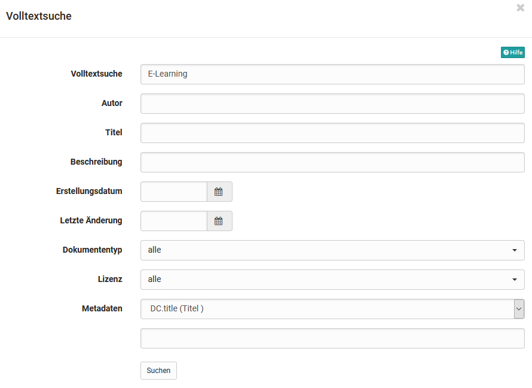
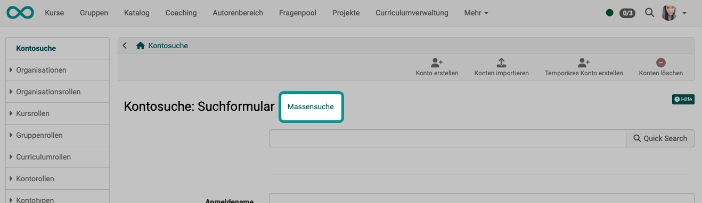
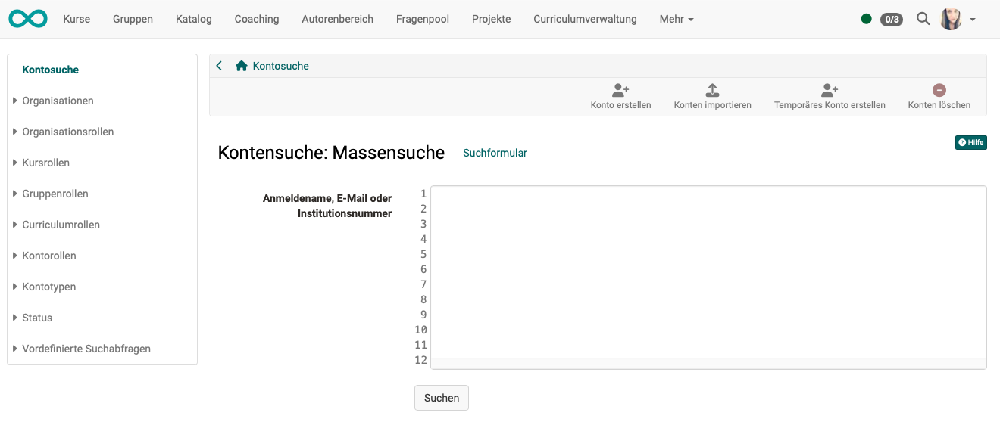
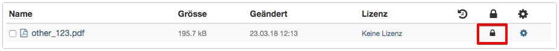

# :o_icon_o_icon_search: Allgemeines zur Suche {: #search_general}

Beim Suchen kommt es darauf an, von welchem **Ausgangspunkt** man sucht. Je nachdem wird

* nur in einem bestimmten Bereich gesucht
* nur nach bestimmten Objekttypen gesucht
* mit anderen Suchverfahren gesucht

:octicons-device-camera-video-24: **Video-Einführung**: [Suchfunktion](<https://www.youtube.com/embed/GlUCyVl11ic>){:target="_blank"}

[Globale Suche >](Search_Global.de.md)

[Lokale Suche >](Search_Local.de.md)

[Personensuche >](Search_Person.de.md)

[Suche in Kursen >](Search_in_Course.de.md)

[Suche im File Hub >](Search_in_FileHub.de.md)

---

## Volltextsuche [:octicons-tag-16:{ title="ab Release 20.1 (OO-8767)" }](https://track.frentix.com/issue/OO-8767) {: #full_text_search}

Die Volltextsuche wird für die globale Suche verwendet. Mit ihr suchen Sie in den **Inhalten** von Kursen, Gruppen und Lernressourcen nach Ihren Suchbegriffen, beispielsweise in Forumsbeiträgen, Wiki-Seiten und in Dateien aus Ordnern. Als Dateiformate werden PDF, HTML, TXT, Word, PowerPoint und Excel erfasst. Personendaten wie Profile oder Visitenkarten werden nicht indexiert.

{ class="shadow lightbox" }

!!! info "Wichtig"

    Sie finden über die Volltextsuche immer nur diejenigen Kursinhalte, auf die Sie eine Zugriffsberechtigung haben.

[zum Seitenanfang ^](#search_general)

---

## Erweiterte Suche {: #advanced_search}

Um die Suche zu verfeinern, benutzen Sie die erweiterte Suche.

{ class="shadow lightbox" }

{ class="shadow lightbox" }

Im Modus _Erweiterte Suche_ können Sie Ihre Sucheingabe verfeinern. Zur Verfügung stehen die Felder Volltextsuche, Autor:in, Titel, Beschreibung, Erstellungsdatum, Letzte Änderung, Dokumententyp, Lizenz und Metadaten. Beachten Sie, dass die verschiedenen Suchfelder mit dem booleschen AND-Operator verknüpft werden. D.h. wenn Sie zum Beispiel die Felder _Titel_ und _Autor:in_ ausfüllen, werden nur Dokumente gefunden, bei denen die Begriffe in den jeweiligen Feldern gleichzeitig vorkommen.

Ausnahme: Das Feld Volltextsuche sucht über alle Felder.

Aus der Ergebnisliste können Sie direkt auf den Lerninhalt mit dem gefundenen Suchbegriff springen.

[zum Seitenanfang ^](#search_general)

---

## Massensuche {: #bulk_search}

In manchen Suchformularen besteht die Möglichkeit, auf eine Massensuche umzuschalten. Es erscheint dann statt des Suchformulars mit einzelnen Eingabefeldern ein einzelnes grosses Feld, in das Sie z.B. mehrere E-Mail-Adressen kopieren können, die Sie aus einem Office-Dokument in die Zwischenablage übernommen haben.

{ class="shadow lightbox" }

{ class="shadow lightbox" }

[zum Seitenanfang ^](#search_general)

---

## Suchsyntax {: #syntax}

Sie können Ihre Suchanfrage mit folgender Syntax modifizieren.

**Einzelne Begriffe**, z.B. _OpenOlat_

**Mehrere Begriffe** im Suchfeld sind immer mit dem ODER-Operator verknüpft

**Suche mittels Wildcards (Platzhalter):** Um nach bestimmten Wortfragmenten zu suchen, können Wildcards verwendet werden.

  * Das Fragezeichen in einem Suchbegriff steht für einen beliebigen, einzelnen Buchstaben. Z.B. Mit der Sucheingabe _te?t_ finden Sie alle Dokumente, die die Wörter "test", "text" usw. enthalten.
  * Der Stern in einem Suchbegriff steht für eine beliebige Anzahl von beliebigen Buchstaben. Z.B. Mit der Sucheingabe _Test*_ finden Sie alle Dokumente, die Wörter enthalten, die mit "Test" beginnen. Der Stern kann auch innerhalb eines Suchbegriffes stehen: _Te*t_

**Erweiterte Suche:** Im Modus _Erweiterte Suche_ werden die verschiedenen Suchfelder mit dem AND-Operator verknüpft.

[zum Seitenanfang ^](#search_general)

---

## Metadaten {: #metadata}

Metadaten oder _Metainformationen_ sind Daten, die Informationen über Merkmale anderer Daten enthalten, aber nicht diese Daten selbst. Metadaten, also Daten **über** Daten, beschreiben eine Datei mit ergänzenden Informationen wie zum Beispiel einem Titel, dem Urheber oder den Herausgeber. Sie sind dazu da, dass besser erkennbar wird, um was für ein Dokument es sich handelt. Dies ist besonders sinnvoll, wenn der Titel eines Dokumentes nicht in den Dateinamen geschrieben werden kann, weil dieser viel zu lange ist oder spezielle Zeichen enthält.

Jede Datei aber auch komplette Lernressourcen können mit Metadaten versehen werden. Die Metadaten sind optional und müssen nicht ausgefüllt werden. Sie orientieren sich am [Dublin Core Simple Standard](https://de.wikipedia.org/wiki/Dublin_Core). Einige Metadaten können nicht verändert werden. Es sind dies der Name der Person, die das Dokument hochgeladen hat, die Grösse des Dokuments, der Zeitpunkt, zu dem das Dokument hochgeladen wurde, und der Dateityp. Informationen wie z.B. den ursprünglichen Verfasser, den Titel, eine Beschreibung, die Quelle oder die Sprache können Sie manuell eingeben.

Die Metadaten werden von der Volltextsuche indexiert. Dies bedeutet, dass man in der Suche nach den verschlagworteten Metadaten suchen kann und so die relevanten Dokumente besser auffindet.

**Datei sperren:** In den Metadaten können Sie eine Datei als gesperrt markieren. Gesperrte Dateien sind mit einem Schloss versehen und können von anderen Benutzer:innen nicht mehr überschrieben, gelöscht oder verschoben werden. Diese Option ist für Ordner nicht vorhanden.

{ class="shadow lightbox" }

Mit Hilfe des verfügbaren externen Links können Sie auch ausserhalb von OpenOlat direkt auf eine bestimmte Datei verlinken.

[zum Seitenanfang ^](#search_general)

---

## Weiterführende Informationen {: #further_information}

[Globale Suche >](Search_Global.de.md) 
[Lokale Suche >](Search_Local.de.md) 
[Personensuche >](Search_Person.de.md) 
[Suche in einem Kurs >](Search_in_Course.de.md) 
[Suche im File Hub >](Search_in_FileHub.de.md) 
[Dublin Core (Wikipedia) >](https://de.wikipedia.org/wiki/Dublin_Core)

**youtube** 
[Suchfunktion](<https://www.youtube.com/embed/GlUCyVl11ic>)

[Zum Seitenanfang ^](#search_general)
