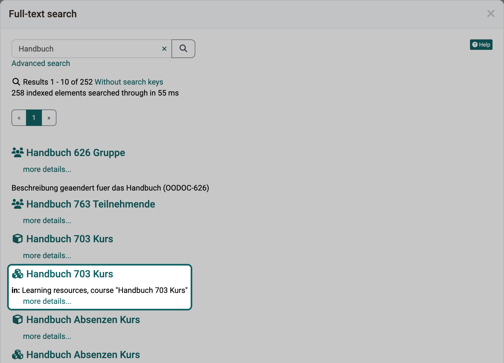
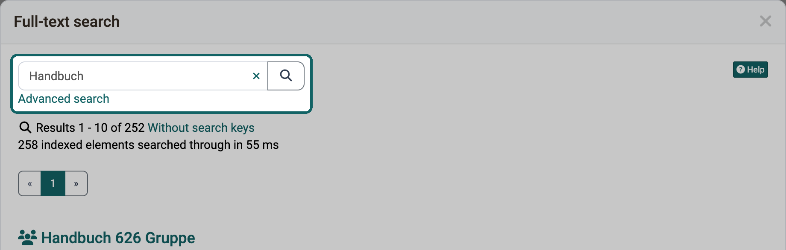
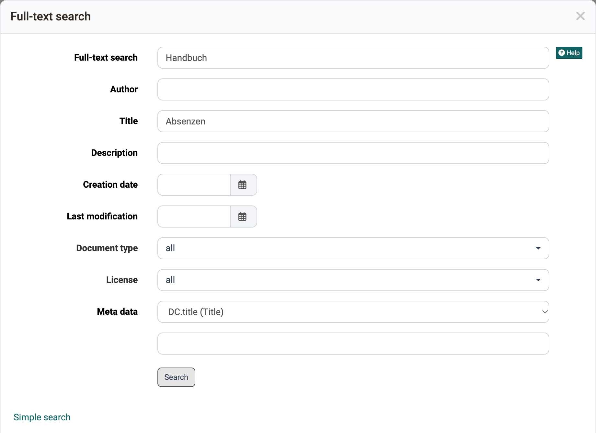
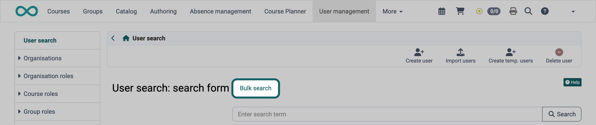
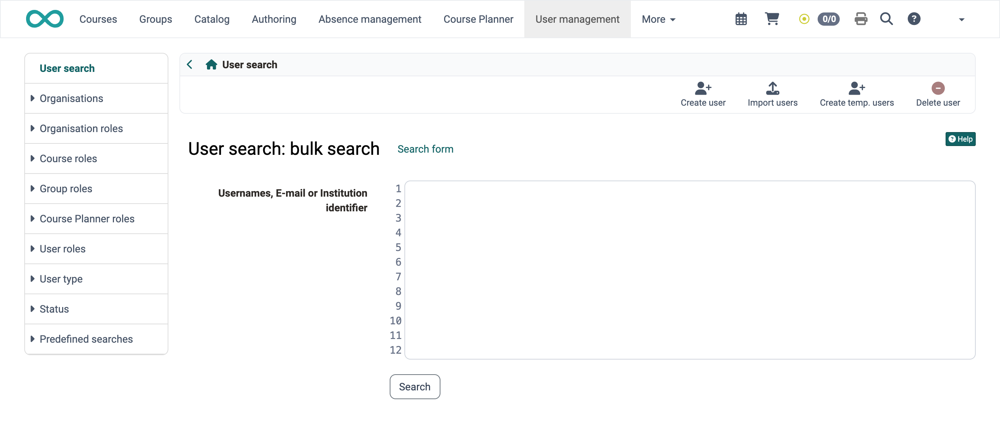
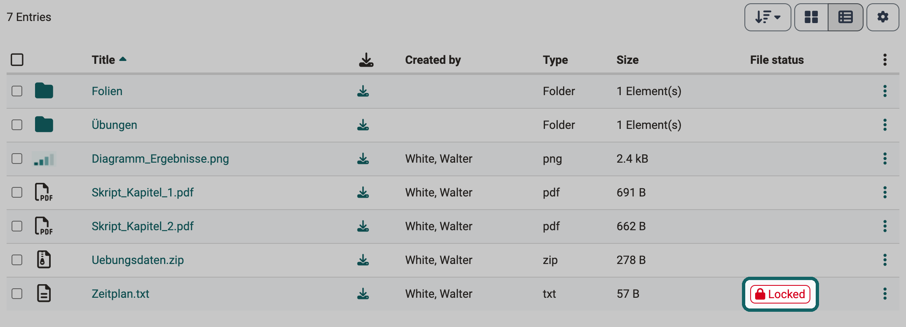
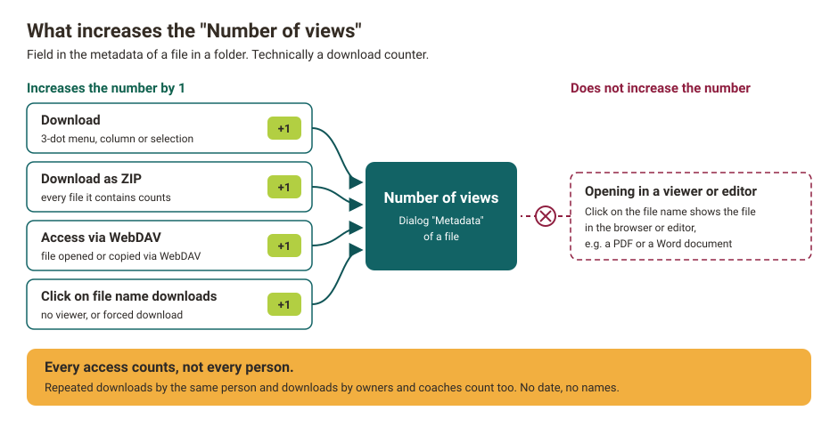

# :o_icon_o_icon_search: General information on the search {: #search_general}

What a search finds depends on where you start it. Depending on the starting point

* OpenOlat only searches a specific area
* OpenOlat only searches for specific object types
* the search uses a different search method

:octicons-device-camera-video-24: **Video introduction (German)**: [Suchfunktion](<https://www.youtube.com/embed/GlUCyVl11ic>){:target="_blank"}

[Global search >](Search_Global.md)

[Local search >](Search_Local.md)

[Search other users >](Search_Person.md)

[Search in a course >](Search_in_Course.md)

[Search in the File Hub >](Search_in_FileHub.md)

---

## Full-text search [:octicons-tag-16:{ title="from Release 20.1 (OO-8767)" }](https://track.frentix.com/issue/OO-8767) {: #full_text_search}

With the full-text search, you find a term anywhere in OpenOlat, including the text of documents. It searches the content of courses, groups and learning resources, for example forum posts, wiki pages and files from folders. The global search works with the full-text search: click the magnifying glass icon at the top right of the main navigation, enter a search term and confirm with the Enter key. The hits appear in the dialog "Full-text search". The full-text search covers the file formats PDF, HTML, TXT, Word, PowerPoint and Excel. It does not index personal data such as profiles or visiting cards.

The magnifying glass icon appears when the search is switched on for your OpenOlat instance, see [Global search](Search_Global.md#activation).

If a hit lies in a course, the line "in:" below its title names the course as the location. With "more details..." below a hit, you expand further information, such as author, last modification, type and description. Above the result list, the link "Without search keys" hides the text excerpts with the highlighted search terms, and the link "With search keys" shows them again.

{ class="shadow lightbox" title="Dialog Full-text search · 2026.11.06" }

!!! info "Important"

    Using the full-text search, you will only ever find the course content to which you have access.

To search only within one course, use the course search in the toolbar of the course, see [Search in a course](Search_in_Course.md).

[To the top of the page ^](#search_general)

---

## Advanced search {: #advanced_search}

If the full-text search returns too many hits, refine it with the advanced search. You open it in the dialog "Full-text search" with the link "Advanced search" below the search field.

{ class="shadow lightbox" title="Dialog Full-text search · 2026.11.06" }

{ class="shadow lightbox" title="Advanced search in the dialog Full-text search · 2026.11.06" }

The advanced search offers the fields "Full-text search", "Author", "Title", "Description", "Creation date", "Last modification", "Document type", "License" and "Meta data". The field "License" appears when licenses are switched on for your OpenOlat instance. In the field "Document type", you select one or more types, for example "PDF file" or "Forum". If it shows "all", the advanced search covers all types.

The search fields are linked with the Boolean AND operator. If you fill in the fields "Title" and "Author", for example, the search only finds documents that contain both terms in the respective field.

Exception: The field "Full-text search" searches across all fields.

From the result list, you can jump directly to the learning content with the search term found.

With the link "Simple search" below the form, you switch back to the single search field.

[To the top of the page ^](#search_general)

---

## Bulk search [:octicons-tag-16:{ title="from Release 15.4 (OO-5233)" }](https://track.frentix.com/issue/OO-5233) {: #bulk_search}

If you are looking for many people at once, for example with a list of e-mail addresses from an Office document, switch to the bulk search. Some search forms offer the link "Bulk search" for this. Instead of the search form with individual input fields, a single large field then appears. Paste the values from the clipboard there, one per line, and click "Search". The link "Search form" takes you back.

{ class="shadow lightbox" title="Account search in the user management · 2026.10.22" }

{ class="shadow lightbox" title="Bulk search in the user management · 2026.10.22" }

[To the top of the page ^](#search_general)

---

## Reset search [:octicons-tag-16:{ title="from Release 21.1 (OO-9627)" }](https://track.frentix.com/issue/OO-9627) {: #search_reset}

You remove a search term with one click, without clearing the field by hand. As soon as the search field contains something, a round button with a cross and the tooltip "Reset search" appears on the right in the field. A click on it clears the field.

What happens next depends on where the search field is:

* **In tables**, the table immediately shows the entries again without the restriction by the search term.
* **In the large search field on the entry pages of Coaching and Course Planner**, the click only clears the field. A new search only starts when you click "Search" again or press the Enter key.
* **In the large search field of the Catalog**, the click also only clears the field as long as no search has run yet. If search results are already shown below it, the Catalog immediately shows the offers again without the restriction by the search term.

[To the top of the page ^](#search_general)

---

## Search syntax {: #syntax}

With the following syntax, you narrow down your search query.

**Individual terms**, e.g. _OpenOlat_

**Multiple terms** in the search field are always linked with the OR operator.

**Search using wildcards:** To search for specific word fragments, use wildcards.

  * The question mark in a search term stands for any single letter. For example, by entering _te?t_ you will find all documents containing the words "test", "text" etc.
  * The asterisk in a search term stands for any number of letters. For example, if you enter the search term _Test*_, you will find all documents containing words beginning with "Test". The asterisk can also appear within a search term: _Te*t_

**Advanced search:** In the advanced search, the various search fields are linked with the AND operator.

[To the top of the page ^](#search_general)

---

## Metadata {: #metadata}

Metadata helps you recognize a document and find it in the search. Metadata or _meta information_ is data that contains information about the characteristics of other data, but not the data itself. It describes a file with additional information such as a title, the author or the publisher. This makes it easier to recognize what kind of document it is. This is particularly useful if the title of a document does not fit into the file name because it is too long or contains special characters.

You can add metadata to each file and also to complete learning resources. The metadata is optional and does not have to be filled in. It is based on the [Dublin Core Simple Standard](https://en.wikipedia.org/wiki/Dublin_Core). Some metadata cannot be changed: the name of the person who uploaded the document, the size of the document, the time at which the document was uploaded and the file type. You can enter information such as the original author, the title, a description, the source or the language manually.

The full-text search indexes the metadata. You therefore also find documents via the terms in their metadata.

**Lock file:** In the metadata of a file, select the option "Locked" in the field "Locked" so that other users can neither overwrite, delete nor move the file. Locked files show the label "Locked" with a lock in the column "File status" of the file list. This option does not exist for folders.

{ class="shadow lightbox" title="File list of a folder · 2026.11.03" }

The field "External link to this resource" in the metadata shows a link with which you can also link directly to the file from outside OpenOlat.

**Number of views:** The field "Number of views" shows how often a file was downloaded from a folder. Despite its name, OpenOlat counts downloads, not the display in the browser. The number goes up by 1 when someone saves the file with "Download", downloads it in a ZIP file together with other files, opens it via WebDAV, or clicks the file name and the file is downloaded. If the file opens in the browser or in an editor on click instead, for example a PDF or a Word document, the number stays the same.

OpenOlat counts every access, not every person: if the same person downloads a file three times, the number goes up by three, and downloads by owners and coaches count too. The field does not show when or by whom a file was downloaded. Read the number as a rough indication, not as a usage evaluation. Everyone who can open the metadata of a file sees the field, including participants, who get a read-only view of the metadata. How often participants opened a course element is shown in the [course statistics](../learningresources/Statistics_Course.md).

{ class="shadow lightbox" title="What increases the number of views · 2026.11.03" }

!!! info "Important"

    Whether a click on the file name downloads the file depends on the file format and on the configuration of the instance. HTML files, for example, are downloaded when the security function ["Force file download in folders"](../../manual_admin/administration/Login_Security.md#files) is switched on.

[To the top of the page ^](#search_general)

---

## Further information {: #further_information}

**Mentioned on this page** 
[Global search >](Search_Global.md) 
[Local search >](Search_Local.md) 
[Search other users >](Search_Person.md) 
[Search in a course >](Search_in_Course.md) 
[Search in the File Hub >](Search_in_FileHub.md) 
[Dublin Core (Wikipedia) >](https://en.wikipedia.org/wiki/Dublin_Core) 
[Course statistics >](../learningresources/Statistics_Course.md) 
[Security >](../../manual_admin/administration/Login_Security.md)

**Further reading** 
[Account search >](../../manual_admin/usermanagement/Search_Users.md) 
[Coaching - User search >](../area_modules/Coaching_User_Search.md) 
[Catalog 2.0: Overview >](../area_modules/catalog2.0/index.md) 
[Course Planner: Overview >](../area_modules/Course_Planner/index.md)

**youtube** 
[Suchfunktion](<https://www.youtube.com/embed/GlUCyVl11ic>)

[To the top of the page ^](#search_general)
