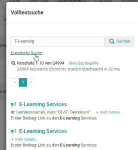
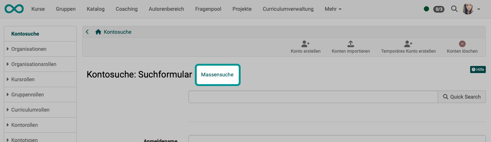
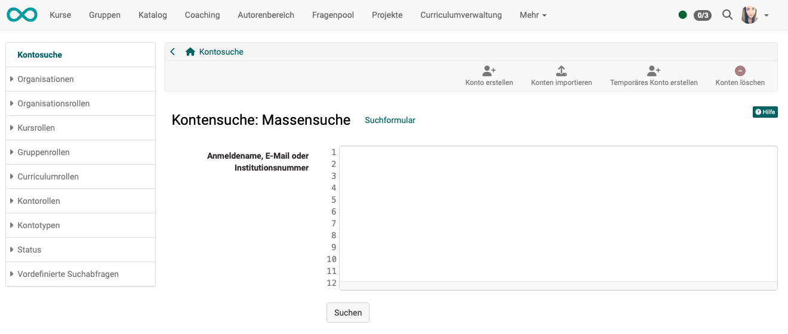

# General information on the search {: #search_general}

When searching, it depends on which **starting point** you are searching from. Depending on this

* it will only be searched in a specific area
* it will only be searched for a specifix object type
* it will be searched via means of another search procedure

[Global search >](Search_Global.md)

[Local search >](Search_Local.md)

[Person search >](Search_Person.md)

[Search in courses >](Search_in_Course.md)

[Search in file hub >](Search_in_FileHub.md)

---

## Full text search {: #full_text_search}

The full-text search is used for the global search. You can use it to search for the search terms in various course and group **content**, for example in forum posts, PDF and Word files.
You can also search for users, portfolio folders and artifacts, as well as for documents in the [Personal folders](../personal_menu/Personal_folders.md). An exception is the private folder, which is not indexed.

!!! info "Hint"

    Using the full-text search, you will only ever find the course content to which you have access authorization.

[To the top of the page ^](#search_general)

---

## Advanced search {: #advanced_search}

To refine your search, use the advanced search.

In _Advanced search_ mode, you can refine your search entry. Please note that the various search fields are linked with the Boolean AND operator. This means that if you fill in the fields _Title_ and _Author_, for example, only documents in which the terms in the respective fields occur simultaneously will be found.

Exception: The Full text search field searches across all fields.

From the results list, you can jump directly to the learning content with the search term found.

[To the top of the page ^](#search_general)

---

## Bulk search {: #bulk_search}

In some search forms it is possible to switch to a bulk search. Instead of the search form with individual input fields, a single large field will appear into which you can copy several e-mail addresses that you have copied from an Office document to the clipboard, for example.

{ class="shadow lightbox"}

{ class="shadow lightbox"}

[To the top of the page ^](#search_general)

---

## Search sytax {: #syntax}

You can modify your search query with the following syntax.

**Individual terms**, e.g. _OpenOlat_

**Multiple terms** in the search field are always linked with the OR operator

**Search using wildcards:** Wildcards can be used to search for specific word fragments.

* The question mark in a search term stands for any single letter. For example, by entering _te?t_ you will find all documents containing the words "test", "text" etc.
* The asterisk in a search term stands for any number of letters. For example, if you enter the search term _test*_, you will find all documents containing words beginning with "test". The asterisk can also appear within a search term: _Te*t_

**Advanced search:** In advanced search mode, the various search fields are linked with the AND operator.

[To the top of the page ^](#search_general)

---

Metadata or _meta information_ is data that contains information about the characteristics of other data, but not the data itself. Metadata, i.e. data **about** data, describes a file with additional information such as a title, the author or the publisher. They are there to make it easier to recognize what kind of document it is. This is particularly useful if the title of a document cannot be written in the file name because it is far too long or contains special characters.

Metadata can be added to each file as well as complete learning resources. The metadata is optional and does not have to be filled in. They are based on the [Dublin Core Simple Standard](https://wikipedia.org/wiki/Dublin_Core). Some metadata cannot be changed. These are the name of the person who uploaded the document, the size of the document, the time at which the document was uploaded and the file type. You can enter information such as the original author, the title, a description, the source or the language manually.

The metadata is indexed by the full-text search. This means that you can search for the indexed metadata in the search and thus find the relevant documents more easily.

**Lock file:** You can mark a file as locked in the metadata. Locked files are provided with a lock and can no longer be overwritten, deleted or moved by other users. This option is not available for folders.

With the help of the available external link, you can also link directly to a specific file outside of OpenOlat.

[To the top of the page ^](#search_general)
