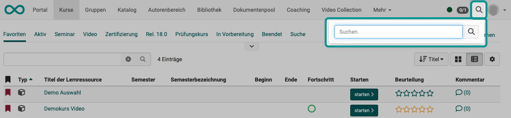

# Globale Suche {: #search_global}

Die globale Suche finden Sie oben rechts in der Kopfzeile. Klicken Sie auf das Lupen-Symbol.

Wenn Sie hier einen Suchbegriff eingeben und mit der Eingabetaste oder Klick auf die Lupe daneben bestätigen, findet eine **Suche über Alles** statt.

Das heisst, dass **im ganzen OpenOlat** gesucht wird und auch innerhalb der Dokumente. Es ist eine [Volltextsuche](Search_General.de.md#full_text_search).

{ class="shadow lightbox"}

## Suchergebnisse {: #search_results}

In den Suchergebnissen der globalen Suche erscheinen:

* Daten, die in Visitenkarten von Benutzer:innen freigegeben sind
* Daten / Dokumente aus “öffentlichen Ordnern” von Benutzer:innen
* Daten / Dokumente aus Kursen, in denen man selbst Mitglied ist und auf die man als Kursmitglied auch Zugriff hat
* Daten / Dokumente aus Kursen, die unter Einstellungen > Freigabe wie folgt konfiguriert sind: "Ohne Buchung" oder "Frei verfügbar"

## Aktivierung {: #activation}

Die globale Suche ist nur dann sichtbar und nutzbar, wenn sie in der Administration
aktiviert ist. Sollte dies bei Ihnen nicht der Fall sein, wenden Sie sich
bitte an den oder die Administrator:in Ihrer OpenOlat Instanz.

## Weitere Informationen

[Allgemeines zur Suche >](Search_General.de.md) 
[Lokale Suche >](Search_Local.de.md) 
[Personensuche >](Search_Person.de.md) 
[Suche in einem Kurs >](Search_in_Course.de.md) 
[Suche im File Hub >](Search_in_FileHub.de.md) 
