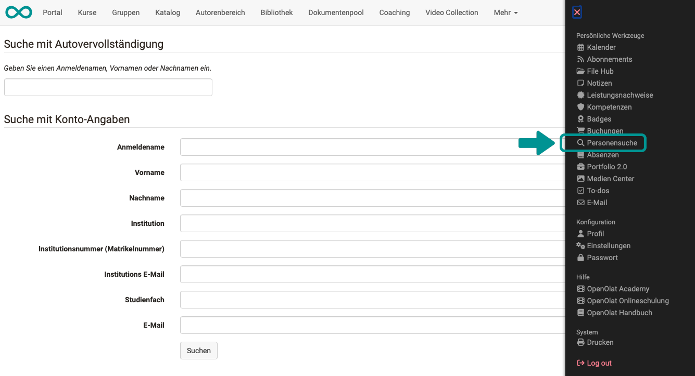
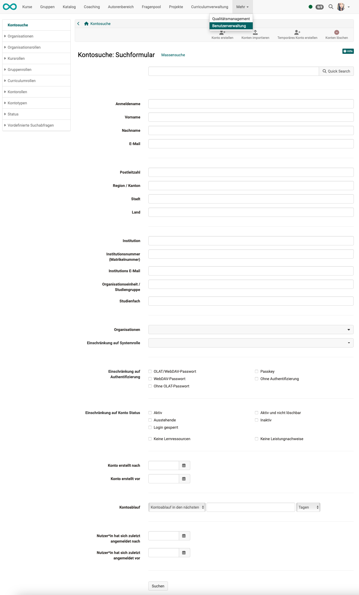

# Personensuche {: #search_person}

## Personensuche im persönlichen Menü {: #personal_menu}

Suchen Sie eine bestimmte Person (aus dem Personenkreis der auf Ihrer OpenOlat-Instanz registrierten Benutzer), dann verwenden Sie dazu am besten die [Personensuche im persönlichen Menü](../basic_concepts/Search_Person.de.md).

Das Suchformular enthält die entsprechenden Felder, mit denen die Suche eingegrenzt werden kann.

{ class="shadow lightbox"}

!!! tip "Hinweis"

    Es muss mindestens ein Begriff zur Eingrenzung eingegeben werden. 
    Ausserdem muss der Suchbegriff eine gewisse Mindestlänge haben.

[zum Seitenanfang ^](#search_person)

---

## Personensuche in der Benutzerverwaltung {: #user_management}

Ist es Ihre Aufgabe, die Benutzer der OpenOlat-Instanz zu verwalten, benötigen Sie die Rolle der **Benutzerverwalter:in**. Damit erhalten Sie Zugang zur Benutzerverwaltung und können die Daten aller Benutzer:innen einsehen und bearbeiten.

Zur effizienten Suche einer bestimmten Benutzer:in gibt es eine Kontosuche, in der Sie Personen sehr spezifisch nach bestimmten Kriterien suchen können.

Auch eine [Massensuche](Search_General.de.md#bulk_search) steht zur Verfügung.

{ class="shadow lightbox"}

[zum Seitenanfang ^](#search_person)

---

## Personensuche im Coaching Tool {: #coachingtool}

Das Coaching Tool dient der kursübergreifenden Betreuung von Teilnehmer:innen. Bei vielen Kursen und Teilnehmer:innen hilft eine [Personensuche](../area_modules/coaching_personensuche.de.md), die nur innerhalb des von Ihnen betreuten Personenkreises sucht.

{ class="shadow lightbox"}

[zum Seitenanfang ^](#search_person)

---

## Weitere Informationen

[Allgemeines zur Suche >](Search_General.de.md) 
[Globale Suche >](Search_Global.de.md) 
[Lokale Suche >](Search_Local.de.md) 
[Suche im Kurs >](Search_in_Course.de.md) 
[Suche im File Hub >](Search_in_FileHub.de.md) 

[zum Seitenanfang ^](#search_person)
