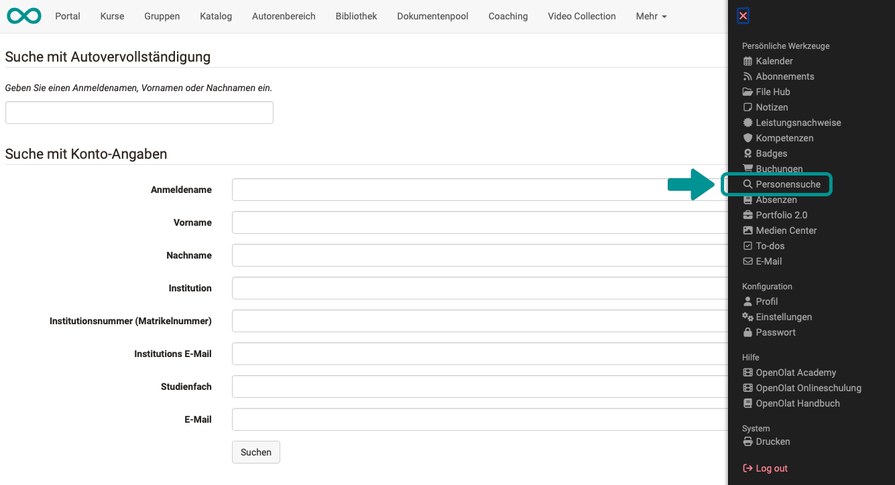
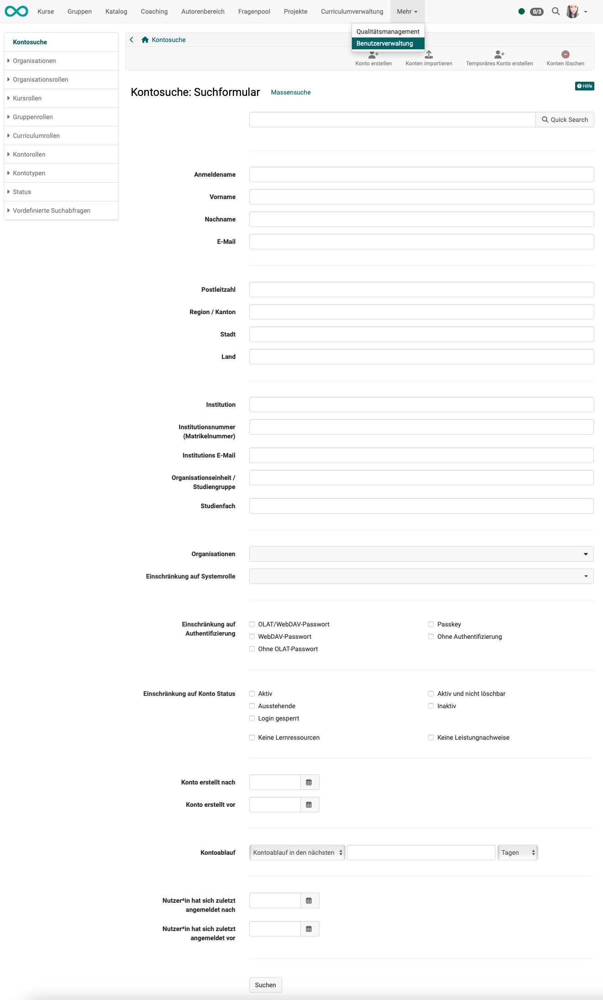
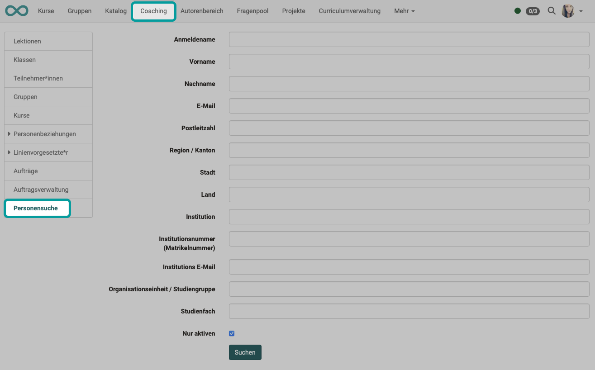
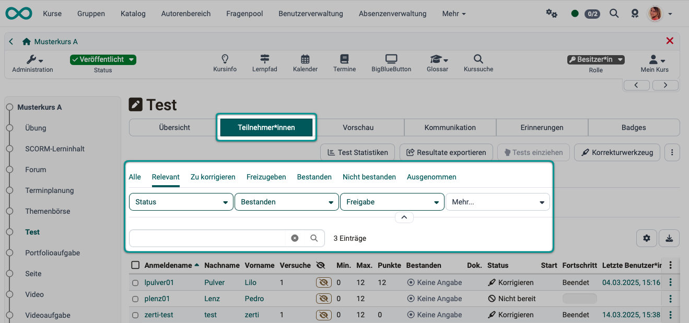

# Personensuche {: #search_person}

## Personensuche im persönlichen Menü {: #personal_menu}

Suchen Sie eine bestimmte Person (aus dem Personenkreis der auf Ihrer OpenOlat-Instanz registrierten Benutzer), dann verwenden Sie dazu am besten die Personensuche im persönlichen Menü.

Das Suchformular enthält die entsprechenden Felder, mit denen die Suche eingegrenzt werden kann.

{ class="shadow lightbox"}

!!! tip "Hinweis"

    Es muss mindestens ein Begriff zur Eingrenzung eingegeben werden. 
    Ausserdem muss der Suchbegriff eine gewisse Mindestlänge haben.

[zum Seitenanfang ^](#search_person)

---

## Personensuche in der Benutzerverwaltung {: #user_management}

Ist es Ihre Aufgabe, die Benutzer:innen der OpenOlat-Instanz zu verwalten, benötigen Sie die Rolle der **Benutzerverwalter:in**. Damit erhalten Sie Zugang zur Benutzerverwaltung und können die Daten aller Benutzer:innen einsehen und bearbeiten.

Zur effizienten Suche einer bestimmten Benutzer:in gibt es eine Kontosuche, in der Sie Personen sehr spezifisch nach bestimmten Kriterien suchen können.

Auch eine [Massensuche](Search_General.de.md#bulk_search) steht zur Verfügung.

{ class="shadow lightbox"}

[zum Seitenanfang ^](#search_person)

---

## Personensuche im Coaching Tool {: #coachingtool}

Das [Coaching Tool](../area_modules/Coaching.de.md) dient der kursübergreifenden Betreuung von Teilnehmer:innen. Bei vielen Kursen und Teilnehmer:innen hilft eine [Personensuche](../area_modules/Coaching_User_Search.de.md), die nur innerhalb des von Ihnen betreuten Personenkreises sucht.

{ class="shadow lightbox"}

[zum Seitenanfang ^](#search_person)

---

## Personensuche im Kurs {: #course}

Als **Betreuer:in** erhalten Sie bei Klick auf bewertbare Kursbausteine zunächst nicht direkt den Inhalt des Kursbausteins angezeigt, sondern Tabs, die mit Ihren Aufgaben als Betreuer:in zu tun haben. So können Sie im **Tab Teilnehmer:innen** eine bestimmte Person auswählen und deren Bearbeitungsstand und Ergebnisse in diesem Kursbausteins verfolgen. 
Es stehen Ihnen Filterfunktionen mit verschiedener Vorauswahl zur Verfügung. Auch eine Eingabe eines bestimmten Namens ins Suchfeld ist möglich.

**Beispiel:** 
Kursmitglieder, die auf den gewählten Kursbaustein keinen Zugriff haben (weil sie ausgenommen sind), finden Sie in einer separaten Vorauswahl "Ausgenommen", aber nicht unter "Relevant".

{ class="shadow lightbox"}

[zum Seitenanfang ^](#search_person)

---

## Weitere Informationen {: #further_information}

[Allgemeines zur Suche >](Search_General.de.md) 
[Globale Suche >](Search_Global.de.md) 
[Lokale Suche >](Search_Local.de.md) 
[Suche im Kurs >](Search_in_Course.de.md) 
[Suche im File Hub >](Search_in_FileHub.de.md) 

[zum Seitenanfang ^](#search_person)
