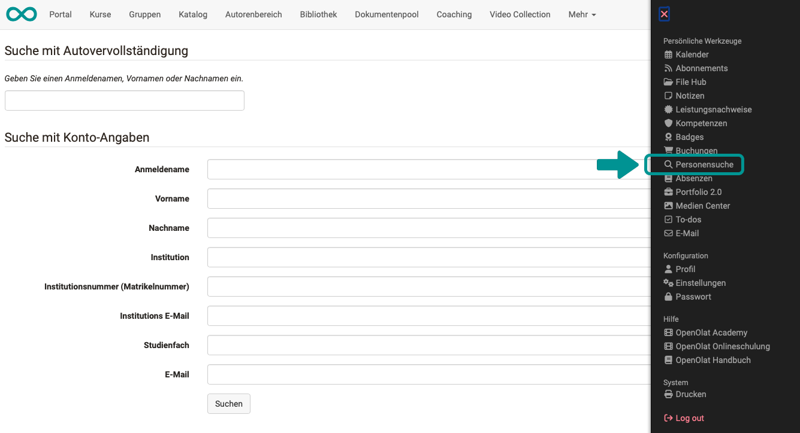
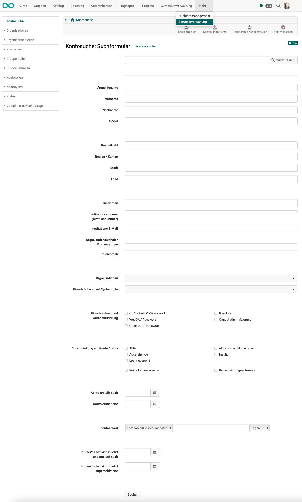
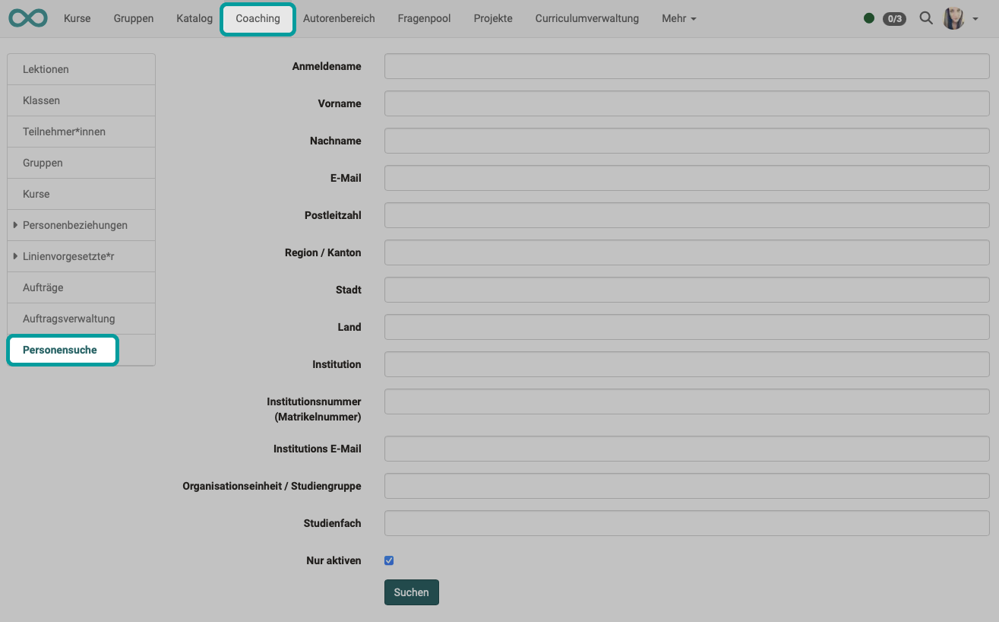
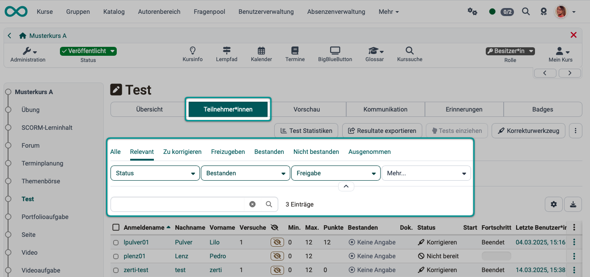

# Search other Users {: #search_person}

## Search for people in the personal menu {: #personal_menu}

If you are looking for a specific person from the group of users registered on your OpenOlat instance, the best way to do this is the entry "Other users" in the personal menu.

The search form has two sections: "Search combined with auto-completion" with a single field for username, first name or last name, and "Search along with user attributes" with individual fields to narrow down the search. Enter at least one search term with at least four characters.

{ class="shadow lightbox"}

[To the top of the page ^](#search_person)

---

## Search for people in user management {: #user_management}

If your job involves managing the users of the OpenOlat instance, you need the **User manager** role. This role grants you access to user management and allows you to view and edit the data of all users.

To efficiently find a specific user, there is a user search that allows you to search for people based on very specific criteria.

A [bulk search](Search_General.md#bulk_search) is also available.

{ class="shadow lightbox"}

[To the top of the page ^](#search_person)

---

## Search for people in Coaching {: #coachingtool}

[Coaching](../area_modules/Coaching.md) is designed to support participants across courses. When dealing with many courses and participants, a [user search](../area_modules/Coaching_User_Search.md) that searches only within the group of people you are responsible for is helpful.

{ class="shadow lightbox"}

[To the top of the page ^](#search_person)

---

## Search for people in a course {: #course}

As a **coach**, when you click on an assessable course element, you do not immediately see the content of the course element; instead, you see tabs related to your duties as a coach. In the **Participants tab**, you can select a specific person and track their progress and results in this course element. 
Various filter options with different preselections are available to you. You can also enter a specific name in the search field.

**Example:** 
Course members who do not have access to the selected course element (because they have been excluded) appear in a separate preselection "Excluded", but not under "Relevant".

{ class="shadow lightbox"}

[To the top of the page ^](#search_person)

---

## Further information {: #further_information}

[General information on the search >](Search_General.md) 
[Coaching - Overview >](../area_modules/Coaching.md) 
[Coaching - User search >](../area_modules/Coaching_User_Search.md) 
[Global search >](Search_Global.md) 
[Local search >](Search_Local.md) 
[Search in a course >](Search_in_Course.md) 
[Search in the File Hub >](Search_in_FileHub.md)

[To the top of the page ^](#search_person)
