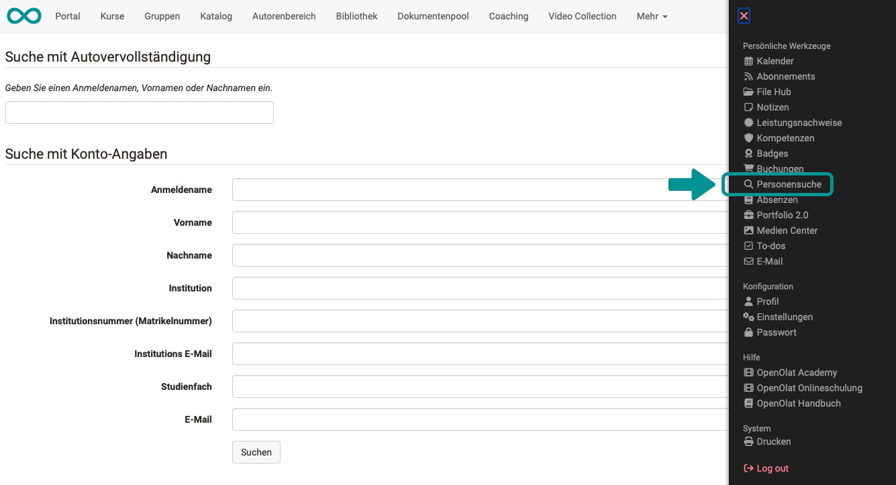
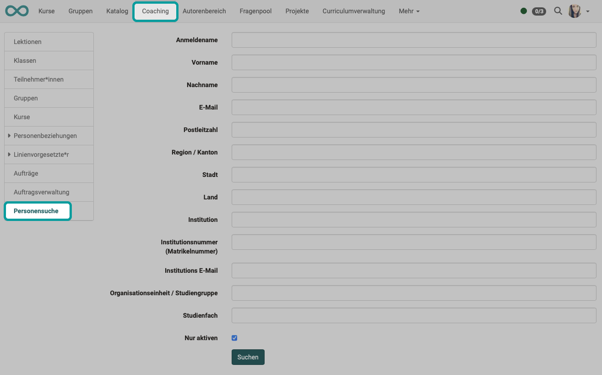

# Search other Users {: #search_person}

## People search in the personal menu

If you are looking for a specific person (from the group of users registered on your OpenOlat instance), the best way to do this is to use the [Person search in the personal menu](../../personal_menu/Other_users.md).

The search form contains the corresponding fields with which the search can be narrowed down.

{ class="shadow lightbox"}

!!! tip "Hint"

    At least one term must be entered to narrow it down. 
    In addition, the search term must have a certain minimum length.

[To the top of the page ^](#search_person)

---

## People search in the coaching tool {: #coachingtool}

The coaching tool is used for cross-course support of participants. For many courses and participants, a [person search](../../area_modules/coaching_personensuche.md), which only searches within the group of people you support, helps.

{ class="shadow lightbox"}

[To the top of the page ^](#search_person)

[General things about the search >](Search_General.md) 
[Local search >](Search_Local.md) 
[Personal search >](Search_Person.md) 
[Search in a course >](Search_in_Course.md) 
[Search in FileHub >](Search_in_FileHub.md) 