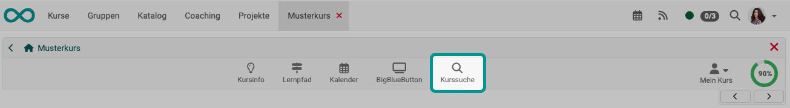

# Search in a course {: #search_in_course}

In addition to the full-text search across the entire OpenOlat, there is also a course search, which can be activated for each course in the toolbar.

{ class="shadow lightbox" }

The course search only searches the corresponding course. The following elements are found:

* Title, short title and description of all course elements
* Content of HTML pages
* Documents in folders
* Title and content of forum posts
* Title and content of messages
* Wiki contributions

## Activation {: #activation}

The display of the course search is activated under "Administration" -> "Settings" in the "[Toolbar](../learningresources/Course_Settings.md#toolbar)" tab. 

## Further information

[General things about the search >](Search_General.md) 
[Local search >](Search_Local.md) 
[Personal search >](Search_Person.md) 
[Search in a course >](Search_in_Course.md) 
[Search in FileHub >](Search_in_FileHub.md) 

