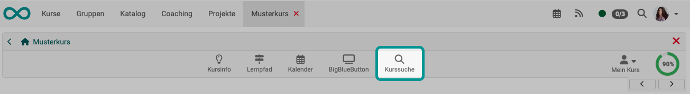

# Search in a course {: #search_in_course}

In addition to the [full-text search](Search_General.md#full_text_search) across the entire OpenOlat, there is also a course search, which can be activated for each course in the toolbar.

{ class="shadow lightbox" }

The course search only searches the corresponding course. The following elements are found:

* Title, short title and description of all course elements
* Content of HTML pages
* Documents in folders
* Title and content of forum posts
* Title and content of notifications
* Wiki contributions

## Activation {: #activation}

You activate the course search in the course administration: 
`Course > Administration > Settings`, tab "[Toolbar](../learningresources/Course_Settings.md#toolbar)", option "Course search".

## Further information {: #further_information}

[General information on the search >](Search_General.md) 
[Course Settings >](../learningresources/Course_Settings.md) 
[Global search >](Search_Global.md) 
[Local search >](Search_Local.md) 
[Search other Users >](Search_Person.md) 
[Search in the File Hub >](Search_in_FileHub.md)

[To the top of the page ^](#search_in_course)
