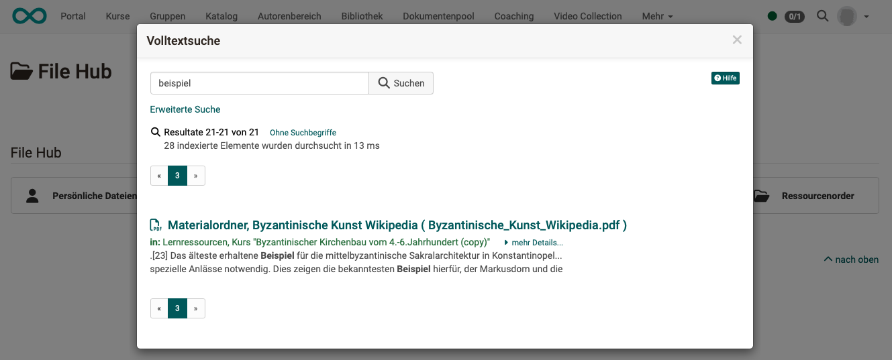
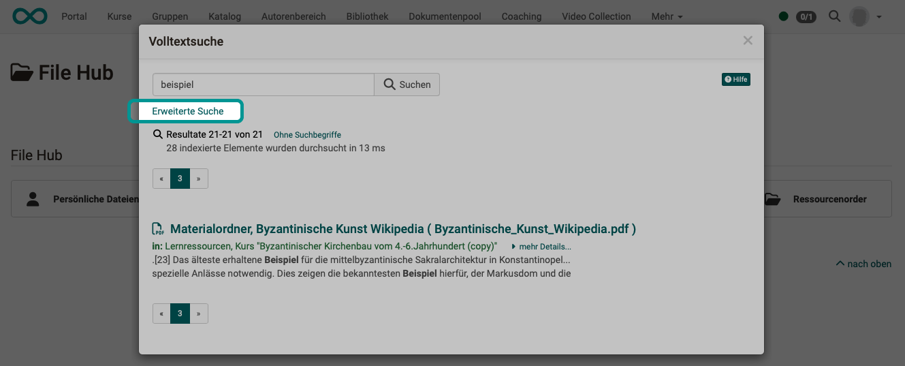

# Suche im File Hub {: #search_in_file_hub}

Der [File Hub](../personal_menu/File_Hub.de.md), den Sie unter den [persönlichen Werkzeugen](../personal_menu/Personal_Tools.de.md) finden, ist ein persönlicher Datei-Explorer und zeigt alle verfügbaren Dateien der OpenOlat-Instanz. Auch eingebundene externe Quellen, wie Sharepoint und OneDrive. Anders gesagt: Sie haben Zugriff auf alle Dateien, für die Sie eine Zugriffsberechtigung haben.

Entsprechend ist die Suche im File Hub in erster Linie auf **Dateien** ausgerichtet, die Sie z.B. kopieren oder verschieben wollen.

---

## Suche in Ordnern {: #search_in_folder}

Die Suchfunktion in Ordnern sucht im aktuellen Ordner mit seinen Unterordnern nach

* Dateinamen,
* Beschreibung
* und Ersteller

(Es ist aktuell keine Volltextsuche, also keine Suche z.B. innerhalb von Word-Dateien.)

---

## Suche im Suchfeld {: #search_in_search_field}

Im Suchfeld des File Hub, wird eine [Volltextsuche](Search_General.de.md#full_text_search) ausgeführt.

{ class="shadow lightbox" }

Sie ist auf die im File Hub angebotenen Ablageorte eingeschränkt. Dies sind
folgende Ordner:

* Kursbaustein Ordner
* Kursbaustein Dateidiskussion
* Ressourcenordner
* Gruppenordner

---

## Erweiterte Suche im Suchresultat {: #advanced_search}

Die "Erweiterte Suche" im Suchresultat ist ebenfalls eine [Volltextsuche](Search_General.de.md#full_text_search) ohne Einschränkungen.

{ class="shadow lightbox" }

{ class="shadow lightbox" }

!!! info "Hintergrundinformation"

        **File Hub = File System + Zusatzinfo (Metadaten)**
        
        Im File Hub von OpenOlat wird ein Abbild des File-Systems verwendet, das um Metadaten ergänzt wird. Diese werden zur Indexierung verwendet.
        
        Das Abbild wird ständig automatisch aktualisiert. Bei Bearf kann auch manuell ein Abgleich angestossen werden.

---

## Weitere Informationen

[Allgemeines zur Suche >](Search_General.de.md) 
[Globale Suche >](Search_Global.de.md) 
[Lokale Suche >](Search_Local.de.md) 
[Personensuche >](Search_Person.de.md) 
[Suche im Kurs >](Search_in_Course.de.md) 

[zum Seitenanfang ^](#search_in_file_hub)

