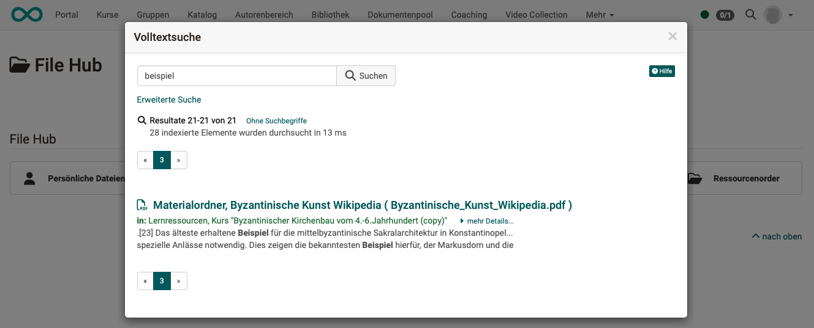
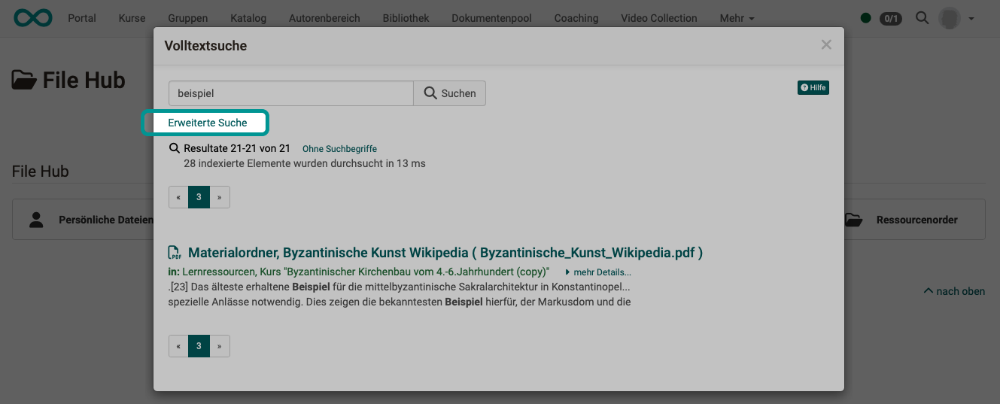
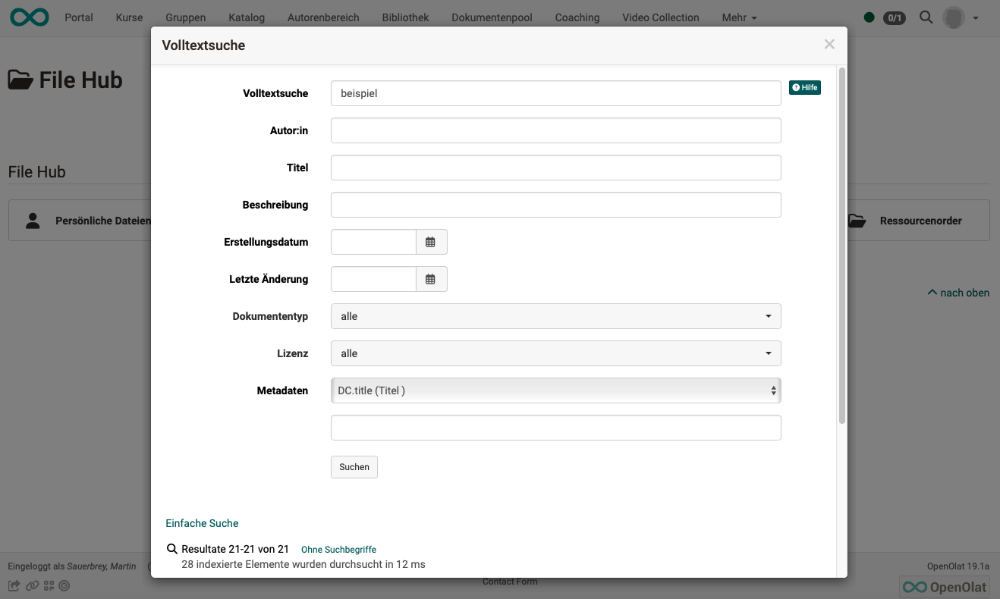

# Search in the File Hub {: #search_in_file_hub}

The [File Hub](../personal_menu/File_Hub.md), which you can find under [Personal tools](../personal_menu/Personal_Tools.md), is a personal file explorer and shows all available files of the OpenOlat instance. Including integrated external sources such as Sharepoint and OneDrive. In other words, you have access to all files for which you have access authorization.

Accordingly, the search in the File Hub is primarily aimed at **files** that you want to copy or move, for example.

---

## Search in folders {: #search_in_folder}

The search function in folders searches the current folder and its subfolders for

* File name,
* Description
* and Creator

(It is currently not a full-text search, i.e. no search within Word files, for example).

---

## Search in search field {: #search_in_search_field}

A [full text search](Search_General.md#full_text_search) is performed in the search field of the File Hub.

{ class="shadow lightbox" }

It is restricted to the storage locations offered in the File Hub. These are the following folders:

* Course element folder
* Course element file discussion
* Resource folder
* Group folder

---

## Advanced search in the search result {: #advanced_search}

The "Advanced search" in the search result is also a [full text search](Search_General.md#full_text_search) without restrictions.

{ class="shadow lightbox" }

{ class="shadow lightbox" }

!!! info "Background information"

    **File Hub = File System + Additional info (metadata)**

    OpenOlat's File Hub uses an image of the file system, which is supplemented with metadata. This is used for indexing.

    The image is constantly updated automatically. If necessary, a synchronization can also be triggered manually.

---

## Further information

[General things about the search >](Search_General.md) 
[Local search >](Search_Local.md) 
[Personal search >](Search_Person.md) 
[Search in a course >](Search_in_Course.md) 
[Search in FileHub >](Search_in_FileHub.md) 

