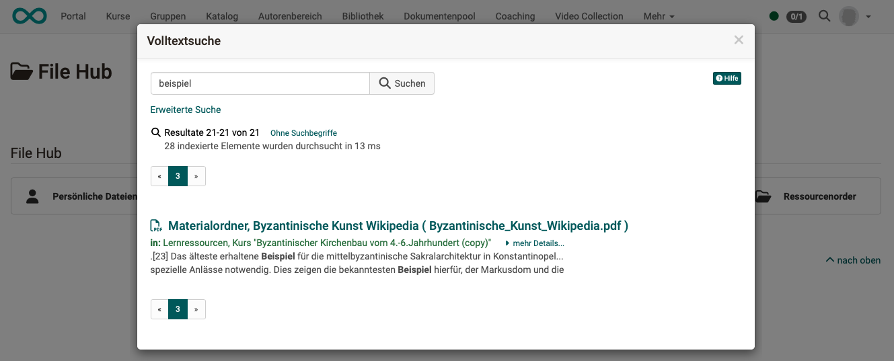
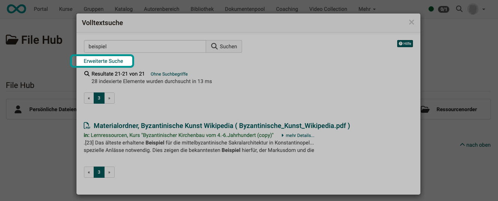
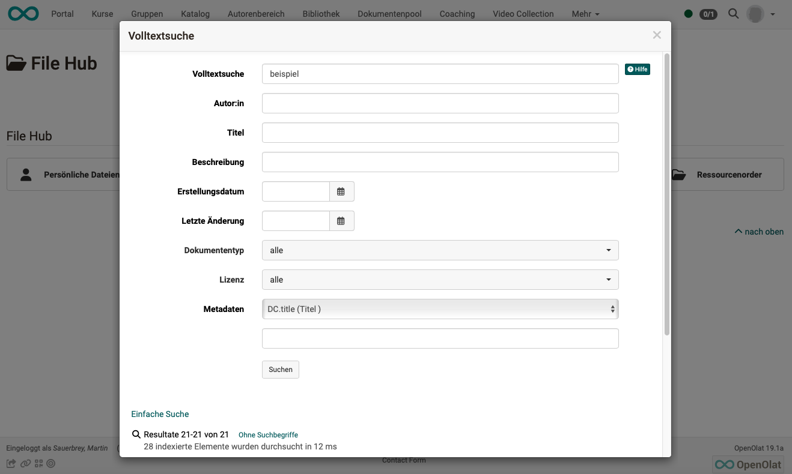

# Search in the File Hub {: #search_in_file_hub}

The [File Hub](../personal_menu/File_Hub.md), which you find under [Personal tools](../personal_menu/Personal_Tools.md), is a personal file explorer and shows available files of the OpenOlat instance.

Accordingly, the search in the File Hub is primarily aimed at **files** that you want to copy or move, for example.

---

## Search in folders {: #search_in_folder}

The search function in folders searches the current folder and its subfolders for

* file name,
* title,
* description
* and creator.

It is not a full-text search, i.e. no search within Word files, for example.

---

## Search in the search field {: #search_in_search_field}

A [full-text search](Search_General.md#full_text_search) is performed in the search field of the File Hub.

{ class="shadow lightbox" }

It is restricted to the storage locations offered in the File Hub. These are the following folders:

* Course element Folder
* Course element File dialog
* Resource folder
* Group folder

---

## Advanced search in the search result {: #advanced_search}

The "Advanced search" in the search result is also a [full-text search](Search_General.md#full_text_search) without restrictions. The page [General information on the search](Search_General.md#advanced_search) describes the search fields of the advanced search.

{ class="shadow lightbox" }

{ class="shadow lightbox" }

!!! info "Background information"

    **File Hub = file system + additional info (metadata)**

    The File Hub of OpenOlat uses an image of the file system, which is supplemented with metadata. This is used for indexing.

    The image is constantly updated automatically. If necessary, a synchronisation can also be triggered manually.

---

## Further information {: #further_information}

[Personal tools: File Hub >](../personal_menu/File_Hub.md) 
[Personal Tools >](../personal_menu/Personal_Tools.md) 
[General information on the search >](Search_General.md) 
[Global search >](Search_Global.md) 
[Local search >](Search_Local.md) 
[Search other Users >](Search_Person.md) 
[Search in a course >](Search_in_Course.md)

[To the top of the page ^](#search_in_file_hub)
