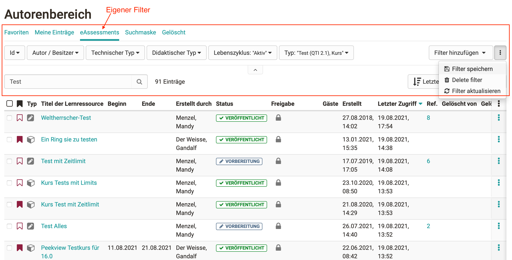

# Mit Tabellen arbeiten

Die Tabellen im Bereich [Kurse](../area_modules/Courses.de.md) und im [Autorenbereich](../area_modules/Authoring.de.md) (für Autoren) bieten verschiedene Filter- und
Einstellungsoptionen.

## Das Filtermenü

Im Filtermenü befinden sich die ausgewählten Filteroptionen sowie die Option
"Filter hinzufügen", "Filter speichern" und "alle Filter". Das Filtermenü kann
durch Klicken auf den kleinen Pfeil ein- und ausgeklappt werden.

Die Filter werden entweder in Dropdown-Menüs ausgewählt oder in ein Input-Feld
eingegeben. Um einen Filter anzuwenden wählen Sie den gewünschten Filter an
und klicken Sie dann auf "Update". Um einen einzelnen Filter zu entfernen
klicken Sie in der jeweilige Filteroption auf "Filter entfernen". Wenn Sie
alle Filter entfernen wollen, klicken Sie auf "aktive Filter entfernen" oben
rechts.

Die aktiven Filter werden kombiniert. D.h. es werden nur Einträge angezeigt,
die **allen** Filtern entsprechen.

### Filter hinzufügen und entfernen

Rechts finden Sie den Button "Filter hinzufügen". Hier können Sie auswählen,
welche Filteroptionen im Filtermenü angezeigt werden, oder ihre Auswahl auf
die Standardeinstellung zurücksetzen.

Befinden Sie sich in einem Filter-Tab mit vordefinierten Filtern, kann dieser
Filter nicht verändert werden.

### Filter speichern

Rechts unter den Menüpunkten finden Sie die Option "Filter speichern". Hier
können Sie ihre aktuell aktiven Filtereinstellungen speichern und so schnell
wieder darauf zurück greifen. Ihre individuellen, gespeicherten Filter werden
dann oberhalb des Filtermenüs als Filter-Tabs angezeigt.

### Alle Filter

Klicken Sie auf die Option "alle Filter", um alle verfügbaren Filteroptionen
im Vollbildmodus anzuzeigen. Dort können Sie die einzelnen Filter auch
einstellen.

## Filter-Tabs

Über dem Filtermenü finden Sie die Filter-Tabs. Sie enthalten die
vordefinierten Filter und individuelle, gespeicherte Filter.

## Massenaktionen

Wenn Sie einen oder mehrere Einträge in der Tabelle angewählt haben,
erscheinen oberhalb der Tabelle verfügbare Massenaktionen. Dadurch können
schnell mehrere Einträge gleichzeitig bearbeitet werden.

## Suchen

Mit der Suche können Sie gezielt nach Einträgen suchen. Die ausgewählten
Filter bleiben dabei aktiv. Genauso können Sie ihre Suchergebnisse mit dem
Filtern weiter eingrenzen.

