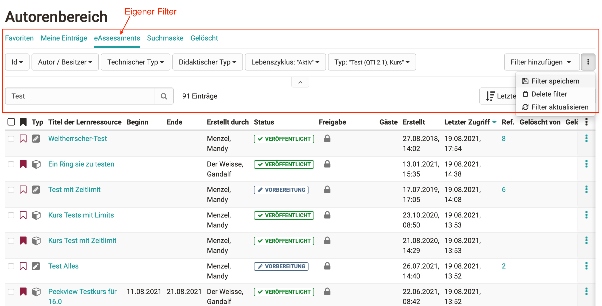

# Mit Tabellen arbeiten {: #tables}

Die Tabellen im Bereich [Kurse](../area_modules/Courses.de.md) und im [Autorenbereich](../area_modules/Authoring.de.md) (für Autor:innen) bieten verschiedene Filter- und Einstellungsoptionen.

## Das Filtermenü

Im Filtermenü befinden sich die ausgewählten Filteroptionen sowie die Buttons "Mehr..." und "Filter entfernen" und die Option "Filter speichern". Das Filtermenü kann durch Klicken auf den kleinen Pfeil ein- und ausgeklappt werden.

Die Filter werden entweder in Dropdown-Menüs ausgewählt oder in ein Eingabefeld eingegeben. Um einen Filter anzuwenden, wählen Sie den gewünschten Filter an und klicken Sie dann auf "Übernehmen". Um einen einzelnen Filter zu entfernen, klicken Sie in der jeweiligen Filteroption auf "Filter entfernen". Wenn Sie alle Filter entfernen wollen, klicken Sie auf den Button "Filter entfernen" rechts im Filtermenü.

Die aktiven Filter werden kombiniert. D.h. es werden nur Einträge angezeigt, die **allen** Filtern entsprechen.

### Filter hinzufügen und entfernen

Rechts im Filtermenü finden Sie den Button "Mehr...". Hier wählen Sie aus, welche Filteroptionen im Filtermenü angezeigt werden, oder Sie setzen Ihre Auswahl auf die Standardeinstellung zurück.

Befinden Sie sich in einem Filter-Tab mit vordefinierten Filtern, kann dieser Filter nicht verändert werden.

### Filter speichern

Rechts im Filtermenü finden Sie die Option "Filter speichern". Hier speichern Sie Ihre aktuell aktiven Filtereinstellungen und greifen so schnell wieder darauf zurück. Ihre individuellen, gespeicherten Filter werden dann oberhalb des Filtermenüs als Filter-Tabs angezeigt.

### Tabelleneinstellungen

Über den Button mit den drei Punkten oberhalb der Tabelle öffnen Sie den Dialog "Tabelleneinstellungen". Dort sehen und setzen Sie alle verfügbaren Filter, legen die Sortierreihenfolge fest und wählen unter "Spalten auswählen" die angezeigten Spalten aus.

{ class="shadow lightbox" }

## Filter-Tabs

Über dem Filtermenü finden Sie die Filter-Tabs. Sie enthalten die vordefinierten Filter und individuelle, gespeicherte Filter.

Manche Tabellen bieten zusätzlich vordefinierte, kontextspezifische Filter an, deren Bedeutung von der jeweiligen Funktion abhängt. Im Coaching zeigt der Filter "Relevant" beispielsweise die für die Betreuer:in aktuell wichtigsten Kurse an, also Kurse im Status "Veröffentlicht" und "Freigabe Betreuer:innen". Siehe [Coaching - Kurse](../area_modules/Coaching_Courses.de.md).

## Sortieren

Über den Sortier-Button oberhalb der Tabelle öffnen Sie das Menü "Sortierreihenfolge" und wählen das Sortierkriterium. Der Button zeigt jeweils das aktive Kriterium an.

## Massenaktionen

Wenn Sie einen oder mehrere Einträge in der Tabelle angewählt haben, erscheinen oberhalb der Tabelle verfügbare Massenaktionen. Dadurch können schnell mehrere Einträge gleichzeitig bearbeitet werden.

## Suchen

Mit der Suche können Sie gezielt nach Einträgen suchen. Die ausgewählten Filter bleiben dabei aktiv. Genauso können Sie Ihre Suchergebnisse mit den Filtern weiter eingrenzen.

## Weiterführende Informationen {: #further_information}

[Kurse finden >](../area_modules/Courses.de.md) 
[Autorenbereich - Übersicht >](../area_modules/Authoring.de.md) 
[Coaching - Kurse >](../area_modules/Coaching_Courses.de.md) 
[Allgemeines zur Suche >](Search_General.de.md) 
[Ordnerkonzept >](Folder_Concept.de.md)

[Zum Seitenanfang ^](#tables)
