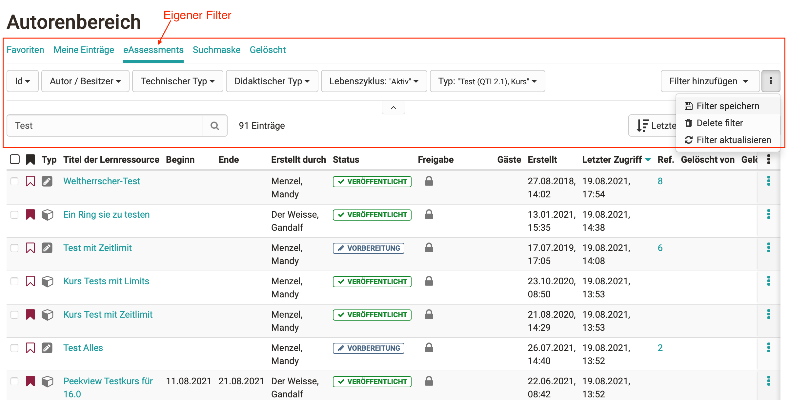

# Working with tables

The tables in the [courses section](../area_modules/Courses.md) and in the [author section](../area_modules/Authoring.md) (for authors)
offer various filter and setting options.

## The Filter Menu

The filter menu contains the selected filter options as well as the "add
filter", "save filter" and "all filters" option. The filter menu can be
expanded and collapsed by clicking on the small arrow.

Filters are either selected from drop-down menus or entered into an input
field. To apply a filter, select the desired filter and then click "Update". To
remove a single filter click "Remove Filter" in the respective filter option.
If you want to remove all filters, click on "Remove active filters" in the
upper right corner.

The active filters will be combined. I.e. only entries matching **all**
filters will be displayed.

{class="lightbox"}

### Add and remove filters

On the right you will find the "Add filter" button. Here you can select which
filter options will be displayed in the filter menu or reset their selection
to default.

If you are in a filter tab with predefined filters, this filter cannot be
changed.

### Saving filters

On the right side below the menu items you will find the option "Save filter".
Here you can save your currently active filter settings and quickly access
them again. Your individual, saved filters are then displayed above the filter
menu as filter tabs.

### Alle Filter

Click on the "All Filters" option to display all available filter options in
full screen mode. You can also set the individual filters there.

## Filter tabs

Above the filter menu you will find the filter tabs. They contain the
predefined filters and individual saved filters.

## Mass actions

If you have selected one or more entries in the table, available mass actions
appear above the table. This allows you to quickly edit multiple entries at
the same time.

## Search

With the search function you can search for specific entries. The selected
filters remain active. In the same way, you can further narrow down your
search results using the filters.

