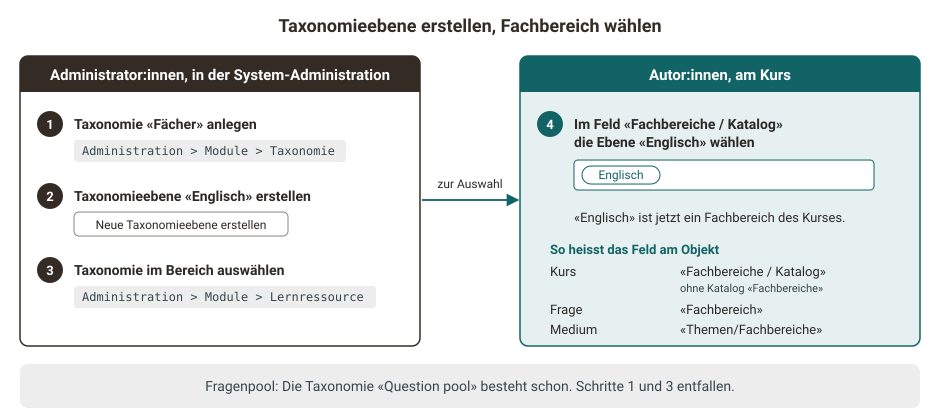
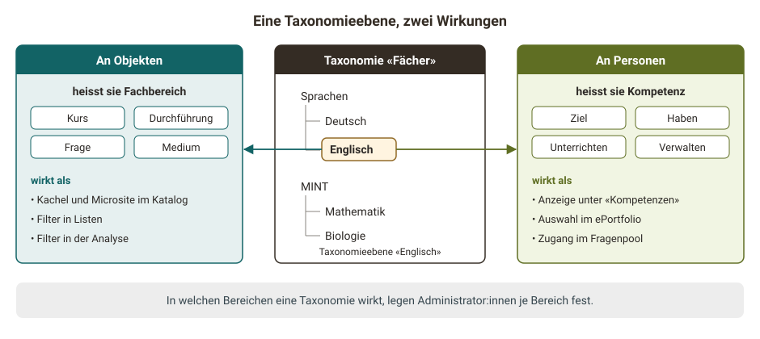
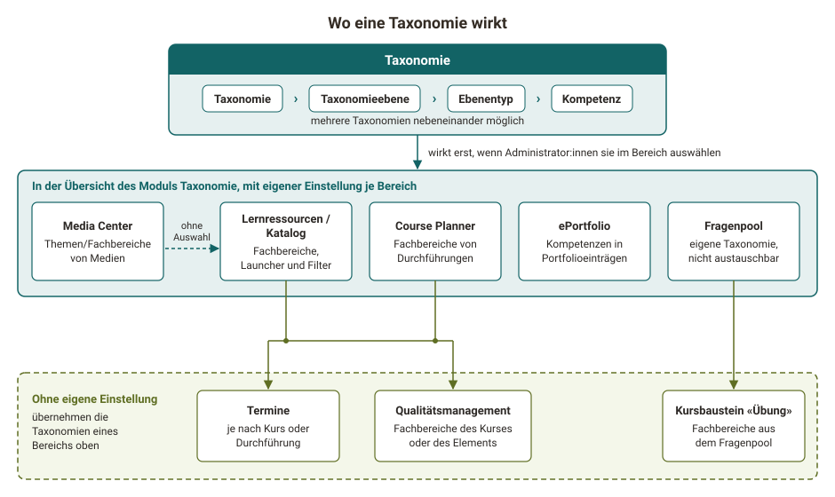
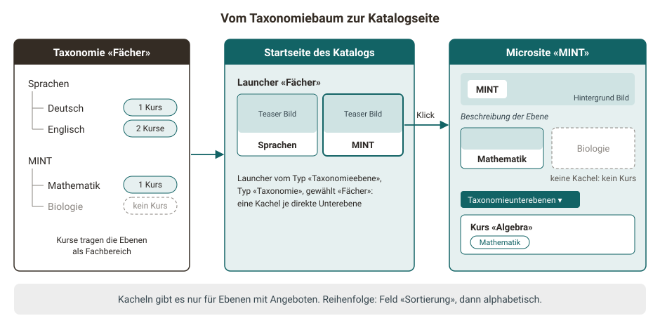
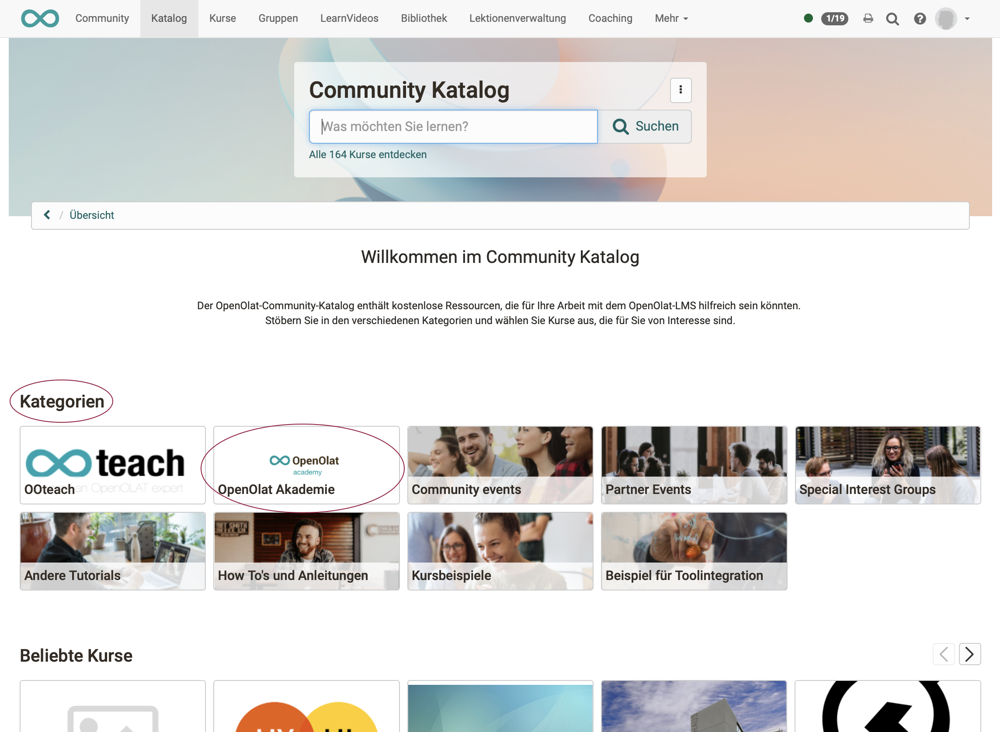
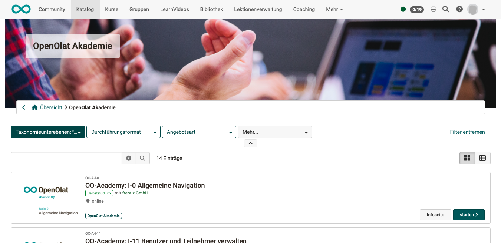

# Taxonomie {: #taxonomy_concept}

Viele Organisationen ordnen ihr Angebot nach Fächern, Themen oder Kompetenzen: Kurse im Katalog, Fragen im Fragenpool, Medien im Media Center. Ohne gemeinsame Ordnung führt jeder Bereich eigene Schlagworte, und dieselbe Sache heisst an jeder Stelle anders. Eine Taxonomie legt diese Ordnung einmal zentral fest. Für jeden Bereich bestimmen danach Administrator:innen in der System-Administration, welche Taxonomie dort gilt.

Diese Seite erklärt, wie eine Taxonomie aufgebaut ist und wie sie wirkt: an Kursen, Durchführungen, Fragen und Medien als Fachbereich, im Katalog als Launcher und Filter, bei Personen als Kompetenz. Wie Sie eine Taxonomie in einem einzelnen Bereich nutzen, beschreiben die Seiten dieses Bereichs. Taxonomien richten Administrator:innen in der System-Administration ein.

## Was ist eine Taxonomie? {: #what_is_a_taxonomy}

Eine Taxonomie ist ein hierarchischer Baum von Begriffen. Oben stehen allgemeine Begriffe, darunter immer genauere. Eine Taxonomie nach Fächern kann zum Beispiel so aussehen:

- Sprachen
    - Deutsch
    - Englisch
- MINT
    - Mathematik
    - Biologie

Mit diesen Begriffen ordnen Sie Lernressourcen, Durchführungen, Fragen und Medien ein und beschreiben, was Personen können oder unterrichten. Mit der Lernzieltaxonomie nach Bloom hat die Taxonomie in OpenOlat nichts zu tun: sie ist ein Ordnungsbaum, keine Stufenlehre für Lernziele.

OpenOlat führt beliebig viele Taxonomien nebeneinander, etwa eine nach Fächern für den Katalog und eine nach Kompetenzen für das ePortfolio.

[Zum Seitenanfang ^](#taxonomy_concept)

## Aufbau einer Taxonomie [:octicons-tag-16:{ title="ab Release 12.2 (OO-3047)" }](https://track.frentix.com/issue/OO-3047){:target="_blank"} {: #structure}

Wer eine Taxonomie einrichtet oder in einem Bereich nutzt, trifft auf vier Begriffe, die aufeinander aufbauen:

| Begriff | Was es ist | Beispiel |
|---|---|---|
| Taxonomie | der ganze Baum, mit Titel und Kennzeichen | «Fächer» |
| Taxonomieebene | ein Knoten im Baum, mit Titel, Beschreibung und optional Bildern | «Sprachen», darunter «Englisch» |
| Ebenentyp | die Art einer Taxonomieebene. Er legt fest, ob Ebenen dieses Typs sichtbar sind, als Kompetenz dienen und Leistungsnachweise gruppieren | «Handlungsfeld», «Fach» |
| Kompetenz | die Verbindung einer Person mit einer Taxonomieebene, mit einem von vier Kompetenztypen | eine Person unterrichtet «Englisch» |

!!! info "Wichtig"

    Hängt eine Taxonomieebene an einer Lernressource, einer Durchführung, einer Frage oder einem Medium, heisst sie dort Fachbereich. Ein Fachbereich ist also keine eigene Struktur, sondern eine Taxonomieebene an einem Objekt.

{ class="shadow lightbox" title="Vom Erstellen der Taxonomieebene zum Fachbereich · 2026.10.08" }

[Zum Seitenanfang ^](#taxonomy_concept)

## Wie eine Taxonomie wirkt {: #how_it_works}

Wer eine Taxonomie einmal pflegt, nutzt jede ihrer Taxonomieebenen an zwei Stellen: an Objekten und an Personen.

- **An Objekten** heisst sie Fachbereich. Autor:innen ordnen Kurse, Fragen und Medien Fachbereichen zu, Kursplaner:innen die Durchführungen. Über die Fachbereiche finden Personen Angebote im Katalog, grenzen Listen mit Filtern ein und werten Ergebnisse aus.
- **An Personen** heisst sie Kompetenz. Eine Kompetenz zeigt, ob eine Person ein Fach anstrebt, beherrscht, unterrichtet oder verwaltet. Im Fragenpool öffnet sie den Zugang zu den Fachbereichen.

In welchen Bereichen eine Taxonomie wirkt, legen Administrator:innen je Bereich fest, siehe [Wo Taxonomie wirkt](#areas). Ihre Kompetenzen sieht eine Person unabhängig davon in den persönlichen Werkzeugen unter "Kompetenzen", aus allen Taxonomien.

{ class="shadow lightbox" title="Fachbereich und Kompetenz · 2026.10.08" }

[Zum Seitenanfang ^](#taxonomy_concept)

## Wo Taxonomie wirkt {: #areas}

Damit in einem Bereich Fachbereiche zur Auswahl stehen, sind in der System-Administration zwei Schritte nötig:

1. Eine Taxonomie anlegen und darin Taxonomieebenen erstellen, unter `Administration > Module > Taxonomie`. Der Fragenpool ist die Ausnahme: Für ihn hat OpenOlat die Taxonomie "Question pool" schon angelegt, zunächst ohne Taxonomieebenen, siehe [Fragenpool](#question_pool).
2. Die Taxonomie in jedem Bereich auswählen, in dem sie wirken soll. Jeder Bereich hat dafür eine eigene Einstellung, siehe Tabelle.

Wenn Sie in einem Bereich keine Fachbereiche zur Auswahl sehen, haben Administrator:innen dort noch keine Taxonomie ausgewählt. Welche Taxonomie in welchen Bereichen ausgewählt ist, zeigt die Übersicht in der System-Administration unter `Administration > Module > Taxonomie`, etwa für die Bereiche "Lernressourcen / Katalog" und "Course Planner". [:octicons-tag-16:{ title="ab Release 20.3.0 (OO-9185)" }](https://track.frentix.com/issue/OO-9185){:target="_blank"}

| Bereich | Wozu die Taxonomie dient | Wo Administrator:innen sie in der System-Administration auswählen |
|---|---|---|
| Lernressourcen / Katalog | Fachbereiche von Lernressourcen; Launcher (Abschnitte der Katalog-Startseite) und Filter im Katalog | `Administration > Module > Lernressource`, Feld "Taxonomie", mehrere Taxonomien möglich |
| Course Planner | Fachbereiche von Durchführungen und Elementen | `Administration > Module > Course Planner`, Feld "Verknüpfte Taxonomien", mehrere Taxonomien möglich |
| Fragenpool | Fachbereiche von Fragen | `Administration > e-Assessment > Fragenpool`, Schalter "Fachbereiche". Das Feld "Taxonomie" zeigt die Taxonomie "Question pool", sie ist fest zugeordnet. |
| ePortfolio | Kompetenzen in Portfolioeinträgen | `Administration > e-Assessment > ePortfolio`, Schalter "Taxonomieverknüpfung einschalten" und Feld "Verknüpfte Taxonomien" |
| Media Center | Feld "Themen/Fachbereiche" eines Mediums | `Administration > Module > Media Center`, Feld "Verknüpfte Taxonomien"; ohne Auswahl gelten die Taxonomien von Lernressourcen / Katalog |

Drei weitere Funktionen haben keine eigene Einstellung. Sie verwenden die Taxonomie eines Bereichs aus der Tabelle. Fachbereiche gibt es dort deshalb nur, wenn dieser Bereich eine Taxonomie ausgewählt hat:

- **Termine**: Gehört ein Termin zu einem Kurs, gelten die Taxonomien von Lernressourcen / Katalog. Gehört er zu einer Durchführung, gelten die Taxonomien des Course Planners.
- **Kursbaustein "Übung"**: Er verwendet die Taxonomie des Fragenpools.
- **Qualitätsmanagement**: Eine Datenerhebung übernimmt die Fachbereiche des Kurses oder des Elements im Course Planner, zu dem sie gehört.

{ class="shadow lightbox" title="Bereiche, in denen eine Taxonomie wirkt · 2026.10.08" }

Die Bereiche teilen ihre Auswahl nicht. Was für Lernressourcen / Katalog ausgewählt ist, steht im Course Planner nicht automatisch zur Verfügung. Wer Kurse, Durchführungen und Medien nach denselben Fächern ordnen will, wählt dieselbe Taxonomie in jedem dieser Bereiche aus.

Zwei Bereiche verhalten sich anders:

- **Fragenpool**: OpenOlat legt für den Fragenpool die Taxonomie "Question pool" an. Sie ist zunächst leer und lässt sich nicht gegen eine andere austauschen. Ihre Taxonomieebenen heissen im Fragenpool Fachbereiche. Administrator:innen erstellen sie mit "Neue Taxonomieebene erstellen" an drei Orten: in der System-Administration unter `Administration > Module > Taxonomie` in der Taxonomie "Question pool" und unter `Administration > e-Assessment > Fragenpool` im Tab "Fachbereiche" sowie im Fragenpool unter `Fragenpool > Administration > Fachbereich`. Im Fragenpool dürfen das auch Poolverwalter:innen, wenn Administrator:innen ihnen erlauben, die Einstellungen "Fachbereiche" zu bearbeiten. Neue Fachbereiche können Sie jederzeit hinzufügen. In den anderen Bereichen steht die Taxonomie "Question pool" wie jede andere Taxonomie zur Auswahl.
- **Media Center**: Wenn die Übersicht in der System-Administration unter `Administration > Module > Taxonomie` beim Media Center "nicht aktiviert" zeigt, Medien aber trotzdem Fachbereiche erhalten, ist für das Media Center keine Taxonomie verknüpft. Es nutzt dann die Taxonomien von Lernressourcen / Katalog.

[Zum Seitenanfang ^](#taxonomy_concept)

## Fachbereiche an Kursen, Fragen und Medien {: #subjects}

Wer einen Kurs, eine Frage oder ein Medium nach Fächern auffindbar machen will, ordnet ihm Fachbereiche zu. Wo das geschieht, hängt vom Bereich ab. Bei einem Kurs wählen Autor:innen sie in den Kurseinstellungen im Tab "Metadaten". Das Feld heisst dort "Fachbereiche", bei eingeschaltetem Katalog "Fachbereiche / Katalog". Im Media Center heisst es "Themen/Fachbereiche". Das Feld bietet nur Taxonomieebenen aus den Taxonomien an, die für den Bereich ausgewählt sind. Bei einer Frage wählen Sie den Fachbereich in den Metadaten der Frage, Abschnitt "Allgemein", Feld "Fachbereich". Zur Auswahl stehen dort die Fachbereiche des Fragenpools.

{ class="shadow lightbox" title="Tab Metadaten der Kurseinstellungen" }

Ein Kurs kann mehreren Fachbereichen angehören. Im Katalog erscheint er auf der Microsite jedes dieser Fachbereiche, siehe [Launcher und Microsite](#launcher).

Bei einem Bild im Media Center kann die KI den Fachbereich vorschlagen, siehe [automatische Zuordnung per KI](../../manual_admin/administration/Modules_Taxonomy.de.md#ai_matching). Sie sucht in denselben Taxonomien wie das Feld "Themen/Fachbereiche".

[Zum Seitenanfang ^](#taxonomy_concept)

## Launcher und Microsite im Katalog [:octicons-tag-16:{ title="ab Release 17.0.0 (OO-6146)" }](https://track.frentix.com/issue/OO-6146){:target="_blank"} {: #launcher}

Im Katalog wird aus der Taxonomie eine Navigation, über die Personen Angebote nach Fächern finden. Die Startseite des Katalogs besteht aus Abschnitten, den Launchern. Ein Launcher vom Typ "Taxonomieebene" zeigt Taxonomieebenen als Kacheln. Im Feld "Typ" wählen Administrator:innen, ob sich der Launcher auf eine ganze Taxonomie oder auf eine einzelne Taxonomieebene bezieht. Der Launcher zeigt deren direkte Unterebenen, siehe [Modul Katalog: Tab Startseite](../../manual_admin/administration/Modules_Catalog_2.0.de.md#tab_start_page).

Ein Klick auf eine Kachel öffnet die Microsite dieser Taxonomieebene. Sie zeigt das Hintergrund Bild und die Beschreibung der Ebene, die Kacheln ihrer Unterebenen und die Angebote mit diesem Fachbereich.

{ class="shadow lightbox" title="Vom Taxonomiebaum zur Katalogseite · 2026.10.08" }

Drei Regeln bestimmen, was der Launcher zeigt:

- **Nur Ebenen mit Angeboten**: Wenn Sie eine Taxonomieebene im Launcher oder auf einer Microsite nicht als Kachel sehen, hat weder sie noch eine ihrer Unterebenen ein Angebot im Katalog. Die Kachel erscheint, sobald ein Angebot diesen Fachbereich trägt.
- **Reihenfolge**: Die Kacheln stehen in der Reihenfolge des Felds "Sortierung" der Taxonomieebenen. Ebenen ohne Sortierung folgen alphabetisch nach Titel.
- **Bilder**: Die Kachel zeigt das Teaser Bild der Taxonomieebene, der Kopf der Microsite ihr Hintergrund Bild. Beide Bilder gehören zur Taxonomieebene, siehe [Modul Taxonomie](../../manual_admin/administration/Modules_Taxonomy.de.md).

{ class="shadow lightbox" title="Startseite des Katalogs mit einem Launcher vom Typ Taxonomieebene" }

### Durchführungen im Katalog [:octicons-tag-16:{ title="ab Release 20.0.0 (OO-8301)" }](https://track.frentix.com/issue/OO-8301){:target="_blank"} {: #catalog_course_planner}

Wer Kurse und Durchführungen im Katalog nach denselben Fachbereichen auffindbar machen will, wählt dieselbe Taxonomie in beiden Bereichen aus. Durchführungen erscheinen als Angebote im Katalog, ihre Fachbereiche stammen aus den Taxonomien des Course Planners. Launcher und Filter des Katalogs bieten nur Taxonomieebenen aus den Taxonomien an, die für Lernressourcen / Katalog ausgewählt sind. Wenn Sie im Katalog für die Fachbereiche von Durchführungen keinen Launcher und keinen Filter einrichten können, ist die Taxonomie nur im Course Planner ausgewählt. Wählen Sie sie zusätzlich für Lernressourcen / Katalog aus.

### Taxonomie abwählen [:octicons-tag-16:{ title="ab Release 20.3.0 (OO-9214)" }](https://track.frentix.com/issue/OO-9214){:target="_blank"} {: #deselect}

Wenn Sie in der System-Administration die Meldung "Die Taxonomie wird noch in einem Launcher des Katalogs verwendet und kann daher nicht abgewählt werden." sehen, ist diese Taxonomie in einem Launcher vom Typ "Taxonomieebene" der Katalog-Startseite eingestellt. Löschen Sie diesen Launcher oder stellen Sie darin eine andere Taxonomie ein, siehe [Modul Katalog: Tab Startseite](../../manual_admin/administration/Modules_Catalog_2.0.de.md#tab_start_page). Danach lässt sich die Taxonomie in der System-Administration unter `Administration > Module > Lernressource` abwählen. Einen Launcher auszuschalten oder ohne Kacheln zu lassen, genügt nicht.

[Zum Seitenanfang ^](#taxonomy_concept)

## Filter {: #filters}

Mit Fachbereichen grenzen Sie lange Listen auf ein Fach ein: im Katalog, in den Listen der Termine und in der Analyse des Qualitätsmanagements.

### Katalog {: #filters_catalog}

Im Katalog grenzen Personen die Angebote mit Filtern auf einen Fachbereich ein. Welche Filter der Katalog zeigt, legen Administrator:innen in der System-Administration unter `Administration > Module > Katalog` im Tab "Filter" fest. Die Filter bieten nur Taxonomieebenen an, denen mindestens ein Angebot zugeordnet ist. Für Taxonomien gibt es zwei Filtertypen:

- **Taxonomieebene**: Der Filter trägt den Titel einer gewählten Taxonomieebene und bietet ihre Unterebenen zur Auswahl an.
- **Fachbereiche**: Der Filter erscheint auf jeder Microsite als "Taxonomieunterebenen" und bietet die Unterebenen der geöffneten Taxonomieebene an. Mit der Option "Lernressourcen der Taxonomieunterebenen anzeigen" im Feld "Default" legen Administrator:innen fest, ob die Microsite die Angebote der Unterebenen von Anfang an zeigt.

{ class="shadow lightbox" title="Microsite einer Taxonomieebene im Katalog" }

### Termine [:octicons-tag-16:{ title="ab Release 20.1.2 (OO-8436)" }](https://track.frentix.com/issue/OO-8436){:target="_blank"} {: #events}

Wer Termine Fachbereichen zuordnet, wählt aus den Taxonomien des Bereichs, zu dem der Termin gehört. Beim Termin eines Kurses sind es die Taxonomien von Lernressourcen / Katalog, beim Termin einer Durchführung die Taxonomien des Course Planners. Gehört ein Termin zu beidem, stehen beide zur Wahl.

Wenn Sie in den Listen der Termine die Spalte "Fachbereiche" und den Filter "Fachbereich Pfade" nicht sehen, ist für den Course Planner keine Taxonomie verknüpft. Das gilt auch für Termine von Kursen. Der Filter bietet die Taxonomieebenen dieser Taxonomien an.

### Qualitätsmanagement {: #quality_management}

Wer die Ergebnisse von Datenerhebungen für ein einzelnes Fach auswerten will, grenzt die Analyse des Qualitätsmanagements auf dessen Fachbereich ein. Dafür gibt es dort den Filter "Fachbereich". Er wertet die Fachbereiche aus, die eine Datenerhebung von ihrem Kurs oder ihrem Element im Course Planner übernommen hat, siehe [Qualitätsmanagement: Analyse](../area_modules/Quality_Management_Analysis.de.md).

[Zum Seitenanfang ^](#taxonomy_concept)

## Kompetenzen {: #competences}

Wer wissen will, wer ein Fach unterrichtet, verwaltet oder beherrscht, findet das an den Kompetenzen. Eine Kompetenz verbindet eine Person mit einer Taxonomieebene. Der Kompetenztyp sagt, in welcher Beziehung die Person zu dieser Ebene steht. Eine Kompetenz kann ein Verfalldatum tragen.

| Kompetenztyp | Bedeutung | Wo OpenOlat ihn auswertet |
|---|---|---|
| Ziel | Die Person strebt die Kompetenz an. | bei der Person unter "Kompetenzen" |
| Haben | Sobald eine Person in ihrem [ePortfolio](../area_modules/Portfolio_General_Information.de.md) einem Eintrag über "Kompetenzen hinzufügen" eine Kompetenz zuordnet, trägt OpenOlat ihr diese Kompetenz automatisch ein. | im ePortfolio bei den Einträgen, bei der Person unter "Kompetenzen" |
| Unterrichten ("Dozieren") | Die Person unterrichtet das Fach und gibt ihr Wissen weiter. | Fragenpool: Zugang zu den Fachbereichen |
| Verwalten | Die Person verwaltet diesen Teil der Taxonomie. | Fragenpool: Zugang zu den Fachbereichen und zu finalen Fragen; Katalog: Bearbeiten der Taxonomieebene in der Katalog-Verwaltung |

Welche Fachbereiche eine Person im Fragenpool sieht, bestimmen ihre Kompetenzen Unterrichten und Verwalten. Ob sie Fragen nur diesen Fachbereichen zuordnen kann, regelt die Einstellung "Auswählbare Fachbereiche". Wer finale Fragen sieht, regelt die Einstellung "Sichtbarkeit von finalen Fragen". Beide Einstellungen beschreibt die Seite [e-Assessment Administration: Fragenpool](../../manual_admin/administration/eAssessment_Question_bank.de.md).

Kompetenzen entstehen auf drei Wegen:

- Administrator:innen weisen sie in der System-Administration an einer Taxonomieebene zu, in den Tabs "Kompetenzen" und "Verwaltung".
- Benutzerverwalter:innen, Rollenverwalter:innen und Administrator:innen weisen sie in der Benutzerverwaltung im Tab "Kompetenzen" einer Person zu.
- Die Kompetenz Haben entsteht im ePortfolio, sobald eine Person einem ihrer Einträge eine Kompetenz zuordnet.

Jede Person sieht ihre eigenen Kompetenzen in den persönlichen Werkzeugen unter [Kompetenzen](../personal_menu/Competences.de.md).

### Kompetenzen im ePortfolio [:octicons-tag-16:{ title="ab Release 15.5.0 (OO-5178)" }](https://track.frentix.com/issue/OO-5178){:target="_blank"} {: #eportfolio}

Wer im ePortfolio festhalten will, zu welchen Kompetenzen ein Eintrag gehört, ordnet ihm Kompetenzen zu. Zur Auswahl stehen aus den verknüpften Taxonomien die Taxonomieebenen, deren Ebenentyp die Einstellung "Kompetenzen" trägt, sowie Ebenen ohne Ebenentyp. Die Verknüpfung wirkt erst, wenn Administrator:innen in der System-Administration unter `Administration > e-Assessment > ePortfolio` den Schalter "Taxonomieverknüpfung einschalten" aktivieren und mindestens eine Taxonomie auswählen. Wenn Kompetenzen aus Portfolioeinträgen verschwinden, haben Administrator:innen an ihrem Ebenentyp die Einstellung "Kompetenzen" ausgeschaltet. OpenOlat entfernt dann alle Ebenen dieses Typs aus den Einträgen.

### Fachbereiche in den Leistungsnachweisen [:octicons-tag-16:{ title="ab Release 16.1.0 (OO-5788)" }](https://track.frentix.com/issue/OO-5788){:target="_blank"} {: #evidence_of_achievements}

Damit sich Leistungsnachweise aus dem Course Planner nach Fächern geordnet finden lassen, gruppiert OpenOlat die Elemente in der Liste der [Leistungsnachweise](../personal_menu/Evidence_of_Achievements.de.md) nach ihren Fachbereichen. Dafür zählen nur Fachbereiche, deren Ebenentyp die Einstellung "Leistungsnachweise" trägt.

[Zum Seitenanfang ^](#taxonomy_concept)

## Einrichtung {: #setup}

Wie Administrator:innen eine Taxonomie anlegen, Ebenentypen und Taxonomieebenen erstellen, Kompetenzen zuweisen und Taxonomien importieren, beschreibt die Seite [Modul Taxonomie](../../manual_admin/administration/Modules_Taxonomy.de.md) im Administrationshandbuch. Die Auswahl der Taxonomie je Bereich steht auf den Seiten der einzelnen Module:

- [Modul Lernressource](../../manual_admin/administration/Modules_Learning_Resource.de.md)
- [Modul Course Planner](../../manual_admin/administration/Modules_Course_Planner.de.md#linked_taxonomies)
- [e-Assessment Administration: ePortfolio](../../manual_admin/administration/eAssessment_ePortfolio.de.md#taxonomy_linking)
- [Modul Media Center](../../manual_admin/administration/Modules_Media_Center.de.md#taxonomy)

Launcher und Filter des Katalogs richten Administrator:innen in der System-Administration unter `Administration > Module > Katalog` ein, siehe [Modul Katalog](../../manual_admin/administration/Modules_Catalog_2.0.de.md).

[Zum Seitenanfang ^](#taxonomy_concept)

## Weiterführende Informationen {: #further_information}

**Auf dieser Seite erwähnt** 
[Modul Taxonomie >](../../manual_admin/administration/Modules_Taxonomy.de.md) 
[Modul Katalog >](../../manual_admin/administration/Modules_Catalog_2.0.de.md) 
[Qualitätsmanagement: Analyse >](../area_modules/Quality_Management_Analysis.de.md) 
[Allgemeines zum Portfolio >](../area_modules/Portfolio_General_Information.de.md) 
[e-Assessment Administration: Fragenpool >](../../manual_admin/administration/eAssessment_Question_bank.de.md) 
[Persönliche Werkzeuge: Kompetenzen >](../personal_menu/Competences.de.md) 
[Persönliche Erfolge/Leistungen: Leistungsnachweise >](../personal_menu/Evidence_of_Achievements.de.md) 
[Modul Lernressource >](../../manual_admin/administration/Modules_Learning_Resource.de.md) 
[Modul Course Planner >](../../manual_admin/administration/Modules_Course_Planner.de.md) 
[e-Assessment Administration: ePortfolio >](../../manual_admin/administration/eAssessment_ePortfolio.de.md) 
[Modul Media Center >](../../manual_admin/administration/Modules_Media_Center.de.md)

**Weiterführend** 
[Katalog 2.0: Übersicht >](../area_modules/catalog2.0.de.md) 
[Katalog 2.0 - Angebote >](../area_modules/catalog2.0_angebote.de.md) 
[Katalog 2.0 - Verwaltung >](../area_modules/catalog2.0_mgmt.de.md) 
[Fragenpool: Übersicht >](../area_modules/Question_Bank.de.md) 
[Fragenpool: Administration >](../area_modules/Question_Bank_Administration.de.md) 
[Kompetenzen verschlagworten >](../area_modules/Competences_tags.de.md) 
[Media Center: Informationen und Einstellungen zu Einzelmedien >](Media_Center_Items.de.md) 
[Kursbaustein "Übung" >](../learningresources/Course_Element_Practice.de.md)

[Zum Seitenanfang ^](#taxonomy_concept)
