# Taxonomy {: #taxonomy_concept}

Many organisations sort their offering by disciplines, topics or competences: courses in the catalog, questions in the question bank, media in the Media Center. Without a shared order, every area keeps its own keywords, and the same thing has a different name in every place. A taxonomy defines this order once, centrally. Administrators then decide in the system administration for each area which taxonomy applies there.

This page explains how a taxonomy is structured and how it takes effect: on courses, implementations, questions and media as a subject, in the catalog as launcher and filter, on people as a competence. How you use a taxonomy in a single area is described on the pages of that area. Administrators set up taxonomies in the system administration.

## What is a taxonomy? {: #what_is_a_taxonomy}

A taxonomy is a hierarchical tree of terms. General terms are at the top, more specific ones below. A taxonomy by discipline can look like this, for example:

- Languages
    - German
    - English
- STEM
    - Mathematics
    - Biology

With these terms you classify learning resources, implementations, questions and media, and describe what people can do or teach. The taxonomy in OpenOlat has nothing to do with Bloom's taxonomy of learning objectives: it is a tree for classification, not a system of levels for learning objectives.

OpenOlat manages any number of taxonomies side by side, for example one by discipline for the catalog and one by competence for the ePortfolio.

[To the top of the page ^](#taxonomy_concept)

## Structure of a taxonomy [:octicons-tag-16:{ title="from Release 12.2 (OO-3047)" }](https://track.frentix.com/issue/OO-3047){:target="_blank"} {: #structure}

Anyone who sets up a taxonomy or uses it in an area comes across four terms that build on each other:

| Term | What it is | Example |
|---|---|---|
| Taxonomy | the whole tree, with title and reference | «Disciplines» |
| Taxonomy level | a node in the tree, with title, description and optional images | «Languages», below it «English» |
| Level type | the kind of a taxonomy level. It defines whether levels of this type are visible, serve as a competence and group evidence of achievement | «Field of action», «Discipline» |
| Competence | the link between a person and a taxonomy level, with one of four competence types | a person teaches «English» |

!!! info "Important"

    If a taxonomy level is attached to a learning resource, an implementation, a question or a media item, it is called a subject there. A subject is therefore not a separate structure, but a taxonomy level on an object.

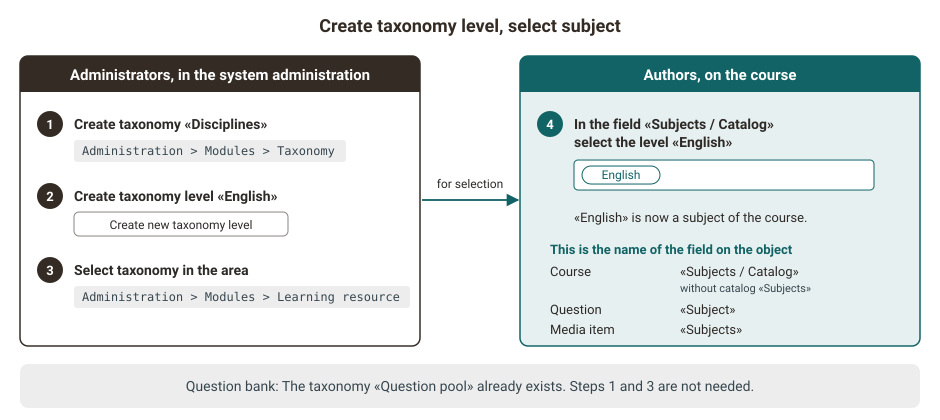{ class="shadow lightbox" title="From creating the taxonomy level to the subject · 2026.10.08" }

[To the top of the page ^](#taxonomy_concept)

## How a taxonomy takes effect {: #how_it_works}

Anyone who maintains a taxonomy once uses each of its taxonomy levels in two places: on objects and on people.

- **On objects** it is called a subject. Authors assign courses, questions and media to subjects, course planners the implementations. Through the subjects, people find offers in the catalog, narrow down lists with filters and evaluate results.
- **On people** it is called a competence. A competence shows whether a person aims for, masters, teaches or manages a discipline. In the question bank, it opens the access to the subjects.

In which areas a taxonomy takes effect is defined by administrators per area, see [Where taxonomy takes effect](#areas). Regardless of this, a person sees their competences in the user tools under "Competences", from all taxonomies.

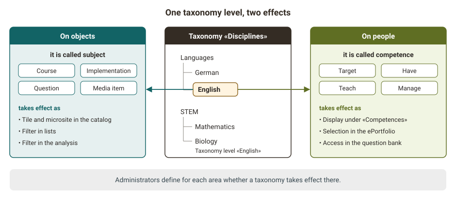{ class="shadow lightbox" title="Subject and competence · 2026.10.08" }

[To the top of the page ^](#taxonomy_concept)

## Where taxonomy takes effect {: #areas}

For subjects to be available for selection in an area, two steps are needed in the system administration:

1. Create a taxonomy and create taxonomy levels in it, under `Administration > Modules > Taxonomy`. The question bank is the exception: for it, OpenOlat has already created the taxonomy "Question pool", initially without taxonomy levels, see [Question bank](#question_pool).
2. Select the taxonomy in each area in which it is to take effect. Each area has its own setting for this, see table.

If you see no subjects for selection in an area, administrators have not yet selected a taxonomy there. Which taxonomy is selected in which areas is shown in the overview in the system administration under `Administration > Modules > Taxonomy`, for example for the areas "Learning resources / Catalog" and "Course Planner". [:octicons-tag-16:{ title="from Release 20.3.0 (OO-9185)" }](https://track.frentix.com/issue/OO-9185){:target="_blank"}

| Area | What the taxonomy is used for | Where administrators select it in the system administration |
|---|---|---|
| Learning resources / Catalog | Subjects of learning resources; launchers (sections of the catalog start page) and filters in the catalog | `Administration > Modules > Learning resource`, field "Taxonomy", several taxonomies possible |
| Course Planner | Subjects of implementations and elements | `Administration > Modules > Course Planner`, field "Linked taxonomies", several taxonomies possible |
| Question bank | Subjects of questions | `Administration > e-Assessment > Question bank`, switch "Subjects". The field "Taxonomy" shows the taxonomy "Question pool", it is permanently assigned. |
| ePortfolio | Competences in portfolio entries | `Administration > e-Assessment > ePortfolio`, switch "Enable taxonomy linking" and field "Linked taxonomies" |
| Media Center | Field "Subjects" of a media item | `Administration > Modules > Media Center`, field "Linked taxonomies"; without a selection, the taxonomies of Learning resources / Catalog apply |

Three further functions have no setting of their own. They use the taxonomy of an area from the table. Subjects are therefore only available there if this area has selected a taxonomy:

- **Events**: If an event belongs to a course, the taxonomies of Learning resources / Catalog apply. If it belongs to an implementation, the taxonomies of the Course Planner apply.
- **Course element "Practice"**: It uses the taxonomy of the question bank.
- **Quality management**: A data collection takes over the subjects of the course or of the element in the Course Planner it belongs to.

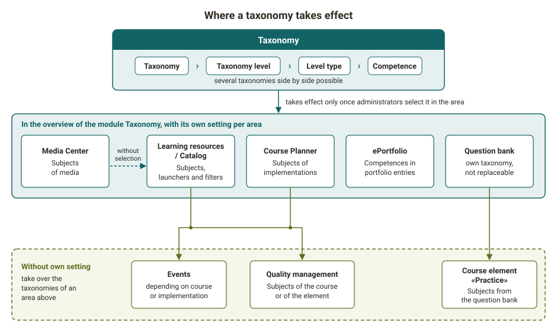{ class="shadow lightbox" title="Areas in which a taxonomy takes effect · 2026.10.08" }

The areas do not share their selection. What is selected for Learning resources / Catalog is not automatically available in the Course Planner. Anyone who wants to sort courses, implementations and media by the same disciplines selects the same taxonomy in each of these areas.

Two areas behave differently:

- **Question bank**: OpenOlat creates the taxonomy "Question pool" for the question bank. It is initially empty and cannot be replaced by another one. Its taxonomy levels are called subjects in the question bank. Administrators create them with "Create new taxonomy level" in three places: in the system administration under `Administration > Modules > Taxonomy` in the taxonomy "Question pool" and under `Administration > e-Assessment > Question bank` in the tab "Subjects", as well as in the question bank under `Question bank > Administration > Subject`. In the question bank, question bank managers may also do this if administrators allow them to edit the settings "Subjects". You can add new subjects at any time. In the other areas, the taxonomy "Question pool" is available for selection like any other taxonomy.
- **Media Center**: If the overview in the system administration under `Administration > Modules > Taxonomy` shows "disabled" for the Media Center, but media still receive subjects, no taxonomy is linked for the Media Center. It then uses the taxonomies of Learning resources / Catalog.

[To the top of the page ^](#taxonomy_concept)

## Subjects on courses, questions and media {: #subjects}

Anyone who wants to make a course, a question or a media item findable by discipline assigns subjects to it. Where this happens depends on the area. For a course, authors select them in the course settings in the tab "Metadata". The field is called "Subjects" there, "Subjects / Catalog" when the catalog is enabled. In the Media Center it is called "Subjects" as well. The field only offers taxonomy levels from the taxonomies that are selected for the area. For a question, you select the subject in the metadata of the question, section "General", field "Subject". The subjects of the question bank are available for selection there.

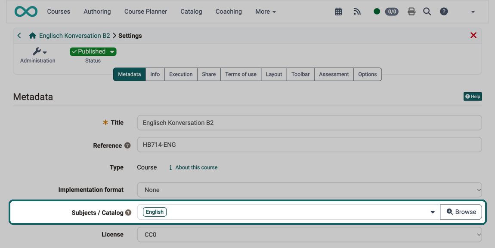{ class="shadow lightbox" title="Metadata tab in the course settings · 2026.10.09" }

A course can belong to several subjects. In the catalog, it appears on the microsite of each of these subjects, see [Launcher and microsite](#launcher).

For an image in the Media Center, the AI can suggest the subject, see [automatic assignment by AI](../../manual_admin/administration/Modules_Taxonomy.md#ai_matching). It searches the same taxonomies as the field "Subjects".

[To the top of the page ^](#taxonomy_concept)

## Launcher and microsite in the catalog [:octicons-tag-16:{ title="from Release 17.0.0 (OO-6146)" }](https://track.frentix.com/issue/OO-6146){:target="_blank"} {: #launcher}

In the catalog, the taxonomy becomes a navigation through which people find offers by discipline. The start page of the catalog consists of sections, the launchers. A launcher of the type "Taxonomy level" shows taxonomy levels as tiles. In the field "Type", administrators choose whether the launcher refers to a whole taxonomy or to a single taxonomy level. The launcher shows their direct sublevels, see [Module Catalog: Tab Launch page](../../manual_admin/administration/Modules_Catalog_2.0.md#tab_start_page).

Clicking a tile opens the microsite of this taxonomy level. Its header shows the background image, the title of the level and, if the level has one, its level type. Below follow the description of the level, the tiles of its sublevels and the offers with this subject.

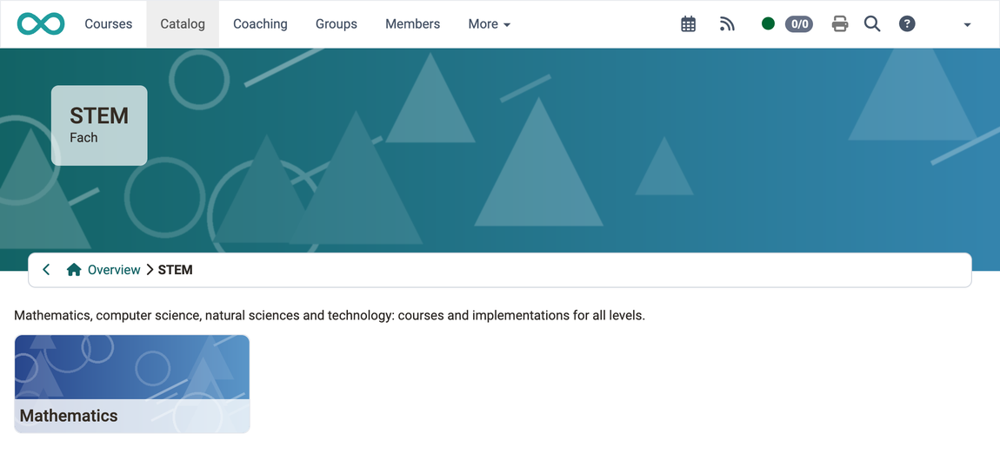{ class="shadow lightbox" title="Microsite of the taxonomy level STEM in the catalog · 2026.10.09" }

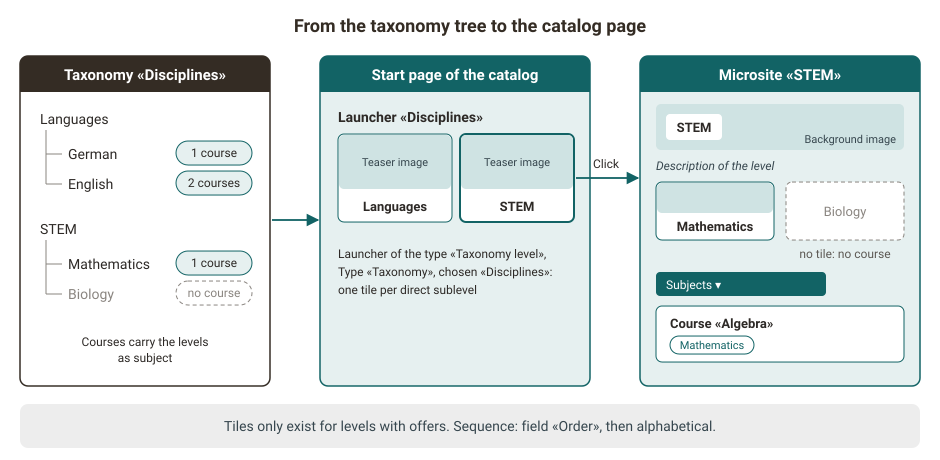{ class="shadow lightbox" title="From the taxonomy tree to the catalog page · 2026.10.08" }

Three rules determine what the launcher shows:

- **Only levels with offers**: If you do not see a taxonomy level as a tile in the launcher or on a microsite, neither it nor any of its sublevels has an offer in the catalog. The tile appears as soon as an offer carries this subject.
- **Sequence**: The tiles appear in the order of the field "Order" of the taxonomy levels. Levels without an order follow alphabetically by title.
- **Images**: The tile shows the teaser image of the taxonomy level, the header of the microsite its background image. Both images belong to the taxonomy level, see [Module Taxonomy](../../manual_admin/administration/Modules_Taxonomy.md).

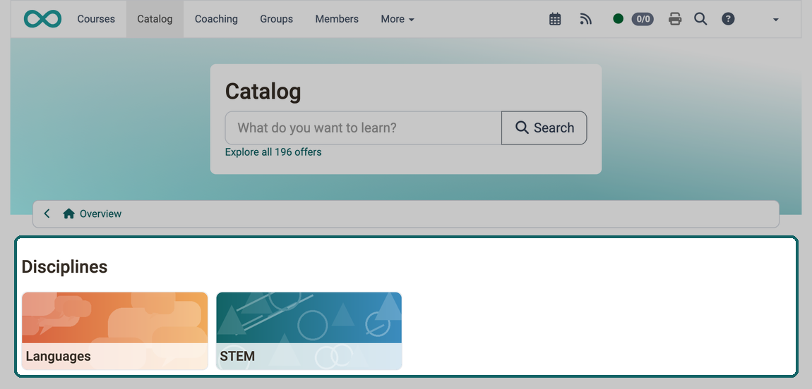{ class="shadow lightbox" title="Start page of the catalog · 2026.10.09" }

### Implementations in the catalog [:octicons-tag-16:{ title="from Release 20.0.0 (OO-8301)" }](https://track.frentix.com/issue/OO-8301){:target="_blank"} {: #catalog_course_planner}

Anyone who wants to make courses and implementations findable in the catalog by the same subjects selects the same taxonomy in both areas. Implementations appear as offers in the catalog; their subjects come from the taxonomies of the Course Planner. Launchers and filters of the catalog only offer taxonomy levels from the taxonomies that are selected for Learning resources / Catalog. If you cannot set up a launcher or a filter in the catalog for the subjects of implementations, the taxonomy is only selected in the Course Planner. Select it additionally for Learning resources / Catalog.

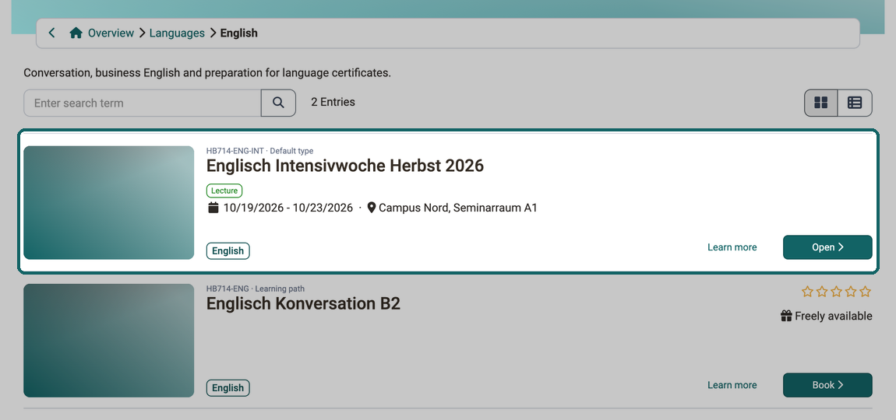{ class="shadow lightbox" title="Microsite of the taxonomy level English in the catalog · 2026.10.09" }

### Deselect a taxonomy [:octicons-tag-16:{ title="from Release 20.3.0 (OO-9214)" }](https://track.frentix.com/issue/OO-9214){:target="_blank"} {: #deselect}

If you see the message "The taxonomy is still used in a launcher of the catalogue and therefore cannot be deselected." in the system administration, this taxonomy is set in a launcher of the type "Taxonomy level" on the start page of the catalog. Delete this launcher or set another taxonomy in it, see [Module Catalog: Tab Launch page](../../manual_admin/administration/Modules_Catalog_2.0.md#tab_start_page). Afterwards, the taxonomy can be deselected in the system administration under `Administration > Modules > Learning resource`. Switching a launcher off or leaving it without tiles is not enough.

[To the top of the page ^](#taxonomy_concept)

## Filters {: #filters}

With subjects, you narrow long lists down to one discipline: in the catalog, in the Media Center, in the lists of events and in the analysis of the quality management. In the Media Center, the filter is called "Subject paths" and offers the taxonomy levels of the taxonomies that apply to the Media Center.

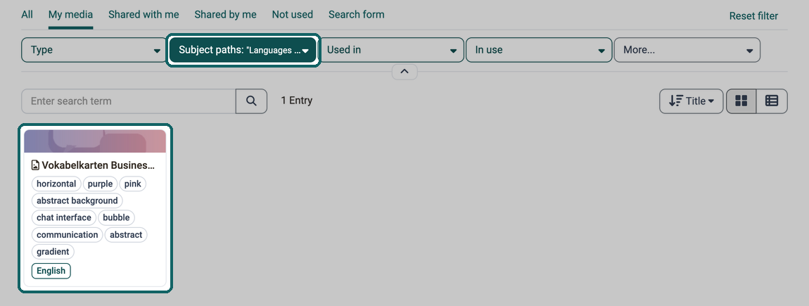{ class="shadow lightbox" title="User tools, Media Center · 2026.10.09" }

### Catalog [:octicons-tag-16:{ title="from Release 17.2.0 (OO-6326)" }](https://track.frentix.com/issue/OO-6326){:target="_blank"} {: #filters_catalog}

In the catalog, people narrow the offers down to a subject with filters. Which filters the catalog shows is defined by administrators in the system administration under `Administration > Modules > Catalog` in the tab "Filters". For taxonomies, there are two filter types:

- **Taxonomy level**: The filter carries the title of a selected taxonomy level and offers all its sublevels for selection, including sublevels without an offer.
- **Taxonomy sublevel**: The filter appears on a microsite as "Subjects" as soon as a sublevel of the opened taxonomy level has an offer. It offers the opened taxonomy level and the sublevels to which at least one offer is assigned. With the option "Show learning resource of taxonomy sublevels" in the field "Default", administrators define whether the microsite shows the offers of the sublevels from the start.

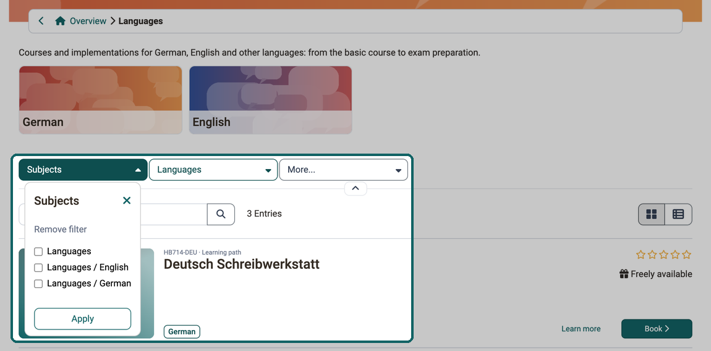{ class="shadow lightbox" title="Microsite of the taxonomy level Languages in the catalog · 2026.10.09" }

### Events [:octicons-tag-16:{ title="from Release 20.1.2 (OO-8436)" }](https://track.frentix.com/issue/OO-8436){:target="_blank"} {: #events}

Anyone who assigns events to subjects chooses from the taxonomies of the area the event belongs to. For an event of a course, these are the taxonomies of Learning resources / Catalog, for an event of an implementation the taxonomies of the Course Planner. If an event belongs to both, both are available for selection.

In the lists of events, the column "Subjects" and the filter "Subject paths" are hidden at first. You show the column via "Customize columns", the filter via "More...". The filter offers the taxonomy levels of the taxonomies of the Course Planner. If you do not find them there either, no taxonomy is linked for the Course Planner. This also applies to events of courses.

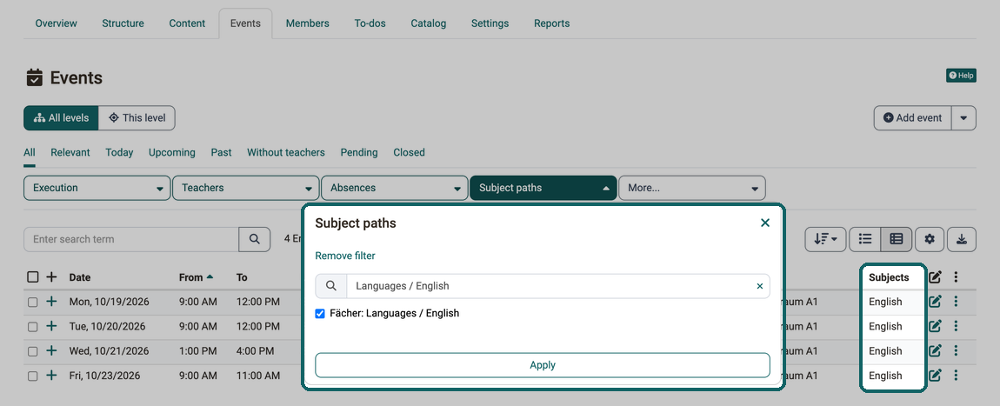{ class="shadow lightbox" title="Course Planner, tab Events of an implementation · 2026.10.09" }

### Quality management {: #quality_management}

Anyone who wants to evaluate the results of data collections for a single discipline narrows the analysis of the quality management down to its subject. There is the filter "Subject" for this. It evaluates the subjects that a data collection has taken over from its course or its element in the Course Planner, see [Quality Management: Analysis](../area_modules/Quality_Management_Analysis.md).

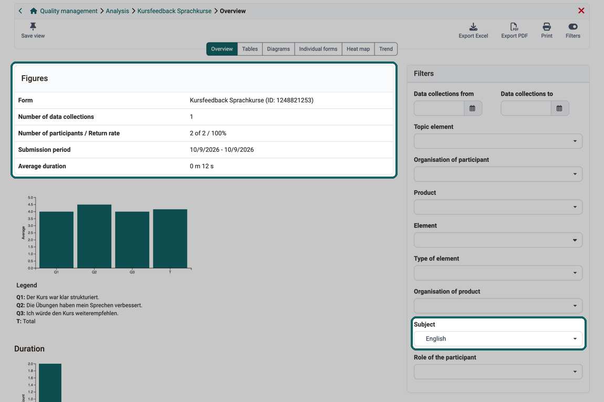{ class="shadow lightbox" title="Quality management, analysis of a form · 2026.10.09" }

[To the top of the page ^](#taxonomy_concept)

## Competences {: #competences}

Anyone who wants to know who teaches, manages or masters a discipline finds this in the competences. A competence links a person with a taxonomy level. The competence type says in which relation the person stands to this level. A competence can carry an expiry date.

| Competence type | Meaning | Where OpenOlat evaluates it |
|---|---|---|
| Target | The person aims for the competence. | for the person under "Competences" |
| Have | As soon as a person assigns a competence to an entry in their [ePortfolio](../area_modules/Portfolio_General_Information.md) in the field "Competences", OpenOlat automatically enters this competence for them. | in the ePortfolio for the entries, for the person under "Competences" |
| Teach | The person teaches the discipline and passes on their knowledge. | Question bank: access to the subjects |
| Manage | The person manages this part of the taxonomy. | Question bank: access to the subjects and to final questions; catalog: editing the taxonomy level in the catalog management |

Which subjects a person sees in the question bank is determined by their Teach and Manage competences. Whether they can assign questions only to these subjects is controlled by the setting "Selectable subjects". Who sees final questions is controlled by the setting "Visibility of final questions". Both settings are described on the page [e-Assessment Administration: Question bank](../../manual_admin/administration/eAssessment_Question_bank.md). If the review process is switched on, these subjects also appear in the menu of the question bank under "My question bank", "Review" and "Final".

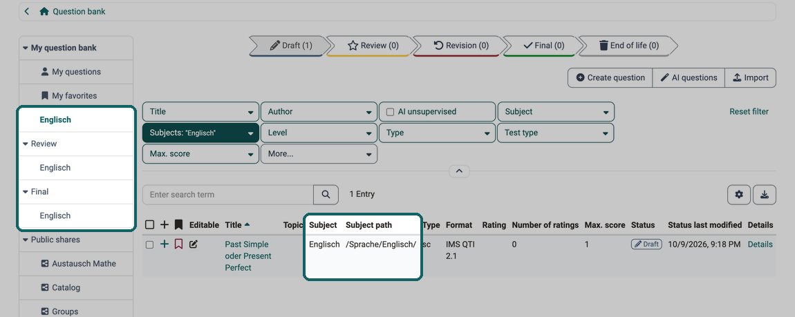{ class="shadow lightbox" title="Question bank, My question bank · 2026.10.09" }

Competences come about in three ways:

- Administrators assign them in the system administration on a taxonomy level, the Manage competence in the tab "Management", the others in the tab "Competences": `Administration > Modules > Taxonomy > "Taxonomy title" > "Taxonomy level"`.
- User managers, roles managers and administrators assign them to a person in the user management: `User management > "Person" > Tab "Competences"`.
- The Have competence comes about in the ePortfolio as soon as a person assigns a competence to one of their entries.

Each person sees their own competences in the user tools under [Competences](../personal_menu/Competences.md).

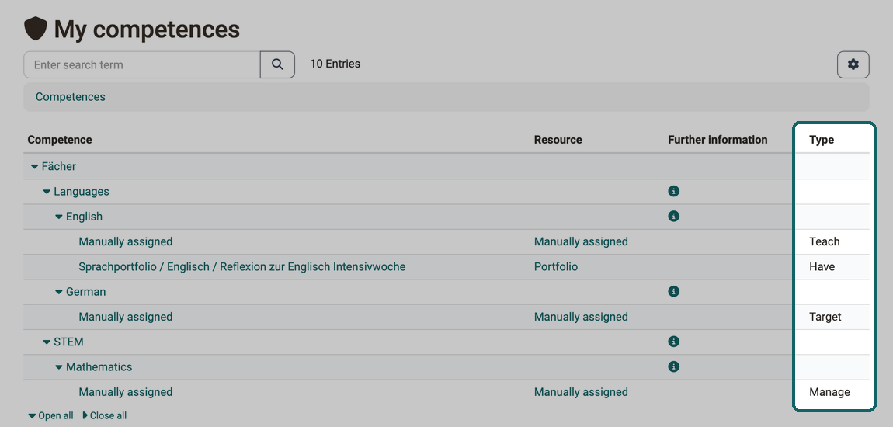{ class="shadow lightbox" title="User tools, Competences · 2026.10.09" }

### Competences in the ePortfolio [:octicons-tag-16:{ title="from Release 15.5.0 (OO-5178)" }](https://track.frentix.com/issue/OO-5178){:target="_blank"} {: #eportfolio}

Anyone who wants to record in the ePortfolio which competences an entry belongs to assigns competences to it: in the header of the entry next to "Competences" via "Add" or "Edit", or under "Edit metadata" in the field "Competences". The selection list shows the taxonomy and the path of each taxonomy level. Available for selection from the linked taxonomies are the taxonomy levels whose level type carries the setting "Competences", as well as levels without a level type. The linking only takes effect once administrators activate the switch "Enable taxonomy linking" in the system administration under `Administration > e-Assessment > ePortfolio` and select at least one taxonomy. If competences disappear from portfolio entries, administrators have switched off the setting "Competences" on their level type. OpenOlat then removes all levels of this type from the entries.

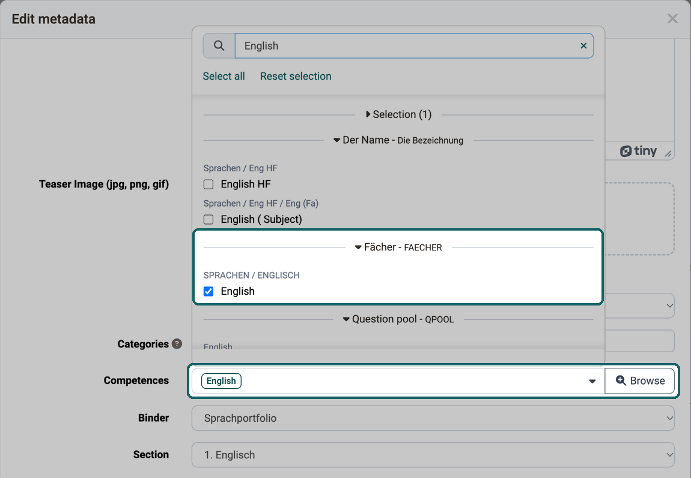{ class="shadow lightbox" title="ePortfolio, metadata of an entry · 2026.10.09" }

### Subjects in the evidence of achievement [:octicons-tag-16:{ title="from Release 16.1.0 (OO-5788)" }](https://track.frentix.com/issue/OO-5788){:target="_blank"} {: #evidence_of_achievements}

So that evidence of achievement from the Course Planner can be found sorted by discipline, OpenOlat groups the elements of a product in the list of [evidence of achievement](../personal_menu/Evidence_of_Achievements.md) by their subjects. You see the grouping when you select the tile of the product at the top. The views "All Evidence of Achievements" and "Individual Courses" show the evidence of achievement without grouping. Only subjects whose level type carries the setting "Evidence of achievement" count for the grouping.

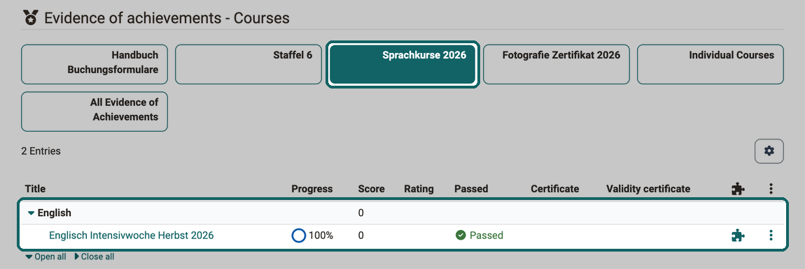{ class="shadow lightbox" title="User tools, Evidence of achievement · 2026.10.09" }

[To the top of the page ^](#taxonomy_concept)

## Setup {: #setup}

How administrators create a taxonomy, create level types and taxonomy levels, assign competences and import taxonomies is described on the page [Module Taxonomy](../../manual_admin/administration/Modules_Taxonomy.md) in the administration manual. The selection of the taxonomy per area is described on the pages of the individual modules:

- [Module Learning resource](../../manual_admin/administration/Modules_Learning_Resource.md)
- [Module Course Planner](../../manual_admin/administration/Modules_Course_Planner.md#linked_taxonomies)
- [e-Assessment Administration: ePortfolio](../../manual_admin/administration/eAssessment_ePortfolio.md#taxonomy_linking)
- [Module Media Center](../../manual_admin/administration/Modules_Media_Center.md#taxonomy)

Administrators set up the launchers and filters of the catalog in the system administration under `Administration > Modules > Catalog`, see [Module Catalog](../../manual_admin/administration/Modules_Catalog_2.0.md).

[To the top of the page ^](#taxonomy_concept)

## Further information {: #further_information}

**Mentioned on this page** 
[Module Taxonomy >](../../manual_admin/administration/Modules_Taxonomy.md) 
[Module Catalog >](../../manual_admin/administration/Modules_Catalog_2.0.md) 
[Quality Management: Analysis >](../area_modules/Quality_Management_Analysis.md) 
[Portfolio - General Information >](../area_modules/Portfolio_General_Information.md) 
[e-Assessment Administration: Question bank >](../../manual_admin/administration/eAssessment_Question_bank.md) 
[User tools: Competences >](../personal_menu/Competences.md) 
[Personal achievements/successes: Evidence of Achievements >](../personal_menu/Evidence_of_Achievements.md) 
[Module Learning resource >](../../manual_admin/administration/Modules_Learning_Resource.md) 
[Module Course Planner >](../../manual_admin/administration/Modules_Course_Planner.md) 
[e-Assessment Administration: ePortfolio >](../../manual_admin/administration/eAssessment_ePortfolio.md) 
[Module Media Center >](../../manual_admin/administration/Modules_Media_Center.md)

**Further reading** 
[Catalog 2.0: Overview >](../area_modules/catalog2.0.md) 
[Catalog 2.0 - Offers >](../area_modules/catalog2.0_angebote.md) 
[Catalog 2.0 - Management >](../area_modules/catalog2.0_mgmt.md) 
[Question Bank: Overview >](../area_modules/Question_Bank.md) 
[Question Bank: Administration >](../area_modules/Question_Bank_Administration.md) 
[Competences tags >](../area_modules/Competences_tags.md) 
[Information and settings for items in the Media Center >](Media_Center_Items.md) 
[Course Element "Practice" >](../learningresources/Course_Element_Practice.md)

[To the top of the page ^](#taxonomy_concept)
