# Nutzungsbedingungen {: #terms_of_use}

## Welche Nutzungsbedingungen müssen akzeptiert werden?

Wenn Sie OpenOlat oder bestimmte Elemente darin zum ersten Mal nutzen, kann eine Zustimmung zu den Nutzungsbedingungen erforderlich sein. Wird dies vom Systembetreiber oder Besitzer:innen eines Kurses oder sonstigen Elements verlangt, können verschiedene Nutzungsbedingungen zur Bestätigung eingeblendet werden.

[Nutzungsbedingungen der OpenOlat-Plattform >](#terms_of_use_platform)

[Nutzungsbedingungen eines Kurses >](#terms_of_use_course)

[Nutzungsbedingungen eines Formulars >](#terms_of_use_form)

[Nutzungsbedingungen externer Werkzeuge >](#terms_of_use_external_tools)

!!! note "Hinweis"

    Neben den Nutzungsbedingungen können auch Bestimmungen zum Datenschutz angezeigt werden und Zustimmung erfordern.

## Nutzungsbedingungen der OpenOlat-Plattform {: #terms_of_use_platform}

### Bestätigung durch OpenOlat-Benutzer:innen beim ersten Aufruf

Beim ersten Aufruf von OpenOlat werden alle Benutzer:innen um Bestätigung der Nutzungsbedingungen gebeten.
Lehnen Sie ab, kehren Sie zurück zur Login-Maske.

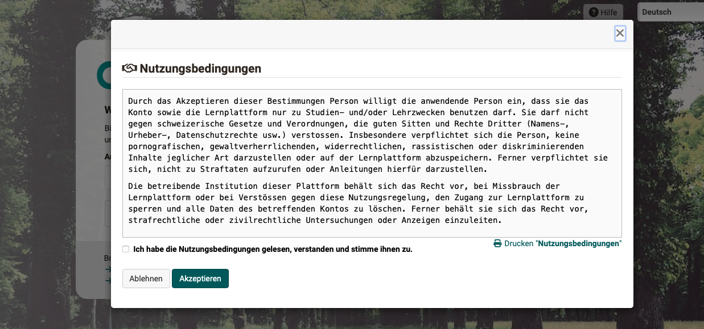{ class="shadow lightbox" }

### Nutzungsbedingungen der Plattform definieren {: #terms_of_use_platform_define}

**Administrator:innen** können in der Systemadministration unter **Customizing > Impressum** den Text der Nutzungsbedingungen definieren. Für jede aktivierte Sprache kann ein eigener Text erstellt werden.

{ class="shadow lightbox" }

### Akzeptierte Nutzungsbedingungen nachlesen {: #terms_of_use_platform_verify}

Alle Benutzer:innen können die Nutzungsbestimmungen, denen sie einmal zugestimmt haben, in ihrem persönlichen Menü jederzeit nachlesen: **Persönliches Menü > Einstellungen > Tab "Nutzungsbedingungen"**

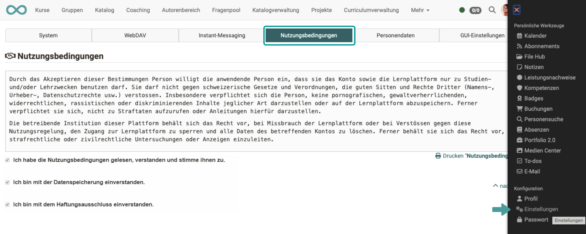{ class="shadow lightbox" }

[Zum Seitenanfang ^](#terms_of_use)

## Nutzungsbedingungen in den Kurseinstellungen {: #terms_of_use_course}

### Bestätigung durch Lernende im Kurs

Beim ersten Aufruf eines Kurses kann eine weitere Bestätigung von Nutzungsbedingungen erforderlich sein, denn die Kursbesitzer:innen können für ihren Kurs jeweils **kursspezifische** Nutzungsbedingungen definieren, die von den Teilnehmer:innen akzeptiert werden müssen. 

### Nutzungsbedingungen eines Kurs definieren

Kursbesitzer:innen können für ihren Kurs eine kurspezifische Nutzungsbedingung erstellen unter 
**Administration > Einstellungen > Tab "Nutzungsbedingungen"**. Der Texteditor wird angezeigt, sobald die Checkbox "Nutzungsbedingungen" angehakt ist.

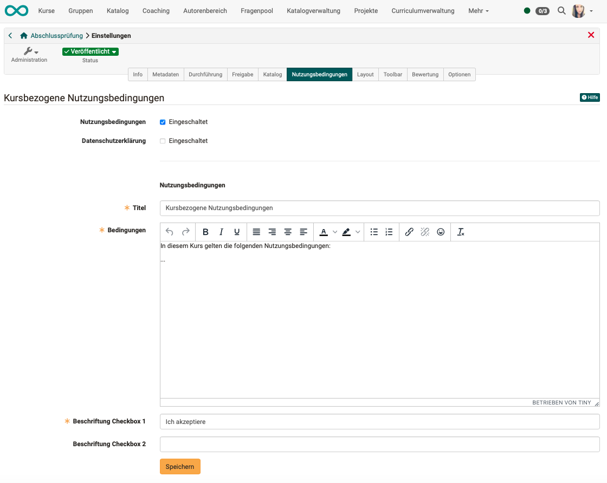{ class="shadow lightbox" }

Am unteren Rand des Screens definieren Sie, welcher Text den Teilnehmer:innen neben ihrer Checkbox zum Akzeptieren der Nutzungsbedingungen angezeigt wird.

Zusätzlich kann noch eine zweite Checkbox mit einem beliebigen Beschreibungstext zur Bestätigung definiert werden. Wird ein Text eingegeben, müssen beide Checkboxen von den Teilnehmer:innen bestätigt werden, damit die Nutzungsbedingung als akzeptiert gilt. Ist kein Beschreibungstext eingegeben, wird die zweite Checkbox den Teilnehmer:innen nicht angezeigt.

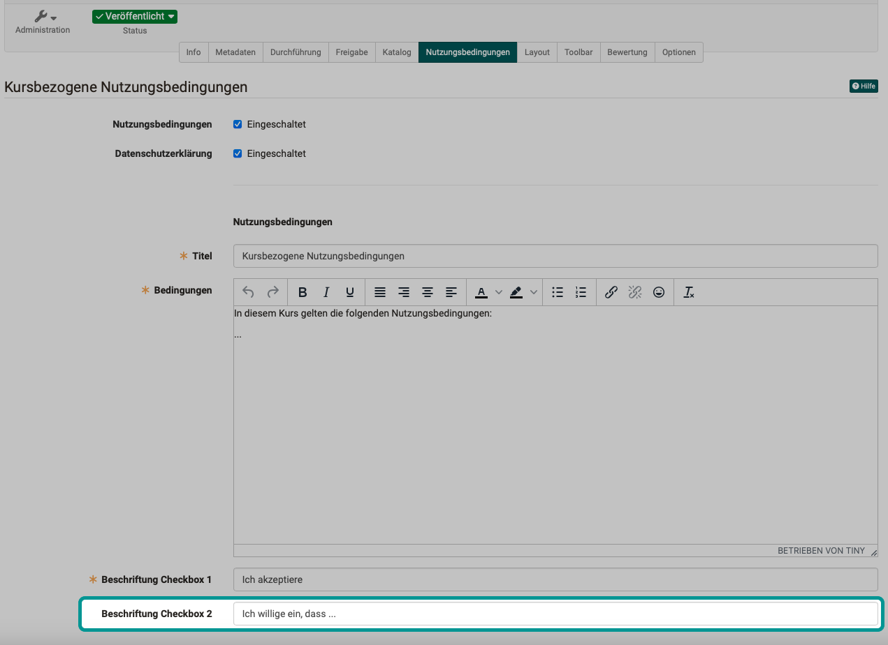{ class="shadow lightbox" }

### Bestätigungsaufforderung für einen Kurs aktivieren

Damit die Nutzungsbedingungen angezeigt werden, müssen sie durch den/die Kursbesitzer:in eingeschaltet werden.
Wurde ein Text für die Nutzungsbedingung erfasst, bleibt er nach dem Speichern erhalten, unabhängig davon, ob die Anzeige aktiviert ist. Sie können eingefügte Nutzungsbedingungen also z.B. bearbeiten und dann so lange deaktivieren, bis die finale Version erstellt ist.

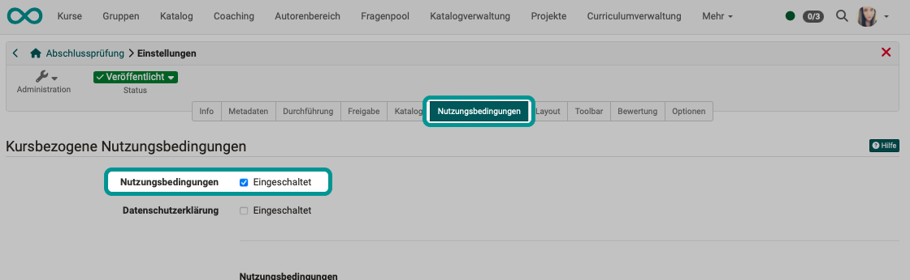{ class="shadow lightbox" }

### Verwaltung der Nutzungsbedingungen in der Mitgliederverwaltung

Wer von den Kursteilnehmer:innen seine Zustimmung zu den kurspezifischen Nutzungsbedingungen gegeben hat, ist für den/die Kursbesitzer:in einsehbar unter **Administration > Mitgliederverwaltung > Einwilligungen**. 

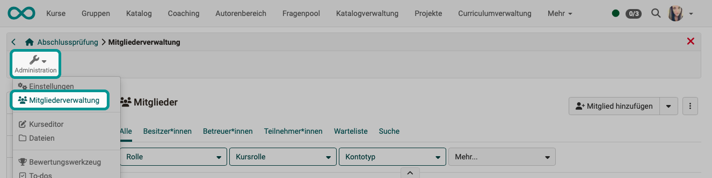{ class="shadow lightbox" }

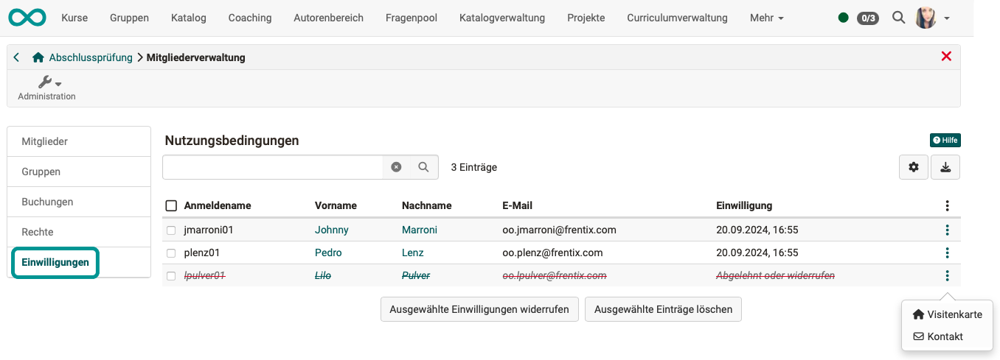{ class="shadow lightbox" }

* Lehnt ein/eine Teilnehmer:in ab, kann direkt mit der betroffenen Person Kontakt aufgenommen werden.
* Wird eine einmal gegebene Einwilligung widerrufen, können Kursbesitzer:innen die Zustimmung hier auch zurücksetzen/löschen.

### Übernahme von Nutzungsbedingungen beim Kopieren von Kursen

Lernpfad-Kurse können mit Hilfe eines Wizards kopiert werden (**Kurs wählen > Administration > Kopieren mit Wizard**). Mit diesem Wizard kann vor der Ausführung des Kopiervorgangs festgelegt werden, welche Einstellungen in die Kopie übernommen werden sollen. Unter anderem können so auch die Nutzungsbedingungen übernommen werden.

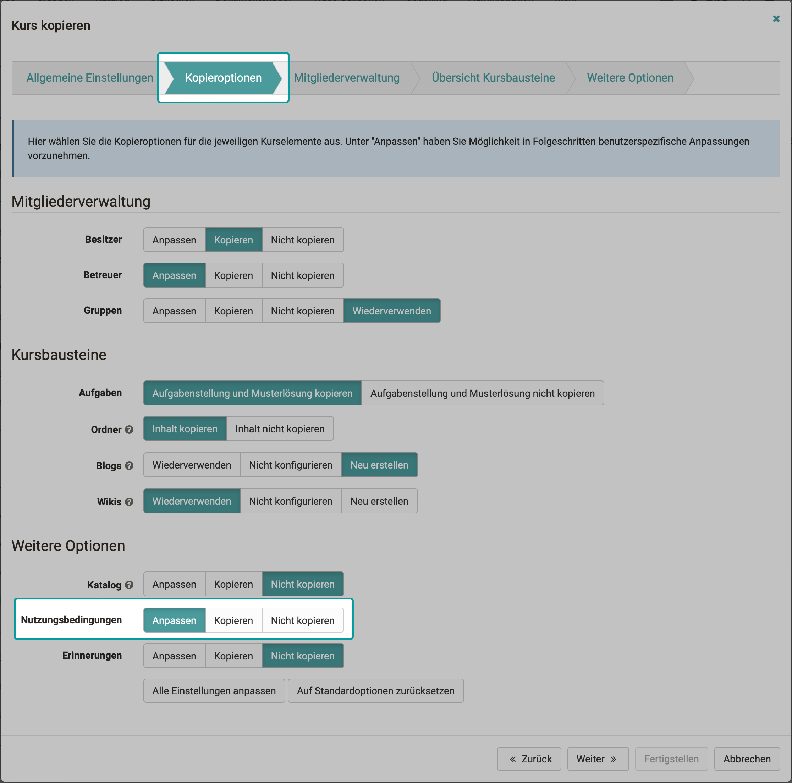{ class="shadow lightbox" }

[Zum Seitenanfang ^](#terms_of_use)

## Nutzungsbedingungen in Formularen {: #terms_of_use_form}

### Bestätigung durch Lernende

Auch beim Ausfüllen eines Formulars kann der erfasste Inhalt es erforderlich machen, dass die Teilnehmer:innen eine Erklärung zu den Nutzungsbedingungen akzeptieren. 

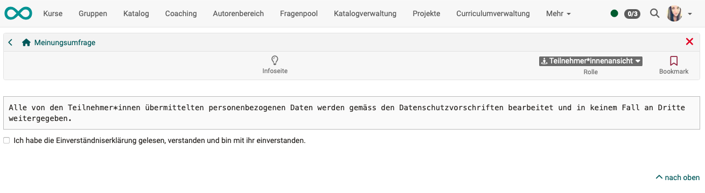{ class="shadow lightbox" }

### Nutzungsbedingungen eines Formulars definieren

Innerhalb der Lernressource "Formular" gibt es ein eigenes Element, das im Formulareditor von Autor:innen eingefügt werden kann.

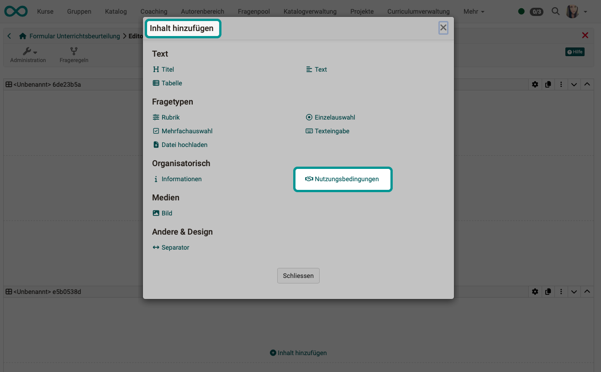{ class="shadow lightbox" }
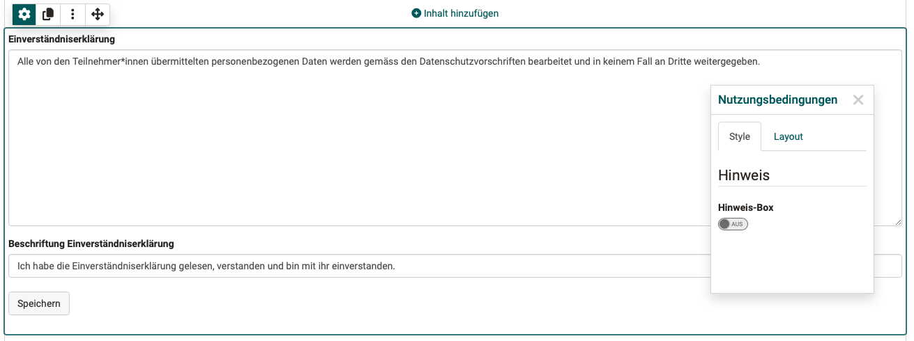{ class="shadow lightbox" }

[Zum Seitenanfang ^](#terms_of_use)

## Nutzungsbedingungen externer Werkzeuge {: #terms_of_use_external_tools}

In OpenOlat sind an einigen Stellen externe Werkzeuge eingebunden (meistens ebenfalls OpenSource, aber nicht von Frentix entwickelt), für die ebenfalls vor Benutzung die Bedingungen akzeptiert werden müssen.

Beispiel **draw.io** 
    draw.io ist ein Online-Werkzeug zur Erstellung von Diagrammen, das in OpenOlat in vielen Stellen eingesetzt werden kann, z.B. in Projekten, im Portfolio, im Kursbaustein "Datei", im Media Center bzw. an vielen Stellen an denen neue Dokumente erstellt werden können. In draw.io können auch mehrere Personen kooperativ an einem Diagramm arbeiten. 

[Zum Seitenanfang ^](#terms_of_use)

## Weiterführende Informationen

[Archivierung der Zustimmungen zu Nutzungsbedingungen durch Administrator:innen](../../manual_admin/usermanagement/Data_protection.de.md#export-von-benutzerdaten)

[Datenschutz](../../manual_admin/usermanagement/Data_protection.de.md)