# Nutzungsbedingungen {: #terms_of_use}

## Welche Nutzungsbedingungen müssen akzeptiert werden?

Wenn Sie OpenOlat oder bestimmte Elemente darin zum ersten Mal nutzen, kann eine Zustimmung zu den Nutzungsbedingungen erforderlich sein. Wird dies von der betreibenden Institution oder von Besitzer:innen eines Kurses oder sonstigen Elements verlangt, können verschiedene Nutzungsbedingungen zur Bestätigung eingeblendet werden.

[Nutzungsbedingungen der OpenOlat-Plattform >](#terms_of_use_platform)

[Nutzungsbedingungen eines Kurses >](#terms_of_use_course)

[Nutzungsbedingungen eines Formulars >](#terms_of_use_form)

[Nutzungsbedingungen externer Werkzeuge >](#terms_of_use_external_tools)

!!! note "Hinweis"

    Neben den Nutzungsbedingungen können auch Bestimmungen zum Datenschutz angezeigt werden und Zustimmung erfordern.

## Nutzungsbedingungen der OpenOlat-Plattform {: #terms_of_use_platform}

### Bestätigung durch OpenOlat-Benutzer:innen beim ersten Aufruf

Beim ersten Aufruf von OpenOlat werden alle Benutzer:innen um Bestätigung der Nutzungsbedingungen gebeten. Lehnen Sie ab, kehren Sie zurück zur Login-Seite.

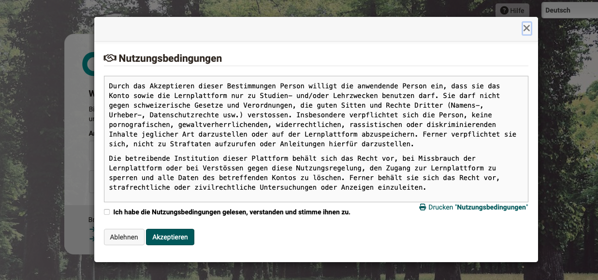{ class="shadow lightbox" }

### Nutzungsbedingungen der Plattform definieren {: #terms_of_use_platform_define}

**Administrator:innen** definieren den Text der Nutzungsbedingungen in der System-Administration unter `Administration > Customizing > Impressum`. Die Nutzungsbedingungen lassen sich nur hinterlegen, wenn das Impressum eingeschaltet ist. Für jede aktivierte Sprache kann ein eigener Text erstellt werden.

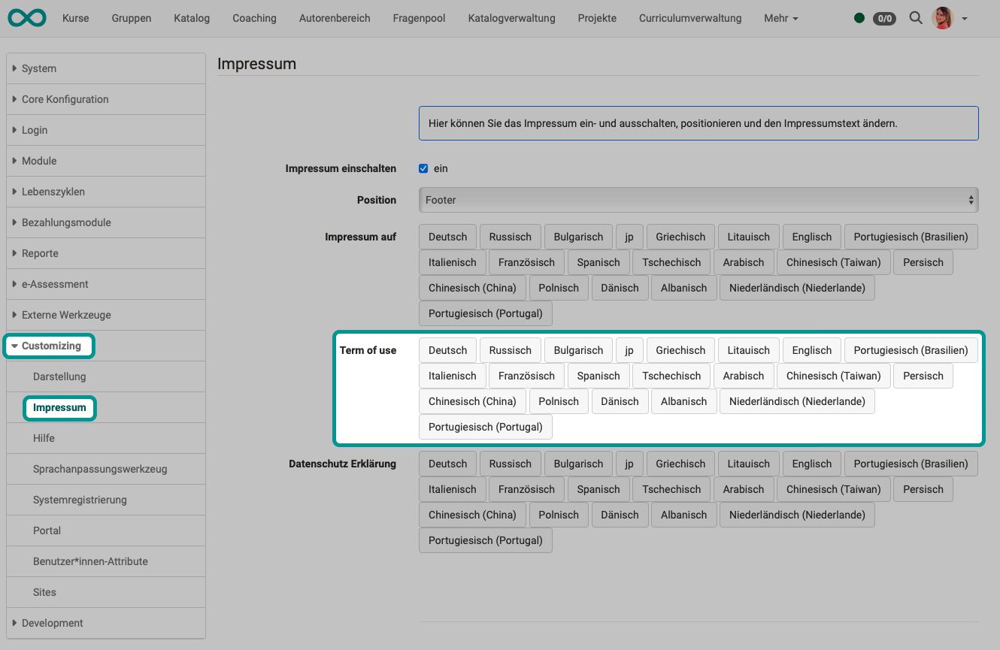{ class="shadow lightbox" }

### Akzeptierte Nutzungsbedingungen nachlesen {: #terms_of_use_platform_verify}

Alle Benutzer:innen können die Nutzungsbedingungen, denen sie einmal zugestimmt haben, in ihrem persönlichen Menü jederzeit nachlesen: `Persönliches Menü > Einstellungen > Tab "Nutzungsbedingungen"`

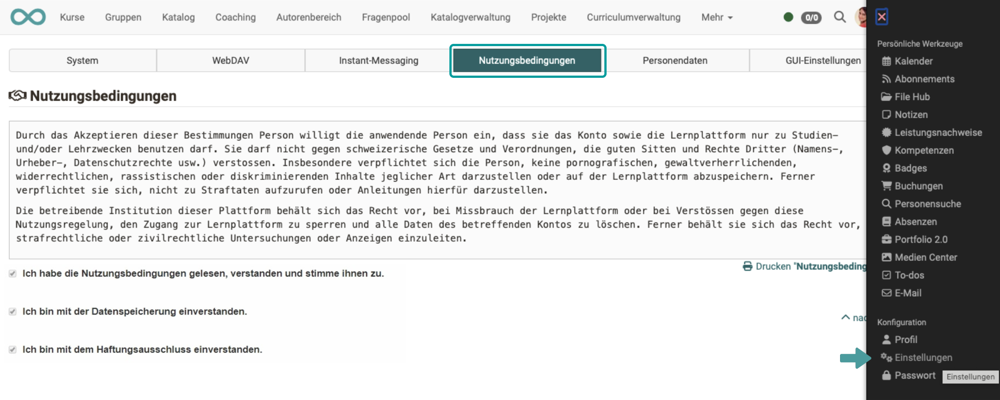{ class="shadow lightbox" }

[Zum Seitenanfang ^](#terms_of_use)

## Nutzungsbedingungen in den Kurseinstellungen {: #terms_of_use_course}

### Bestätigung durch Lernende im Kurs

Beim ersten Aufruf eines Kurses kann eine weitere Bestätigung von Nutzungsbedingungen erforderlich sein, denn die Kursbesitzer:innen können für ihren Kurs jeweils **kursspezifische** Nutzungsbedingungen definieren, die von den Teilnehmer:innen akzeptiert werden müssen.

### Nutzungsbedingungen eines Kurses definieren {: #terms_of_use_course_define}

Kursbesitzer:innen erstellen für ihren Kurs kursspezifische Nutzungsbedingungen unter: `Kurs > Administration > Einstellungen > Tab "Nutzungsbedingungen"`

Der Texteditor wird angezeigt, sobald die Checkbox "Nutzungsbedingungen" angehakt ist. Auf demselben Tab kann zusätzlich eine kursbezogene Datenschutzerklärung eingeschaltet werden; sie ist gleich aufgebaut.

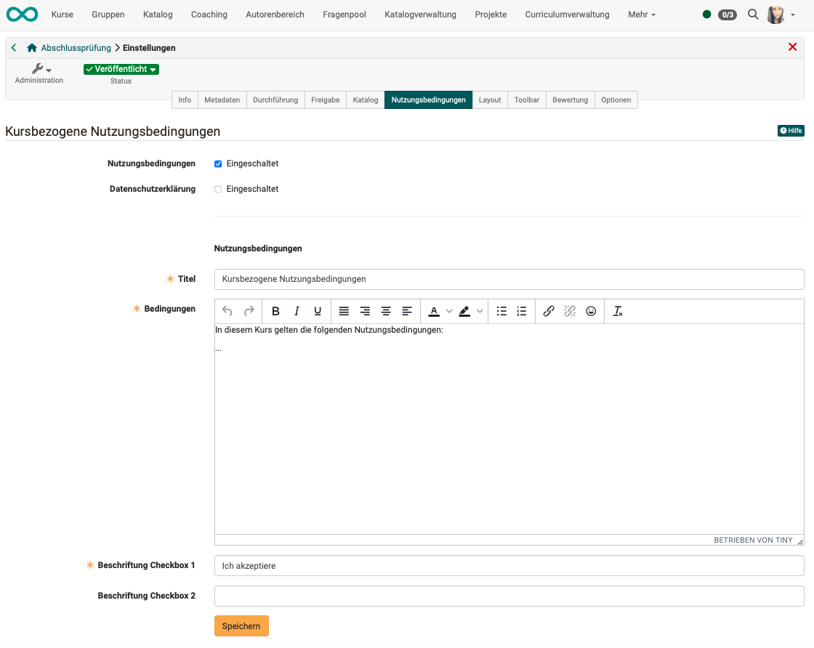{ class="shadow lightbox" }

Im Feld "Beschriftung Checkbox 1" am unteren Rand der Seite definieren Sie, welcher Text den Teilnehmer:innen neben ihrer Checkbox zum Akzeptieren der Nutzungsbedingungen angezeigt wird.

Zusätzlich kann im Feld "Beschriftung Checkbox 2" eine zweite Checkbox mit einem beliebigen Beschreibungstext zur Bestätigung definiert werden. Wird ein Text eingegeben, müssen beide Checkboxen von den Teilnehmer:innen bestätigt werden, damit die Nutzungsbedingungen als akzeptiert gelten. Ist kein Beschreibungstext eingegeben, wird die zweite Checkbox den Teilnehmer:innen nicht angezeigt.

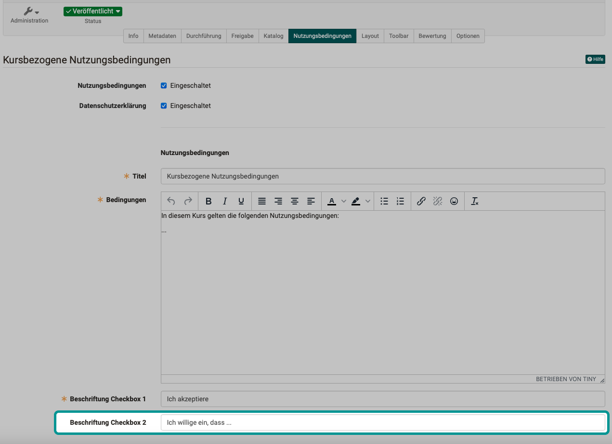{ class="shadow lightbox" }

### Bestätigungsaufforderung für einen Kurs aktivieren

Damit die Nutzungsbedingungen angezeigt werden, müssen sie durch die Kursbesitzer:in eingeschaltet werden. Wurde ein Text für die Nutzungsbedingungen erfasst, bleibt er nach dem Speichern erhalten, unabhängig davon, ob die Anzeige aktiviert ist. Sie können eingefügte Nutzungsbedingungen also z.B. bearbeiten und dann so lange deaktivieren, bis die finale Version erstellt ist.

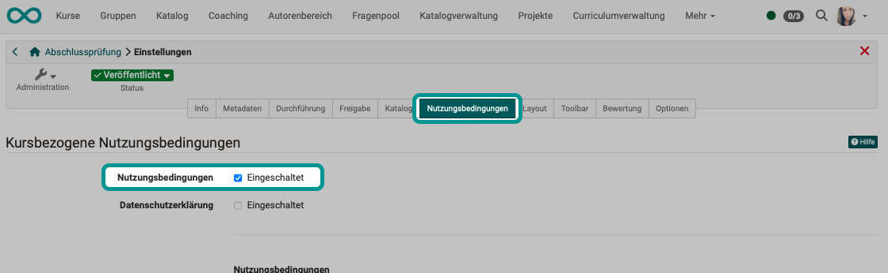{ class="shadow lightbox" }

### Verwaltung der Nutzungsbedingungen in der Mitgliederverwaltung

Welche Kursteilnehmer:innen ihre Zustimmung zu den kursspezifischen Nutzungsbedingungen gegeben haben, sehen Kursbesitzer:innen in der [Mitgliederverwaltung](../learningresources/Members_management.de.md) unter: `Kurs > Administration > Mitgliederverwaltung > Einwilligungen`

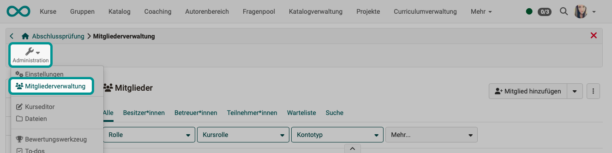{ class="shadow lightbox" }

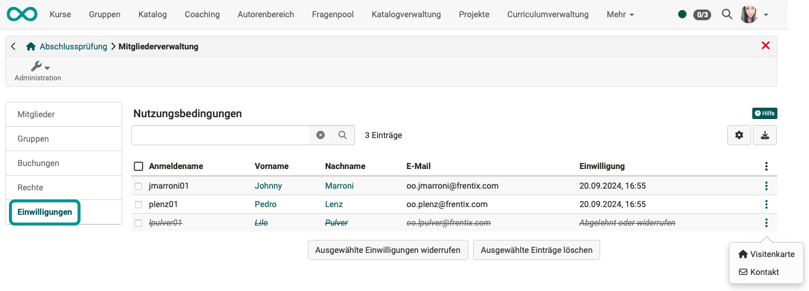{ class="shadow lightbox" }

* Lehnt eine Teilnehmer:in ab, kann direkt mit der betroffenen Person Kontakt aufgenommen werden.
* Kursbesitzer:innen können ausgewählte Einwilligungen widerrufen oder die Einträge löschen.

### Übernahme von Nutzungsbedingungen beim Kopieren von Kursen

[Lernpfadkurse](../learningresources/Creating_learning_path_courses.de.md) können mit Hilfe eines Wizards kopiert werden: `Kurs > Administration > Kopieren mit Wizard`. Mit diesem Wizard kann vor der Ausführung des Kopiervorgangs festgelegt werden, welche [Kurseinstellungen](../learningresources/Course_Settings.de.md) in die Kopie übernommen werden sollen. Unter anderem können so auch die Nutzungsbedingungen übernommen werden.

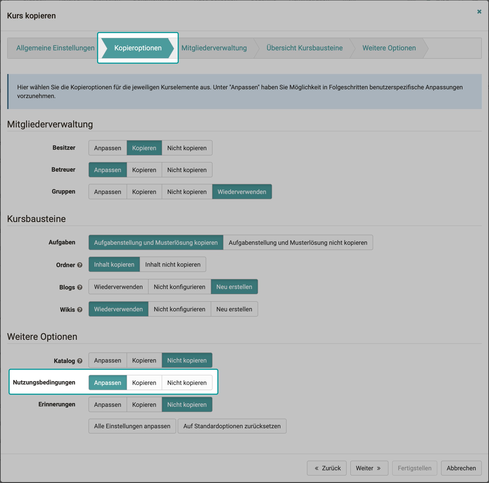{ class="shadow lightbox" }

[Zum Seitenanfang ^](#terms_of_use)

## Nutzungsbedingungen in Formularen {: #terms_of_use_form}

### Bestätigung durch Lernende

Auch beim Ausfüllen eines Formulars kann der erfasste Inhalt es erforderlich machen, dass die Teilnehmer:innen eine Erklärung zu den Nutzungsbedingungen akzeptieren.

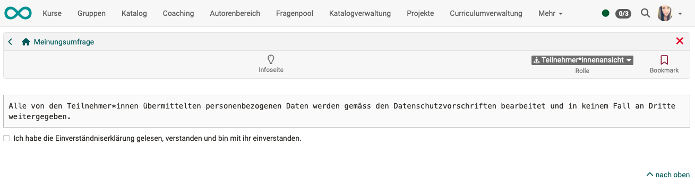{ class="shadow lightbox" }

### Nutzungsbedingungen eines Formulars definieren

Innerhalb der Lernressource Formular gibt es das Element "Nutzungsbedingungen", das Autor:innen im [Formular-Editor](../learningresources/Form_Editor.de.md) über "Inhalt hinzufügen" einfügen. Im Element definieren Sie den Text der Einverständniserklärung und die Beschriftung der Checkbox.

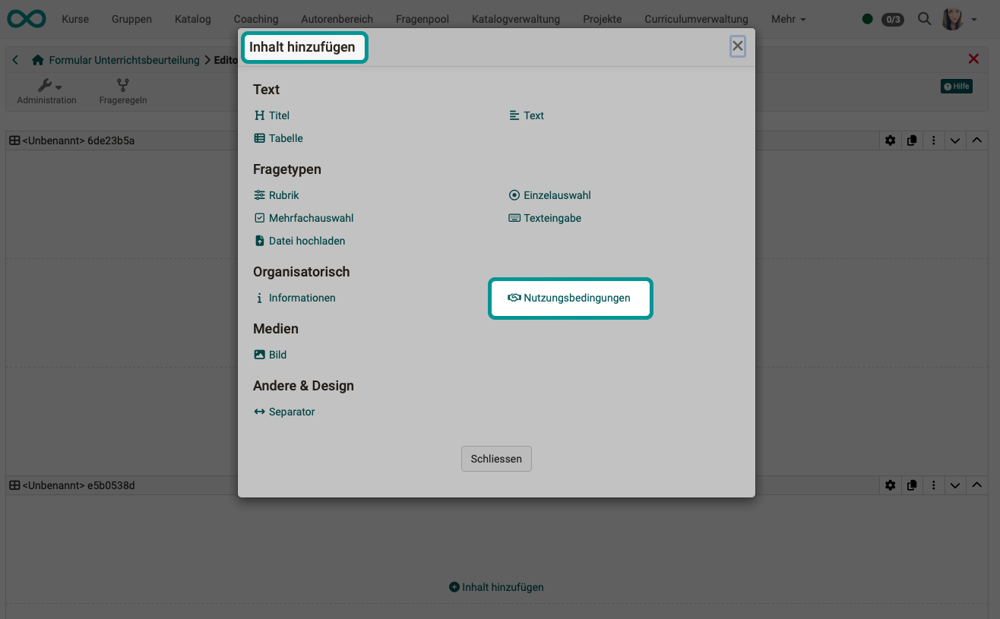{ class="shadow lightbox" }
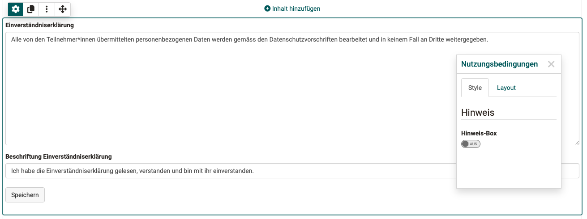{ class="shadow lightbox" }

[Zum Seitenanfang ^](#terms_of_use)

## Nutzungsbedingungen externer Werkzeuge {: #terms_of_use_external_tools}

In OpenOlat sind an einigen Stellen externe Werkzeuge eingebunden (meistens ebenfalls Open Source, aber nicht von frentix entwickelt), für die ebenfalls vor Benutzung die Bedingungen akzeptiert werden müssen.

Beispiel **draw.io** 
draw.io ist ein Online-Werkzeug zur Erstellung von Diagrammen, das in OpenOlat an vielen Stellen eingesetzt werden kann, z.B. in Projekten, im Portfolio, im Kursbaustein "Dokument", im Media Center und überall, wo neue Dokumente erstellt werden können. In draw.io können auch mehrere Personen kooperativ an einem Diagramm arbeiten.

[Zum Seitenanfang ^](#terms_of_use)

## Weiterführende Informationen {: #further_information}

[Mitgliederverwaltung >](../learningresources/Members_management.de.md) 
[Lernpfad Kurse erstellen >](../learningresources/Creating_learning_path_courses.de.md) 
[Kurseinstellungen >](../learningresources/Course_Settings.de.md) 
[Der Formular-Editor >](../learningresources/Form_Editor.de.md) 
[Datenschutz >](../../manual_admin/usermanagement/Data_protection.de.md) 
[Persönliche Konfiguration: Einstellungen >](../personal_menu/Settings.de.md)

[Zum Seitenanfang ^](#terms_of_use)
