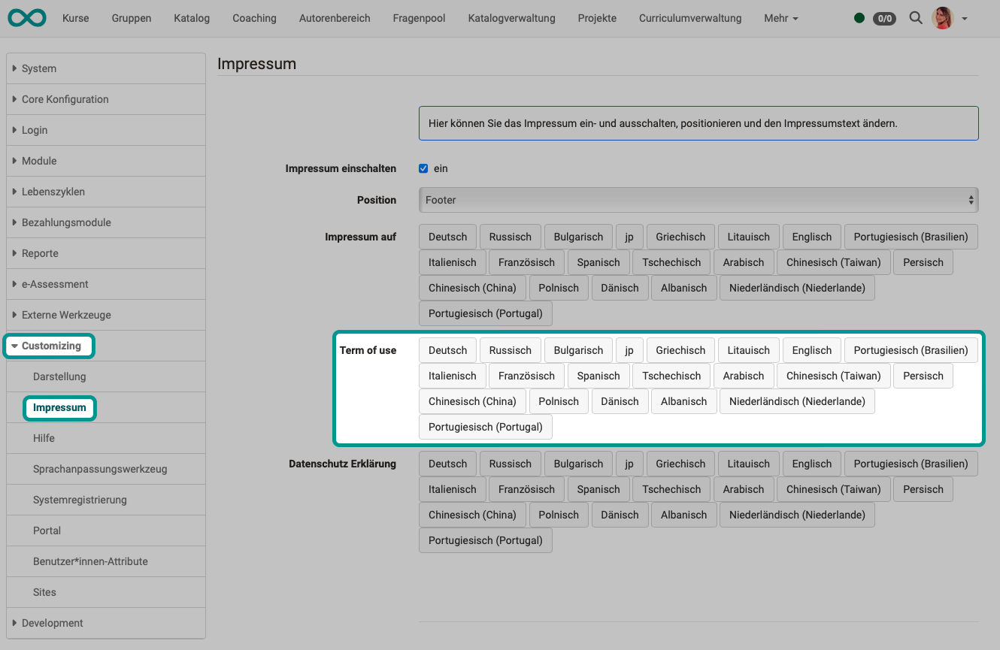
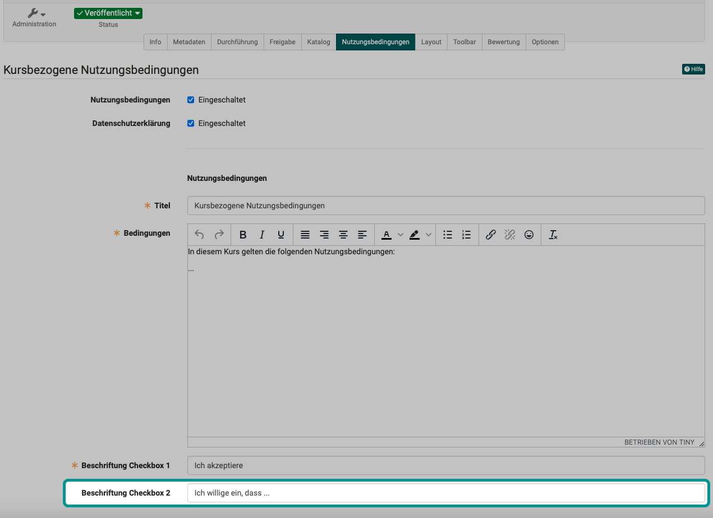
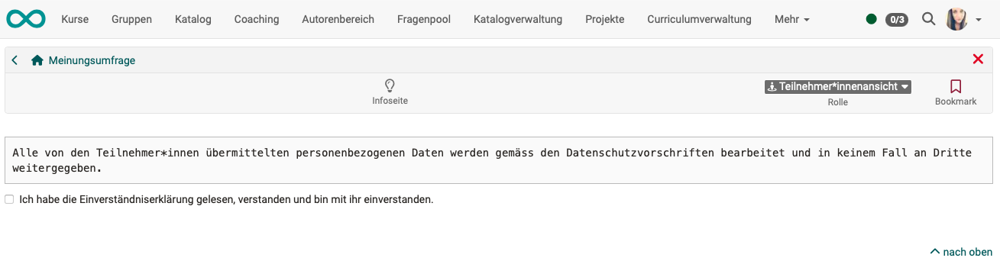
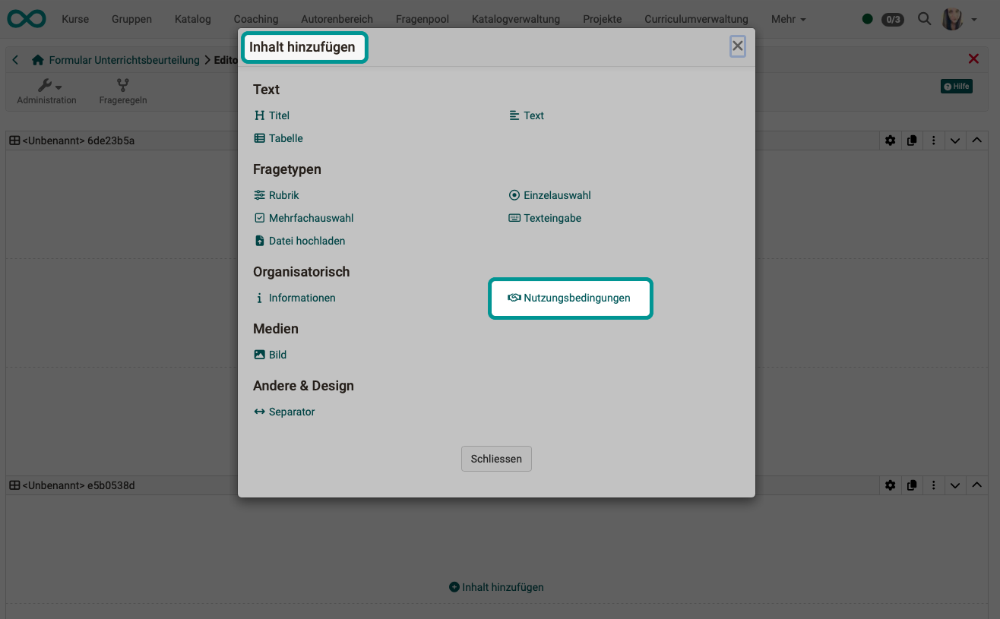

# Terms of Use

## Which terms of use must be accepted?

When you use OpenOlat or certain elements of it for the first time, you may be required to agree to the terms of use. If this is required by the system operator or owner of a course or other element, various terms of use may be displayed for confirmation.

[Terms of use of the OpenOlat platform >](#terms_of_use_platform)

[Terms of use of a course >](#terms_of_use_course)

[Terms of use of a form >](#terms_of_use_form)

[Terms of use of external tools >](#terms_of_use_external_tools)

!!! note "Note"

    In addition to the terms of use, data protection provisions may also be displayed and require consent.

## Terms of use of the OpenOlat platform {: #terms_of_use_platform}

###  Confirmation by OpenOlat users on first call

When OpenOlat is called up for the first time, all users are asked to confirm the terms of use.
If you decline, you will return to the login screen.

{ class="shadow lightbox" }

### Define terms of use of the platform {: #terms_of_use_platform_define}

**Administrators can define the text of the terms of use in the system administration under **Customizing > Imprint**. A separate text can be created for each activated language.

{ class="shadow lightbox" }

### Read accepted terms of use {: #terms_of_use_platform_verify}

All users can read the terms of use that they have agreed to at any time in their personal menu: **Personal menu > Settings > Tab "Terms of use"**

{ class="shadow lightbox" }

[To the top of the page ^](#terms-of-use)

## Define terms of use for a course

Course owners can create a course-specific terms of use for their course at
**Administration > Settings > Tab "Terms of use"**.  The text editor is displayed as soon as the "Terms of use" checkbox is ticked.

{ class="shadow lightbox" }

At the bottom of the screen, you define which text is displayed to participants next to their checkbox for accepting the terms of use.

In addition, a second checkbox with any descriptive text can be defined for confirmation. If a text is entered, both checkboxes must be confirmed by the participants for the terms of use to be considered accepted. If no descriptive text is entered, the second checkbox is not displayed to the participants.

{ class="shadow lightbox" }

### Activate confirmation request for a course

In order for the terms of use to be displayed, they must be activated by the course owner.
If a text has been entered for the terms of use, it is retained after saving, regardless of whether the display is activated. You can therefore edit inserted terms of use, for example, and then deactivate them until the final version has been created.

{ class="shadow lightbox" }

### Management of the terms of use in the members management

Those of the course participants who have given their consent to the course-specific terms of use can be viewed by the course owner under **Administration > [Members management](../learningresources/Members_management.md) > Permissions**

{ class="shadow lightbox" }

{ class="shadow lightbox" }

* If a participant declines, the person concerned can be contacted directly.
* If consent is revoked, course owners can also reset/delete their consent here.

### Acceptance of terms of use when copying courses

[Learning path courses](../learningresources/Creating_learning_path_courses.md) can be copied with the help of a wizard (**Select course > Administration > Copy with wizard**). This wizard can be used to specify which [course settings](../learningresources/Course_Settings.md) are to be transferred to the copy before the copy process is executed. Among other things, the terms of use can also be copied.

{ class="shadow lightbox" }

[To the top of the page ^](#terms-of-use)

## Terms of use in forms {: #terms_of_use_form}

### Confirmation by learners

When filling out a form, the content entered may also require participants to accept a declaration on the terms of use. 

{ class="shadow lightbox" }

### Define terms of use for a form

Within the learning resource "Form" is the element "[Form editor](../learningresources/Form_Editor.md)", which can be inserted by authors.

{ class="shadow lightbox" }
{ class="shadow lightbox" }

[To the top of the page ^](#terms-of-use)

## Terms of use of external tools {: #terms_of_use_external_tools}

In OpenOlat, external tools are integrated in some places (mostly also OpenSource, but not developed by frentix), for which the conditions must also be accepted before use.

Example **draw.io** 
    draw.io is an online tool for creating diagrams that can be used in many places in OpenOlat, e.g. in projects, in the portfolio, in the "File" course element, in the Media Center and in many other places where new documents can be created. In draw.io, several people can also work together on a diagram.

[To the top of the page ^](#terms-of-use)

## Further information

[Archiving of consents to terms of use by administrators](../../manual_admin/usermanagement/Data_protection.md#export-von-benutzerdaten)

[Archiving of consents to terms of use by administrators](../../manual_admin/usermanagement/Data_protection.md)

[Settings in the Personal Menu](../personal_menu/Settings.md)

