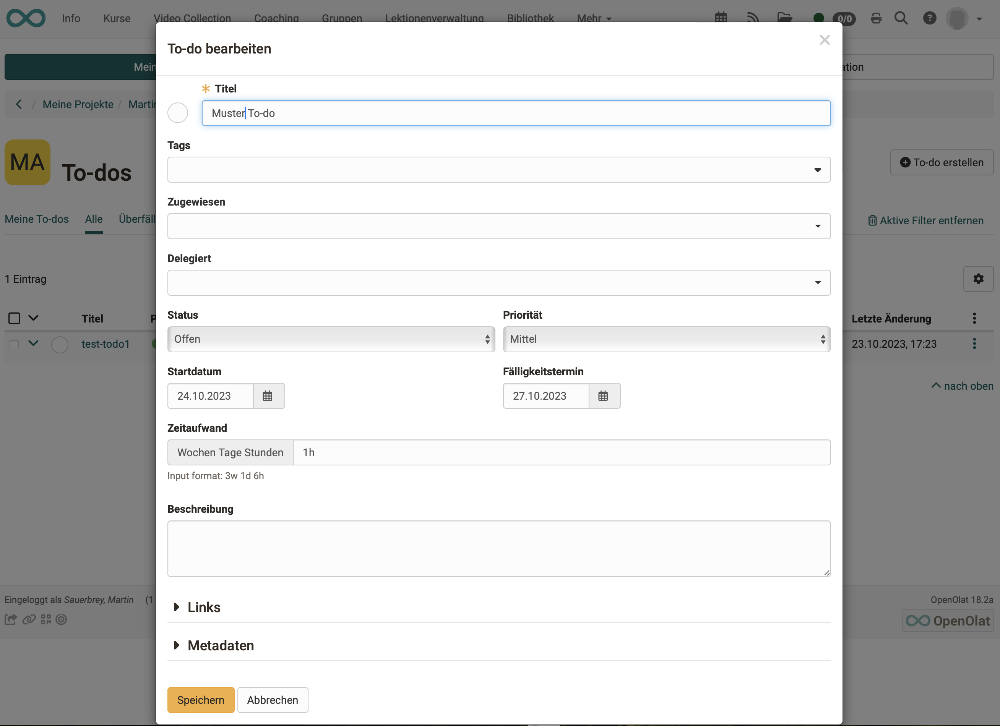
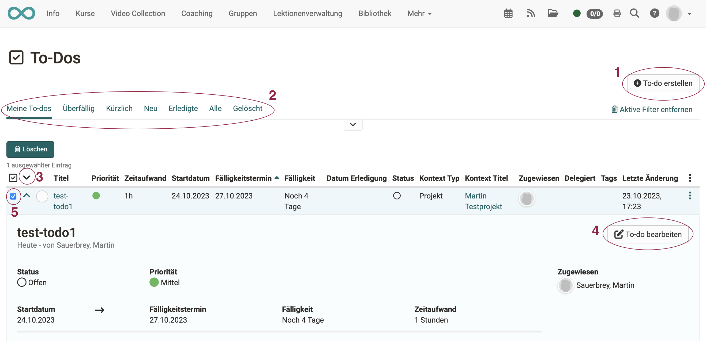
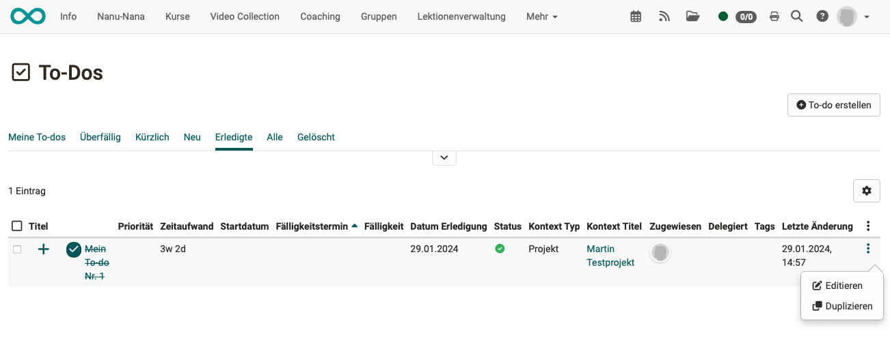

# To-dos

## Wo gibt es in OpenOlat To-dos?

Die zu erledigenden Aufgaben (To-dos) finden sich an mehreren Stellen in OpenOlat:

* im [persönlichen Menü](../personal_menu/To-Dos.de.md) 
Hier finden Sie alle Ihre persönlichen To-dos zusammengefasst in einer Übersicht.
* innerhalb eines [Projektes](../area_modules/Project_Todos.de.md) 
Hier handelt es sich um Aufgaben, die im Rahmen des Projektes zu erledigen sind.
* im [Kurs](../learningresources/Course_todos.de.md) 
Im Kursmenü `Administration > To-dos` können To-dos erstellt werden, die den aktuell editierten Kurs betreffen.
* im [Kursbaustein Aufgabe](../learningresources/Course_Element_Task.de.md) 
* im [Course Planner](../area_modules/Course_Planner_Todos.de.md) [:octicons-tag-16:{ title="ab Release 21.0 (OO-9417)" }](https://track.frentix.com/issue/OO-9417){:target="_blank"} 
Jedes CPL-Element verfügt über einen Tab «To-dos», in dem Aufgaben direkt dem Element zugeordnet werden können. Eine zentrale Übersicht fasst alle CPL-To-dos über alle Produkte hinweg zusammen.

## Bestandteile eines To-dos

Ein To-do ist eine Art Karteikarte, auf der es verschiedene Felder hat. 

{ class=" shadow lightbox" }

* **Titel** 
Ein Pflichtfeld. Vergeben Sie möglichst einen selbsterklärenden Titel.
* **Tags** 
Es können Tags zur Verschlagwortung erstellt werden. Einmal erstellte Tags können auch in anderen To-dos verwendet werden. Beachten Sie, dass es sich hier jedoch nicht um eine systematisch (hierarchisch) strukturierte Verschlagwortung (Taxonomie) handelt, wie sie an anderen Stellen in OpenOlat angelegt werden kann.
* **Zugewiesen**  
Ein Pflichtfeld. Hier wird die Person ausgewählt, die für die Erledigung des To-dos verantwortlich ist.
* **Delegiert**  Die Arbeit kann an eine andere Person delegiert werden, auch phasenweise immer wieder an andere Personen. Gesamtverantwortlich bleibt trotzdem die Person, die im Feld "Zugewiesen" eingetragen ist.
* **Status** [:octicons-tag-16:{ title="ab Release 21.0 (OO-9563)" }](https://track.frentix.com/issue/OO-9563){:target="_blank"} 
Der Status zeigt den aktuellen Bearbeitungsstand (Offen, In Bearbeitung, Erledigt) und wird in der Listenansicht als farbiger Kreis neben dem Titel angezeigt. Über das Dropdown im Bearbeitungsdialog lässt sich der Status setzen. Die Schnellaktionen **«Starten»** (setzt den Status auf «In Bearbeitung») und **«Als erledigt markieren»** sind direkt aus der Liste verfügbar, ohne das To-do zu öffnen.
* **Priorität** 
Es kann klassifiziert werden nach: Dringend - Hoch - Mittel - Tief.
* **Startdatum** 
Das Startdatum kann für Erinnerungen verwendet werden. Sind sowohl Startdatum als auch Fälligkeitsdatum gesetzt, wird in der Listenansicht ein Fortschrittsbalken angezeigt. [:octicons-tag-16:{ title="ab Release 21.0 (OO-9563)" }](https://track.frentix.com/issue/OO-9563){:target="_blank"}
* **Fälligkeitstermin** 
Das Datum, bis zu dem die Aufgabe erledigt sein soll.

* **Zeitaufwand** 
Ein Feld für den vermuteten Zeitaufwand. Die Angabe kann für Berechnungen verwendet werden. 
Es können Wochen (w), Tage (d) und Stunden (h) angegeben werden. Beispiel: 3w 1d 6h
* **Beschreibung** 
Ergänzende Informationen zur Aufgabe.

* **Links** 
Hier kann dieses To-do mit Dateien, Terminen und Entscheidungen des Projektes verlinkt werden.
* **Metadaten** 
Erstellungsdatum des To-dos und alle Änderungen (wer, wann) können in den Metadaten nachvollzogen werden.

## To-dos verwalten

Sie können

* neue To-dos erstellen (1)
* Ihre To-dos nach Status sortiert anzeigen (2)
* durch Klick auf den kleinen Pfeil am Zeilenanfang die Details eines To-dos aufklappen (3)
* die To-dos bearbeiten (4)
* To-dos löschen (Nach Selektion eines To-dos in der ersten Spalte wird der Löschen-Button angezeigt) (5)

{ class=" shadow lightbox" }

Zum **Kopieren** eines To-dos wählen Sie die Option **Duplizieren** unter den 3 Punkten am Ende einer Zeile. Zur Wahl der gewünschten Kopiervorlage helfen Ihnen die Tabs über der Liste. Z.B. indem Sie bereits erledigte To-dos vorselektieren.

{ class=" shadow lightbox" }

!!! note "Hinweis"

    Wenn Sie Ihre To-dos statt im persönlichen Menü lieber in der Kopfzeile angezeigt haben möchten, können Sie die Menüoption vom persönlichen Menü dorthin verschieben. Die Einstellung dazu nehmen Sie vor unter 
    `Persönliches Menü > Einstellungen > Tab System > Abschnitt Persönliche Werkzeuge` 
    Alle Werkzeuge, die Sie hier markieren, werden statt im persönlichen Menü in der Kopfzeile rechts oben angezeigt und sind so schneller erreichbar.

## Benachrichtigungen

Werden To-dos erstellt oder bearbeitet und andere Personen sind dadurch betroffen, so werden sie durch automatisch erstellte Mails über die Änderungen benachrichtigt. Bei mehreren Änderungen in kurzer Zeit wird eine zusammengefasste Mail erzeugt.
