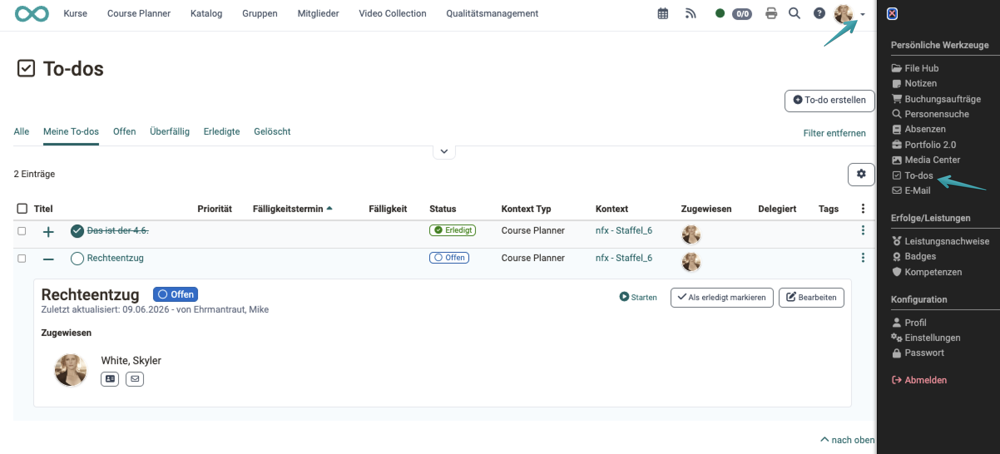

# To-dos: Grundlagen

Ein To-do ist eine Aufgabe mit einer verantwortlichen Person und einem Termin. OpenOlat führt To-dos in mehreren Modulen, überall mit denselben Feldern, demselben Statusmodell und derselben Benachrichtigung. Diese Seite beschreibt, was für alle To-dos gilt. Wie Sie in einem Modul damit arbeiten, steht auf der Seite des Moduls.

{ class="shadow lightbox" }

## Wo gibt es To-dos?

Aufgaben werden dort erfasst, wo sie anfallen. Im persönlichen Menü laufen sie zusammen.

| Ort | Was dort erfasst wird |
|---|---|
| [Persönliches Menü](../personal_menu/To-Dos.de.md) | Alle Ihre To-dos aus allen Modulen in einer Liste, dazu eigene To-dos ohne Modulbezug |
| [Projekt](../area_modules/Project_Todos.de.md) | Aufgaben innerhalb eines Projekts, verknüpfbar mit Dateien, Terminen und Entscheidungen |
| [Kurs](../learningresources/Course_todos.de.md) | Aufgaben zum Kurs, erstellt unter `Kurs > Administration > To-dos` |
| [Kursbaustein Aufgabe](../learningresources/Course_Element_Task.de.md) | To-dos, die der Kursbaustein automatisch zuweist. Sie dienen der Information und lassen sich nicht bearbeiten oder löschen |
| [Course Planner](../area_modules/Course_Planner_Todos.de.md) [:octicons-tag-16:{ title="ab Release 21.0 (OO-9417)" }](https://track.frentix.com/issue/OO-9417){:target="_blank"} | Aufgaben auf jedem Element eines Produkts, dazu eine zentrale Übersicht über alle Produkte |
| [Qualitätsmanagement](../area_modules/Quality_Management_To-dos.de.md) | Massnahmen, die aus einer Datenerhebung hervorgehen |

## Die Felder eines To-dos

Alle Module verwenden dieselbe Karteikarte. Drei Angaben gibt es nur in einem Modul.

| Feld | Bedeutung | Verfügbar |
|---|---|---|
| Titel | Bezeichnet die Aufgabe. Vergeben Sie einen selbsterklärenden Titel | überall, Pflichtfeld |
| Zugewiesen | Die Person, die für die Erledigung verantwortlich ist | überall, Pflichtfeld |
| Delegiert | Die Ausführung kann an andere Personen delegiert werden, auch phasenweise an wechselnde. Die Verantwortung bleibt bei der zugewiesenen Person | überall |
| Status | Der Bearbeitungsstand der Aufgabe | überall |
| Priorität | Dringend, Hoch, Mittel oder Tief | überall |
| Startdatum | Ab wann die Aufgabe läuft. Kann für Erinnerungen verwendet werden | überall |
| Fälligkeitstermin | Das Datum, bis zu dem die Aufgabe erledigt sein soll | überall |
| Zeitaufwand | Der geschätzte Aufwand in Wochen (w), Tagen (d) und Stunden (h), Eingabeformat `3w 1d 6h`. Die Angabe kann für Berechnungen verwendet werden | überall |
| Tags | Frei vergebbare Schlagwörter | überall |
| Beschreibung | Ergänzende Informationen zur Aufgabe | überall |
| Kontext | Modul und Objekt, aus dem das To-do stammt. In der Liste als Spalten «Kontext Typ» und «Kontext» | überall |
| Links | Verknüpfung des To-dos mit Dateien, Terminen und Entscheidungen | nur im Projekt |
| Metadaten | Erstellung und alle Änderungen mit Person und Datum | nur im Projekt |
| Relative Datumsangaben | Startdatum und Fälligkeitstermin bezogen auf den Durchführungszeitraum statt als festes Kalenderdatum | nur im [Course Planner](../area_modules/Course_Planner_Todos.de.md#relative_date) |

Einmal erstellte Tags stehen auch in anderen To-dos zur Auswahl. Es handelt sich dabei nicht um eine hierarchisch strukturierte Verschlagwortung, wie sie die Taxonomie an anderen Stellen in OpenOlat bietet.

## Status und Schnellaktionen [:octicons-tag-16:{ title="ab Release 21.0 (OO-9563)" }](https://track.frentix.com/issue/OO-9563){:target="_blank"}

| Status | Bedeutung |
|---|---|
| Offen | Die Aufgabe ist erstellt, aber noch nicht begonnen |
| In Bearbeitung | Die Arbeit an der Aufgabe hat begonnen |
| Erledigt | Die Aufgabe ist abgeschlossen |
| Gelöscht | Das To-do ist entfernt und nur noch über den Filter «Gelöscht» sichtbar |

In der Liste steht der Status als farbiger Kreis neben dem Titel. Über das Pluszeichen am Zeilenanfang klappen Sie den Detailbereich auf. Dort ändern Sie den Stand, ohne den Dialog zu öffnen:

* **«Starten»** setzt den Status auf «In Bearbeitung». Die Aktion erscheint nur beim Status «Offen».
* **«Als erledigt markieren»** schliesst die Aufgabe ab. Die Aktion erscheint bei den Status «Offen» und «In Bearbeitung».
* **«Bearbeiten»** öffnet den Dialog mit allen Feldern.

Sind Startdatum und Fälligkeitstermin gesetzt, zeigt die Liste zusätzlich einen Fortschrittsbalken.

Das Bild am Seitenanfang zeigt die Statuskreise und den aufgeklappten Detailbereich mit den Schnellaktionen.

## Wer ein To-do bearbeiten darf

Bearbeitungsrechte haben die Person, die das To-do erstellt hat, die zugewiesene und die delegierte Person. Welche Rollen darüber hinaus bearbeiten dürfen, legt das Modul fest: im [Course Planner](../area_modules/Course_Planner_Todos.de.md#todo_permissions) sind es Kursplaner:innen und Elementbesitzer:innen, im [Projekt](../area_modules/Project_Todos.de.md) die Projektleitung.

To-dos lassen sich nur dort löschen, wo sie erstellt wurden.

## Benachrichtigungen

Werden To-dos erstellt oder bearbeitet und sind andere Personen davon betroffen, benachrichtigt OpenOlat sie per E-Mail. Bei mehreren Änderungen in kurzer Zeit fasst OpenOlat sie in einer Mail zusammen.
